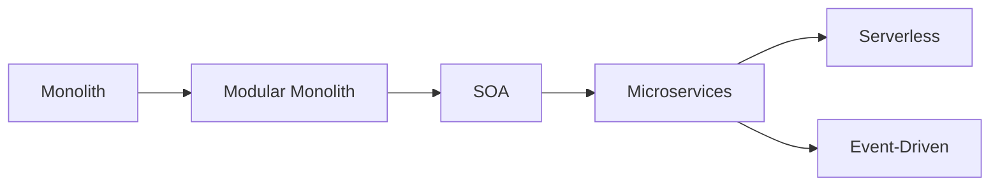
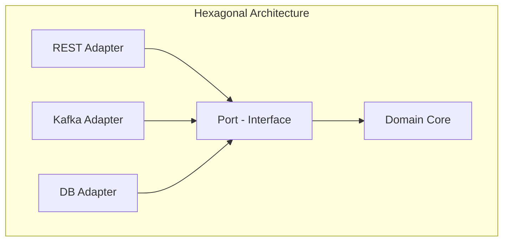

# Architectural Foundations

> The mental models every architect lives by. Before patterns, understand principles.

---

## Architecture Styles — The Evolution

| Style | Description | When to Choose |
|-------|-------------|----------------|
| **Monolith** | Single deployable unit, shared DB | Small teams, early stage — start here |
| **Modular Monolith** | Clear internal boundaries, single deploy | Pre-microservices step; enforce internal contracts |
| **SOA** | Coarse-grained services over ESB | Legacy enterprise; ESB = central coupling risk |
| **Microservices** | Fine-grained services, independent deploy, own data | Scale teams independently; well-understood domain |
| **Serverless / FaaS** | Event-triggered functions, no infra management | Bursty, event-driven, cost-sensitive workloads |
| **Event-Driven** | Events as first-class citizens, async by default | Loose coupling at scale, workflows, integrations |

---

## Application Architecture Patterns

| Pattern | Core Idea | Key Characteristic |
|---------|-----------|-------------------|
| **Layered (N-tier)** | Controller → Service → Repository | Simple; tight coupling across layers leaks |
| **Hexagonal (Ports & Adapters)** | Business core isolated from infra; ports = interfaces, adapters = implementations | Testability-first; swap adapters without touching domain |
| **Onion Architecture** | Concentric rings; domain at center, infra at outermost | Dependency rule: inner rings know nothing about outer |
| **Clean Architecture** | Onion + explicit Use Case layer | Uncle Bob's formalization of hexagonal |
| **Pipe and Filter** | Data flows through independent processing stages | Kafka Streams, ETL pipelines, request interceptor chains |
| **CQRS** | Separate read (Query) and write (Command) models | High read/write ratio; independent scaling |

!!! tip "Onion vs Hexagonal vs Clean"
    These are the same idea with different vocabulary. The key: domain logic has zero dependency on frameworks, databases, or HTTP. All dependencies point inward.

---

## Key Architecture Principles

### CAP Theorem

A distributed system can guarantee only **2 of 3**:

- **C**onsistency — every read gets the latest write
- **A**vailability — every request receives a response
- **P**artition Tolerance — system continues despite network splits

> Partition tolerance is non-negotiable in distributed systems. The real choice is **CP vs AP**.

| CP Systems | AP Systems |
|-----------|-----------|
| Strong consistency; may reject requests during partition | Always respond; may return stale data |
| Banking, inventory, payment | Social feeds, product recommendations, analytics |
| PostgreSQL, HBase, Zookeeper | Cassandra, CouchDB, DynamoDB (eventual mode) |

---

### BASE vs ACID

|  | ACID | BASE |
|--|------|------|
| **Used by** | Relational DBs | NoSQL, distributed systems |
| **Consistency** | Strong (immediate) | Eventual |
| **Stands for** | Atomicity, Consistency, Isolation, Durability | Basically Available, Soft state, Eventually consistent |
| **Trade-off** | Slower; less scalable | Faster; complex application logic |

---

### Conway's Law

> *"Organizations design systems that mirror their own communication structure."*

- Siloed teams → tightly coupled services
- **Inverse Conway Maneuver:** intentionally structure teams to get the architecture you want
- **Team Topologies** (Skelton & Pais): Stream-aligned, Platform, Enabling, Complicated-subsystem teams

---

### Core Design Principles

| Principle | What It Means |
|-----------|---------------|
| **Loose Coupling** | Change one service without breaking others |
| **High Cohesion** | Related logic together; unrelated things apart |
| **Design for Failure** | Assume every downstream call will eventually fail |
| **Single Responsibility** | One service = one business capability |
| **Fail Fast** | Surface problems immediately; don't swallow errors |
| **Immutable Infrastructure** | Don't patch production — replace it |
| **Everything as Code** | Infra, config, pipelines — versioned in Git |
| **Separation of Concerns** | Each layer/service has one job |
