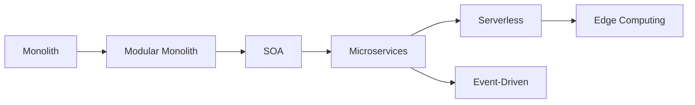
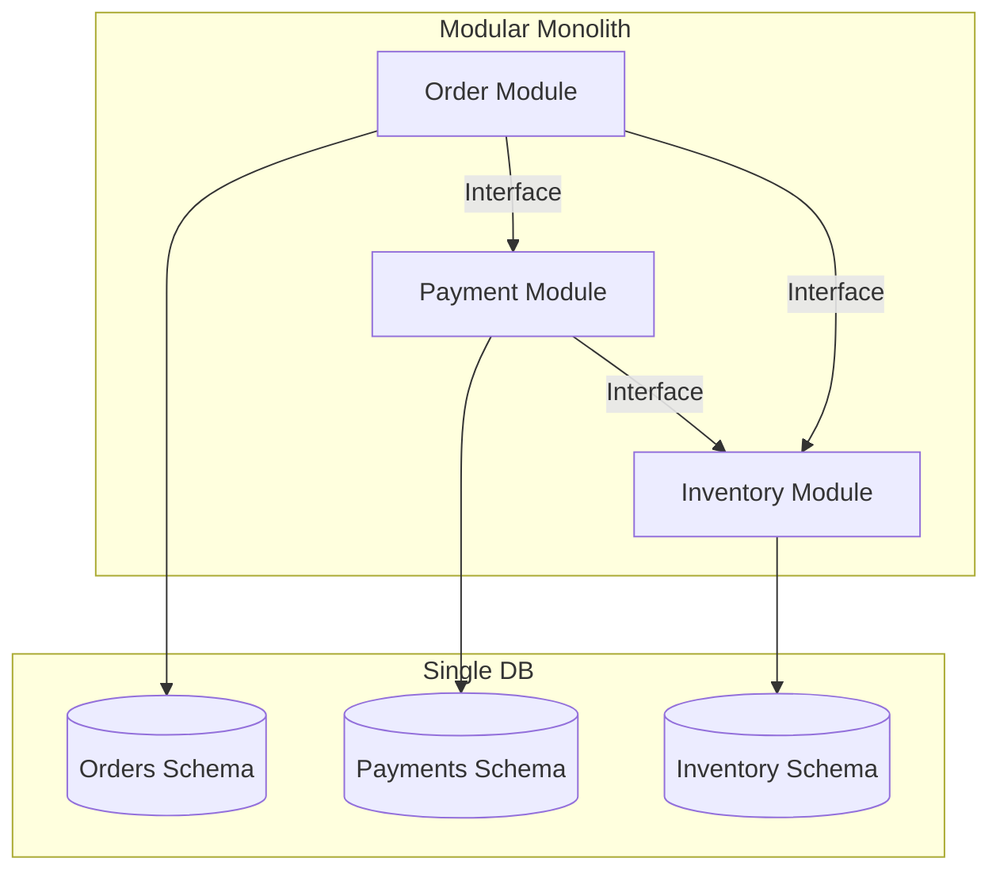
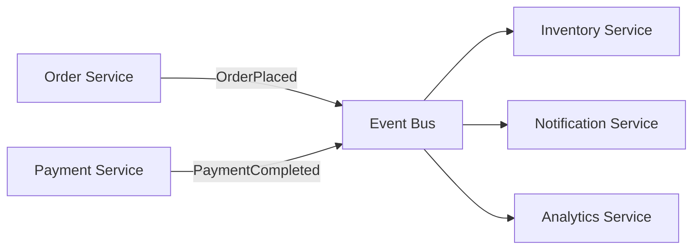
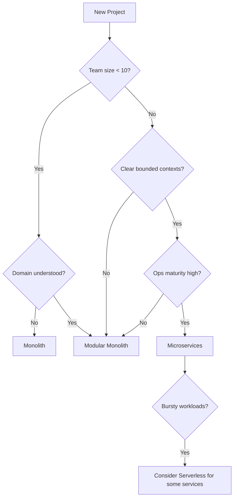

# Architecture Styles — Deep Dive

> **Level:** Beginner → Intermediate  
> **Pre-reading:** [01 · Architectural Foundations](01-foundations.md)

---

## The Evolution of Architecture Styles

Software architecture has evolved in response to changing business needs, team structures, and technology capabilities. Understanding this evolution helps you make informed choices about where your system sits on the spectrum.

---

## Monolith — The Starting Point

A **monolith** is a single deployable unit containing all application logic, typically sharing one database.

| Aspect | Characteristics |
|:-------|:----------------|
| **Deployment** | One artifact (WAR, JAR, binary) |
| **Database** | Single shared schema |
| **Scaling** | Vertical or horizontal (whole app) |
| **Team structure** | One team or tightly coordinated teams |

### When Monolith Is the Right Choice

- **Early-stage startups** — speed to market matters more than scalability
- **Small teams (< 10 developers)** — coordination overhead of microservices isn't justified
- **Unclear domain boundaries** — you don't know where to split yet
- **Simple CRUD apps** — no complex business logic warranting separation

!!! tip "Start with a monolith"
    Martin Fowler's "Monolith First" advice: it's much easier to extract services from a well-structured monolith than to merge poorly-designed microservices back together.

### When to Move Away from Monolith

- Deployments are slow and risky (everything deploys together)
- Teams step on each other's code constantly
- Scaling is inefficient (scale the whole app for one hot path)
- Technology lock-in (can't adopt new tech for one component)

---

## Modular Monolith — The Stepping Stone

A **modular monolith** maintains a single deployable unit but enforces strict internal boundaries between modules. Each module owns its data and communicates via well-defined interfaces.

| Benefit | Description |
|:--------|:------------|
| **Clear boundaries** | Modules can evolve independently |
| **Single deploy** | Operational simplicity retained |
| **Refactoring safety** | Interfaces enforce contracts |
| **Extraction path** | Each module is a candidate microservice |

**Tools:** Spring Modulith, Java 9+ modules (JPMS), .NET projects/assemblies

!!! warning "Discipline required"
    Without enforcement, developers will bypass module interfaces. Use [ArchUnit](https://www.archunit.org/) or similar tools to enforce architectural rules at build time.

---

## Service-Oriented Architecture (SOA)

**SOA** emerged in the early 2000s as an enterprise integration pattern. Services communicate via an **Enterprise Service Bus (ESB)** — a centralized middleware handling routing, transformation, and orchestration.

| Aspect | SOA Characteristic |
|:-------|:-------------------|
| **Services** | Coarse-grained, often aligned with enterprise capabilities |
| **Communication** | ESB-mediated; SOAP/XML common |
| **Governance** | Centralized; schema and contract management |
| **Coupling** | ESB is a central point of coupling and failure |

### SOA vs Microservices

| | SOA | Microservices |
|:-|:----|:--------------|
| **Service size** | Large, enterprise-wide | Small, single responsibility |
| **Communication** | ESB, SOAP | Direct, REST/gRPC/async |
| **Data** | Often shared databases | Database per service |
| **Governance** | Centralized | Decentralized |
| **Deployment** | Often coordinated | Independent |

!!! note "SOA isn't dead"
    Many enterprises still run SOA. Microservices can be seen as SOA done right — without the ESB bottleneck and with true service independence.

---

## Microservices — Independent Services at Scale

**Microservices** are small, independently deployable services, each owning its data and business capability.

| Principle | Implementation |
|:----------|:---------------|
| **Single responsibility** | One service = one bounded context |
| **Independent deployment** | Change and deploy without coordinating with others |
| **Decentralized data** | Each service owns its database |
| **Smart endpoints, dumb pipes** | Business logic in services, not middleware |
| **Design for failure** | Circuit breakers, retries, graceful degradation |

### Microservices Trade-offs

| Benefit | Cost |
|:--------|:-----|
| Independent scaling | Distributed system complexity |
| Team autonomy | Service coordination overhead |
| Technology flexibility | Operational burden (many deployables) |
| Fault isolation | Network reliability challenges |
| Faster deployments | Data consistency complexity |

### Prerequisites for Microservices Success

- [ ] Mature CI/CD pipeline with automated testing
- [ ] Container orchestration (Kubernetes)
- [ ] Observability stack (logs, metrics, traces)
- [ ] Service discovery and load balancing
- [ ] Clear domain boundaries (DDD)
- [ ] Team structure aligned with services

---

## Serverless / FaaS — Functions as a Service

**Serverless** abstracts infrastructure entirely. You deploy functions; the cloud provider handles scaling, availability, and billing (per invocation).

| Concept | Description |
|:--------|:------------|
| **Function** | Single-purpose code triggered by events |
| **Cold start** | Latency penalty when function instance spins up |
| **Stateless** | No local state between invocations |
| **Event-driven** | Triggered by HTTP, queue messages, schedules, etc. |

### Serverless Trade-offs

| Benefit | Cost |
|:--------|:-----|
| Zero infrastructure management | Cold start latency |
| Auto-scaling to zero | Vendor lock-in |
| Pay per invocation | Execution time limits |
| Rapid development | Debugging complexity |

### When to Choose Serverless

- **Bursty, unpredictable workloads** — pay only for what you use
- **Event processing** — file uploads, webhooks, queue consumers
- **APIs with low/moderate traffic** — cost-effective for small scale
- **Scheduled jobs** — cron-like tasks without managing servers

### When NOT to Choose Serverless

- **Low-latency requirements** — cold starts are unpredictable
- **Long-running processes** — execution limits (15 min on AWS Lambda)
- **Stateful workloads** — functions are ephemeral
- **High-volume, consistent traffic** — containers may be cheaper

---

## Event-Driven Architecture — Events as First-Class Citizens

**Event-driven architecture** uses asynchronous events as the primary integration mechanism. Producers emit events; consumers react independently.

| Pattern | Description |
|:--------|:------------|
| **Event Notification** | Notify that something happened; consumer queries for details |
| **Event-Carried State Transfer** | Event contains full payload; no follow-up query needed |
| **Event Sourcing** | Events are the source of truth; state derived by replay |

→ **[Deep Dive: Event-Driven Architecture](04-event-driven.md)** for patterns, Kafka, CQRS, and Saga

---

## Choosing an Architecture Style — Decision Framework

| Factor | Monolith | Modular Monolith | Microservices | Serverless |
|:-------|:---------|:-----------------|:--------------|:-----------|
| **Team size** | 1–10 | 5–30 | 20+ | Any |
| **Domain clarity** | Low | Medium | High | High |
| **Ops maturity** | Low | Low | High | Medium |
| **Latency needs** | Any | Any | Any | Tolerant |
| **Release frequency** | Weekly | Weekly | Daily+ | Instant |

---

??? question "When would you recommend a modular monolith over microservices?"
    When the team lacks mature DevOps practices (CI/CD, K8s, observability), when domain boundaries are still being discovered, or when the team is small (< 20 developers). A modular monolith gives you clear boundaries and an extraction path without the operational overhead of distributed systems.

??? question "What is the main difference between SOA and microservices?"
    **SOA** uses centralized governance with an ESB for routing and transformation — the ESB becomes a coupling point. **Microservices** use decentralized governance with smart endpoints (services) and dumb pipes (HTTP, messaging) — no central bottleneck. Microservices also enforce database-per-service, while SOA often shared databases.

??? question "What are the hidden costs of microservices that teams often underestimate?"
    (1) **Operational complexity** — managing dozens/hundreds of deployables, (2) **Distributed debugging** — tracing requests across services, (3) **Data consistency** — eventual consistency and saga complexity, (4) **Network reliability** — handling partial failures, timeouts, retries, (5) **Testing** — integration and contract testing across service boundaries.

