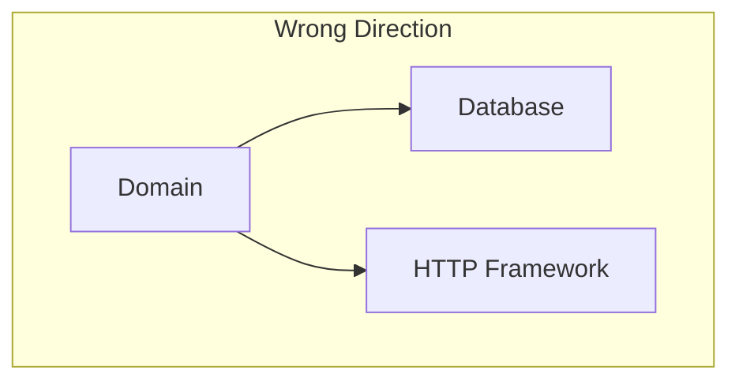
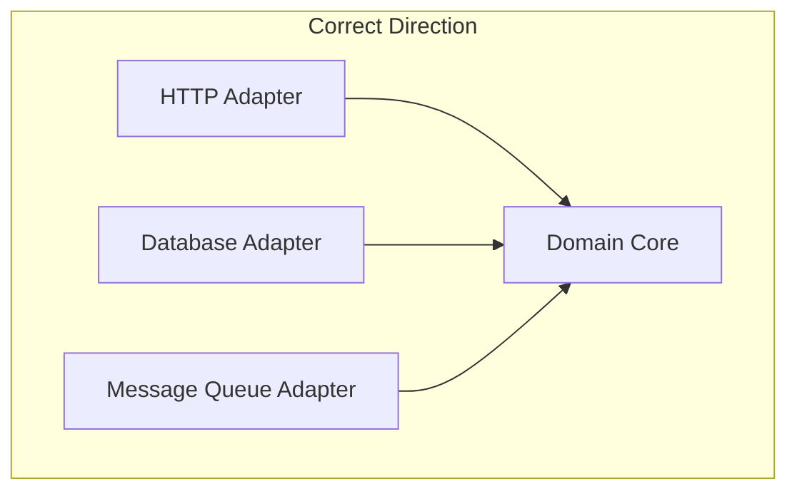
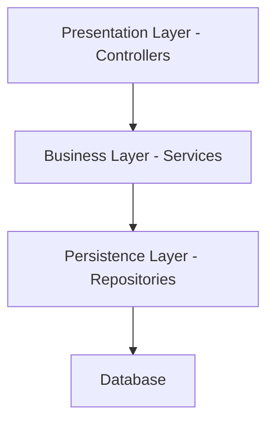
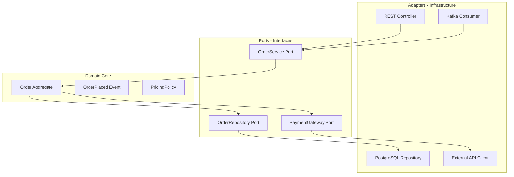
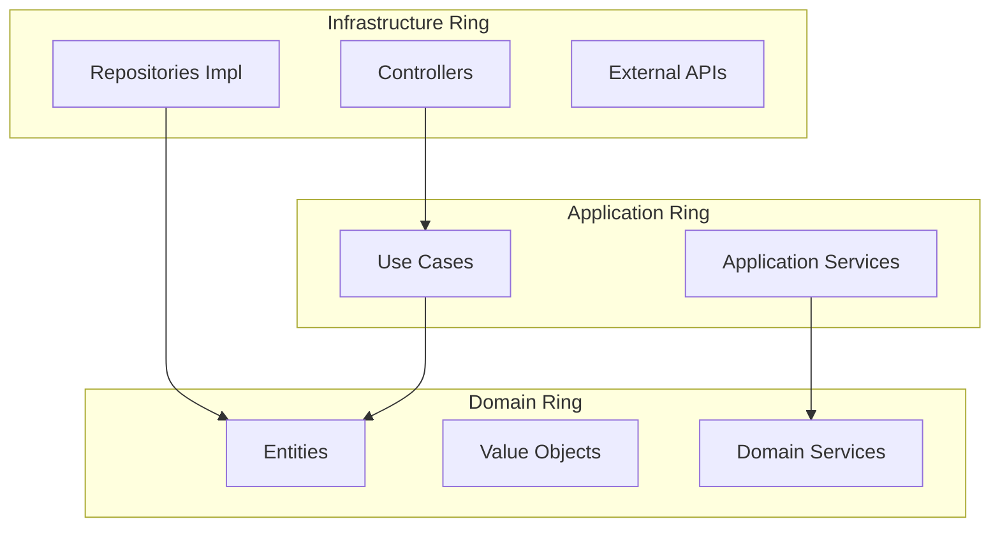
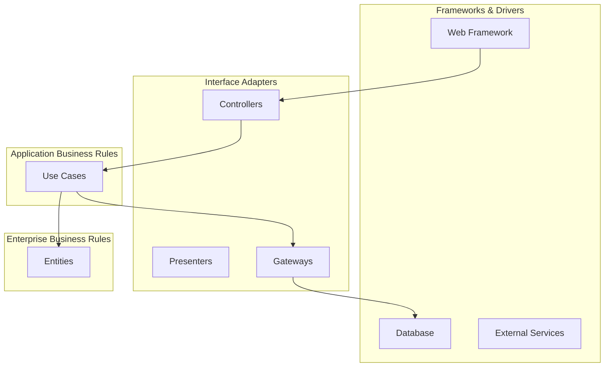
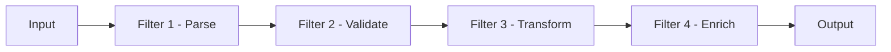

# Application Architecture Patterns — Deep Dive

> **Level:** Intermediate  
> **Pre-reading:** [01 · Architectural Foundations](01-foundations.md)

---

## The Core Idea: Dependency Inversion

All modern application architecture patterns share one principle: **the domain/business logic should not depend on infrastructure concerns**. Databases, HTTP, message queues — these are details that can change. Your business rules should be immune to such changes.





---

## Layered Architecture (N-Tier)

The traditional approach: stack layers on top of each other. Each layer can only call the layer directly below it.



| Layer | Responsibility | Spring Boot Example |
|:------|:---------------|:--------------------|
| **Presentation** | HTTP handling, request/response mapping | `@RestController` |
| **Business** | Business logic, orchestration | `@Service` |
| **Persistence** | Data access, ORM | `@Repository`, JPA |
| **Database** | Storage | PostgreSQL, MongoDB |

### Layered Architecture Problems

| Problem | Description |
|:--------|:------------|
| **Tight coupling** | Business layer often imports persistence annotations |
| **Database-driven design** | Entity model becomes the domain model |
| **Testing difficulty** | Services need real or mocked repositories |
| **Framework lock-in** | Spring/JPA annotations leak everywhere |

!!! warning "The anemic domain model trap"
    In layered architecture, entities often become dumb data holders (getters/setters only), with all logic in services. This is an anti-pattern — business rules should live with the data they protect.

---

## Hexagonal Architecture (Ports & Adapters)

Proposed by Alistair Cockburn. The **domain core** sits at the center, isolated from all external concerns via **ports** (interfaces) and **adapters** (implementations).



### Key Concepts

| Concept | Description |
|:--------|:------------|
| **Port** | Interface defined by the domain; contract for interaction |
| **Adapter** | Implementation of a port; connects to external systems |
| **Driving adapter** | Initiates actions (HTTP, CLI, tests) |
| **Driven adapter** | Called by the domain (DB, external APIs, messaging) |

### Hexagonal Architecture Benefits

| Benefit | How |
|:--------|:----|
| **Testability** | Test domain with in-memory adapters; no Spring context needed |
| **Flexibility** | Swap PostgreSQL for MongoDB by writing a new adapter |
| **Framework independence** | Domain has zero framework imports |
| **Clear boundaries** | Ports define explicit contracts |

### Package Structure Example

```
com.example.order/
├── domain/
│   ├── Order.java              # Aggregate root
│   ├── OrderLine.java          # Entity
│   ├── Money.java              # Value object
│   ├── OrderPlaced.java        # Domain event
│   └── ports/
│       ├── OrderRepository.java    # Driven port (out)
│       ├── PaymentGateway.java     # Driven port (out)
│       └── OrderService.java       # Driving port (in)
├── application/
│   └── OrderServiceImpl.java   # Use case orchestration
├── adapters/
│   ├── in/
│   │   ├── rest/
│   │   │   └── OrderController.java
│   │   └── kafka/
│   │       └── OrderEventConsumer.java
│   └── out/
│       ├── persistence/
│       │   └── JpaOrderRepository.java
│       └── payment/
│           └── StripePaymentGateway.java
```

---

## Onion Architecture

Proposed by Jeffrey Palermo. Concentric rings where **dependencies always point inward**. The domain is at the center; infrastructure is at the outermost ring.



| Ring | Contents | Dependencies |
|:-----|:---------|:-------------|
| **Domain** | Entities, Value Objects, Domain Services | None (pure business logic) |
| **Application** | Use cases, application services, ports | Domain only |
| **Infrastructure** | Controllers, DB adapters, external APIs | Application + Domain |

!!! tip "Onion vs Hexagonal"
    They're nearly identical. Onion makes the concentric dependency rule explicit and adds an Application layer for use case orchestration. In practice, teams use them interchangeably.

---

## Clean Architecture

Proposed by Robert C. Martin (Uncle Bob). A formalization of hexagonal/onion with explicit **use case** layer and **interface adapters**.



### The Dependency Rule

> Source code dependencies must point only inward, toward higher-level policies.

- **Entities** know nothing about use cases
- **Use Cases** know nothing about controllers or databases
- **Controllers** know about use cases but not about database implementation

### Clean Architecture Layers

| Layer | Responsibility | Changes When |
|:------|:---------------|:-------------|
| **Entities** | Enterprise business rules | Business rules change |
| **Use Cases** | Application-specific business rules | User workflow changes |
| **Interface Adapters** | Convert data between layers | UI or external API changes |
| **Frameworks & Drivers** | Glue code for frameworks | Framework version changes |

---

## Pipe and Filter Architecture

Data flows through a sequence of independent processing stages (**filters**) connected by **pipes** (channels).



| Concept | Description |
|:--------|:------------|
| **Filter** | Stateless processing unit; single responsibility |
| **Pipe** | Channel connecting filters; buffering, backpressure |
| **Composability** | Reorder, add, or remove filters without affecting others |

### Real-World Examples

| Domain | Implementation |
|:-------|:---------------|
| **Data pipelines** | Apache Kafka Streams, Apache Flink |
| **ETL** | Airflow DAGs, dbt transformations |
| **Request processing** | Servlet filters, Spring interceptors |
| **Unix philosophy** | `cat file | grep error | sort | uniq` |

---

## Comparing the Patterns

| Pattern | Key Distinction | Best For |
|:--------|:----------------|:---------|
| **Layered** | Vertical stack; each layer calls the one below | Simple CRUD apps |
| **Hexagonal** | Ports and adapters; domain at center | Testable, framework-agnostic systems |
| **Onion** | Concentric rings; strict dependency direction | Complex domains |
| **Clean** | Explicit use case layer; UI-agnostic | Enterprise applications |
| **Pipe & Filter** | Linear data flow through processing stages | ETL, streaming, request chains |

### Quick Decision Guide

| Situation | Recommendation |
|:----------|:---------------|
| **Simple CRUD, small team** | Layered is fine; don't over-engineer |
| **Complex business logic** | Hexagonal/Onion — isolate domain |
| **Multiple entry points (REST, CLI, events)** | Hexagonal — adapters per entry point |
| **Emphasize testability** | Hexagonal/Clean — test domain in isolation |
| **Data transformation pipeline** | Pipe and Filter |

---

## Common Implementation Mistakes

| Mistake | Impact | Fix |
|:--------|:-------|:----|
| Domain imports framework annotations | Domain becomes untestable without framework | Pure POJOs in domain; annotations in adapters only |
| Use case calls repository directly | No clear boundary for domain logic | Use case calls domain methods; domain uses repository port |
| Anemic entities | Logic scattered across services | Put behavior in entities with state |
| Too many layers | Ceremony without benefit | Start simple; add layers when complexity justifies them |
| One-to-one mapping between layers | Entities = DTOs = database tables | Each layer has its own model optimized for its purpose |

---

??? question "What is the difference between Hexagonal, Onion, and Clean Architecture?"
    They all share the same core idea: **domain at the center, dependencies pointing inward, infrastructure at the edges**. Hexagonal emphasizes ports/adapters vocabulary. Onion visualizes concentric rings. Clean Architecture adds an explicit Use Case layer and is more prescriptive about layer responsibilities. In practice, they're interchangeable.

??? question "When is layered architecture acceptable?"
    For **simple CRUD applications** with little business logic, where the overhead of hexagonal/clean isn't justified. Also acceptable as a starting point for new teams — evolve toward hexagonal as complexity grows.

??? question "How do you test a hexagonal architecture application?"
    (1) **Unit test the domain** with in-memory implementations of driven ports (fake repositories, stub gateways). (2) **Integration test adapters** against real infrastructure (Testcontainers for DB). (3) **End-to-end test** through driving adapters (REST endpoints) with the full stack. The domain tests are fast and don't need Spring context.

