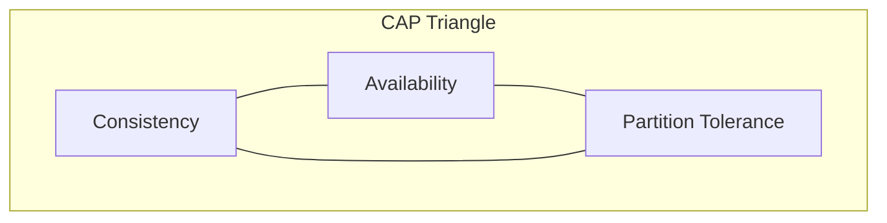
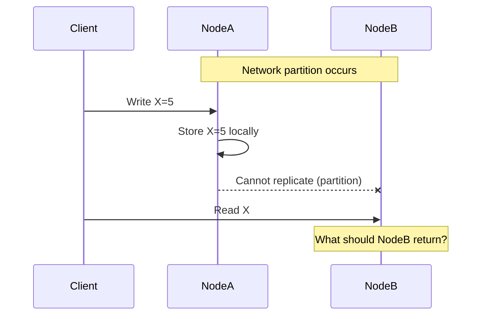
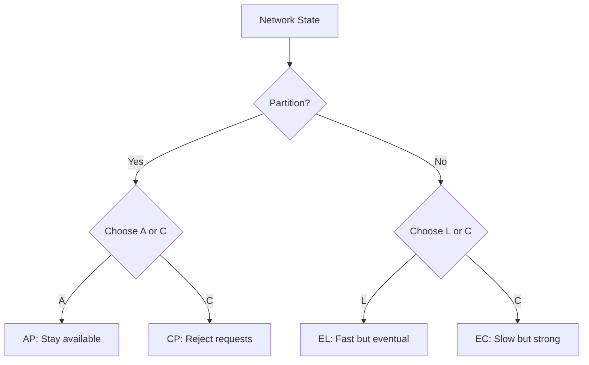
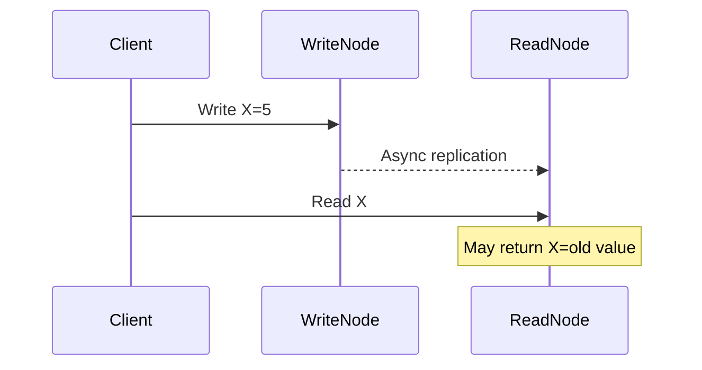
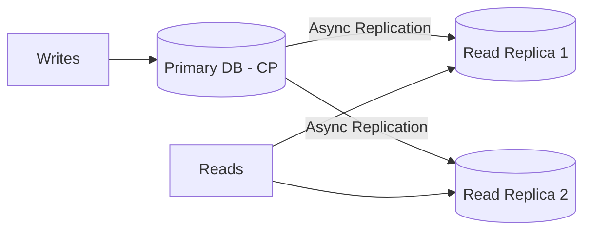

# CAP Theorem — Deep Dive

> **Level:** Intermediate  
> **Pre-reading:** [01 · Architectural Foundations](01-foundations.md)

---

## The Theorem

In a distributed data store, you can only guarantee **two out of three** properties simultaneously:

| Property | Definition |
|:---------|:-----------|
| **Consistency (C)** | Every read receives the most recent write or an error |
| **Availability (A)** | Every request receives a non-error response (though it might not be the latest data) |
| **Partition Tolerance (P)** | The system continues to operate despite network partitions between nodes |

---

## Why You Must Choose P

In any real distributed system, **network partitions will happen**. Machines fail, switches die, cables get unplugged, data centers lose connectivity. You cannot wish partitions away.

> **Partition tolerance is not optional.** The real choice is: what do you sacrifice when a partition occurs — consistency or availability?

**During a partition:**

- **CP system:** NodeB returns an error (sacrifices availability to maintain consistency)
- **AP system:** NodeB returns stale data (sacrifices consistency to remain available)

---

## CP Systems — Consistency over Availability

**CP systems** prioritize returning correct data. If they cannot guarantee the latest value, they refuse to respond.

| System | Behavior During Partition |
|:-------|:--------------------------|
| **PostgreSQL** (single primary) | Writes to primary only; reads from primary or fail |
| **HBase** | Strongly consistent reads; unavailable if region server down |
| **Zookeeper** | Majority quorum required for reads/writes |
| **etcd** | Raft consensus; unavailable without majority |
| **MongoDB** (with majority write concern) | Waits for majority acknowledgment |

### When to Choose CP

| Use Case | Why Consistency Matters |
|:---------|:------------------------|
| **Financial transactions** | Can't have inconsistent account balances |
| **Inventory management** | Overselling causes real-world problems |
| **Leader election** | Only one leader must exist at a time |
| **Configuration management** | Stale config can cause outages |

!!! warning "CP doesn't mean always consistent"
    CP means the system chooses consistency **when a partition occurs**. During normal operation, most CP systems are highly available. The trade-off only manifests during failures.

---

## AP Systems — Availability over Consistency

**AP systems** always respond, even if the response might be stale. They accept writes during partitions and reconcile later.

| System | Behavior During Partition |
|:-------|:--------------------------|
| **Cassandra** | Writes accepted on available nodes; reconciled later |
| **CouchDB** | Multi-master; conflicts resolved on read |
| **DynamoDB** (default mode) | Eventually consistent reads; highly available |
| **Riak** | Vector clocks for conflict resolution |
| **DNS** | Cached responses; eventual propagation |

### When to Choose AP

| Use Case | Why Availability Matters |
|:---------|:-------------------------|
| **Social media feeds** | Slightly stale timeline is acceptable |
| **Product catalogs** | Showing last-known price is better than error |
| **Session stores** | Better to let users in than lock them out |
| **Analytics/Metrics** | Approximate counts are acceptable |

### Conflict Resolution Strategies

When partitions heal, AP systems must reconcile divergent data:

| Strategy | Description |
|:---------|:------------|
| **Last Write Wins (LWW)** | Timestamp-based; latest write overwrites |
| **Vector Clocks** | Track causality; detect concurrent writes |
| **CRDTs** | Conflict-free data types; mathematically guaranteed merge |
| **Application-level** | Push conflicts to application for resolution |

---

## PACELC — A More Complete Model

CAP only describes behavior **during partitions**. In practice, you also care about behavior during **normal operation**.

**PACELC:** If there's a **P**artition, choose **A**vailability or **C**onsistency; **E**lse, when running normally, choose **L**atency or **C**onsistency.

| System | P+A or P+C | E+L or E+C | PACELC Classification |
|:-------|:-----------|:-----------|:----------------------|
| **DynamoDB** | PA | EL | PA/EL — fast and available |
| **Cassandra** | PA | EL | PA/EL — eventual consistency |
| **MongoDB** | PC | EC | PC/EC — consistent but slower |
| **PostgreSQL** | PC | EC | PC/EC — ACID compliance |
| **PNUTS (Yahoo)** | PC | EL | PC/EL — consistent during partition, fast normally |

---

## Consistency Levels — Tunable Trade-offs

Many distributed databases let you choose consistency level **per operation**:

### Cassandra Consistency Levels

| Level | Description | Trade-off |
|:------|:------------|:----------|
| **ONE** | Wait for one replica acknowledgment | Fastest; may read stale |
| **QUORUM** | Wait for majority (N/2 + 1) | Balanced; consistent if read+write > N |
| **ALL** | Wait for all replicas | Slowest; highest consistency |
| **LOCAL_QUORUM** | Quorum within local datacenter | Low latency; cross-DC eventual |

### Read-Your-Writes Consistency

A common requirement: after writing, the same client must see their own write.

**Solutions:**

- Route reads to the same node that handled the write (sticky sessions)
- Include write timestamp in request; read waits until caught up
- Use quorum reads + writes

---

## Practical CAP Trade-offs

### Pattern: Strong Consistency for Writes, Eventual for Reads

Many systems use different consistency for different operations:

| Operation | Consistency | Rationale |
|:----------|:------------|:----------|
| **Place order** | Strong (CP) | Can't lose orders or double-charge |
| **View order history** | Eventual (AP) | Slight delay acceptable |
| **Update inventory** | Strong (CP) | Prevent overselling |
| **Browse products** | Eventual (AP) | Stale catalog is acceptable |

### Pattern: CP for System of Record, AP for Read Replicas

---

## CAP Misconceptions

| Misconception | Reality |
|:--------------|:--------|
| "CAP means pick 2 of 3" | Partition tolerance isn't optional; pick C or A during partitions |
| "CA systems exist" | CA requires no partitions; impossible in distributed systems |
| "CP means no availability" | CP systems are available when there's no partition |
| "AP means no consistency" | AP systems are eventually consistent; they converge |
| "CAP applies always" | CAP is about behavior **during partitions** only |

---

## Designing for Partitions

| Strategy | Description |
|:---------|:------------|
| **Detect partitions** | Heartbeats, gossip protocols, failure detectors |
| **Degrade gracefully** | Switch to read-only mode; queue writes for later |
| **Use idempotent operations** | Safely retry when partition heals |
| **Design for reconciliation** | Application logic to merge conflicts |
| **Set timeouts appropriately** | Distinguish slow responses from partitions |

---

??? question "Can you have a CA distributed system?"
    Not in any practical sense. CA requires that network partitions never occur, which is impossible in real distributed systems. A single-node database is trivially CA (no network to partition), but any multi-node system must be prepared for partitions. In practice, "CA" systems are really CP or AP systems that haven't experienced a partition yet.

??? question "How does DynamoDB handle the CAP trade-off?"
    DynamoDB is **AP by default** (eventually consistent reads) but offers **strong consistency as an option**. You can request strongly consistent reads (CP behavior) at the cost of higher latency and lower availability. For writes, DynamoDB replicates to multiple nodes and returns when a quorum acknowledges. This makes it tunable: PA/EL by default, but you can opt into PC/EC per operation.

??? question "What consistency model would you choose for a shopping cart?"
    **Eventual consistency (AP)** with conflict resolution. A shopping cart is a good fit for CRDTs (specifically, an add-wins set). If a user adds items on two devices during a partition, both items should appear when the partition heals. LWW would lose one addition. The worst case (duplicate items) is better than lost items, and the user can easily remove duplicates.

