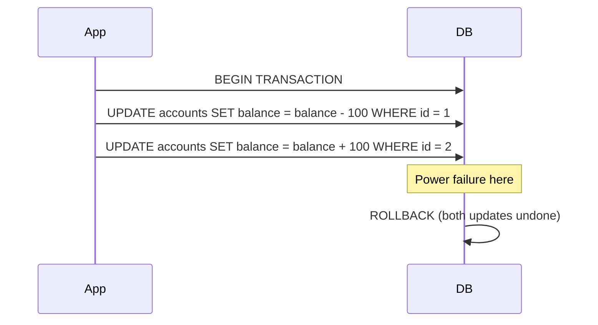
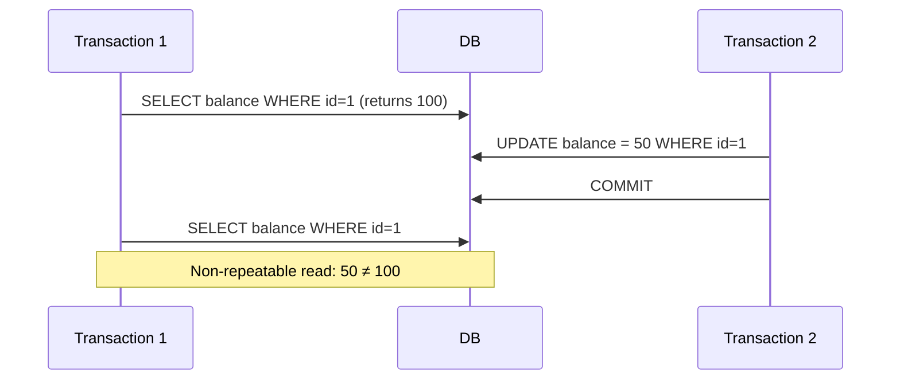
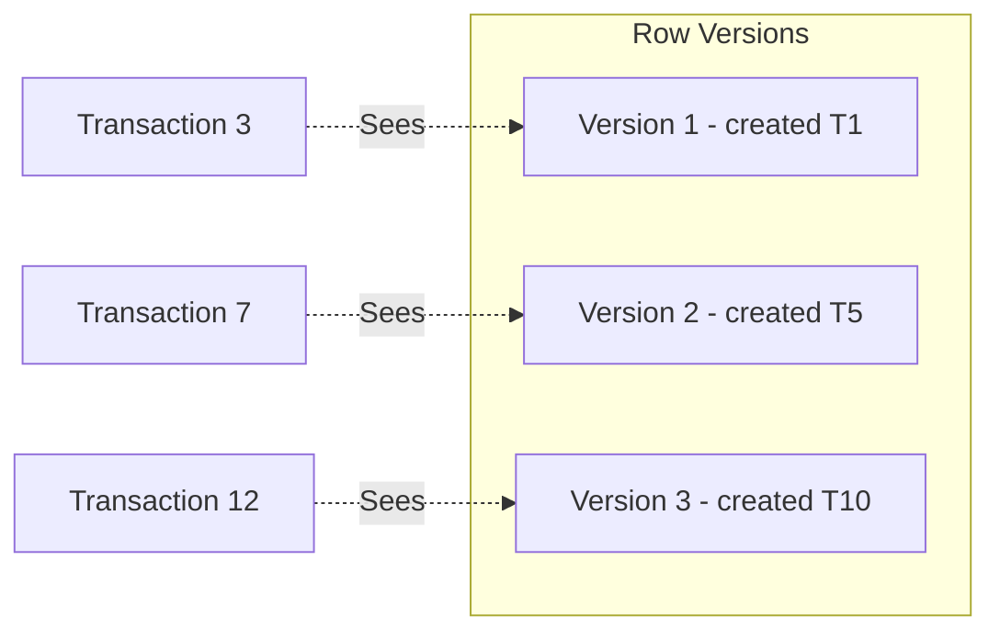
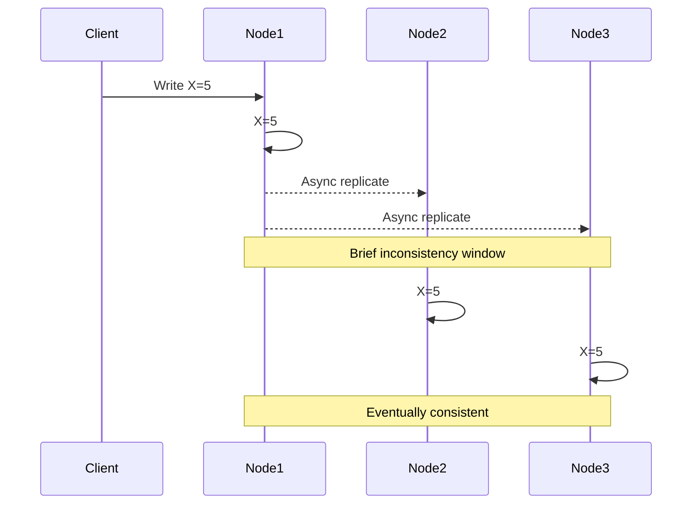
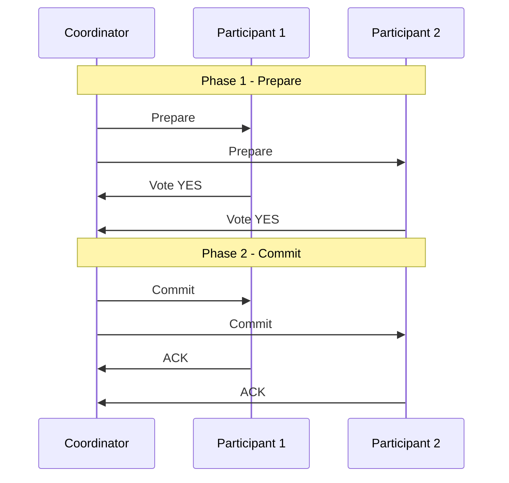
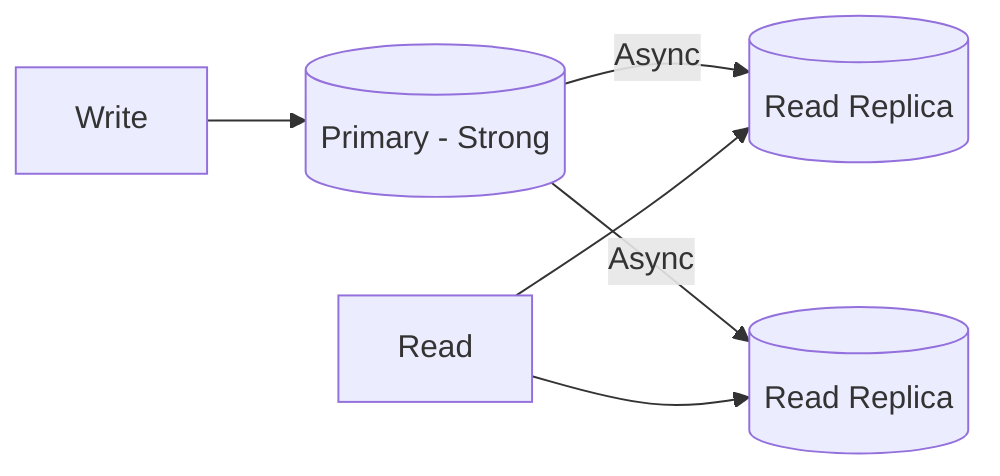

# ACID vs BASE — Deep Dive

> **Level:** Intermediate  
> **Pre-reading:** [01 · Architectural Foundations](01-foundations.md) · [01.03 · CAP Theorem](01.03-cap-theorem.md)

---

## Two Models of Data Consistency

Distributed systems force a choice between two consistency models. **ACID** prioritizes correctness and strong guarantees. **BASE** prioritizes availability and performance, accepting eventual consistency.

| | ACID | BASE |
|:-|:-----|:-----|
| **Philosophy** | Pessimistic; prevent all anomalies | Optimistic; accept temporary inconsistency |
| **Consistency** | Strong; immediate | Eventual; converges over time |
| **Availability** | May block or reject | Always available |
| **Use case** | Financial systems, inventory | Social feeds, analytics, caches |

---

## ACID — The Traditional Model

**ACID** transactions guarantee four properties:

### Atomicity — All or Nothing

A transaction either completes entirely or has no effect. If any part fails, all changes are rolled back.



| Without Atomicity | With Atomicity |
|:------------------|:---------------|
| Money debited from A, but credit to B lost | Either both happen or neither happens |
| Inconsistent state persisted | System always in valid state |

### Consistency — Valid State Transitions

The database moves from one valid state to another. Constraints (foreign keys, check constraints, triggers) are enforced. Invariants are preserved.

!!! note "Consistency in ACID vs CAP"
    These are different concepts. **ACID consistency** = database invariants preserved. **CAP consistency** = all nodes see the same data at the same time.

### Isolation — Concurrent Transactions Don't Interfere

Transactions execute as if they were serial, even when running concurrently.

| Isolation Level | Dirty Read | Non-Repeatable Read | Phantom Read | Performance |
|:----------------|:-----------|:--------------------|:-------------|:------------|
| **Read Uncommitted** | ✗ Possible | ✗ Possible | ✗ Possible | Fastest |
| **Read Committed** | ✓ Prevented | ✗ Possible | ✗ Possible | Fast |
| **Repeatable Read** | ✓ Prevented | ✓ Prevented | ✗ Possible | Medium |
| **Serializable** | ✓ Prevented | ✓ Prevented | ✓ Prevented | Slowest |



### Durability — Committed Data Survives Failures

Once a transaction commits, its changes persist even if the system crashes immediately after.

| Mechanism | Description |
|:----------|:------------|
| **Write-Ahead Log (WAL)** | Changes logged before applied; replay on recovery |
| **Fsync** | Force write to disk (not just OS buffer) |
| **Replication** | Synchronous replication to standby |
| **Checksums** | Detect corruption on read |

---

## ACID Implementation Techniques

### Two-Phase Locking (2PL)

| Phase | Behavior |
|:------|:---------|
| **Growing phase** | Transaction acquires locks; cannot release any |
| **Shrinking phase** | Transaction releases locks; cannot acquire new |

Guarantees serializability but can cause deadlocks.

### Multi-Version Concurrency Control (MVCC)

Instead of locking, each transaction sees a **snapshot** of the database at a point in time. Writers create new versions; readers see old versions.



| Database | Concurrency Control |
|:---------|:--------------------|
| **PostgreSQL** | MVCC (snapshot isolation) |
| **MySQL InnoDB** | MVCC + row locks |
| **Oracle** | MVCC |
| **SQL Server** | 2PL by default; MVCC optional |

---

## BASE — The Distributed Model

**BASE** is the alternative for systems where ACID's guarantees are too expensive:

### Basically Available

The system guarantees availability, even during partial failures. Some requests may get degraded responses, but the system doesn't go offline.

### Soft State

The system's state may change over time, even without input, due to eventual consistency. Data may be temporarily inconsistent between replicas.

### Eventually Consistent

If no new updates are made, all replicas will eventually converge to the same value. The "eventually" may be milliseconds or seconds.



---

## Eventual Consistency — Deeper Look

### Types of Eventual Consistency

| Type | Guarantee |
|:-----|:----------|
| **Eventual** | All replicas converge given enough time |
| **Read-your-writes** | Client always sees their own writes |
| **Monotonic reads** | Client never sees older data after seeing newer |
| **Monotonic writes** | Client's writes are serialized in order |
| **Causal** | Causally related operations seen in order |

### The Consistency Window

The time between when a write occurs and when all replicas reflect it.

| Factor | Effect on Window |
|:-------|:-----------------|
| **Network latency** | Higher latency → longer window |
| **Replication lag** | More replicas → longer to propagate |
| **Write volume** | Higher volume → replication falls behind |
| **Conflict resolution** | Complex resolution → longer convergence |

---

## Comparing ACID and BASE

| Aspect | ACID | BASE |
|:-------|:-----|:-----|
| **Focus** | Correctness | Availability |
| **Scale** | Single node or distributed with coordination | Massively distributed |
| **Performance** | Bounded by coordination | High throughput |
| **Failure mode** | Reject operations | Accept and reconcile |
| **Complexity** | In the database | In the application |
| **Use case** | Banking, inventory | Social, analytics, cache |

### When to Choose ACID

| Scenario | Rationale |
|:---------|:----------|
| **Money transfers** | Cannot have inconsistent balances |
| **Inventory decrement** | Must prevent overselling |
| **Booking systems** | Cannot double-book resources |
| **Audit requirements** | Need provable transaction history |

### When to Choose BASE

| Scenario | Rationale |
|:---------|:----------|
| **Social media likes** | Approximate counts acceptable |
| **Shopping cart** | Merge conflicts on sync |
| **Product recommendations** | Stale data is acceptable |
| **Metrics/analytics** | Eventual accuracy is fine |

---

## Distributed Transactions — ACID Across Services

When ACID guarantees are needed across multiple services:

### Two-Phase Commit (2PC)



| Problem | Description |
|:--------|:------------|
| **Blocking** | Participants hold locks until coordinator decides |
| **Coordinator failure** | Participants stuck in prepared state |
| **Latency** | Multiple round-trips |
| **Availability** | Any participant failure blocks all |

!!! warning "Avoid 2PC in microservices"
    2PC creates tight coupling and availability problems. Use Saga pattern with compensating transactions instead.

### Saga Pattern — BASE for Cross-Service Transactions

Each step is a local ACID transaction. On failure, execute compensating transactions to undo previous steps.

→ **[Deep Dive: Saga Pattern](04.05-saga-pattern.md)** for choreography vs orchestration, compensating transactions

---

## Hybrid Approaches

### Strong Consistency for Writes, Eventual for Reads



| Operation | Consistency | Target |
|:----------|:------------|:-------|
| **Create Order** | Strong | Primary database |
| **View Order List** | Eventual | Read replica |
| **Update Inventory** | Strong | Primary database |
| **Browse Products** | Eventual | Read replica or cache |

### Consistency Per Operation

Many databases allow tuning consistency per query:

```sql
-- DynamoDB: strongly consistent read
aws dynamodb get-item --consistent-read

-- Cassandra: quorum consistency
SELECT * FROM orders WHERE id = 123 CONSISTENCY QUORUM;
```

---

## Application-Level Consistency Patterns

When the database doesn't guarantee consistency, the application must:

| Pattern | Implementation |
|:--------|:---------------|
| **Idempotency keys** | Store operation ID; reject duplicates |
| **Optimistic locking** | Version column; reject stale updates |
| **Conflict-free data types** | CRDTs that merge automatically |
| **Event sourcing** | Append-only events; derive state |
| **Compensating actions** | Undo on failure |

---

??? question "What's the difference between consistency in ACID vs consistency in CAP?"
    **ACID consistency** means database invariants are preserved — constraints are enforced, referential integrity maintained. It's about **valid state transitions** within a single database. **CAP consistency** means all nodes in a distributed system see the **same data at the same time** — it's about **replica synchronization**. A system can be ACID-consistent on each node but CAP-inconsistent across nodes.

??? question "Why is 2PC problematic for microservices?"
    (1) **Blocking**: All participants hold locks waiting for coordinator decision. (2) **Single point of failure**: Coordinator failure leaves participants stuck. (3) **Tight coupling**: All services must participate in the protocol. (4) **Availability**: Any participant being unavailable blocks the entire transaction. (5) **Latency**: Multiple synchronous round-trips. Use Saga pattern instead — local transactions with compensating actions.

??? question "How do you handle eventual consistency in a user-facing application?"
    (1) **Optimistic UI**: Show the expected state immediately; reconcile if different. (2) **Read-your-writes**: Route reads to the node that handled the write. (3) **Polling/websockets**: Update UI when data converges. (4) **Explicit messaging**: "Your order is being processed" instead of showing stale state. (5) **Idempotent retries**: Safe to retry if user refreshes during consistency window.

