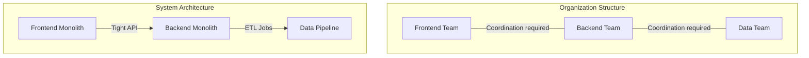
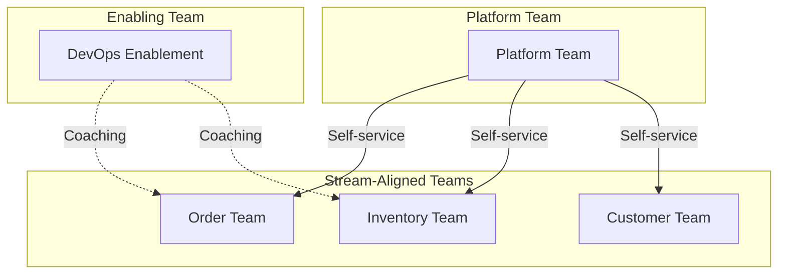
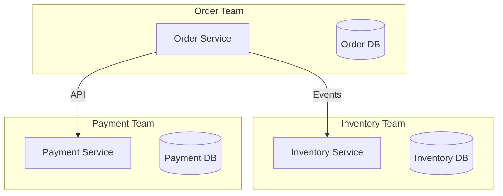

# Conway's Law — Deep Dive

> **Level:** Beginner → Intermediate  
> **Pre-reading:** [01 · Architectural Foundations](01-foundations.md)

---

## The Law

> *"Organizations which design systems are constrained to produce designs which are copies of the communication structures of these organizations."*
> — Melvin Conway, 1967

In plain terms: **your system architecture will mirror your org chart**. Teams that don't talk to each other will build components that don't integrate well. Teams that must coordinate constantly will create tightly coupled systems.

---

## Why Conway's Law Matters for Architects

| If You Ignore It | What Happens |
|:-----------------|:-------------|
| **Org structure misaligns with desired architecture** | Constant friction; architecture drifts toward org |
| **Teams forced to collaborate on shared codebase** | Merge conflicts, coordination overhead, slow releases |
| **Boundaries drawn arbitrarily** | Cross-team dependencies; blocking; politics |

!!! tip "Architecture follows people"
    You cannot sustainably impose an architecture that fights your org structure. Either change the architecture to fit the org, or change the org to fit the architecture.

---

## The Inverse Conway Maneuver

Instead of letting org structure accidentally shape your system, **intentionally structure your teams to produce the architecture you want**.

### Example: Microservices Adoption

| Goal | Org Design |
|:-----|:-----------|
| Independent deployable services | One team per service |
| Service owns its data | Team owns service + database |
| Minimal cross-service dependencies | Minimize cross-team dependencies |
| API contracts between services | API contracts negotiated at team boundaries |

### Example: Breaking Up a Monolith

**Before:**
- 3 feature teams share one monolith codebase
- Merge conflicts, coordinated releases, everyone touches everything

**After (Inverse Conway):**
- Extract bounded contexts into separate services
- Each team owns one or more services end-to-end
- Teams deploy independently

---

## Team Topologies — A Framework

Team Topologies (Skelton & Pais, 2019) provides patterns for structuring teams to reduce cognitive load and enable fast flow:

### Four Fundamental Team Types

| Team Type | Purpose | Example |
|:----------|:--------|:--------|
| **Stream-aligned** | Delivers value in a business domain; end-to-end ownership | Order team, Payments team |
| **Platform** | Provides self-service capabilities to stream-aligned teams | Internal developer platform, K8s platform |
| **Enabling** | Helps other teams adopt new technologies or practices | DevOps enablement, security champions |
| **Complicated-subsystem** | Owns a component requiring deep specialist knowledge | ML model team, payment gateway integration |

### Three Interaction Modes

| Mode | Description | When to Use |
|:-----|:------------|:------------|
| **Collaboration** | Two teams work closely together | Early stages; discovering boundaries |
| **X-as-a-Service** | One team provides a service; other consumes via API | Stable interfaces; platform teams |
| **Facilitating** | Enabling team helps upskill another team | Adopting new practices; temporary |

!!! warning "Collaboration should be temporary"
    Extended collaboration between teams signals unclear boundaries. Use collaboration to discover, then transition to X-as-a-Service.

---

## Cognitive Load and Team Size

Teams have limited cognitive capacity. Overloading a team leads to:
- Slower delivery
- Higher error rates
- Knowledge silos within the team
- Burnout

### Types of Cognitive Load

| Type | Description | How to Reduce |
|:-----|:------------|:--------------|
| **Intrinsic** | Complexity of the problem domain | Training; documentation; domain expertise |
| **Extraneous** | Incidental complexity from tools, processes | Better tooling; eliminate unnecessary process |
| **Germane** | Learning and problem-solving effort | Reduce intrinsic/extraneous to leave room for this |

### Team-Sized Architecture

> *"A team should own a piece of the system they can understand and evolve within their cognitive capacity."*

| Guideline | Rationale |
|:----------|:----------|
| **Team size: 5–9 people** | Two-pizza team; communication scales with n² |
| **One team, one bounded context** | Clear ownership; no coordination needed |
| **Minimize external dependencies** | Each dependency adds cognitive load |
| **Platform absorbs complexity** | Stream-aligned teams focus on business logic |

---

## Signs Your Org and Architecture Are Misaligned

| Symptom | Root Cause | Fix |
|:--------|:-----------|:----|
| **Service A and B always deploy together** | Teams A and B are separate but services are coupled | Merge teams or decouple services |
| **Every feature requires 3+ teams** | Architecture doesn't match value streams | Realign teams to bounded contexts |
| **"Shared services" team is a bottleneck** | Centralized dependency | Distribute ownership; enable self-service |
| **Integration team exists** | Services don't have clear contracts | Define contracts; eliminate integration team |
| **Long PR review queues** | Too many people on one codebase | Split the codebase; shrink teams |

---

## Practical Application: Designing Service Boundaries

### Step 1: Identify Business Capabilities

| Business Capability | Sub-capabilities |
|:--------------------|:-----------------|
| **Order Management** | Create order, track order, cancel order |
| **Inventory** | Stock levels, reservations, replenishment |
| **Customer** | Registration, profile, preferences |
| **Payment** | Charge, refund, fraud detection |

### Step 2: Map to Bounded Contexts (DDD)

Each business capability often maps to a bounded context — a consistent domain model with clear boundaries.

### Step 3: Align Teams to Bounded Contexts

### Step 4: Define Interaction Contracts

- API specifications (OpenAPI, gRPC)
- Event schemas (Avro, Protobuf)
- SLAs (latency, availability)

---

## Common Anti-Patterns

| Anti-Pattern | Problem | Fix |
|:-------------|:--------|:----|
| **Component teams** | Frontend, backend, data teams slice horizontally | Cross-functional stream-aligned teams |
| **Shared codebase** | Multiple teams, one repo | Ownership per folder → extract to repos |
| **Approval committees** | Architecture review board for every change | Decentralize decisions; document principles |
| **Bottleneck teams** | Platform/infra team approves everything | Self-service platform; GitOps |
| **Matrix management** | Developers report to project managers and tech leads | Clear team boundaries; one backlog |

---

## Applying Conway at Scale

### Amazon's "Two-Pizza Teams"

- Teams small enough that two pizzas can feed them
- Each team owns a service end-to-end (build, run, operate)
- Teams communicate via APIs, not meetings
- Architecture emerged from team structure

### Spotify's Squads and Tribes

| Concept | Description |
|:--------|:------------|
| **Squad** | Cross-functional team; owns a feature area |
| **Tribe** | Collection of squads in related area |
| **Chapter** | Horizontal skill group (e.g., all backend devs) |
| **Guild** | Cross-tribe community of practice |

!!! note "Spotify model caveats"
    Many organizations cargo-cult Spotify's model without understanding it evolved organically for Spotify's specific context. Apply the principles, not the exact structure.

---

??? question "What is the Inverse Conway Maneuver?"
    Instead of letting your architecture accidentally emerge from your org chart, you **intentionally design your team structure to produce the desired architecture**. Want microservices? Create small, autonomous teams each owning one service. Want a platform? Create a platform team providing self-service capabilities. The org structure becomes a tool for architectural alignment.

??? question "How does Conway's Law apply to microservices?"
    Microservices architecture requires teams that can independently own, build, deploy, and operate their services. If teams share codebases or have tight coordination requirements, you'll get distributed monoliths (microservices with monolith coupling). The solution: one team per bounded context, clear API contracts, and minimize cross-team dependencies.

??? question "What are the four team types in Team Topologies?"
    (1) **Stream-aligned**: delivers value for a business domain end-to-end. (2) **Platform**: provides self-service capabilities to reduce cognitive load on stream-aligned teams. (3) **Enabling**: helps teams adopt new skills or technologies (temporary). (4) **Complicated-subsystem**: owns specialist components requiring deep expertise. Most teams should be stream-aligned; other types support them.

