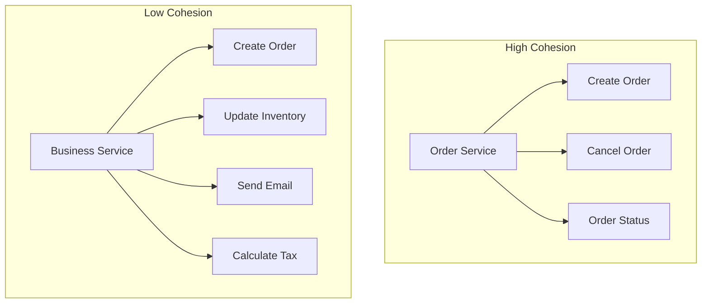

# Core Design Principles — Deep Dive

> **Level:** Beginner → Intermediate  
> **Pre-reading:** [01 · Architectural Foundations](01-foundations.md)

---

## Why Principles Matter

Patterns solve specific problems. **Principles** guide decision-making when no pattern fits exactly. They're the "first principles" you reason from when facing unfamiliar situations.

---

## Loose Coupling

> *"Components should depend on each other as little as possible."*

**Coupling** measures how much one component knows about another's internal workings.

| Tight Coupling | Loose Coupling |
|:---------------|:---------------|
| Direct method calls across services | Async events or well-defined APIs |
| Shared database schemas | Each service owns its data |
| Synchronous chains | Async messaging with retries |
| Shared libraries with business logic | Shared contracts only (schemas, APIs) |

### Coupling Spectrum


### How to Achieve Loose Coupling

| Technique | Description |
|:----------|:------------|
| **Async messaging** | Producer doesn't wait for consumer response |
| **API versioning** | Consumers don't break on minor changes |
| **Schema evolution** | Add fields; never remove/rename |
| **Contracts > implementations** | Depend on interfaces, not concrete classes |
| **Feature flags** | Deploy independently; enable features at runtime |

!!! warning "Distributed monolith"
    Microservices that must deploy together, share databases, or have synchronous call chains aren't microservices — they're a distributed monolith with all the costs and none of the benefits.

---

## High Cohesion

> *"Related code should live together; unrelated code should live apart."*

**Cohesion** measures how focused a component is. High cohesion means everything in the component serves a single, well-defined purpose.

| Low Cohesion | High Cohesion |
|:-------------|:--------------|
| `UtilityService` with unrelated methods | `OrderService` doing only order things |
| "God class" doing everything | Small classes with single responsibility |
| Feature spanning 5 services | Feature contained in one service |

### Cohesion and Service Boundaries



### Testing Cohesion

| Question | If Yes |
|:---------|:-------|
| Can you name the component in 2–3 words? | Cohesive |
| Does every method relate to that name? | Cohesive |
| Would splitting it create artificial coupling? | Keep together |
| Are there methods that never change together? | Split them |

---

## Design for Failure

> *"In distributed systems, failure is not an exception — it's the norm."*

Every network call can fail. Every service can go down. Every database can timeout. Design assuming everything will fail.

### Failure Modes

| Failure | Example |
|:--------|:--------|
| **Crash** | Service process dies |
| **Timeout** | Service is slow; caller gives up |
| **Error response** | Service returns 500 |
| **Corruption** | Service returns wrong data |
| **Byzantine** | Service behaves unpredictably |

### Design Patterns for Failure

| Pattern | Purpose |
|:--------|:--------|
| **Retry** | Recover from transient failures |
| **Circuit Breaker** | Stop calling failing services |
| **Bulkhead** | Isolate failures to one component |
| **Timeout** | Don't wait forever |
| **Fallback** | Degrade gracefully |
| **Idempotency** | Safe retries without side effects |

→ **[Deep Dive: Resilience Patterns](06-resilience.md)** for implementation details

---

## Single Responsibility Principle (SRP)

> *"A component should have one, and only one, reason to change."*

"Reason to change" = a stakeholder or business capability. If a change to billing logic and a change to shipping logic both require modifying the same service, that service has too many responsibilities.

### At the Service Level

| Good | Bad |
|:-----|:----|
| `OrderService` changes only when order logic changes | `OrderService` changes when shipping rules change |
| `PaymentService` owns all payment logic | Payment logic scattered across three services |

### At the Code Level

| Good | Bad |
|:-----|:----|
| `OrderValidator` validates orders | `OrderService` validates, persists, and notifies |
| `InvoiceGenerator` creates invoices | `OrderService` also generates invoices |

---

## Fail Fast

> *"Surface problems immediately; don't hide or swallow errors."*

The longer an error goes undetected, the harder it is to diagnose and the wider the blast radius.

| Fail Fast | Fail Slow (Anti-pattern) |
|:----------|:-------------------------|
| Validate input at API boundary | Accept anything; fail deep in the call stack |
| Throw exception on bad config | Start with defaults; fail mysteriously later |
| Health check fails if dependency down | Serve requests anyway; return errors |
| Circuit breaker trips fast | Keep retrying until timeout |

### Implementation

```java
// Fail fast: validate at entry point
public Order createOrder(OrderRequest request) {
    Objects.requireNonNull(request, "Request cannot be null");
    if (request.getItems().isEmpty()) {
        throw new IllegalArgumentException("Order must have items");
    }
    // Proceed with valid request
}
```

```yaml
# Kubernetes: fail fast startup probe
startupProbe:
  httpGet:
    path: /actuator/health
    port: 8080
  failureThreshold: 3
  periodSeconds: 5
```

---

## Immutable Infrastructure

> *"Don't patch production — replace it."*

Mutable infrastructure: SSH into servers, apply patches, modify config files. State drifts; "works on my machine" multiplies.

Immutable infrastructure: Build new images with changes; deploy them; destroy old instances. Every deployment is a fresh start.

| Mutable | Immutable |
|:--------|:----------|
| SSH and modify | Build new container image |
| In-place upgrades | Blue-green deployment |
| Configuration drift | Every environment identical |
| "Just tweak it in prod" | Rollback = deploy previous image |

### Benefits

| Benefit | Explanation |
|:--------|:------------|
| **Reproducibility** | Same image runs everywhere |
| **Rollback** | Deploy previous known-good image |
| **No drift** | Production matches what you tested |
| **Security** | No SSH access needed; smaller attack surface |

---

## Everything as Code

> *"If it's not in Git, it doesn't exist."*

Version control isn't just for application code. Infrastructure, configuration, pipelines, policies — all should be codified, reviewed, and versioned.

| Domain | As Code |
|:-------|:--------|
| **Infrastructure** | Terraform, Pulumi, AWS CDK |
| **Configuration** | Helm values, Kustomize overlays |
| **Pipelines** | GitHub Actions, GitLab CI YAML |
| **Policies** | OPA Rego, Kubernetes admission policies |
| **Documentation** | Markdown in repo; MkDocs |

### Benefits

| Benefit | Explanation |
|:--------|:------------|
| **Audit trail** | Who changed what, when, and why |
| **Collaboration** | PRs, reviews, comments |
| **Reproducibility** | Recreate environments from scratch |
| **Rollback** | `git revert` to undo changes |

---

## Separation of Concerns

> *"Each component should handle one aspect of functionality."*

Related to SRP but at a higher level. Different types of concerns should be separated:

| Concern | Separation |
|:--------|:-----------|
| **Business logic vs infrastructure** | Hexagonal architecture |
| **Read vs write models** | CQRS |
| **API vs implementation** | Interface-based design |
| **Configuration vs code** | Environment variables, ConfigMaps |
| **Cross-cutting concerns** | Service mesh, middleware, aspects |

### Cross-Cutting Concerns

Some concerns span all components: logging, security, metrics. Handle them consistently without duplicating logic:

| Approach | Example |
|:---------|:--------|
| **Middleware/interceptors** | Express middleware, Spring filters |
| **Aspect-Oriented Programming** | Spring AOP for logging |
| **Service Mesh** | Istio sidecars handle mTLS, metrics |
| **API Gateway** | Centralized auth, rate limiting |

---

## Principle Tensions

Principles sometimes conflict. Architecture is about navigating trade-offs:

| Tension | Trade-off |
|:--------|:----------|
| **Loose coupling vs consistency** | Looser coupling means eventual consistency |
| **High cohesion vs reuse** | Cohesive components may duplicate code |
| **Fail fast vs availability** | Failing fast may reduce availability |
| **Immutability vs cost** | Rebuilding images costs compute time |
| **Everything as code vs agility** | PR reviews add latency to changes |

---

## Principle Checklist

Use this when reviewing designs:

- [ ] Can this component change independently of others?
- [ ] Does this component do one thing well?
- [ ] What happens when this dependency fails?
- [ ] Is there a single reason this code would change?
- [ ] Would a bug here be detected immediately?
- [ ] Is the infrastructure reproducible from scratch?
- [ ] Is everything needed to deploy this system in version control?
- [ ] Is business logic separate from infrastructure concerns?

---

??? question "What's the difference between coupling and cohesion?"
    **Coupling** is about the relationship *between* components — how much one depends on another's internals. **Cohesion** is about the relationship *within* a component — how focused and unified its purpose is. Good design has **low coupling** (components independent) and **high cohesion** (components focused).

??? question "How do you apply 'design for failure' in practice?"
    (1) Assume every network call will fail: add timeouts, retries, circuit breakers. (2) Have fallback responses: cached data, default values, degraded modes. (3) Make operations idempotent: safe to retry without side effects. (4) Test failures: chaos engineering, fault injection. (5) Monitor and alert: detect failures before users do.

??? question "Why is 'immutable infrastructure' better than patching servers?"
    (1) **No drift**: production is identical to what was tested. (2) **Reproducible**: can recreate environment from code. (3) **Easy rollback**: deploy the previous image. (4) **Better security**: no SSH access needed. (5) **Simpler debugging**: every instance is identical. With mutable infrastructure, each server can be slightly different, making debugging a nightmare.

