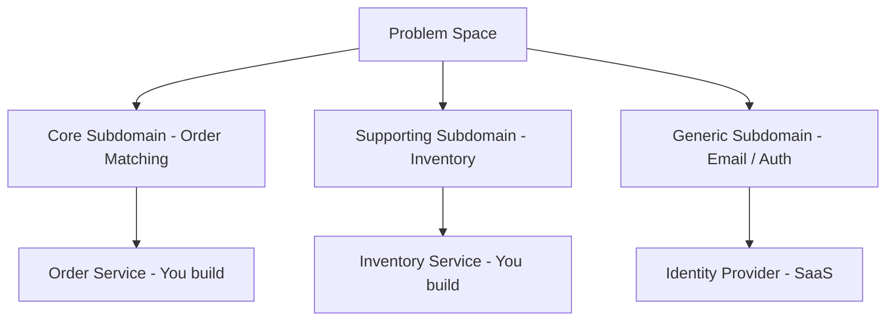
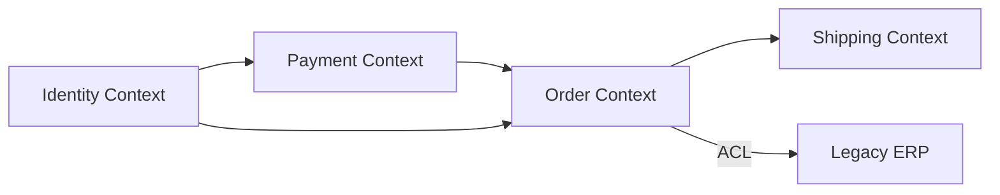
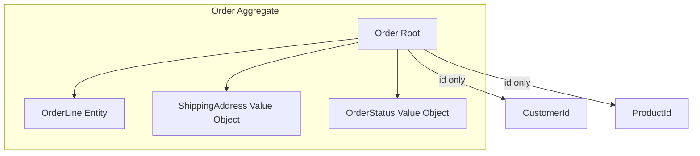

# Domain-Driven Design (DDD)

> DDD is the language microservices are written in. It answers: *how do you draw service boundaries?*

---

## Why DDD Matters for Microservices

The hardest part of microservices is not the technology — it's knowing **where to cut**. DDD provides:

- A vocabulary shared by developers and domain experts
- A principled way to identify service boundaries
- Building blocks for rich domain models

---

## Strategic DDD — The Big Picture

### Bounded Context

The single most important concept. A **bounded context** is an explicit boundary within which a domain model is valid and consistent. The word "Customer" means something different in Sales vs Billing — that's two bounded contexts.

- Each microservice typically maps to **one bounded context**
- Boundaries enforced via explicit APIs and event contracts
- Teams own bounded contexts; one team per context is the goal

### Ubiquitous Language

A shared vocabulary used **consistently** by developers and domain experts, **within a bounded context**. No translation needed inside the context; translation happens at boundaries.

### Subdomains

| Type | Description | Strategy |
|------|-------------|----------|
| **Core** | Competitive advantage; what makes you unique | Build it yourself; invest deeply |
| **Supporting** | Necessary but not differentiating | Build or buy; less investment |
| **Generic** | Commodity functionality | Buy SaaS or use open source |

---

## Context Mapping — How Bounded Contexts Relate

| Pattern | Relationship | Use When |
|---------|-------------|---------|
| **Shared Kernel** | Two teams share a domain model subset; changes require joint agreement | Transitioning; keep small |
| **Customer / Supplier** | Upstream shapes what downstream gets; downstream can negotiate | Clear producer-consumer relationship |
| **Conformist** | Downstream conforms to upstream with no negotiation power | Third-party APIs you can't influence |
| **Anti-Corruption Layer (ACL)** | Translation layer protecting your model from external/legacy systems | Integrating with legacy; strangling monolith |
| **Open Host Service** | Upstream publishes a well-defined protocol multiple consumers can use | Shared platform services |
| **Published Language** | Well-documented shared schema (Avro, JSON Schema, Protobuf) | Event-driven integration contracts |
| **Separate Ways** | No integration; teams solve problems independently | When integration cost exceeds value |

---

## Tactical DDD — Building Blocks

| Building Block | Description | Example |
|----------------|-------------|---------|
| **Entity** | Has a unique identity; mutable over time | `Order` identified by `orderId` |
| **Value Object** | No identity; defined entirely by attributes; immutable | `Money(amount, currency)`, `Address` |
| **Aggregate** | Cluster of entities and value objects; one **Aggregate Root** controls all access | `Order` root containing `OrderLine` entities |
| **Domain Event** | Immutable fact: something happened in the domain | `OrderPlaced`, `PaymentFailed` |
| **Domain Service** | Logic that doesn't belong to any single entity | `PricingService`, `TaxCalculator` |
| **Repository** | Abstraction for persisting and loading aggregates | `OrderRepository.save(order)` |
| **Factory** | Encapsulates complex object creation | `OrderFactory.createFromCart(cart)` |
| **Application Service** | Orchestrates use cases; thin layer above the domain | `OrderApplicationService.placeOrder(cmd)` |

---

## Aggregate Design — Rules of Thumb

- Model aggregates around **invariants** (business rules that must always hold)
- Keep aggregates **small** — include only what must change atomically together
- Reference other aggregates by **ID only**, never by object reference
- **One transaction = one aggregate** — cross-aggregate changes use domain events
- Cross-aggregate consistency is **eventual**, coordinated by events

---

## DDD and Microservices — The Alignment

| DDD Concept | Microservices Equivalent |
|-------------|-------------------------|
| Bounded Context | Microservice boundary |
| Ubiquitous Language | Service API vocabulary |
| Domain Event | Integration event published to Kafka |
| Aggregate | Unit of transactional consistency |
| Anti-Corruption Layer | Adapter translating external API |
| Context Map | Service dependency diagram |

!!! note "The common mistake"
    Decomposing by technical layer (UserController, UserService, UserRepo as separate services) instead of by business capability. DDD prevents this.
