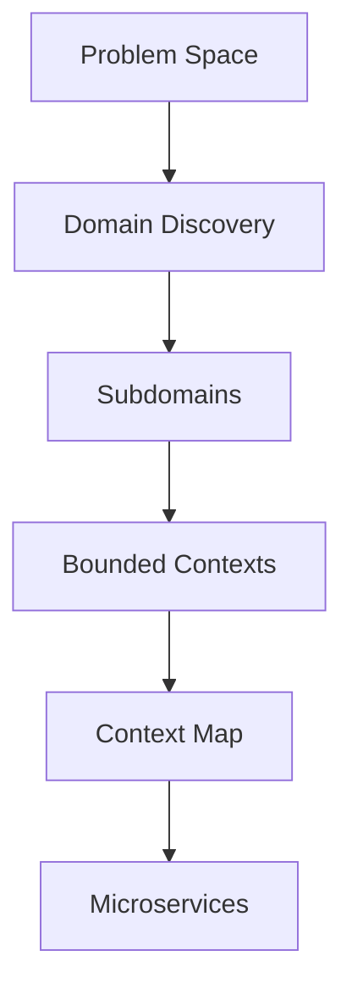
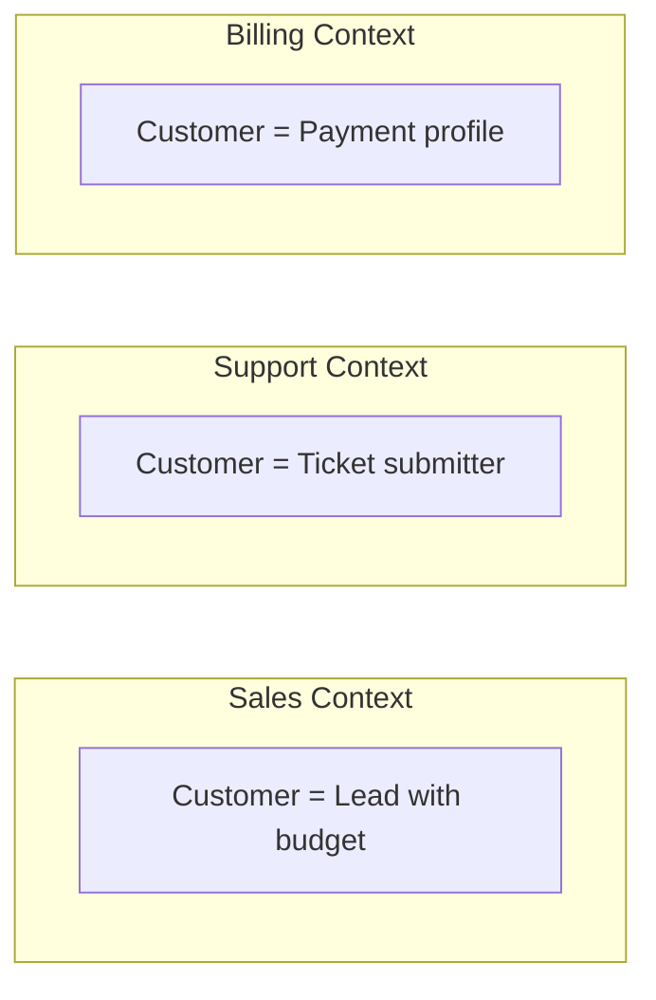
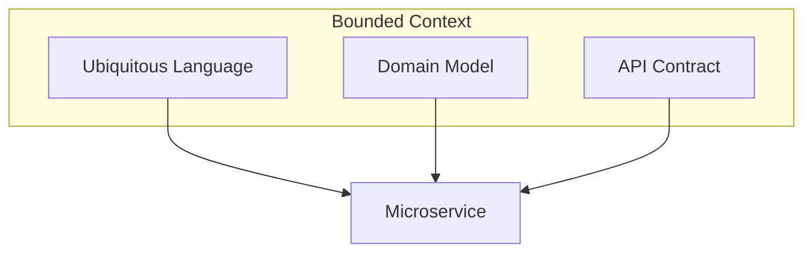
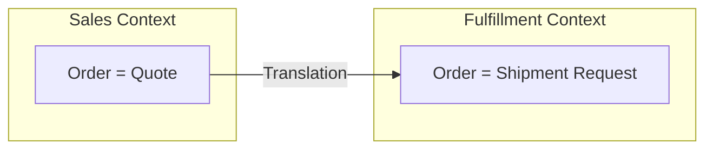
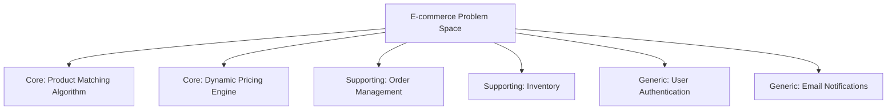
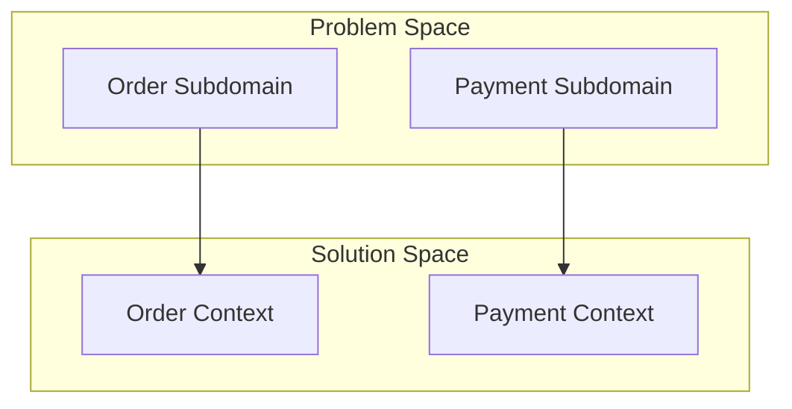
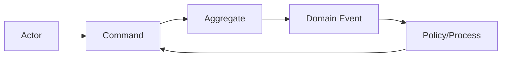

# Strategic DDD — Deep Dive

> **Level:** Intermediate  
> **Pre-reading:** [02 · Domain-Driven Design](02-ddd.md)

---

## Strategic DDD Overview

**Strategic DDD** is about the big picture: how to divide a large system into smaller parts, how those parts relate, and how to invest effort wisely. It answers: *Where do we draw boundaries?*

---

## Bounded Context — The Central Pattern

A **bounded context** is an explicit boundary within which a domain model is defined and consistent. The same word (e.g., "Customer") can mean different things in different contexts.

### Why Bounded Contexts Matter

| Without Bounded Contexts | With Bounded Contexts |
|:-------------------------|:----------------------|
| One "Customer" entity with 50 fields | Each context has its own Customer model |
| Changes ripple everywhere | Changes isolated to one context |
| Conflicting requirements | Each context optimized for its use case |
| One team, one huge model | Teams own their contexts |

### Identifying Bounded Contexts

| Signal | Indicates Boundary |
|:-------|:-------------------|
| **Different vocabulary** | Same word means different things |
| **Different rules** | Business logic diverges |
| **Different data shapes** | Entities have different attributes |
| **Different teams** | Separate ownership needed |
| **Different rates of change** | Decouple to deploy independently |

### Bounded Context to Microservice

| DDD Concept | Microservices Equivalent |
|:------------|:------------------------|
| Bounded Context | Service boundary |
| Ubiquitous Language | API vocabulary |
| Domain Events | Integration events |
| Context Map | Service dependency diagram |

!!! tip "One bounded context = one team"
    A bounded context should be owned by exactly one team. If multiple teams need to modify it, either split the context or reorganize the teams.

---

## Ubiquitous Language

**Ubiquitous language** is a shared vocabulary between developers and domain experts, used consistently in code, documentation, and conversations — **within a bounded context**.

### Building Ubiquitous Language

| Activity | Description |
|:---------|:------------|
| **Event Storming** | Workshop with domain experts; discover events, commands, actors |
| **Domain interviews** | Ask "What happens when...?" and "What do you call...?" |
| **Glossary** | Document terms with precise definitions |
| **Code review** | Reject code that uses wrong terminology |

### Examples

| Wrong (Technical) | Right (Domain) |
|:------------------|:---------------|
| `OrderTable` | `Order` |
| `setStatus(3)` | `confirmOrder()` |
| `insertRecord()` | `placeOrder()` |
| `flagged = true` | `orderHeld = true` |
| `CustomerDTO` | `Customer` (in domain), `CustomerResponse` (in API) |

### Language Boundaries

Ubiquitous language is **not universal**. "Order" in Sales means a quote. "Order" in Fulfillment means a shipment request. This is why bounded contexts exist.

---

## Subdomains — Classifying Problem Areas

The **problem space** is divided into **subdomains** — areas of business functionality. Not all subdomains are equally important.

### Subdomain Types

| Type | Description | Strategy | Example |
|:-----|:------------|:---------|:--------|
| **Core** | Competitive advantage; what makes you unique | Build in-house; invest deeply | Recommendation engine, pricing algorithm |
| **Supporting** | Necessary but not differentiating | Build or buy; moderate investment | Inventory management, CRM |
| **Generic** | Commodity; everyone needs it | Buy SaaS or use open source | Email, authentication, payments |

### Subdomain Investment Strategy

| Subdomain Type | Build vs Buy | Team Investment | Code Quality |
|:---------------|:-------------|:----------------|:-------------|
| **Core** | Always build | Best engineers | Highest standards |
| **Supporting** | Build if simple; buy if complex | Standard team | Good enough |
| **Generic** | Always buy/use OSS | None (SaaS managed) | N/A |

!!! warning "Core domain drift"
    Over time, what's "core" can change. A differentiating feature becomes commoditized. Regularly reassess where your competitive advantage lies.

---

## Subdomain to Bounded Context Mapping

Subdomains are **problem space** concepts. Bounded contexts are **solution space** concepts.

| Relationship | Description |
|:-------------|:------------|
| **1:1** | One subdomain, one bounded context (ideal) |
| **1:N** | One subdomain, multiple bounded contexts (subdomain too large) |
| **N:1** | Multiple subdomains, one bounded context (early stage; will split later) |

---

## Domain Discovery Techniques

### Event Storming

A collaborative workshop for discovering domain events, commands, aggregates, and bounded contexts.

| Step | Activity | Output |
|:-----|:---------|:-------|
| 1 | Write domain events on orange stickies | Event timeline |
| 2 | Add commands (blue) that trigger events | Command-event pairs |
| 3 | Add actors (yellow) who issue commands | Actor identification |
| 4 | Group into aggregates (large yellow) | Aggregate boundaries |
| 5 | Identify bounded context boundaries | Context map |
| 6 | Identify policies and external systems | Integration points |

### Domain Storytelling

Walk through concrete user stories with domain experts, drawing pictorial flows.

### Example Mapping

For each user story:

1. Write the story on a yellow card
2. Add rules (business rules) on blue cards
3. Add examples (scenarios) on green cards
4. Add questions (unknowns) on red cards

---

## Strategic DDD Checklist

- [ ] Have you identified all subdomains in your problem space?
- [ ] Are subdomains classified as Core, Supporting, or Generic?
- [ ] Is your team investment aligned with subdomain importance?
- [ ] Does each bounded context have a clear owner?
- [ ] Is ubiquitous language documented for each context?
- [ ] Do developers use the same vocabulary as domain experts?
- [ ] Are context boundaries visible in code (modules, packages, services)?

---

??? question "How do you identify bounded contexts in a legacy system?"
    (1) **Analyze existing terminology**: where does the same word mean different things? (2) **Look for clusters**: which tables/entities are always queried together? (3) **Find team boundaries**: which code is owned by which team? (4) **Run Event Storming**: discover events and group related ones. (5) **Look for integration points**: existing APIs and message contracts often indicate boundaries.

??? question "What's the difference between a subdomain and a bounded context?"
    A **subdomain** is a problem-space concept — a part of the business domain (e.g., "Payments"). A **bounded context** is a solution-space concept — a specific model with explicit boundaries (e.g., "Payment Service"). Ideally they're 1:1, but early systems may have one bounded context spanning multiple subdomains until it's worth splitting.

??? question "Why shouldn't a bounded context be shared by multiple teams?"
    Shared ownership leads to coordination overhead, conflicting priorities, and diluted responsibility. Each team optimizes for their needs, leading to a bloated, inconsistent model. Conway's Law kicks in: the system will mirror the org structure. One team per bounded context enables autonomy, clear ownership, and independent deployment.

