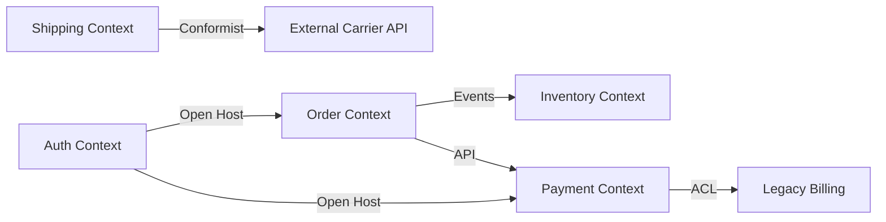
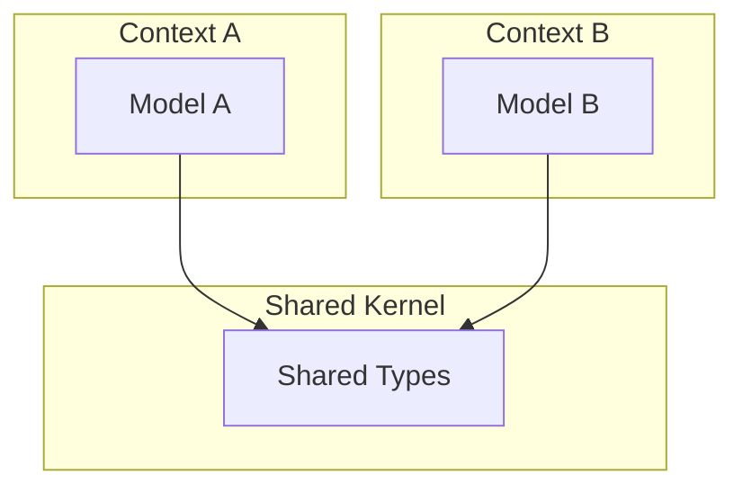
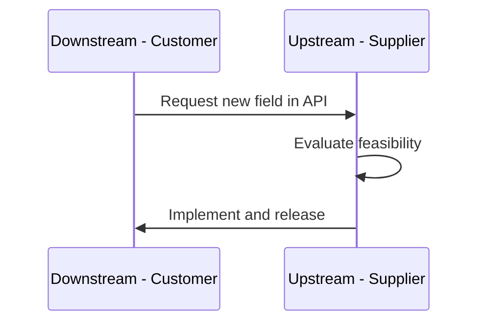
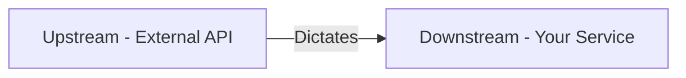
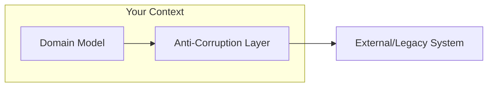
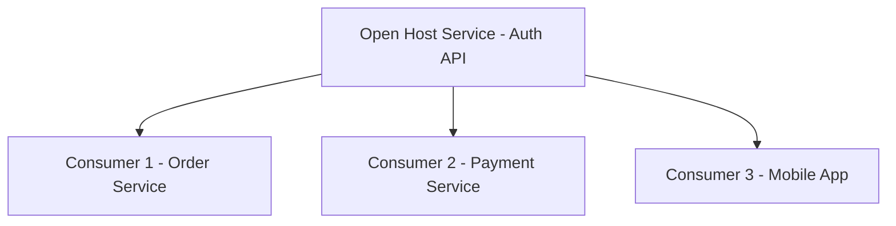
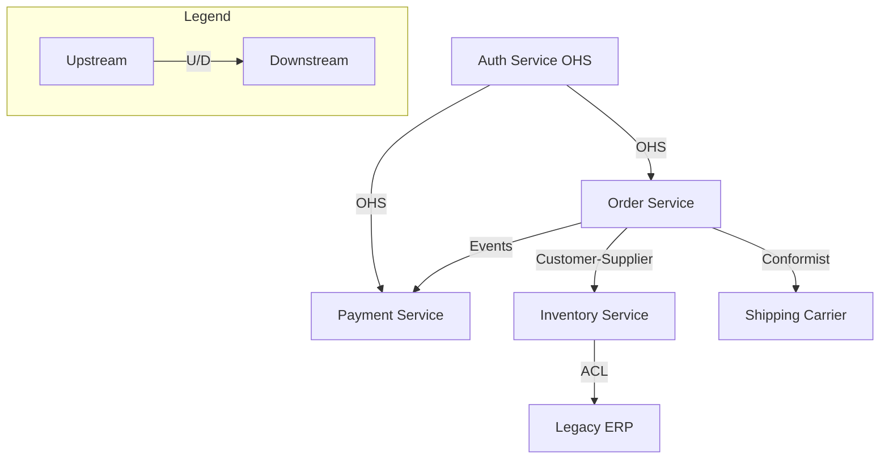

# Context Mapping — Deep Dive

> **Level:** Intermediate → Advanced  
> **Pre-reading:** [02 · Domain-Driven Design](02-ddd.md) · [02.01 · Strategic DDD](02.01-strategic-ddd.md)

---

## What is a Context Map?

A **context map** documents the relationships between bounded contexts. It makes explicit how contexts integrate, who has power in the relationship, and what translation is needed.



---

## Context Mapping Patterns

### Upstream / Downstream Relationships

In any integration between two contexts, one is **upstream** (producer) and one is **downstream** (consumer). Power dynamics affect how contracts evolve.

| Relationship | Upstream | Downstream |
|:-------------|:---------|:-----------|
| **Customer-Supplier** | Shapes the contract | Can negotiate changes |
| **Conformist** | Dictates the contract | Must accept as-is |
| **Open Host Service** | Publishes stable API | Multiple consumers use it |
| **Anti-Corruption Layer** | Any | Translates to protect its model |

---

## Pattern Details

### 1. Shared Kernel

Two contexts share a subset of the domain model. Changes require joint agreement from both teams.



| Pros | Cons |
|:-----|:-----|
| Avoids duplication | Tight coupling |
| Consistent types | Coordination overhead |
| Useful for transitioning | Can grow uncontrollably |

**Use when:** Transitioning from monolith; very closely related contexts; temporary state.

**Avoid when:** Teams are autonomous; shared kernel keeps growing.

!!! warning "Shared Kernel should shrink over time"
    If your shared kernel grows, you're building a distributed monolith. Work to eliminate it or clearly define what belongs there.

---

### 2. Customer-Supplier

The downstream (customer) context depends on the upstream (supplier) context. The relationship allows negotiation — downstream can request changes.



| Upstream Responsibility | Downstream Responsibility |
|:------------------------|:--------------------------|
| Maintain stable API | Provide feedback on needs |
| Communicate breaking changes | Adapt to changes |
| Consider downstream needs | Accept that changes take time |

**Use when:** Clear producer-consumer relationship with collaboration between teams.

---

### 3. Conformist

Downstream has no power to influence upstream. Accept the upstream model as-is, conform to it.



| Scenario | Example |
|:---------|:--------|
| **Third-party API** | Stripe, Twilio, Google Maps |
| **Regulated standard** | ISO, SWIFT, HL7 |
| **Dominant partner** | Large retailer dictating EDI format |

**Use when:** You have no negotiating power; the upstream is outside your control.

**Mitigation:** Consider adding an Anti-Corruption Layer if the upstream model leaks into your domain.

---

### 4. Anti-Corruption Layer (ACL)

A translation layer that protects your domain model from external or legacy models. All interactions with the upstream context go through the ACL.



| ACL Responsibility |
|:-------------------|
| Translate external DTOs to domain objects |
| Translate domain commands to external API calls |
| Hide external model complexity from domain |
| Handle external error formats |

### ACL Implementation

```java
// External model (messy, not your design)
public class LegacyOrderResponse {
    private String ord_id;
    private int stat_code;  // 1=new, 2=shipped, 3=cancelled
    private List<LegacyItem> itms;
}

// Your domain model (clean)
public class Order {
    private OrderId id;
    private OrderStatus status;
    private List<OrderLine> lines;
}

// ACL translates between them
public class OrderAcl {
    public Order toDomain(LegacyOrderResponse response) {
        return new Order(
            new OrderId(response.getOrd_id()),
            mapStatus(response.getStat_code()),
            mapLines(response.getItms())
        );
    }
    
    private OrderStatus mapStatus(int code) {
        return switch (code) {
            case 1 -> OrderStatus.NEW;
            case 2 -> OrderStatus.SHIPPED;
            case 3 -> OrderStatus.CANCELLED;
            default -> throw new IllegalArgumentException("Unknown status: " + code);
        };
    }
}
```

**Use when:** Integrating with legacy systems, external APIs, or any system with a model you don't want to adopt.

---

### 5. Open Host Service

Upstream exposes a well-defined protocol (API) that multiple downstream consumers can use. The API is stable and documented.



| Characteristics |
|:----------------|
| Versioned API (OpenAPI, gRPC) |
| Stable; breaking changes are rare |
| Documentation and SDK provided |
| Often paired with Published Language |

**Use when:** Building a platform service used by multiple consumers.

---

### 6. Published Language

A well-documented, shared schema for data exchange. Often paired with Open Host Service.

| Format | Use Case |
|:-------|:---------|
| **JSON Schema** | REST APIs |
| **Avro** | Kafka events (Schema Registry) |
| **Protocol Buffers** | gRPC services |
| **XML Schema (XSD)** | Enterprise integrations |

**Use when:** Integration contracts need formal documentation and validation.

---

### 7. Separate Ways

No integration. Each context solves the problem independently.

| When Separate Ways is Right |
|:----------------------------|
| Integration cost exceeds benefit |
| Contexts have fundamentally different needs |
| Duplication is acceptable |

**Example:** Two contexts both need currency conversion. If integrating is complex and requirements differ, each implements its own.

---

## Context Map Visualization

Draw your context map to make relationships explicit:



### Context Map Heuristics

| Relationship | Draw As |
|:-------------|:--------|
| Customer-Supplier | Arrow with label "C/S" |
| Conformist | Arrow with label "Conformist" |
| ACL | Box around downstream with "ACL" |
| Open Host Service | Labeled API box |
| Shared Kernel | Overlapping area |
| Separate Ways | No connection |

---

## Integration Strategy by Relationship

| Relationship | Recommended Integration |
|:-------------|:------------------------|
| **Shared Kernel** | Shared library or schema |
| **Customer-Supplier** | API with versioning |
| **Conformist** | Direct API call (no translation) |
| **ACL** | Adapter/translator layer |
| **Open Host Service** | REST/gRPC with OpenAPI/Proto |
| **Published Language** | Schema Registry for events |

---

## Common Mistakes

| Mistake | Impact | Fix |
|:--------|:-------|:----|
| No explicit context map | Hidden dependencies | Document relationships |
| Shared Kernel grows | Tight coupling | Extract or eliminate |
| Missing ACL for legacy | Legacy model leaks into domain | Add translation layer |
| Conformist to internal service | Downstream blocked by upstream | Negotiate (Customer-Supplier) |
| Too many Shared Kernels | Distributed monolith | One Shared Kernel max; prefer APIs |

---

??? question "When should you use an Anti-Corruption Layer?"
    Use ACL when integrating with (1) legacy systems with poor models, (2) external APIs you can't control, (3) any system whose model you don't want leaking into your domain. ACL has a cost (translation code, potential bugs), so only use it when the upstream model is significantly different from your domain model.

??? question "What's the difference between Customer-Supplier and Conformist?"
    **Customer-Supplier** implies negotiation power — downstream can request changes. **Conformist** means downstream has no power and must accept whatever upstream provides. With third-party APIs (Stripe, AWS), you're a Conformist. With internal teams, aim for Customer-Supplier so needs are considered.

??? question "How do you evolve from Shared Kernel to separate contexts?"
    (1) Identify which parts of the shared kernel are truly shared vs. duplicated for convenience. (2) For truly shared types (e.g., Money), consider a small shared library. (3) For context-specific types, duplicate and let them evolve independently. (4) Replace shared database access with APIs or events. (5) Gradually shrink the kernel until it's eliminated or minimal.

