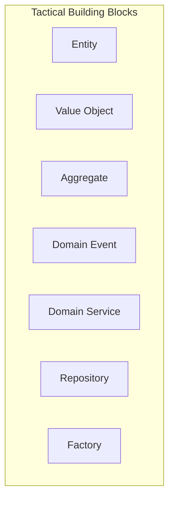

# Tactical DDD Building Blocks — Deep Dive

> **Level:** Intermediate  
> **Pre-reading:** [02 · Domain-Driven Design](02-ddd.md) · [02.01 · Strategic DDD](02.01-strategic-ddd.md)

---

## Tactical DDD Overview

**Tactical DDD** provides building blocks for implementing a rich domain model within a bounded context. These patterns help express business logic in code that mirrors how domain experts think.



---

## Entity

An **entity** has a unique identity that persists over time. Two entities with the same attributes but different IDs are different entities.

| Characteristic | Description |
|:---------------|:------------|
| **Identity** | Has a unique identifier (ID) |
| **Mutability** | Can change state over time |
| **Lifecycle** | Created, modified, possibly deleted |
| **Equality** | Two entities are equal if IDs match |

### Entity Examples

| Entity | Identity | Why Entity? |
|:-------|:---------|:------------|
| `Order` | `orderId` | Tracks through lifecycle |
| `Customer` | `customerId` | Same person over time |
| `Product` | `SKU` | Inventory tracked per SKU |
| `BankAccount` | `accountNumber` | Balance changes; identity persists |

### Entity Implementation

```java
public class Order {
    private final OrderId id;  // Identity
    private OrderStatus status;
    private List<OrderLine> lines;
    private Money totalAmount;
    
    // Business methods, not just getters/setters
    public void addLine(Product product, int quantity) {
        // Invariant check
        if (status != OrderStatus.DRAFT) {
            throw new IllegalStateException("Cannot modify confirmed order");
        }
        lines.add(new OrderLine(product.getId(), quantity, product.getPrice()));
        recalculateTotal();
    }
    
    public void confirm() {
        if (lines.isEmpty()) {
            throw new IllegalStateException("Cannot confirm empty order");
        }
        this.status = OrderStatus.CONFIRMED;
        // Could raise OrderConfirmed event here
    }
    
    @Override
    public boolean equals(Object o) {
        if (this == o) return true;
        if (!(o instanceof Order)) return false;
        Order order = (Order) o;
        return id.equals(order.id);  // Identity-based equality
    }
}
```

!!! warning "Anemic Entity anti-pattern"
    Entities with only getters/setters and no behavior are called anemic. Business logic ends up scattered across services. Put behavior **in** the entity where the data lives.

---

## Value Object

A **value object** has no identity. It is defined entirely by its attributes. Value objects are **immutable** — to change, create a new one.

| Characteristic | Description |
|:---------------|:------------|
| **No identity** | Defined by attributes, not ID |
| **Immutable** | Cannot be modified after creation |
| **Equality** | Two VOs are equal if all attributes match |
| **Replaceable** | Swap one for another freely |

### Value Object Examples

| Value Object | Attributes | Why Value Object? |
|:-------------|:-----------|:------------------|
| `Money` | `amount`, `currency` | $100 USD is $100 USD everywhere |
| `Address` | `street`, `city`, `zip`, `country` | Interchangeable if attributes match |
| `DateRange` | `start`, `end` | No need to track "which date range" |
| `EmailAddress` | `value` | Validates format; interchangeable |
| `Coordinates` | `latitude`, `longitude` | A point is just a point |

### Value Object Implementation

```java
public final class Money {
    private final BigDecimal amount;
    private final Currency currency;
    
    public Money(BigDecimal amount, Currency currency) {
        if (amount == null || currency == null) {
            throw new IllegalArgumentException("Amount and currency required");
        }
        if (amount.compareTo(BigDecimal.ZERO) < 0) {
            throw new IllegalArgumentException("Amount cannot be negative");
        }
        this.amount = amount;
        this.currency = currency;
    }
    
    // Operations return new instances (immutability)
    public Money add(Money other) {
        if (!this.currency.equals(other.currency)) {
            throw new IllegalArgumentException("Cannot add different currencies");
        }
        return new Money(this.amount.add(other.amount), this.currency);
    }
    
    public Money multiply(int quantity) {
        return new Money(this.amount.multiply(BigDecimal.valueOf(quantity)), this.currency);
    }
    
    @Override
    public boolean equals(Object o) {
        if (this == o) return true;
        if (!(o instanceof Money)) return false;
        Money money = (Money) o;
        return amount.compareTo(money.amount) == 0 && currency.equals(money.currency);
    }
    
    @Override
    public int hashCode() {
        return Objects.hash(amount, currency);
    }
}
```

### Entity vs Value Object Decision

| Question | Entity | Value Object |
|:---------|:-------|:-------------|
| Does it need to be tracked over time? | Yes | No |
| Is identity important? | Yes | No |
| Are two instances with same attributes the same thing? | No | Yes |
| Should it be immutable? | Usually no | Always yes |

---

## Domain Event

A **domain event** represents something that happened in the domain. Events are immutable facts — past tense, already occurred.

| Characteristic | Description |
|:---------------|:------------|
| **Past tense naming** | `OrderPlaced`, `PaymentReceived` |
| **Immutable** | Cannot be changed after creation |
| **Contains context** | Includes data needed by consumers |
| **Timestamp** | When the event occurred |

### Domain Event Examples

| Event | Payload | Triggered By |
|:------|:--------|:-------------|
| `OrderPlaced` | `orderId`, `customerId`, `totalAmount`, `lines[]` | `order.place()` |
| `PaymentFailed` | `orderId`, `reason`, `failedAt` | Payment gateway callback |
| `InventoryReserved` | `orderId`, `items[]`, `warehouseId` | Inventory service |
| `CustomerRegistered` | `customerId`, `email`, `registeredAt` | Registration flow |

### Domain Event Implementation

```java
public record OrderPlaced(
    OrderId orderId,
    CustomerId customerId,
    Money totalAmount,
    List<OrderLineSnapshot> lines,
    Instant occurredAt
) {
    public OrderPlaced {
        Objects.requireNonNull(orderId);
        Objects.requireNonNull(customerId);
        Objects.requireNonNull(totalAmount);
        Objects.requireNonNull(lines);
        if (occurredAt == null) {
            occurredAt = Instant.now();
        }
    }
}

// Raising events from an entity
public class Order {
    private final List<DomainEvent> domainEvents = new ArrayList<>();
    
    public void place() {
        // Business logic...
        this.status = OrderStatus.PLACED;
        
        // Raise event
        domainEvents.add(new OrderPlaced(
            this.id, this.customerId, this.totalAmount, 
            snapshotLines(), Instant.now()
        ));
    }
    
    public List<DomainEvent> getDomainEvents() {
        return List.copyOf(domainEvents);
    }
    
    public void clearDomainEvents() {
        domainEvents.clear();
    }
}
```

---

## Domain Service

A **domain service** contains business logic that doesn't naturally belong to any single entity or value object.

| Use When | Example |
|:---------|:--------|
| Logic spans multiple aggregates | `TransferService.transfer(from, to, amount)` |
| Logic requires external information | `PricingService.calculatePrice(order, customerTier)` |
| Operation is a domain concept | `TaxCalculator.calculate(order, jurisdiction)` |

### Domain Service vs Application Service

| | Domain Service | Application Service |
|:-|:---------------|:--------------------|
| **Contains** | Business logic | Orchestration |
| **Knows about** | Domain model | Use cases, transactions |
| **Calls** | Entities, other domain services | Repositories, domain services |
| **Depends on** | Domain only | Infrastructure (indirectly via ports) |

### Domain Service Implementation

```java
// Domain Service (pure domain logic)
public class PricingService {
    public Money calculateOrderTotal(Order order, CustomerTier tier) {
        Money subtotal = order.getSubtotal();
        Money discount = calculateDiscount(subtotal, tier);
        return subtotal.subtract(discount);
    }
    
    private Money calculateDiscount(Money amount, CustomerTier tier) {
        BigDecimal discountRate = switch (tier) {
            case BRONZE -> BigDecimal.ZERO;
            case SILVER -> new BigDecimal("0.05");
            case GOLD -> new BigDecimal("0.10");
            case PLATINUM -> new BigDecimal("0.15");
        };
        return amount.multiply(discountRate);
    }
}

// Application Service (orchestration)
public class OrderApplicationService {
    private final OrderRepository orderRepository;
    private final PricingService pricingService;
    private final CustomerRepository customerRepository;
    
    public void placeOrder(PlaceOrderCommand command) {
        Customer customer = customerRepository.findById(command.customerId())
            .orElseThrow(() -> new CustomerNotFoundException(command.customerId()));
        
        Order order = Order.create(command.items());
        Money total = pricingService.calculateOrderTotal(order, customer.getTier());
        order.setTotal(total);
        order.place();
        
        orderRepository.save(order);
        // Publish domain events...
    }
}
```

---

## Repository

A **repository** provides an abstraction for loading and saving aggregates. It acts as a collection of aggregates.

| Characteristic | Description |
|:---------------|:------------|
| **Collection semantics** | `add()`, `remove()`, `findById()` |
| **Aggregate-level** | One repository per aggregate root |
| **Persistence ignorance** | Domain doesn't know about DB |
| **Interface in domain** | Implementation in infrastructure |

### Repository Implementation

```java
// Port (interface in domain layer)
public interface OrderRepository {
    Optional<Order> findById(OrderId id);
    List<Order> findByCustomer(CustomerId customerId);
    void save(Order order);
    void delete(Order order);
}

// Adapter (implementation in infrastructure layer)
@Repository
public class JpaOrderRepository implements OrderRepository {
    private final OrderJpaRepository jpaRepository;
    private final OrderMapper mapper;
    
    @Override
    public Optional<Order> findById(OrderId id) {
        return jpaRepository.findById(id.getValue())
            .map(mapper::toDomain);
    }
    
    @Override
    public void save(Order order) {
        OrderEntity entity = mapper.toEntity(order);
        jpaRepository.save(entity);
    }
}
```

---

## Factory

A **factory** encapsulates complex object creation logic. Use when constructing an aggregate requires significant logic.

| Use When |
|:---------|
| Creation logic is complex |
| Creation involves multiple steps |
| Different creation paths exist |
| Invariants must be enforced at creation |

### Factory Implementation

```java
public class OrderFactory {
    private final ProductRepository productRepository;
    private final PricingService pricingService;
    
    public Order createFromCart(Cart cart, Customer customer) {
        // Validate products exist and are available
        List<OrderLine> lines = cart.getItems().stream()
            .map(item -> {
                Product product = productRepository.findById(item.productId())
                    .orElseThrow(() -> new ProductNotFoundException(item.productId()));
                if (!product.isAvailable()) {
                    throw new ProductUnavailableException(product.getId());
                }
                return new OrderLine(product.getId(), item.quantity(), product.getPrice());
            })
            .toList();
        
        Order order = new Order(OrderId.generate(), customer.getId(), lines);
        Money total = pricingService.calculateOrderTotal(order, customer.getTier());
        order.setTotal(total);
        
        return order;
    }
}
```

---

## Building Blocks Summary

| Building Block | Identity | Mutable | Contains Logic | Persisted |
|:---------------|:---------|:--------|:---------------|:----------|
| **Entity** | Yes | Yes | Yes | Yes (via Repository) |
| **Value Object** | No | No | Yes | Embedded in Entity |
| **Aggregate** | Yes (root) | Yes | Yes | Yes (via Repository) |
| **Domain Event** | No | No | No | Yes (Event Store) |
| **Domain Service** | N/A | N/A | Yes | No |
| **Repository** | N/A | N/A | No (interface) | N/A |
| **Factory** | N/A | N/A | Yes (creation) | No |

---

??? question "When should logic go in an Entity vs a Domain Service?"
    If the logic operates on the **data owned by a single entity** and represents a **natural behavior** of that entity, it belongs in the entity. If the logic **spans multiple aggregates**, requires **external information**, or represents a **standalone domain concept** (like pricing or tax calculation), use a domain service.

??? question "Why are Value Objects immutable?"
    (1) **Thread safety**: no synchronization needed. (2) **Simpler reasoning**: no hidden state changes. (3) **Safe sharing**: pass references freely. (4) **Cacheable**: same inputs always produce same output. (5) **Equality stability**: if attributes define equality, changing them would break collections.

??? question "What's the difference between a Repository and a DAO?"
    A **Repository** operates on **aggregates** and uses **collection semantics** (`add`, `remove`). It's a domain concept. A **DAO** (Data Access Object) operates on **database tables** and uses **CRUD semantics**. DAOs are persistence-focused; Repositories are domain-focused. Repositories often use DAOs internally.

