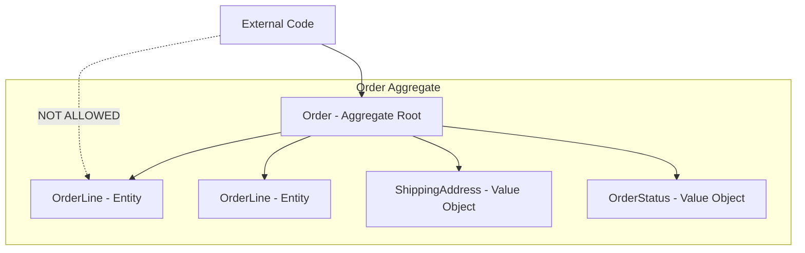
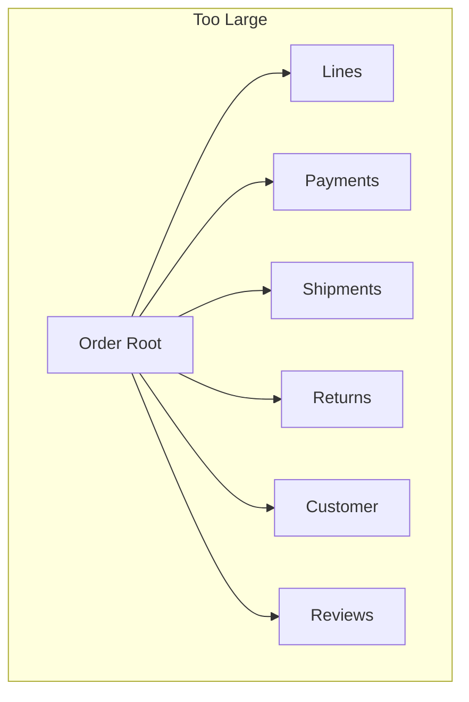
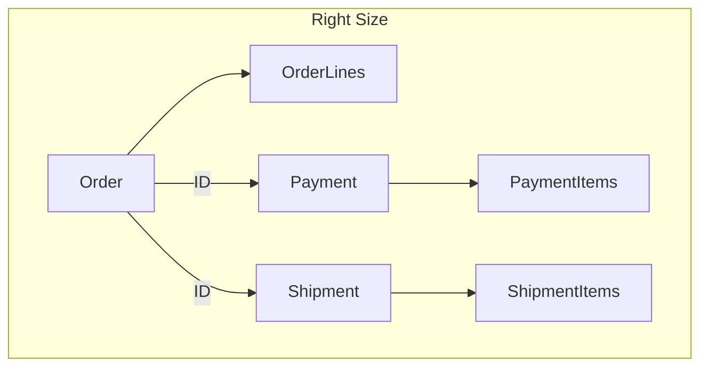
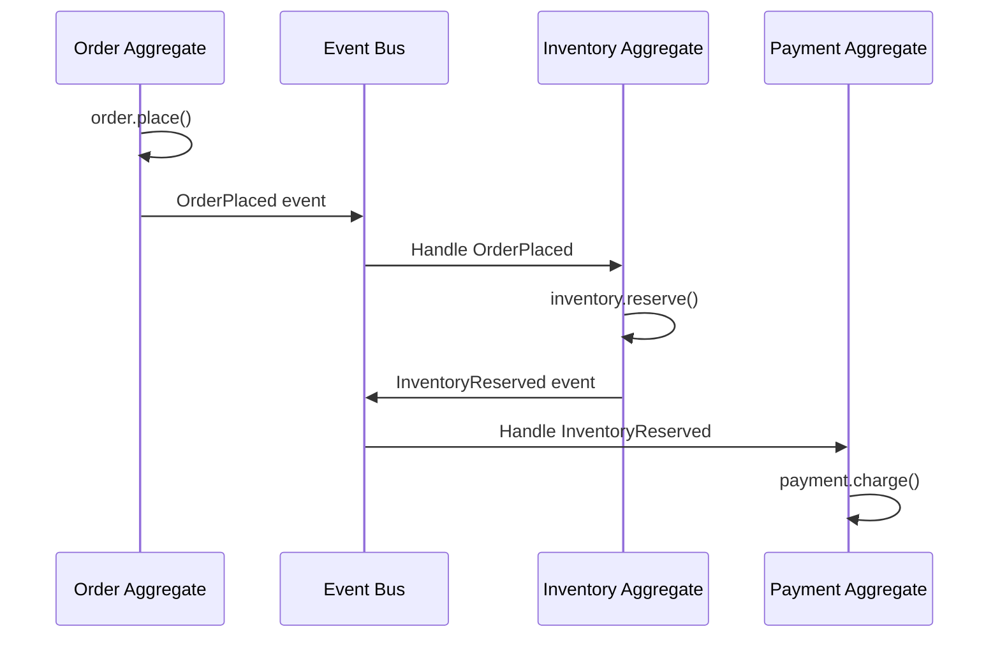
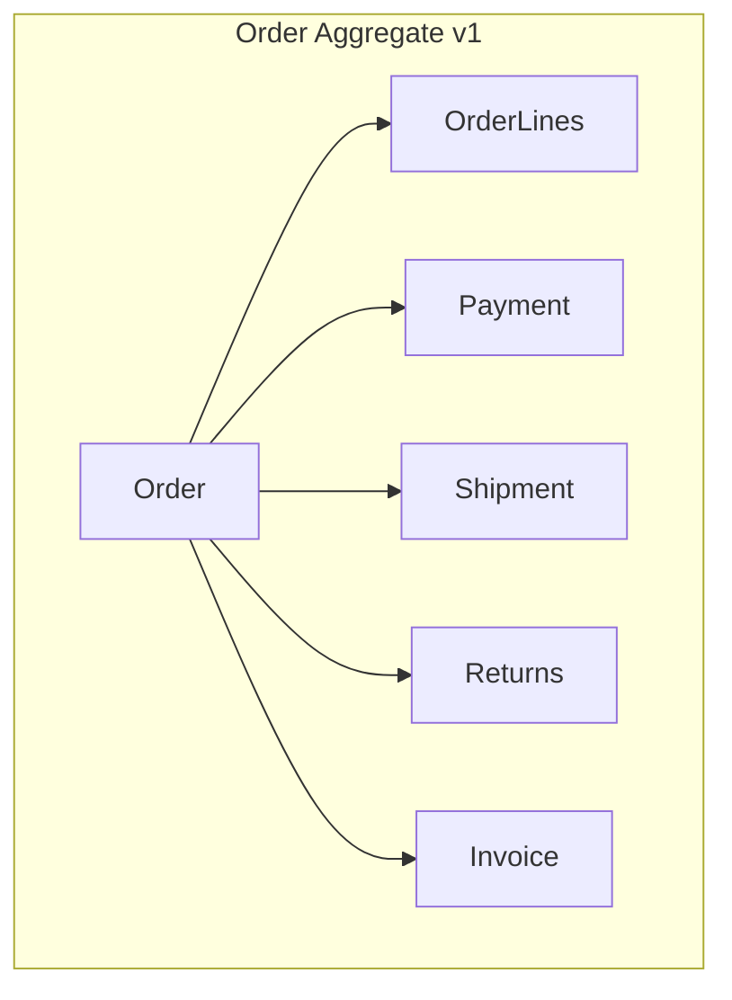
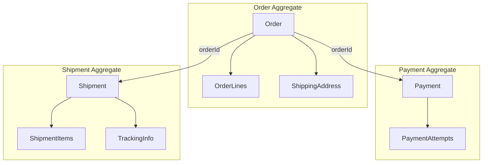

# Aggregate Design — Deep Dive

> **Level:** Advanced  
> **Pre-reading:** [02 · Domain-Driven Design](02-ddd.md) · [02.03 · Tactical Building Blocks](02.03-tactical-building-blocks.md)

---

## What is an Aggregate?

An **aggregate** is a cluster of entities and value objects with a consistency boundary. One entity acts as the **aggregate root** — the only entry point for external access.



---

## Aggregate Rules

### Rule 1: Reference Aggregate Root Only

External code can only hold references to the aggregate root. Internal entities are accessed through the root.

```java
// WRONG: Direct access to internal entity
OrderLine line = orderLineRepository.findById(lineId);
line.setQuantity(5);

// RIGHT: Access through aggregate root
Order order = orderRepository.findById(orderId);
order.updateLineQuantity(lineId, 5);  // Root enforces invariants
```

### Rule 2: One Transaction = One Aggregate

A single transaction should only modify one aggregate. Cross-aggregate changes use domain events and eventual consistency.

```java
// WRONG: Modify two aggregates in one transaction
@Transactional
public void placeOrder(Order order, Inventory inventory) {
    order.place();
    inventory.reserve(order.getItems());  // Two aggregates
    // If inventory fails, order is rolled back — tight coupling
}

// RIGHT: Single aggregate per transaction; use events
@Transactional
public void placeOrder(Order order) {
    order.place();  // Raises OrderPlaced event
    orderRepository.save(order);
}

// Another service handles InventoryReserved via event
@EventListener
public void onOrderPlaced(OrderPlaced event) {
    Inventory inventory = inventoryRepository.findByWarehouse(warehouseId);
    inventory.reserve(event.getItems());
    inventoryRepository.save(inventory);
}
```

### Rule 3: Reference Other Aggregates by ID Only

Don't hold object references to other aggregates. Use IDs. This enforces loose coupling and enables distribution.

```java
// WRONG: Object reference to another aggregate
public class Order {
    private Customer customer;  // Object reference
}

// RIGHT: ID reference
public class Order {
    private CustomerId customerId;  // ID only
}
```

### Rule 4: Aggregates Are Consistency Boundaries

All invariants within an aggregate are enforced immediately (strong consistency). Invariants across aggregates are eventually consistent.

| Invariant Scope | Consistency Model |
|:----------------|:------------------|
| Within aggregate | Immediate (ACID) |
| Across aggregates | Eventual (events) |

---

## Designing Aggregate Boundaries

### Model Around Invariants

An **invariant** is a business rule that must always hold true. Include in the aggregate only what's needed to enforce invariants.

| Invariant | Aggregate Design |
|:----------|:-----------------|
| "Order total must equal sum of line amounts" | Order + OrderLines in same aggregate |
| "Customer cannot exceed credit limit" | Customer aggregate checks limit on order placement? NO — use events |
| "SKU must be unique per product" | Product aggregate |

### Keep Aggregates Small

Large aggregates cause:
- Performance problems (loading everything)
- Contention (locking large data structures)
- Complexity (too many invariants)





### Split by Rate of Change

Entities that change independently should be in separate aggregates.

| Entity | Changes When | Aggregate |
|:-------|:-------------|:----------|
| Order | Order placed, modified, cancelled | Order |
| Shipment | Shipped, delivered, returned | Shipment (separate) |
| Payment | Charged, refunded | Payment (separate) |

---

## Aggregate Design Heuristics

### Heuristic 1: Start with Smallest Possible Aggregate

Begin with the aggregate root and its most essential value objects. Add entities only when invariants require it.

### Heuristic 2: Question Every Entity in Aggregate

For each entity inside an aggregate, ask:
- Can this exist independently?
- Does the root need it to enforce invariants?
- Could this be its own aggregate?

### Heuristic 3: Use Value Objects Liberally

Value objects have no identity overhead and can be copied freely. Prefer them over entities when possible.

### Heuristic 4: Trust Eventual Consistency

Don't expand aggregates just to get immediate consistency. Many business rules tolerate eventual consistency with proper compensation.

---

## Cross-Aggregate Consistency

When business logic spans aggregates, use domain events:



### Saga for Complex Workflows

When cross-aggregate operations can fail and require compensation:

| Step | Action | Compensating Action |
|:-----|:-------|:--------------------|
| 1 | Reserve inventory | Release reservation |
| 2 | Charge payment | Issue refund |
| 3 | Create shipment | Cancel shipment |

→ **[Deep Dive: Saga Pattern](04.05-saga-pattern.md)**

---

## Aggregate and Persistence

### One Repository Per Aggregate

```java
public interface OrderRepository {
    Optional<Order> findById(OrderId id);
    void save(Order order);
}

// NOT one repository per entity
// OrderLineRepository — WRONG
```

### Load Complete Aggregate

When loading, load the entire aggregate. Lazy loading internals defeats the consistency boundary.

```java
// Load complete
Order order = orderRepository.findById(id);  // Includes all OrderLines

// NOT piecemeal
Order order = orderRepository.findById(id);
order.getLines();  // Lazy load — can cause consistency issues
```

### Consider Snapshots for Large Aggregates

If an aggregate has many events (Event Sourcing) or deep object graphs, use snapshots to speed loading.

---

## Common Aggregate Mistakes

| Mistake | Problem | Fix |
|:--------|:--------|:----|
| **Too large** | Performance, contention | Split; eventual consistency |
| **Object references across aggregates** | Tight coupling; can't distribute | Use IDs |
| **Multiple aggregates in one transaction** | Scalability limits; distributed transactions | Events; saga |
| **Exposing internals** | Invariants bypassed | Access only through root |
| **Anemic root** | Logic scattered outside | Behavior in aggregate |

---

## Aggregate Case Study: E-Commerce Order

### Version 1: Too Large



**Problems:**
- Payment can change independently of order
- Shipment has its own lifecycle
- High contention on order modifications

### Version 2: Right-Sized



**Relationships:**
- Payment references Order by ID
- Shipment references Order by ID
- OrderPlaced event triggers Payment and Shipment creation

---

## Aggregate Invariant Examples

| Aggregate | Invariants |
|:----------|:-----------|
| **Order** | Total = sum of lines; at least one line; can only cancel if not shipped |
| **Inventory** | Reserved + Available = Total; cannot reserve more than available |
| **Account** | Balance cannot go negative (unless overdraft enabled) |
| **Cart** | Max 100 items; item quantity ≥ 1 |

---

??? question "Why should aggregates be small?"
    (1) **Performance**: Loading a large aggregate is slow. (2) **Contention**: Concurrent updates conflict on large aggregates. (3) **Memory**: Large aggregates consume more memory. (4) **Complexity**: More invariants to reason about. (5) **Transactions**: Large aggregates mean larger, longer transactions. Start small; expand only when invariants require it.

??? question "How do you handle cross-aggregate transactions?"
    Use **domain events** and **eventual consistency**. Each aggregate is updated in its own transaction. Events notify other aggregates of changes. For complex multi-step processes, use the **Saga pattern** with compensating transactions. Avoid distributed transactions (2PC) — they don't scale and reduce availability.

??? question "When should an entity be inside an aggregate vs. its own aggregate?"
    Include an entity inside an aggregate if: (1) it cannot exist without the root (OrderLine without Order), (2) it's always modified through the root, (3) the root needs it to enforce invariants. Make it a separate aggregate if: (1) it has its own lifecycle, (2) it's accessed independently, (3) it changes at a different rate.

