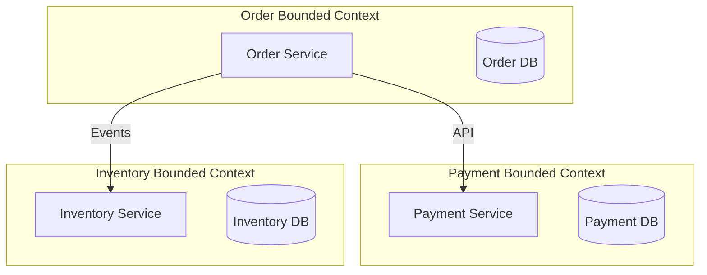
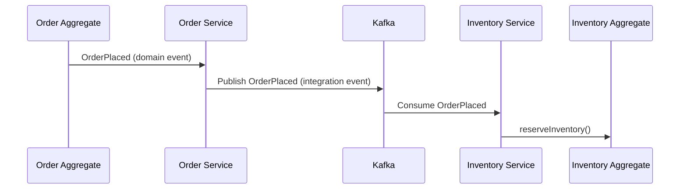
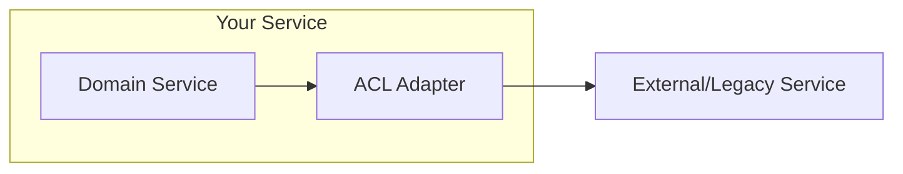
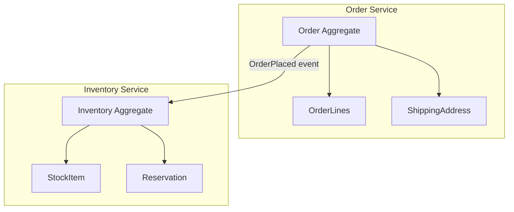
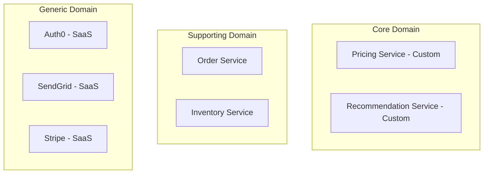
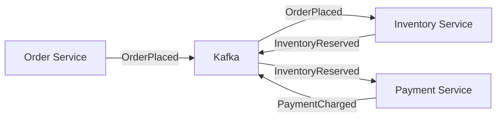
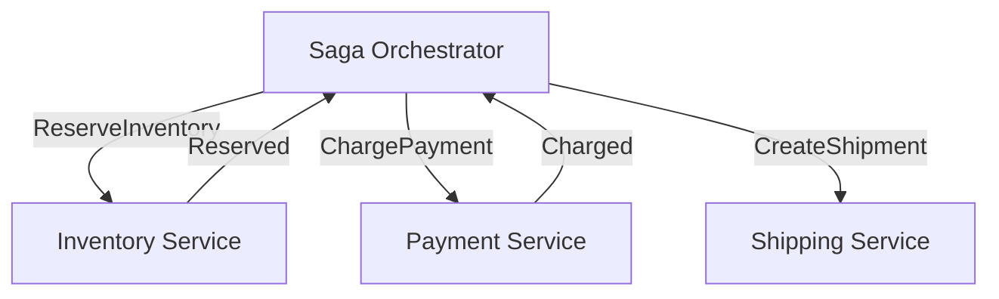
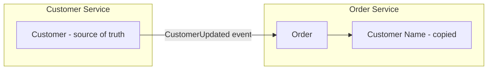
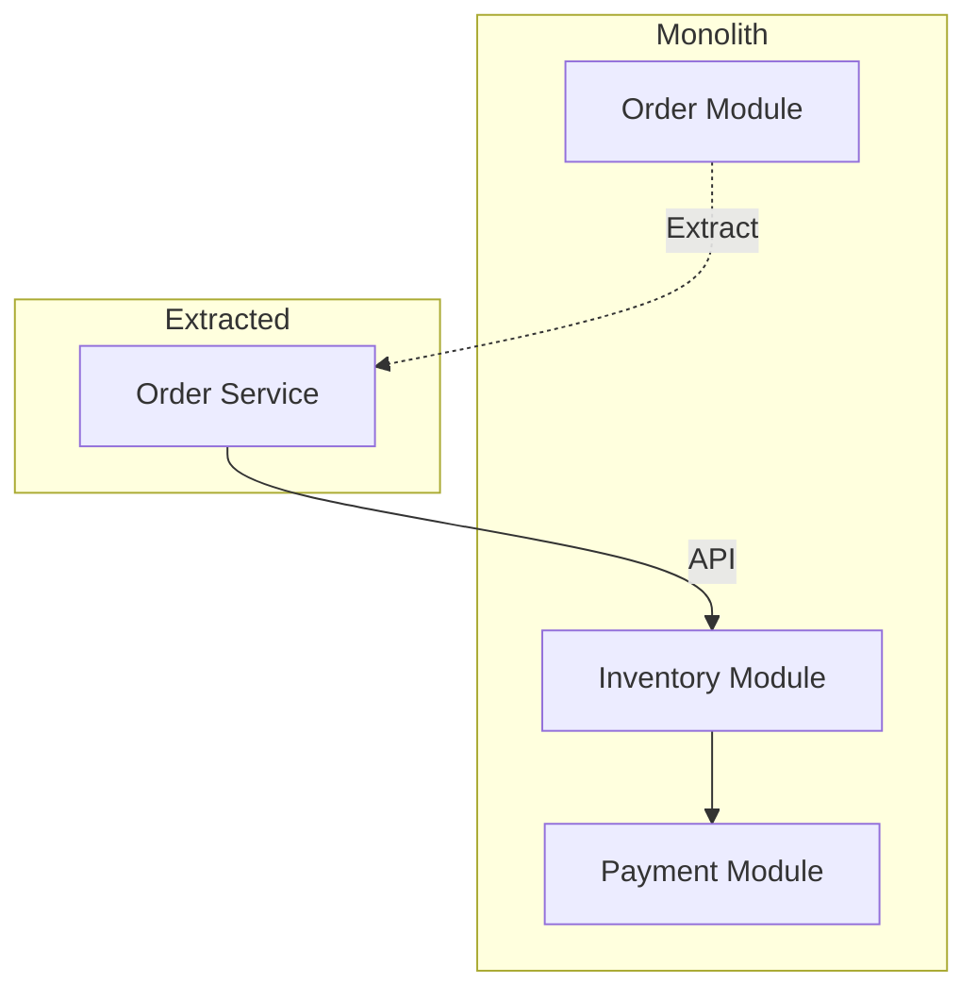

# DDD and Microservices Alignment — Deep Dive

> **Level:** Intermediate  
> **Pre-reading:** [02 · Domain-Driven Design](02-ddd.md) · [03 · Microservices Patterns](03-microservices-patterns.md)

---

## DDD is the Language of Microservices

Microservices without DDD often result in arbitrary service boundaries, tight coupling, and distributed monoliths. DDD provides the vocabulary and techniques to draw the right boundaries.

| Challenge | DDD Solution |
|:----------|:-------------|
| Where do I draw service boundaries? | Bounded contexts |
| How do services communicate? | Context mapping, domain events |
| How do I model data per service? | Aggregates, entities, value objects |
| How do I handle distributed transactions? | Saga pattern, eventual consistency |

---

## Bounded Context = Microservice Boundary

Each microservice typically implements one bounded context. The context boundary becomes the service API boundary.



### Alignment Table

| DDD Concept | Microservices Equivalent |
|:------------|:------------------------|
| Bounded Context | Service boundary |
| Ubiquitous Language | API vocabulary, schema names |
| Context Map | Service dependency diagram |
| Domain Event | Integration event (Kafka, etc.) |
| Aggregate | Unit of consistency within service |
| Repository | Service's data access layer |
| Anti-Corruption Layer | API adapter for external services |

---

## Domain Events as Integration Events

Within a bounded context, domain events are internal facts. When published across service boundaries, they become **integration events**.



### Domain Event vs Integration Event

| Aspect | Domain Event | Integration Event |
|:-------|:-------------|:------------------|
| **Scope** | Within bounded context | Across service boundaries |
| **Consumer** | Same service handlers | Other services |
| **Schema** | Internal; can change freely | Published language; versioned |
| **Transport** | In-memory, same transaction | Message broker (Kafka, SQS) |

### Integration Event Design

```java
// Integration event (published to Kafka)
public record OrderPlacedEvent(
    String eventId,
    String orderId,
    String customerId,
    BigDecimal totalAmount,
    String currency,
    List<OrderLineDto> items,
    Instant occurredAt,
    int version  // Schema version
) {}
```

**Best practices:**
- Include all data consumers need (event-carried state transfer)
- Version the schema (Avro with Schema Registry)
- Use past-tense naming
- Include timestamp and unique event ID

---

## Context Mapping to Service Integration

Context map patterns translate directly to service integration strategies:

| Context Map Pattern | Service Integration |
|:--------------------|:--------------------|
| **Open Host Service** | REST API with OpenAPI spec |
| **Published Language** | Avro/Protobuf schemas in Schema Registry |
| **Customer-Supplier** | API with SLA; consumer feedback loop |
| **Conformist** | Accept external API as-is |
| **Anti-Corruption Layer** | Adapter service or translation layer |
| **Shared Kernel** | Shared library (use sparingly) |

### Anti-Corruption Layer in Services



```java
// ACL isolates your domain from external API
public class LegacyOrderAdapter implements OrderGateway {
    private final LegacyOrderClient legacyClient;
    
    @Override
    public Order fetchOrder(OrderId orderId) {
        // External API returns messy legacy format
        LegacyOrderResponse legacy = legacyClient.getOrder(orderId.value());
        
        // Translate to your clean domain model
        return new Order(
            new OrderId(legacy.getOrdNo()),
            mapStatus(legacy.getStatCd()),
            mapLines(legacy.getItms())
        );
    }
}
```

---

## Aggregate Per Service

Each service owns its aggregates. Aggregates enforce consistency within the service; events coordinate across services.



### No Shared Aggregates

```java
// WRONG: Inventory service accessing Order aggregate
public class InventoryService {
    private final OrderRepository orderRepository;  // Crosses boundary!
    
    public void reserveForOrder(OrderId orderId) {
        Order order = orderRepository.findById(orderId);  // BAD
        // ...
    }
}

// RIGHT: Inventory service receives event with needed data
public class InventoryEventHandler {
    @KafkaListener(topics = "orders")
    public void handleOrderPlaced(OrderPlacedEvent event) {
        // Event contains all needed data
        inventory.reserve(event.items());
    }
}
```

---

## Subdomains to Service Strategy

| Subdomain Type | Service Strategy |
|:---------------|:-----------------|
| **Core** | Build custom microservice; invest heavily |
| **Supporting** | Build or buy; standard microservice |
| **Generic** | Use SaaS or managed service |



---

## Saga Pattern for Cross-Service Transactions

DDD's eventual consistency model maps to the Saga pattern in microservices.

### Choreography (Event-Driven)



### Orchestration (Coordinator)



→ **[Deep Dive: Saga Pattern](04.05-saga-pattern.md)**

---

## Database Per Service

Each bounded context (service) owns its data. No shared databases.

| Pattern | Description |
|:--------|:------------|
| **Database per service** | Each service has private DB; no direct access by others |
| **API Composition** | Query data by calling service APIs |
| **CQRS** | Read models optimized separately from write models |
| **Event-carried state** | Events contain data; consumers store local copies |

### Data Duplication is Okay



Services may store copies of data they need. The source of truth publishes events when data changes.

---

## Ubiquitous Language in APIs

Your API should use domain language, not technical jargon.

| Bad (Technical) | Good (Domain) |
|:----------------|:--------------|
| `POST /orders/create` | `POST /orders` (placing an order) |
| `PUT /orders/{id}/status?value=3` | `POST /orders/{id}/cancel` |
| `GET /order-records` | `GET /orders` |
| `{"type": 1, "amt": 100}` | `{"orderType": "standard", "amount": {"value": 100, "currency": "USD"}}` |

### Command Naming

| Command | REST Mapping |
|:--------|:-------------|
| `PlaceOrder` | `POST /orders` |
| `CancelOrder` | `POST /orders/{id}/cancel` |
| `ShipOrder` | `POST /orders/{id}/shipments` |
| `AddOrderLine` | `POST /orders/{id}/lines` |

---

## Migration: Monolith to Microservices with DDD

### Step 1: Identify Bounded Contexts in Monolith

Use Event Storming or domain analysis to find context boundaries within the existing codebase.

### Step 2: Create Modules

Enforce boundaries within the monolith first (modular monolith).

### Step 3: Extract Services

One bounded context at a time, extract to a separate service using Strangler Fig pattern.



### Step 4: Replace Synchronous with Events

As services mature, replace synchronous calls with event-driven integration for looser coupling.

---

## Common Alignment Mistakes

| Mistake | Impact | Fix |
|:--------|:-------|:----|
| **Technical decomposition** | User service, database service, etc. | Decompose by bounded context |
| **Shared database** | Tight coupling; no autonomy | Database per service |
| **Synchronous chains** | Cascading failures | Async events where possible |
| **No clear ownership** | Conflicting changes | One team per bounded context |
| **Ignoring context boundaries** | Distributed monolith | Respect ubiquitous language per context |

---

??? question "How do you decide between one service per bounded context vs. multiple?"
    Start with **one service per bounded context** — this is the default. Split a bounded context into multiple services only if: (1) parts scale differently, (2) parts have different deployment needs, (3) the context is too large for one team. Avoid going smaller than a bounded context — you'll lose the consistency boundary benefits.

??? question "How do you handle queries that span multiple services?"
    (1) **API Composition**: Gateway or BFF calls multiple services and aggregates. (2) **CQRS with read models**: Build denormalized read models from events. (3) **Event-carried state**: Services store copies of data they need. Choice depends on consistency needs and query complexity. CQRS is most flexible for complex queries.

??? question "What's the relationship between aggregates and microservices?"
    A microservice (bounded context) contains **one or more aggregates**. Each aggregate is a consistency boundary within the service. The service's API exposes operations on its aggregates. Cross-service consistency uses events, not transactions. Think: bounded context = service, aggregate = consistency unit within service.

