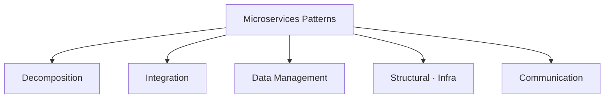
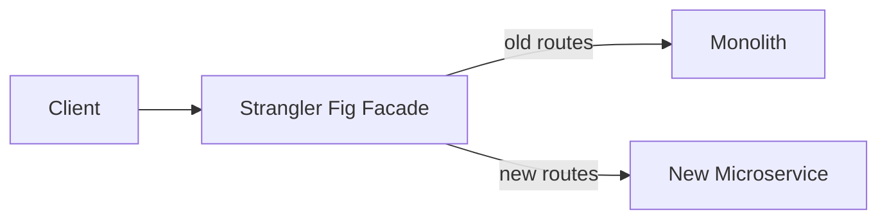
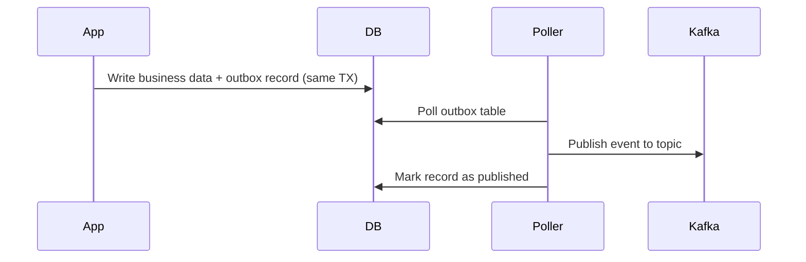
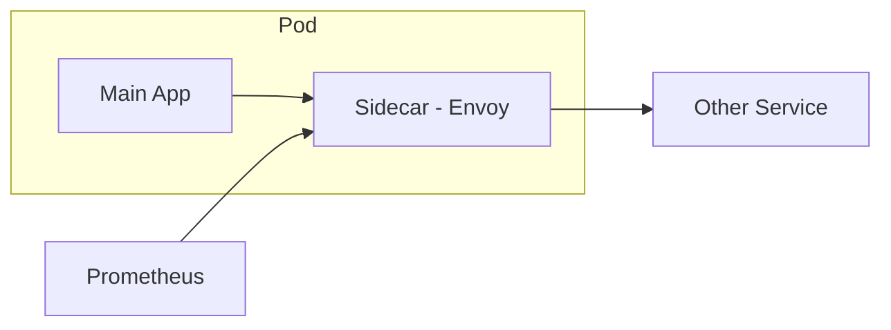

# Microservices Design Patterns

> The catalog of solutions to recurring problems in distributed systems.

---

## Pattern Categories

---

## Decomposition Patterns

| Pattern | Description | Use When |
|---------|-------------|---------|
| **Decompose by Business Capability** | Each service owns one business capability aligned with org structure | Conway's Law alignment; stable domain |
| **Decompose by Subdomain** | Use DDD subdomains as service boundaries | More precise; domain model-driven |
| **Strangler Fig** | Gradually replace monolith — new services absorb functionality over time via a facade | Safe monolith migration; no big-bang rewrite |
| **Branch by Abstraction** | Introduce abstraction layer over existing code, swap implementation behind it | Large in-place refactoring |

→ **[Deep Dive: Decomposition Patterns](03.01-decomposition-patterns.md)** — Strangler Fig, business capability vs subdomain decomposition

---

## Integration Patterns

| Pattern | Description |
|---------|-------------|
| **API Gateway** | Single entry point; handles routing, auth, rate limiting, SSL termination |
| **Backend for Frontend (BFF)** | Separate gateway per client type — mobile BFF, web BFF, partner BFF |
| **Client-Side Service Discovery** | Client queries service registry (Eureka) and picks an instance |
| **Server-Side Service Discovery** | Load balancer queries registry and routes (Kubernetes DNS + kube-proxy) |
| **Anti-Corruption Layer** | Translate between your domain model and an external/legacy model |
| **Gateway Aggregation** | Gateway fans out to multiple services and merges responses |
| **Gateway Offloading** | Push cross-cutting concerns (auth, logging, rate limiting) to the gateway layer |

→ **[Deep Dive: Integration Patterns](03.02-integration-patterns.md)** — API Gateway, BFF, Service Discovery, Gateway Aggregation

---

## Data Management Patterns

| Pattern | Problem Solved |
|---------|----------------|
| **Database per Service** | Each service owns its schema; no direct DB sharing between services |
| **API Composition** | Aggregate data from multiple services at query time (join in application layer) |
| **CQRS** | Separate write model (commands) from read model (queries) for performance |
| **Event Sourcing** | Persist events as source of truth; derive current state by replaying them |
| **Saga Pattern** | Manage distributed transactions across services without 2-phase commit |
| **Outbox Pattern** | Guarantee atomic write to DB AND event publication via same transaction |
| **Shared Database** | **(Anti-pattern)** Multiple services share a DB — creates tight coupling; avoid |

### The Outbox Pattern — Atomic DB Write + Event Publish

> Without this pattern: you can write to DB but crash before publishing — or publish but DB write fails. The outbox removes the race condition.

Tools: **Debezium** (CDC-based), **Spring Modulith** outbox support, Transactional Outbox libraries.

→ **[Deep Dive: Data Management Patterns](03.03-data-management-patterns.md)** — Database per Service, API Composition, CQRS

→ **[Deep Dive: Saga and Outbox Patterns](03.04-saga-and-outbox.md)** — Choreography vs orchestration, CDC, Debezium

---

## Structural / Sidecar Patterns

| Pattern | What It Does | Example |
|---------|-------------|---------|
| **Sidecar** | Co-deployed helper container alongside main app | Envoy proxy, log forwarder, config reloader |
| **Ambassador** | Sidecar that proxies *outgoing* requests — adds retry, circuit breaking, mTLS | Envoy as egress proxy |
| **Adapter** | Sidecar that translates app output/metrics to what the platform expects | Prometheus exporter sidecar |
| **Init Container** | Runs to completion *before* main container starts | DB schema migration, config bootstrap, secret fetch |

→ **[Deep Dive: Sidecar Patterns](03.05-sidecar-patterns.md)** — Sidecar, Ambassador, Adapter, Init Container

---

## Service Discovery & Load Balancing

When services scale to multiple instances, clients need to find them dynamically.

| Pattern | Description | When to Use |
|---------|-------------|-----------|
| **Kubernetes DNS** | CoreDNS; zero code changes; transparent | Kubernetes environments (easiest) |
| **Client-Side Discovery** | Client queries registry (Eureka); picks instance | Non-K8s; custom load balancing logic |
| **Server-Side Discovery** | Load balancer queries registry; routes transparently | Separation of concerns |
| **Service Mesh** | Sidecar proxy handles discovery + routing + observability | Large scale; language diversity |

→ **[Deep Dive: Service Discovery & Load Balancing](03.06-service-discovery-and-load-balancing.md)** — Kubernetes DNS, Eureka, Consul, Service Mesh, load balancing algorithms

---

## Cache Patterns

Cache frequently accessed data to reduce database load and latency.

| Pattern | Behavior | Use Case |
|---------|----------|----------|
| **Cache-Aside** | Check cache → miss → load from DB → store in cache | Read-heavy; app controls what to cache |
| **Write-Through** | Write to cache AND DB together | Strong consistency required |
| **Write-Behind** | Write to cache immediately; async flush to DB | High-write; non-critical data; analytics |
| **Distributed Cache** | Multi-node cache (Redis Cluster); sharded data | Horizontal scale; shared cache across services |

**Cache Invalidation:** TTL-based (automatic expiry), Event-based (explicit invalidation), Versioning (cache key versioning).

→ **[Deep Dive: Cache Patterns & Strategies](03.07-cache-patterns.md)** — Cache-aside, Write-through, Write-behind, Cache stampede, Redis sharding, Database sharding

---

## Communication Patterns

| Style | Examples | Trade-off |
|-------|---------|-----------|
| **Synchronous** | REST, gRPC | Simple mental model; tight temporal coupling |
| **Asynchronous** | Kafka, RabbitMQ, SQS | Decoupled; harder to trace; eventual consistency |
| **Async Request-Reply** | Command on request topic, reply on reply topic + correlation ID | Async with response semantics |
| **Publish-Subscribe** | Publisher broadcasts to topic; N consumers | Fan-out; publisher unaware of consumers |
| **Event Streaming** | Continuous event log; consumers replay at their own pace | Kafka; audit trails; reprocessing |

---

