# Decomposition Patterns — Deep Dive

> **Level:** Intermediate  
> **Pre-reading:** [03 · Microservices Patterns](03-microservices-patterns.md) · [02 · Domain-Driven Design](02-ddd.md)

---

## The Decomposition Challenge

The hardest problem in microservices isn't technology — it's knowing **where to draw the lines**. Wrong boundaries lead to distributed monoliths: all the complexity of distributed systems with none of the benefits.

---

## Decompose by Business Capability

Align services with business capabilities — stable, high-level functions the business performs.

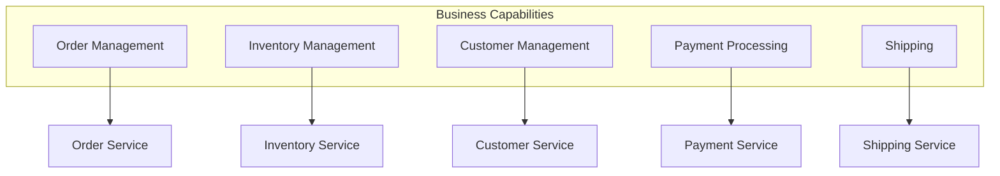

| Business Capability | Service | Responsibilities |
|:--------------------|:--------|:-----------------|
| Order Management | Order Service | Create, update, cancel orders |
| Inventory | Inventory Service | Stock levels, reservations |
| Customer | Customer Service | Registration, profiles, preferences |
| Payment | Payment Service | Charge, refund, payment methods |
| Shipping | Shipping Service | Shipment creation, tracking |

### Identifying Business Capabilities

| Source | Method |
|:-------|:-------|
| **Organization chart** | Business units often map to capabilities |
| **Business processes** | Steps in customer journey |
| **Value streams** | What delivers value to customers |
| **Domain experts** | Interview to understand their world |

### Characteristics

| Aspect | Detail |
|:-------|:-------|
| **Stability** | Capabilities change slowly |
| **Alignment** | Maps naturally to teams (Conway's Law) |
| **Cohesion** | Related functionality together |
| **Autonomy** | Each capability can evolve independently |

---

## Decompose by Subdomain

Use DDD's subdomain concept for finer-grained boundaries. More precise than business capabilities.

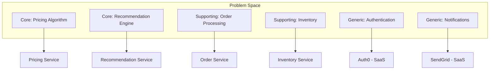

### Subdomain-Based Strategy

| Subdomain Type | Service Strategy |
|:---------------|:-----------------|
| **Core** | Custom microservice; best engineers; highest investment |
| **Supporting** | Standard microservice; build or buy |
| **Generic** | SaaS or open source; don't build |

### When to Use Subdomain vs Business Capability

| Factor | Business Capability | Subdomain |
|:-------|:--------------------|:----------|
| **Precision** | Coarser | Finer |
| **DDD experience** | Not required | Helpful |
| **Stability** | High | High |
| **Domain complexity** | Simple to moderate | Complex |

---

## Strangler Fig Pattern

Incrementally migrate from a monolith to microservices by gradually replacing functionality behind a facade.

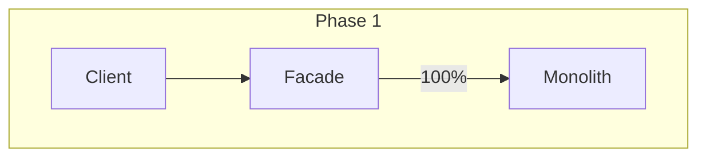

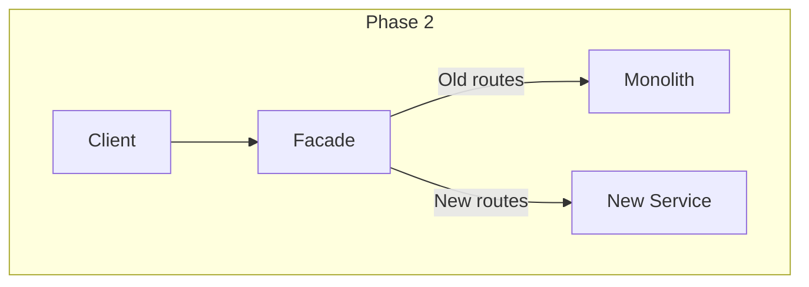

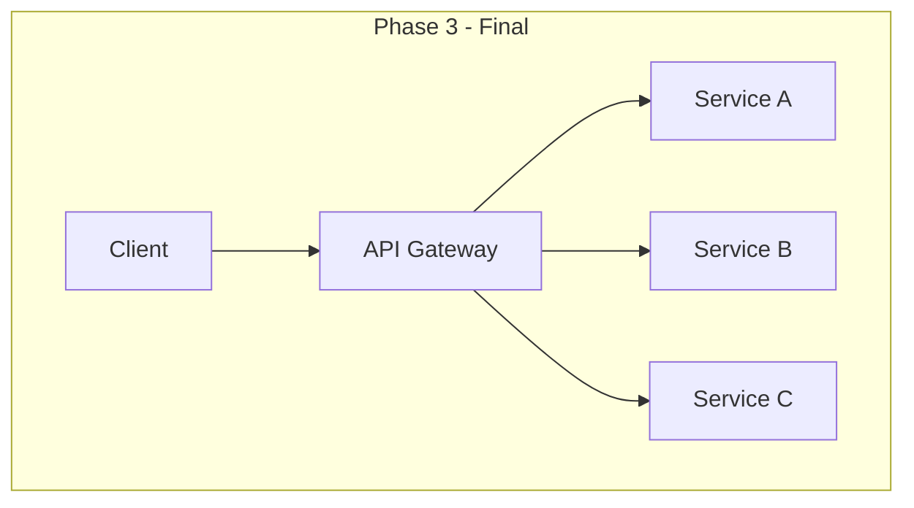

### Implementation Steps

| Step | Action |
|:-----|:-------|
| 1 | Put a facade (API Gateway) in front of the monolith |
| 2 | Identify a bounded context to extract |
| 3 | Build the new service; deploy alongside monolith |
| 4 | Route traffic for that context to new service |
| 5 | Remove old code from monolith |
| 6 | Repeat until monolith is gone |

### Strangler Fig Routing

```yaml
# API Gateway configuration (Kong/Envoy)
routes:
  - path: /api/orders/*
    destination: order-service  # New service
  - path: /api/inventory/*
    destination: inventory-service  # New service
  - path: /*
    destination: monolith  # Everything else
```

### Benefits

| Benefit | Description |
|:--------|:------------|
| **Low risk** | Incremental; can stop or reverse |
| **Continuous delivery** | Both old and new run in production |
| **No big bang** | Avoids risky "complete rewrite" |
| **Gradual learning** | Team learns microservices iteratively |

### Risks and Mitigations

| Risk | Mitigation |
|:-----|:-----------|
| **Two systems to maintain** | Timebox extraction; prioritize |
| **Data synchronization** | Use events; avoid dual writes |
| **Feature creep in monolith** | Freeze monolith features; only bugs |
| **Never finishing** | Set deadline for monolith retirement |

---

## Branch by Abstraction

Refactor within the monolith by introducing an abstraction layer, then swap the implementation.

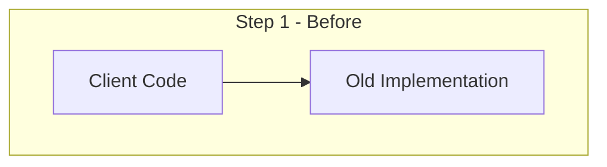

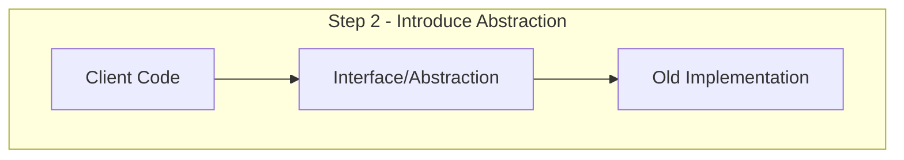

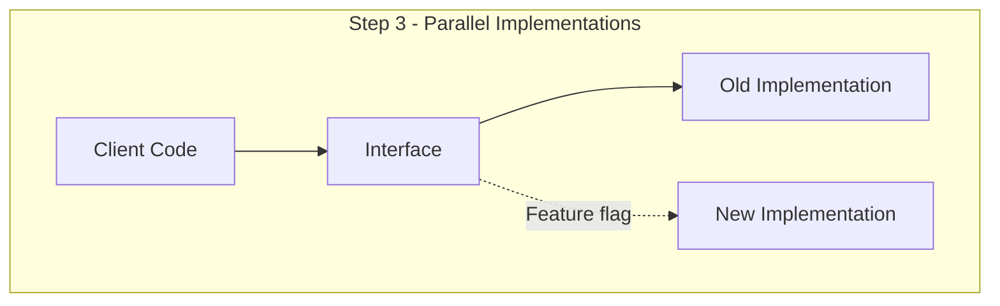

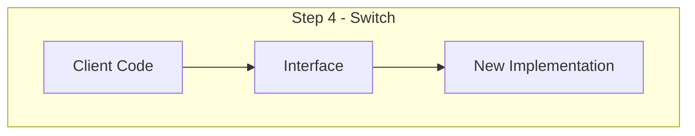

### Implementation Steps

| Step | Action |
|:-----|:-------|
| 1 | Identify the code to replace |
| 2 | Create an abstraction (interface) over it |
| 3 | Point all callers to the abstraction |
| 4 | Build new implementation behind the abstraction |
| 5 | Use feature flag to switch implementations |
| 6 | Remove old implementation when confident |

### Use Cases

| Scenario | Example |
|:---------|:--------|
| **Replace database** | Abstract data access; swap PostgreSQL for DynamoDB |
| **Replace service call** | Abstract integration; swap REST for gRPC |
| **Extract microservice** | Abstract module; swap local call for remote |

---

## Decomposition Anti-Patterns

### 1. Technical Decomposition

**Wrong:** Services based on technical layers.

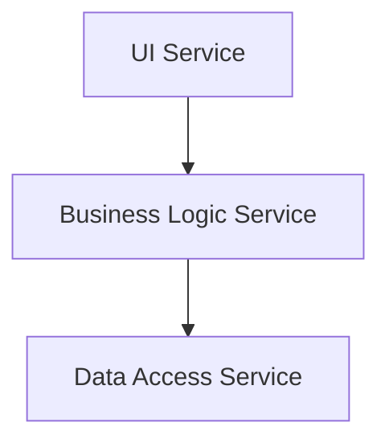

**Problem:** Every feature requires changes to all services. Tight coupling.

**Fix:** Decompose by business capability. Each service owns its full stack.

### 2. Entity Services

**Wrong:** One service per database entity.

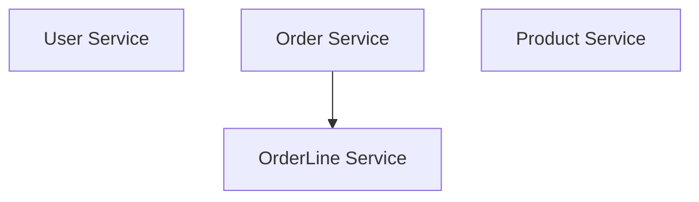

**Problem:** OrderLine isn't a business capability; it's an implementation detail. Chatty services.

**Fix:** Aggregate entities into bounded contexts.

### 3. Nano-Services

**Wrong:** Services that are too small.

| Sign | Problem |
|:-----|:--------|
| Service does one CRUD operation | Not a bounded context |
| Every change needs multiple services | Wrong boundaries |
| More network calls than logic | Over-decomposed |

**Fix:** Merge into meaningful bounded contexts.

---

## Service Sizing Guidelines

| Factor | Small Service | Large Service |
|:-------|:--------------|:--------------|
| **Team ownership** | Partial person | Multiple teams |
| **Deploy frequency** | Tied to others | Independent |
| **Data access** | Calls other services often | Owns its data |
| **Bounded context** | Partial | One or more |

### The Two-Pizza Rule

A service should be owned by a team that can be fed with two pizzas (~6-10 people). If one team owns too many services, merge some. If multiple teams need to change one service, split it.

---

## Decision Framework

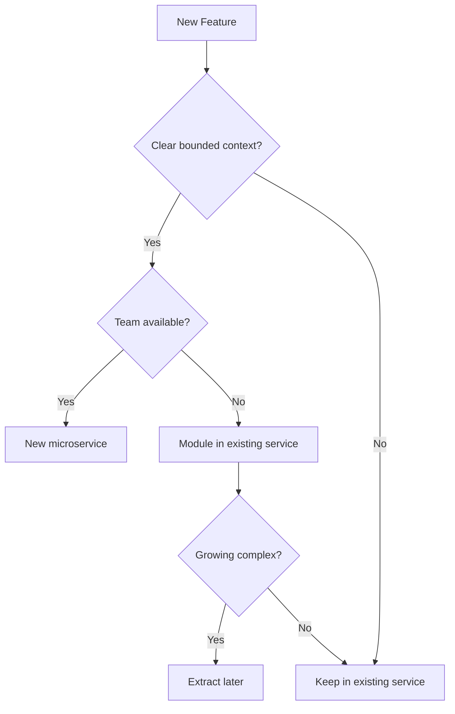

---

??? question "How do you know if your services are too small?"
    Signs of nano-services: (1) Every user story requires changing 3+ services. (2) Services have chatty communication (many synchronous calls). (3) A service does only CRUD with no business logic. (4) Team context-switches constantly between services. (5) Transactions frequently span services. If these apply, merge services into coarser bounded contexts.

??? question "When should you use Strangler Fig vs. big bang rewrite?"
    Use **Strangler Fig** (almost always): when the system is in production, when risk tolerance is low, when you can route traffic incrementally. Use **Big Bang** (rarely): for small systems, when old system is not in production, when incremental migration is technically impossible. Strangler Fig is safer and lets you learn iteratively.

??? question "What's the difference between decomposing by business capability vs by subdomain?"
    **Business capability** is a coarser organizational concept — what the business does (Order Management, Customer Management). **Subdomain** is a DDD concept that's often finer-grained and focused on domain model boundaries. For complex domains, subdomain decomposition gives more precise boundaries. For simpler domains or organizations new to DDD, business capability is sufficient.

