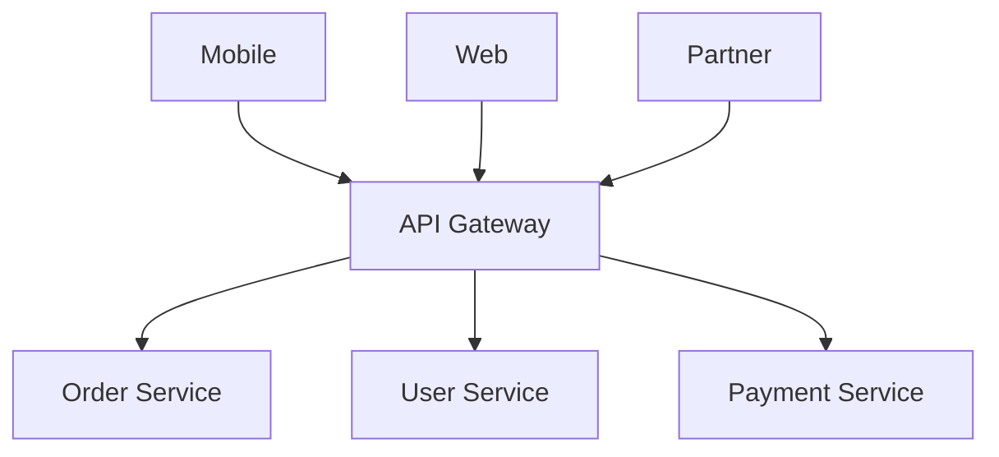
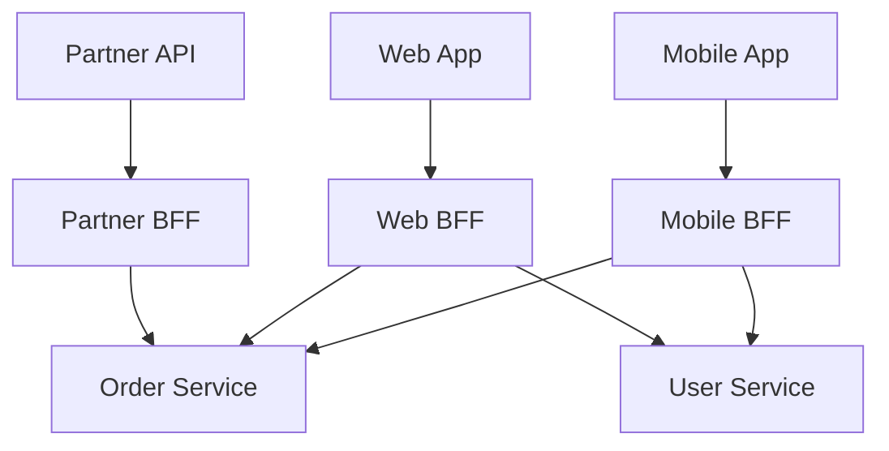
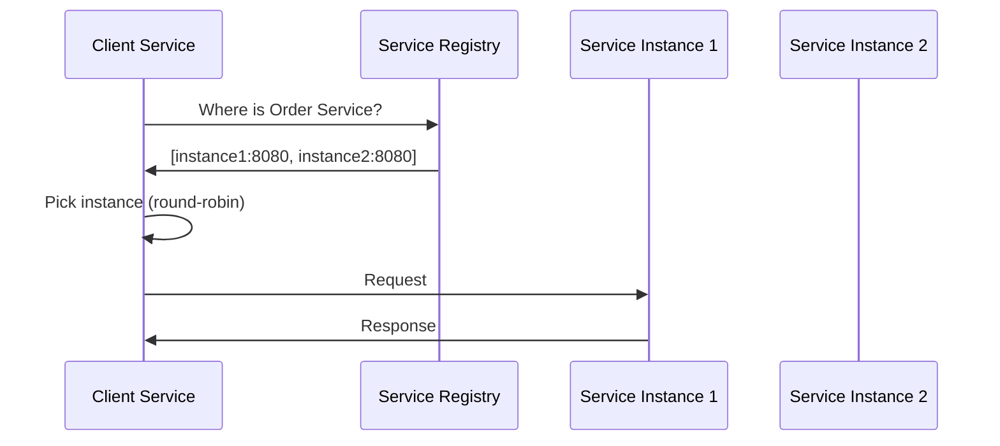
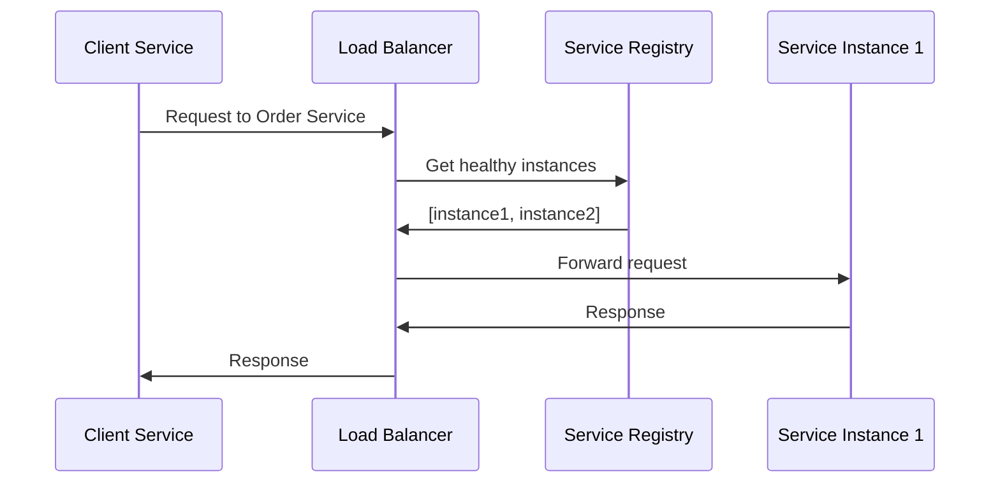
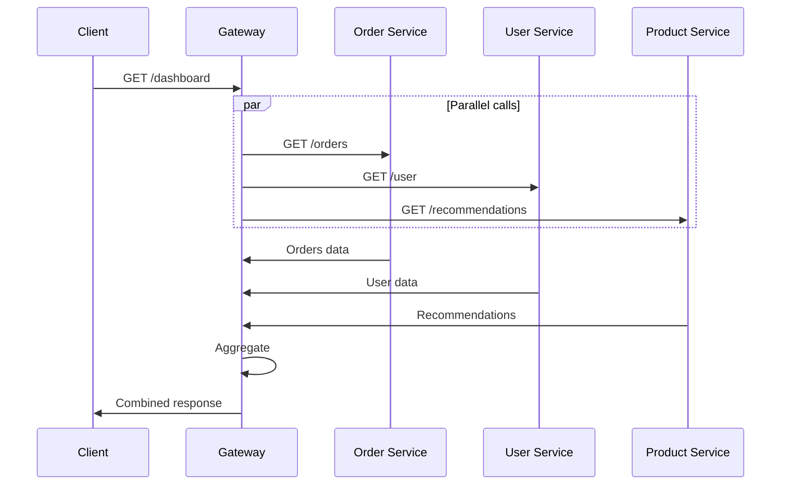
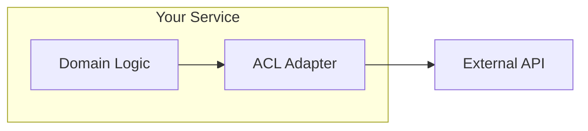

# Integration Patterns — Deep Dive

> **Level:** Intermediate  
> **Pre-reading:** [03 · Microservices Patterns](03-microservices-patterns.md)

---

## Integration Challenges

Microservices need to communicate. How they discover, connect, and exchange data defines the system's resilience and flexibility.

---

## API Gateway

A single entry point for all client requests. Handles cross-cutting concerns and routes to backend services.



### Gateway Responsibilities

| Concern | What Gateway Does |
|:--------|:------------------|
| **Routing** | Path/header/method-based routing to services |
| **Authentication** | Validate JWT/API key before forwarding |
| **Rate Limiting** | Per-client throttling; return 429 |
| **SSL Termination** | TLS at gateway; plain HTTP internally |
| **Request Transform** | Add/remove headers; shape requests |
| **Response Aggregation** | Combine responses from multiple services |
| **Caching** | Cache GET responses |
| **Load Balancing** | Distribute across service instances |

### Gateway Implementation Options

| Tool | Characteristics |
|:-----|:----------------|
| **Kong** | OSS + Enterprise; plugin ecosystem; declarative config |
| **AWS API Gateway** | Serverless; Lambda integration; pay-per-request |
| **Spring Cloud Gateway** | Java-native; reactive; WebFlux |
| **Envoy** | High-performance proxy; often used with Istio |
| **Nginx** | Proven; lightweight; config-based |
| **Traefik** | Kubernetes-native; automatic discovery |

### Gateway Routing Example (Kong)

```yaml
services:
  - name: order-service
    url: http://order-service:8080
    routes:
      - name: orders-route
        paths:
          - /api/orders

  - name: user-service
    url: http://user-service:8080
    routes:
      - name: users-route
        paths:
          - /api/users
```

### Gateway Anti-Patterns

| Anti-Pattern | Problem | Fix |
|:-------------|:--------|:----|
| **Business logic in gateway** | Gateway becomes monolith | Keep gateway thin; logic in services |
| **Single gateway for all** | Bottleneck; single point of failure | Consider BFF pattern |
| **No rate limiting** | DoS vulnerability | Configure per-client limits |
| **Catch-all error handling** | Hides real errors | Pass through meaningful errors |

---

## Backend for Frontend (BFF)

A separate gateway per client type, each tailored to that client's needs.



### Why BFF?

| Problem with Single Gateway | BFF Solution |
|:----------------------------|:-------------|
| Mobile needs less data than web | BFF returns optimized payloads |
| Different auth flows per client | Each BFF handles its auth |
| One client needs aggregation, another doesn't | BFF customizes per client |
| Breaking change affects all clients | Change only affects one BFF |

### BFF Ownership

| Model | Description |
|:------|:------------|
| **Frontend team owns BFF** | Mobile team owns Mobile BFF |
| **Fullstack team** | Team owns frontend + BFF |
| **Platform team** | Central team; all BFFs |

!!! tip "Frontend team ownership preferred"
    The team building the client understands its needs best. They should own the BFF.

### BFF Trade-offs

| Benefit | Cost |
|:--------|:-----|
| Tailored per client | More services to maintain |
| Independent evolution | Possible logic duplication |
| Team autonomy | Need coordination on backend changes |

---

## Service Discovery

Services need to find each other. Two approaches: client-side and server-side discovery.

### Client-Side Discovery

Client queries a service registry and selects an instance.



| Tool | Description |
|:-----|:------------|
| **Eureka** | Netflix OSS; Spring Cloud integration |
| **Consul** | HashiCorp; health checks; KV store |
| **Zookeeper** | Apache; mature; complex |

### Server-Side Discovery

Load balancer handles discovery; client sends to fixed endpoint.



| Tool | Description |
|:-----|:------------|
| **Kubernetes DNS** | Built-in; Service resolves to pod IPs |
| **AWS ALB** | Cloud-native; target groups |
| **Envoy + Istio** | Service mesh handles routing |

### Kubernetes Service Discovery

```yaml
apiVersion: v1
kind: Service
metadata:
  name: order-service
spec:
  selector:
    app: order
  ports:
    - port: 80
      targetPort: 8080
---
# Client calls: http://order-service/api/orders
# Kubernetes DNS resolves to pod IPs
```

### Discovery Comparison

| Aspect | Client-Side | Server-Side |
|:-------|:------------|:------------|
| **Client complexity** | Higher | Lower |
| **Load balancer** | Not needed | Required |
| **Language agnostic** | No (needs library) | Yes |
| **Kubernetes native** | No | Yes |

---

## Gateway Aggregation

Gateway fetches from multiple services and combines responses.



### Aggregation Considerations

| Concern | Solution |
|:--------|:---------|
| **Partial failure** | Return partial data; indicate failures |
| **Latency** | Parallel calls; timeouts |
| **Complexity** | Keep aggregation simple; consider BFF |
| **Caching** | Cache individual responses |

### When to Aggregate at Gateway vs Client

| Gateway Aggregation | Client Aggregation |
|:--------------------|:-------------------|
| Mobile clients (minimize round trips) | Web apps with good connectivity |
| Complex joins across services | Simple parallel fetches |
| Caching benefits | Dynamic composition needs |

---

## Gateway Offloading

Push cross-cutting concerns to the gateway so services stay focused on business logic.

| Concern | Gateway Implementation |
|:--------|:-----------------------|
| **Authentication** | Validate JWT; reject invalid |
| **Authorization** | Check scopes/roles for route |
| **Rate limiting** | Token bucket per client |
| **Logging** | Access logs; correlation IDs |
| **Metrics** | Request count, latency per route |
| **Compression** | gzip responses |
| **CORS** | Handle preflight; set headers |

### Offloading Example (Kong)

```yaml
plugins:
  - name: jwt
    config:
      claims_to_verify:
        - exp
        - iss
  - name: rate-limiting
    config:
      minute: 100
      policy: local
  - name: correlation-id
    config:
      header_name: X-Request-ID
      generator: uuid
```

---

## Anti-Corruption Layer (ACL)

A translation layer protecting your services from external or legacy APIs.



### ACL Implementation

```java
// External API returns inconsistent format
public class LegacyInventoryResponse {
    private String sku_code;
    private int qty_avail;
    private String loc_id;
}

// Your clean domain model
public record StockLevel(
    ProductId productId,
    int availableQuantity,
    WarehouseId warehouseId
) {}

// ACL translates
public class InventoryAcl {
    private final LegacyInventoryClient client;
    
    public StockLevel getStockLevel(ProductId productId) {
        LegacyInventoryResponse response = client.getStock(productId.value());
        return new StockLevel(
            productId,
            response.getQty_avail(),
            new WarehouseId(response.getLoc_id())
        );
    }
}
```

### When to Use ACL

| Scenario | ACL Value |
|:---------|:----------|
| **Integrating with legacy** | Isolate legacy model from domain |
| **Third-party APIs** | Translate to your vocabulary |
| **External partner APIs** | Handle format changes in one place |
| **Migration** | Adapter to old system during transition |

---

## Integration Pattern Selection

| Scenario | Recommended Pattern |
|:---------|:--------------------|
| **Single public API** | API Gateway |
| **Multiple client types** | BFF per client |
| **Kubernetes environment** | Server-side discovery (DNS) |
| **Spring Cloud apps** | Client-side discovery (Eureka) |
| **Dashboard with multiple data sources** | Gateway aggregation |
| **Integrating with legacy/external** | Anti-Corruption Layer |

---

??? question "When should you use BFF vs a single API Gateway?"
    Use **BFF** when clients have significantly different needs: different data shapes, different auth flows, different aggregation patterns. Examples: mobile needs minimal payload; web needs rich data; partner API needs stable contract. Use **single gateway** when clients are similar or when team doesn't want to maintain multiple gateways.

??? question "Why is client-side discovery falling out of favor?"
    Kubernetes provides **server-side discovery** natively via DNS and kube-proxy. Services just call `http://service-name`. No library needed, language-agnostic. Client-side discovery (Eureka) requires libraries, adds complexity, and doesn't integrate as seamlessly with K8s.

??? question "How do you handle partial failures in gateway aggregation?"
    (1) Set **timeouts** for each downstream call. (2) Use **circuit breakers** to fail fast. (3) Return **partial data** with indication of what failed. (4) Have **fallbacks** (cached data, default values). (5) Design clients to handle incomplete responses gracefully.

