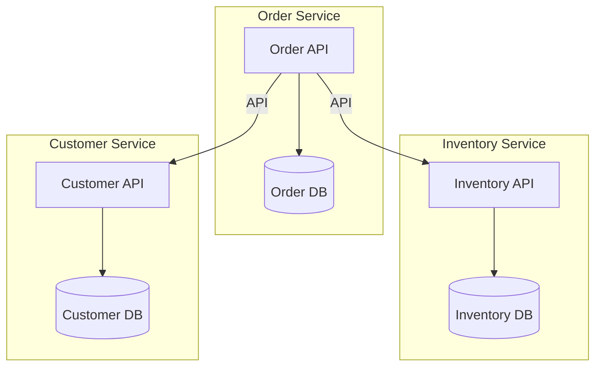
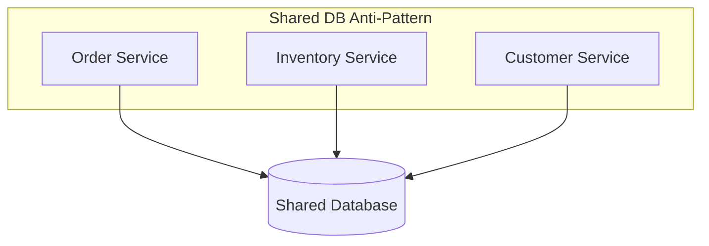
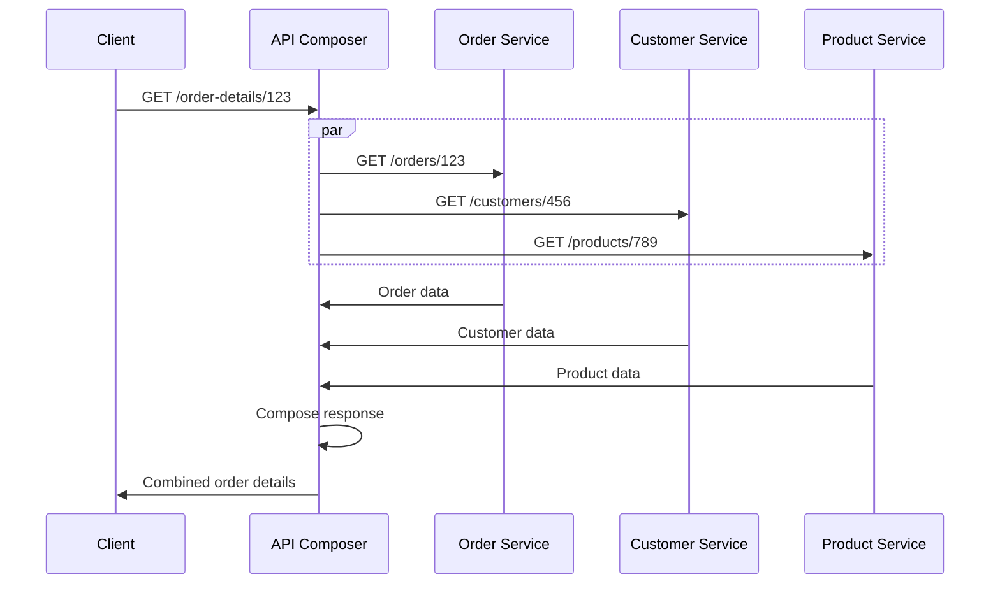
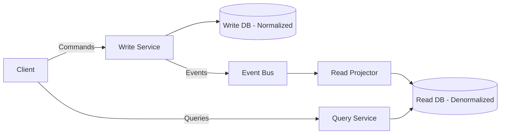
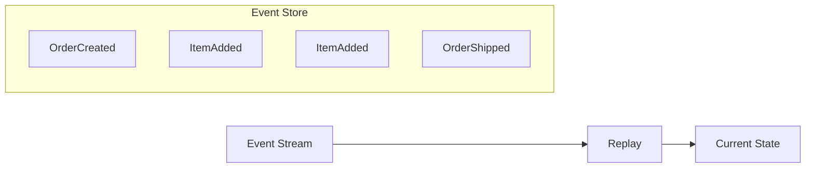
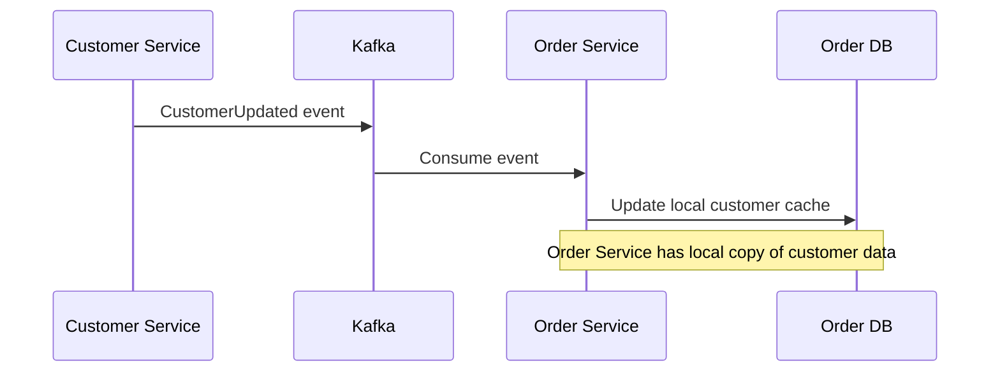
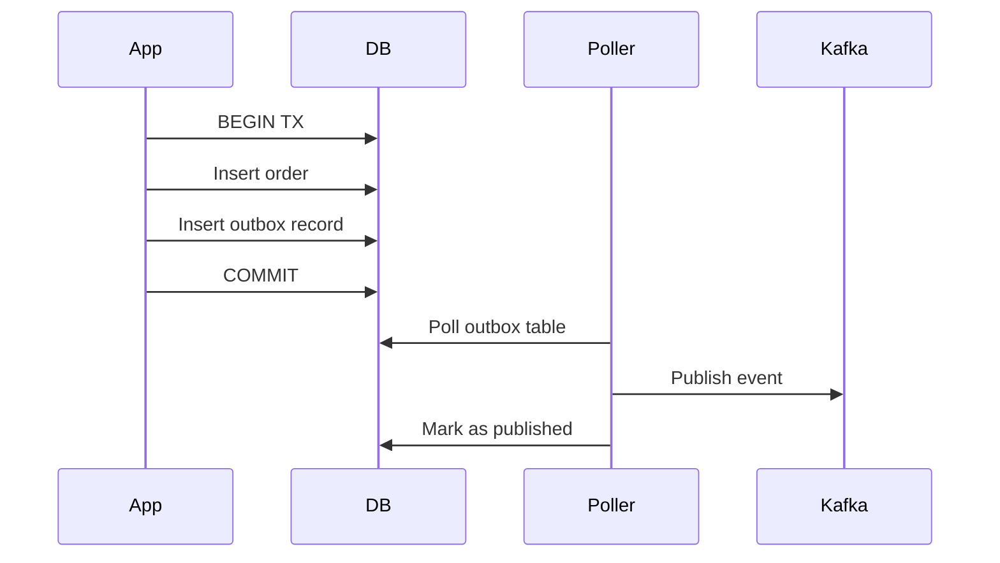

# Data Management Patterns — Deep Dive

> **Level:** Intermediate  
> **Pre-reading:** [03 · Microservices Patterns](03-microservices-patterns.md) · [02.04 · Aggregate Design](02.04-aggregate-design.md)

---

## The Data Challenge in Microservices

Each service should own its data. But how do you query across services? How do you maintain consistency? These patterns address data management in distributed systems.

---

## Database Per Service

Each service has its own database. No shared schemas, no direct database access across service boundaries.

### Why Database Per Service?

| Benefit | Description |
|:--------|:------------|
| **Loose coupling** | Schema changes don't affect other services |
| **Technology freedom** | Each service picks its optimal database |
| **Independent scaling** | Scale storage per service needs |
| **Fault isolation** | Database failure affects one service |
| **Team autonomy** | Teams control their own data model |

### Database Technology Selection

| Service Need | Database Choice |
|:-------------|:----------------|
| **Transactions, relations** | PostgreSQL, MySQL |
| **Document flexibility** | MongoDB, DocumentDB |
| **High write throughput** | Cassandra, DynamoDB |
| **Caching, sessions** | Redis |
| **Full-text search** | Elasticsearch |
| **Time series** | TimescaleDB, InfluxDB |
| **Graph relationships** | Neo4j |

### Challenges

| Challenge | Mitigation |
|:----------|:-----------|
| **Cross-service queries** | API Composition, CQRS |
| **Data consistency** | Saga, eventual consistency |
| **Data duplication** | Accept it; sync via events |
| **Operational overhead** | Managed databases; automation |

---

## Shared Database (Anti-Pattern)

Multiple services share a single database. **Avoid this.**

### Why It's Problematic

| Problem | Impact |
|:--------|:-------|
| **Schema coupling** | Any change requires coordinating all services |
| **Performance coupling** | One service's queries affect others |
| **Deployment coupling** | Can't deploy services independently |
| **No technology freedom** | All services use same database |
| **Hidden dependencies** | Services read/write each other's tables |

### Transition Away

| Step | Action |
|:-----|:-------|
| 1 | Identify table ownership per service |
| 2 | Add APIs for cross-service data access |
| 3 | Replace direct queries with API calls |
| 4 | Separate into distinct schemas/databases |

---

## API Composition

Retrieve data from multiple services at query time. The composer (gateway, BFF, or service) calls multiple services and aggregates.

### When to Use

| Scenario | API Composition Fits |
|:---------|:---------------------|
| **Simple joins** | Combining 2–3 services |
| **Read-heavy** | Queries more common than writes |
| **Consistency needed** | Data must be up-to-date |
| **Low latency services** | Backend calls are fast |

### Challenges

| Challenge | Mitigation |
|:----------|:-----------|
| **Latency** | Parallel calls; caching |
| **Partial failures** | Circuit breakers; fallbacks |
| **Complexity** | Keep compositions simple |
| **Data volume** | Pagination; filtering at source |

---

## CQRS — Command Query Responsibility Segregation

Separate the write model (commands) from the read model (queries). Each is optimized for its purpose.

### CQRS Components

| Component | Purpose |
|:----------|:--------|
| **Command Model** | Handles creates, updates, deletes |
| **Query Model** | Handles reads; optimized projections |
| **Event Publisher** | Emits events when write model changes |
| **Projector** | Consumes events; updates read model |

### Read Model Optimization

| Query Need | Read Model Design |
|:-----------|:------------------|
| **Dashboard** | Pre-aggregated summaries |
| **Search** | Elasticsearch index |
| **Reporting** | Materialized views |
| **Mobile list** | Denormalized, paginated |

### When to Use CQRS

| Good Fit | Bad Fit |
|:---------|:--------|
| High read/write ratio | Simple CRUD |
| Complex queries across aggregates | Single aggregate queries |
| Different scaling needs | Uniform load |
| Team experienced with eventual consistency | Team new to distributed systems |

### CQRS Trade-offs

| Benefit | Cost |
|:--------|:-----|
| Independent read/write scaling | Two models to maintain |
| Optimized read performance | Eventual consistency |
| Flexible query patterns | Complexity |
| Different storage technologies | More infrastructure |

→ **[Deep Dive: CQRS](04.03-cqrs.md)** for implementation details

---

## Event Sourcing

Store events as the source of truth. Current state is derived by replaying events.

### Event Sourcing Concepts

| Concept | Description |
|:--------|:------------|
| **Event Store** | Append-only log of events |
| **Current State** | Derived by replaying events |
| **Snapshot** | Periodic state capture to speed replay |
| **Projection** | Read model built from events |

### When to Use Event Sourcing

| Good Fit | Bad Fit |
|:---------|:--------|
| **Audit trail required** | Simple CRUD |
| **Time travel debugging** | No replay needs |
| **Complex state machines** | Straightforward state |
| **Regulatory compliance** | Team unfamiliar with pattern |

→ **[Deep Dive: Event Sourcing](04.04-event-sourcing.md)** for implementation details

---

## Data Replication via Events

Services maintain local copies of data they need, synced via events.

### Why Replicate Data?

| Reason | Benefit |
|:-------|:--------|
| **Performance** | Avoid cross-service calls |
| **Availability** | Function when other service is down |
| **Query optimization** | Join local data |

### Replication Trade-offs

| Benefit | Cost |
|:--------|:-----|
| Fast local queries | Data may be stale |
| Decoupled availability | Storage duplication |
| Simpler queries | Event handling complexity |

### What to Replicate

| Replicate | Don't Replicate |
|:----------|:----------------|
| Reference data (product name, customer name) | Transactional data |
| Data needed for local queries | Frequently changing data |
| Immutable or slowly changing data | Sensitive data (minimize copies) |

---

## Saga Pattern for Distributed Transactions

Coordinate cross-service operations with local transactions and compensating actions.

| Step | Forward Action | Compensating Action |
|:-----|:---------------|:--------------------|
| 1 | Reserve inventory | Release reservation |
| 2 | Charge payment | Issue refund |
| 3 | Create shipment | Cancel shipment |

→ **[Deep Dive: Saga Pattern](04.05-saga-pattern.md)** for choreography vs orchestration

---

## Outbox Pattern

Guarantee atomic database write + event publish using a single transaction.

→ **[Deep Dive: Outbox Pattern](04.06-outbox-pattern.md)** for implementation

---

## Pattern Selection Guide

| Need | Pattern |
|:-----|:--------|
| Service owns its data | Database per Service |
| Query across services | API Composition |
| High read/write ratio | CQRS |
| Audit trail, time travel | Event Sourcing |
| Avoid cross-service calls | Data Replication |
| Cross-service transactions | Saga |
| Reliable event publish | Outbox |

---

??? question "How do you handle joins across microservices?"
    Three options: (1) **API Composition** — call multiple services and join in application. (2) **CQRS** — build denormalized read models from events. (3) **Data Replication** — store copies of needed data locally. API Composition is simplest; CQRS is most flexible; Replication is fastest but requires event handling.

??? question "When is data duplication across services acceptable?"
    When the duplicated data is (1) **reference data** (product names, customer names), (2) **slowly changing**, (3) **needed for query performance**, (4) **synced via events**. Avoid duplicating frequently changing transactional data. Accept eventual consistency. The source of truth publishes events; consumers maintain local copies.

??? question "What's the difference between CQRS and Event Sourcing?"
    **CQRS** separates read and write models — they can use different databases and schemas. **Event Sourcing** stores events as the source of truth — state is derived by replay. They're often used together (events feed read model projections) but are independent patterns. You can use CQRS without Event Sourcing (events just sync the read model).

