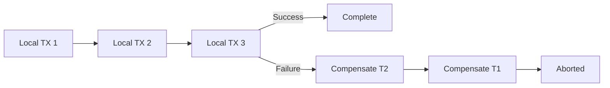
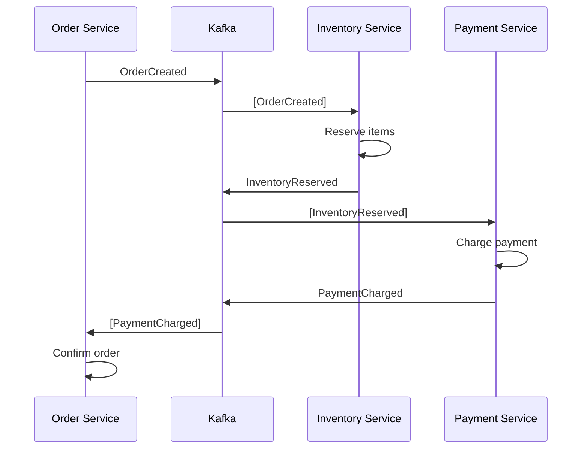
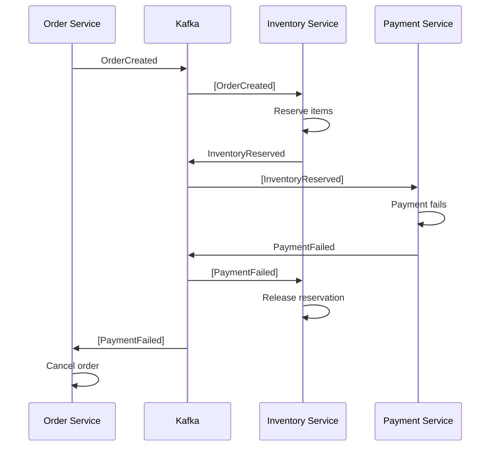
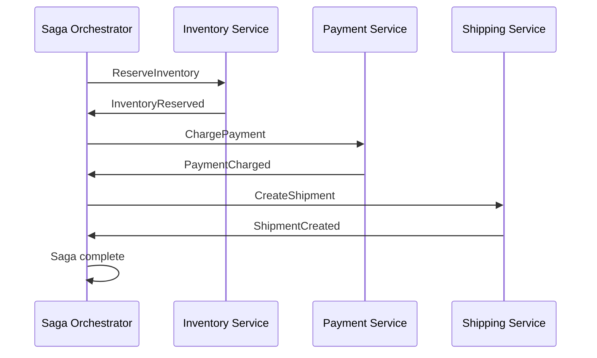
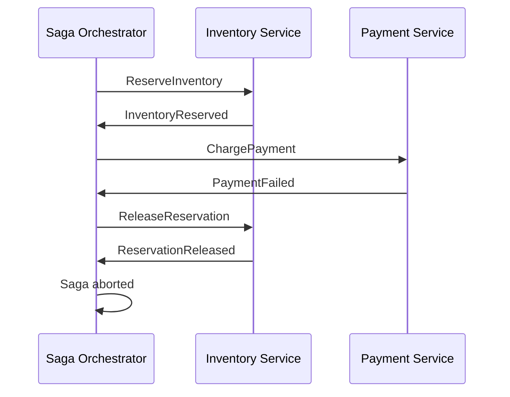
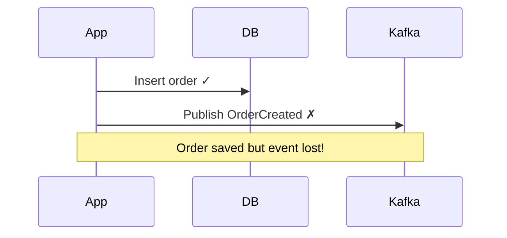
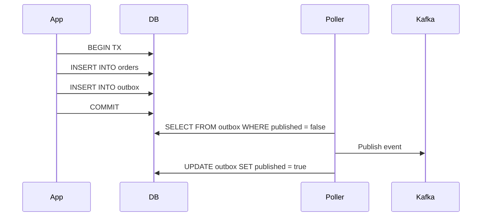
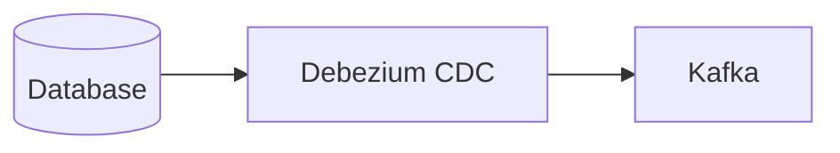

# Saga and Outbox Patterns — Deep Dive

> **Level:** Advanced  
> **Pre-reading:** [03 · Microservices Patterns](03-microservices-patterns.md) · [04 · Event-Driven Architecture](04-event-driven.md)

---

## The Distributed Transaction Problem

In microservices, operations often span multiple services. Traditional ACID transactions don't work across service boundaries. 2PC (Two-Phase Commit) blocks and doesn't scale.

**Solution:** The Saga pattern — a sequence of local transactions coordinated by events.

---

## Saga Pattern

A **saga** is a sequence of local transactions. Each step has a **compensating transaction** to undo if a later step fails.



### Saga Example: Order Placement

| Step | Service | Forward Action | Compensating Action |
|:-----|:--------|:---------------|:--------------------|
| 1 | Order Service | Create order (PENDING) | Cancel order |
| 2 | Inventory Service | Reserve items | Release reservation |
| 3 | Payment Service | Charge payment | Issue refund |
| 4 | Order Service | Confirm order (CONFIRMED) | — |

### Saga Coordination: Choreography vs Orchestration

---

## Choreography — Event-Driven

Each service publishes events; other services react. No central coordinator.



### Choreography: Failure Flow



### Choreography Characteristics

| Aspect | Detail |
|:-------|:-------|
| **Coupling** | Loose; services don't know each other |
| **Visibility** | Hard to see full saga flow |
| **Complexity** | Grows with number of steps |
| **Failure handling** | Each service publishes compensating events |
| **Best for** | Simple sagas (2–4 steps) |

---

## Orchestration — Central Coordinator

A **saga orchestrator** directs the flow. It tells each service what to do and handles responses.



### Orchestration: Failure Flow



### Orchestration Characteristics

| Aspect | Detail |
|:-------|:-------|
| **Coupling** | Orchestrator knows all participants |
| **Visibility** | Clear view of saga state |
| **Complexity** | Centralized; easier to manage |
| **Failure handling** | Orchestrator manages rollback |
| **Best for** | Complex sagas (5+ steps) |

### Orchestration Tools

| Tool | Description |
|:-----|:------------|
| **Temporal.io** | Durable workflow engine; code-based |
| **AWS Step Functions** | Serverless state machine |
| **Camunda** | BPMN-based workflow |
| **Axon Framework** | Java-based; saga + event sourcing |
| **Netflix Conductor** | Microservices workflow orchestration |

---

## Choreography vs Orchestration

| Aspect | Choreography | Orchestration |
|:-------|:-------------|:--------------|
| **Coupling** | Lower | Higher (to orchestrator) |
| **Visibility** | Harder to trace | Central dashboard |
| **Single point of failure** | None | Orchestrator |
| **Complexity** | Distributed | Centralized |
| **Testing** | Harder | Easier |
| **Best for** | Simple flows | Complex flows |

### When to Use Which

| Scenario | Recommendation |
|:---------|:---------------|
| 2–4 steps, simple flow | Choreography |
| 5+ steps | Orchestration |
| Need workflow visibility | Orchestration |
| Team familiar with events | Choreography |
| Complex branching logic | Orchestration |
| Minimal infrastructure | Choreography |

---

## Compensating Transactions

Compensations undo the effects of forward transactions. They must be **idempotent** and **safe to execute multiple times**.

### Compensation Design

| Forward Action | Compensation | Notes |
|:---------------|:-------------|:------|
| Create order | Mark order cancelled | Don't delete; keep audit trail |
| Reserve inventory | Release reservation | Restore available count |
| Charge payment | Issue refund | Stripe/PayPal refund API |
| Send email | Send cancellation email | Can't unsend; send follow-up |
| Create shipment | Cancel shipment | May not be possible if shipped |

### Semantic Compensation

Some actions can't be truly undone. Use **semantic compensation** — a corrective action.

| Action | Semantic Compensation |
|:-------|:---------------------|
| Send email | Send "sorry, please disregard" email |
| Ship package | Send return label; arrange pickup |
| Post to timeline | Post correction or delete |

---

## Saga State Management

### Choreography State

Each service maintains its own state. Events carry enough context.

```java
// Order service
@EventListener
public void on(PaymentFailed event) {
    Order order = orderRepository.findById(event.orderId());
    order.cancel(event.reason());
    orderRepository.save(order);
}
```

### Orchestration State

Orchestrator tracks saga state explicitly.

```java
public class OrderSaga {
    private String sagaId;
    private OrderId orderId;
    private SagaStatus status;  // STARTED, INVENTORY_RESERVED, PAYMENT_CHARGED, COMPLETED, COMPENSATING, ABORTED
    private List<String> completedSteps;
}
```

---

## The Outbox Pattern

### The Dual-Write Problem

Writing to DB and publishing an event are two operations. Either can fail independently.



### Solution: Outbox Table

Write both the business data and the event to the database in the **same transaction**. A separate process publishes events.



### Outbox Table Schema

```sql
CREATE TABLE outbox (
    id UUID PRIMARY KEY,
    aggregate_type VARCHAR(255),    -- 'Order'
    aggregate_id VARCHAR(255),      -- '12345'
    event_type VARCHAR(255),        -- 'OrderCreated'
    payload JSONB,                  -- Event data
    created_at TIMESTAMP,
    published BOOLEAN DEFAULT FALSE
);
```

### Outbox Implementation

```java
@Transactional
public void placeOrder(PlaceOrderCommand cmd) {
    // Business logic
    Order order = Order.create(cmd);
    orderRepository.save(order);
    
    // Write to outbox (same transaction)
    OutboxEvent event = new OutboxEvent(
        "Order",
        order.getId().toString(),
        "OrderCreated",
        serialize(order.toOrderCreatedEvent())
    );
    outboxRepository.save(event);
}

// Separate poller process
@Scheduled(fixedDelay = 100)
public void publishOutboxEvents() {
    List<OutboxEvent> pending = outboxRepository.findUnpublished();
    for (OutboxEvent event : pending) {
        kafkaTemplate.send(event.getTopic(), event.getPayload());
        event.markPublished();
        outboxRepository.save(event);
    }
}
```

### Change Data Capture (CDC) Alternative

Instead of polling, use CDC tools to capture database changes and publish events.



| Tool | Description |
|:-----|:------------|
| **Debezium** | OSS CDC; PostgreSQL, MySQL, MongoDB |
| **AWS DMS** | Managed CDC; RDS to Kinesis |
| **Spring Modulith** | Outbox support built-in |

### Outbox Benefits

| Benefit | Description |
|:--------|:------------|
| **Atomicity** | DB write and event are atomic |
| **At-least-once** | Events guaranteed to be published |
| **Order preserved** | Events processed in order |
| **No distributed transactions** | Single DB transaction |

### Outbox Guarantees

| Guarantee | How |
|:----------|:----|
| **At-least-once delivery** | Retry until published |
| **Ordering** | Process outbox in order |
| **No loss** | Event in DB survives crashes |

!!! warning "Idempotent consumers required"
    Outbox guarantees at-least-once, not exactly-once. Consumers must handle duplicates.

---

??? question "When should you use choreography vs orchestration for sagas?"
    Use **choreography** for simple sagas (2–4 steps) with clear event flows and a team comfortable with event-driven design. Use **orchestration** for complex sagas (5+ steps), when you need visibility into saga state, or when branching/conditional logic is involved. Orchestration is easier to test and debug.

??? question "What guarantees does the outbox pattern provide?"
    **At-least-once delivery**: Events will be published (eventually). **Ordering**: Events are published in the order written. **No loss**: Events persist in DB; survive crashes. It does NOT guarantee exactly-once — consumers must be idempotent. The outbox pattern trades simplicity for reliability.

??? question "How do you handle a compensation that fails?"
    (1) **Retry** with exponential backoff. (2) **Dead letter queue** for events that exceed retries. (3) **Manual intervention** via ops dashboard. (4) **Reconciliation job** that detects inconsistencies. Compensations must be idempotent so retries are safe. Design compensations to eventually succeed.

