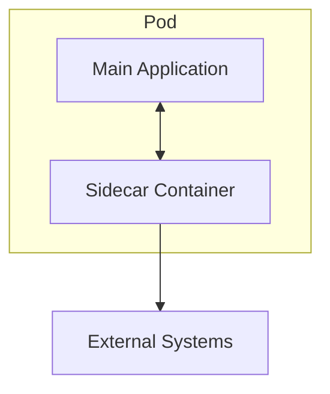
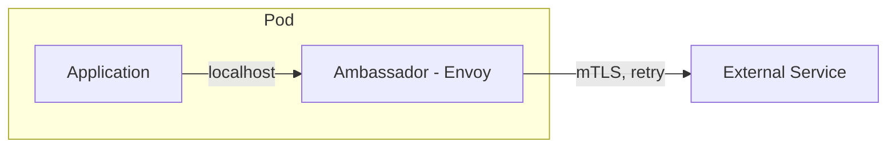
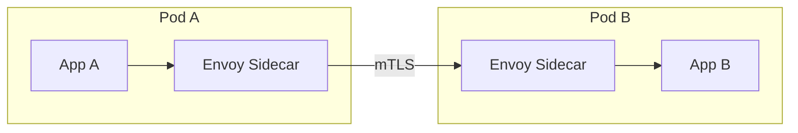
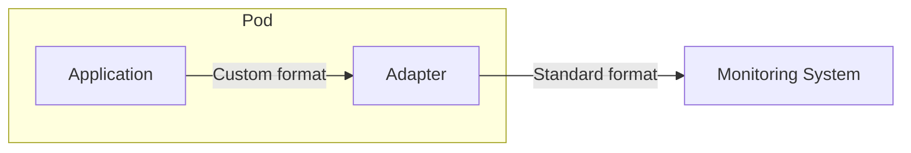
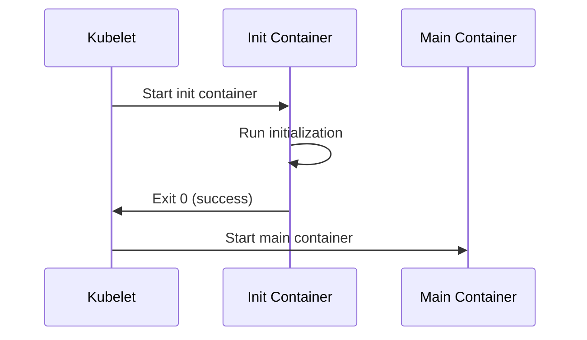
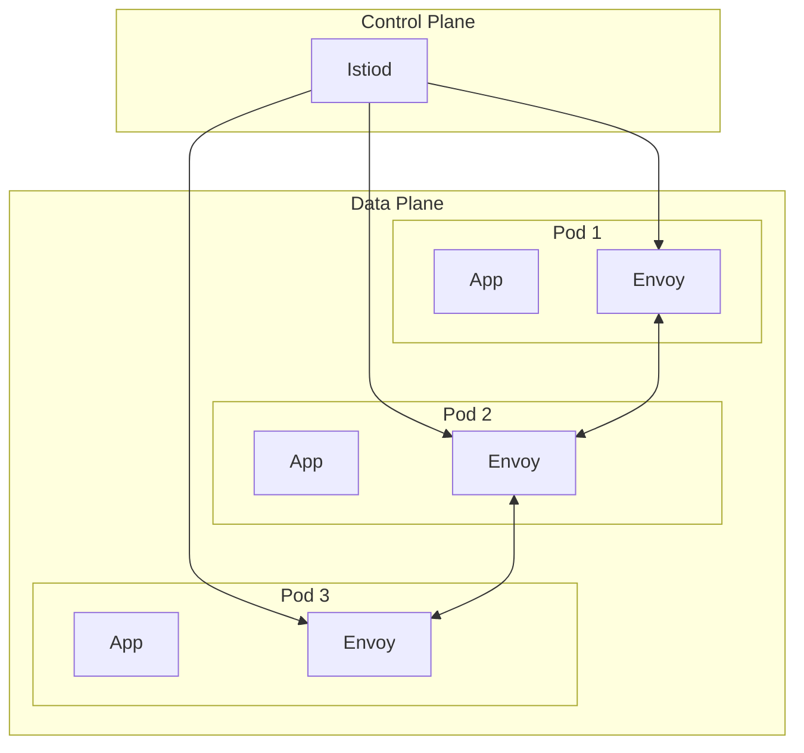

# Sidecar Patterns — Deep Dive

> **Level:** Intermediate  
> **Pre-reading:** [03 · Microservices Patterns](03-microservices-patterns.md) · [09 · Deployment & Infrastructure](09-deployment.md)

---

## The Sidecar Concept

A **sidecar** is a helper container that runs alongside your main application container in the same pod. It handles cross-cutting concerns without modifying application code.



### Why Sidecars?

| Benefit | Description |
|:--------|:------------|
| **Separation of concerns** | App focuses on business logic |
| **Language agnostic** | Works with any application runtime |
| **Independent deployment** | Update sidecar without changing app |
| **Reusability** | Same sidecar for all services |

---

## Sidecar Pattern

The general pattern: a co-deployed container that extends application functionality.

### Common Sidecar Use Cases

| Use Case | Sidecar Implementation |
|:---------|:-----------------------|
| **Proxy traffic** | Envoy, Linkerd proxy |
| **Logging** | Fluentd/Fluent Bit log forwarder |
| **Metrics** | Prometheus exporter |
| **Secret management** | Vault agent |
| **Config reloading** | Config watcher |
| **Service mesh** | Istio sidecar (Envoy) |

### Kubernetes Sidecar Example

```yaml
apiVersion: v1
kind: Pod
metadata:
  name: order-service
spec:
  containers:
    # Main application
    - name: order-app
      image: order-service:1.0
      ports:
        - containerPort: 8080
      volumeMounts:
        - name: logs
          mountPath: /var/log/app
    
    # Sidecar: Log forwarder
    - name: log-forwarder
      image: fluent/fluent-bit:latest
      volumeMounts:
        - name: logs
          mountPath: /var/log/app
          readOnly: true
  
  volumes:
    - name: logs
      emptyDir: {}
```

### Sidecar Communication

| Method | Description |
|:-------|:------------|
| **Localhost** | Sidecar listens on localhost; app calls it |
| **Shared volume** | Both containers read/write same volume |
| **Unix socket** | Low-latency IPC |

---

## Ambassador Pattern

A sidecar that handles **outgoing** requests. It adds features like retries, circuit breaking, and mTLS to outbound traffic.



### Ambassador Responsibilities

| Concern | Ambassador Handles |
|:--------|:-------------------|
| **mTLS** | Terminate and originate TLS |
| **Retries** | Automatic retry with backoff |
| **Circuit breaking** | Fail fast on downstream issues |
| **Load balancing** | Distribute across instances |
| **Observability** | Emit metrics, traces |

### Service Mesh as Ambassador

In Istio, the Envoy sidecar acts as an ambassador for all outgoing traffic:



---

## Adapter Pattern

A sidecar that **transforms** application output to match what the platform expects. Converts metrics, logs, or data formats.



### Adapter Examples

| Application Output | Adapter | Platform Input |
|:-------------------|:--------|:---------------|
| Custom metrics format | Prometheus exporter | Prometheus scrape |
| Plain text logs | Fluent Bit | JSON structured logs |
| Proprietary protocol | Protocol converter | Standard REST/gRPC |

### Prometheus Exporter Adapter

```yaml
apiVersion: v1
kind: Pod
spec:
  containers:
    - name: app
      image: my-app:1.0
      # App exposes metrics at /internal-metrics in custom format
    
    - name: prometheus-exporter
      image: custom-exporter:1.0
      ports:
        - containerPort: 9090
          name: metrics
      # Converts /internal-metrics to Prometheus format at :9090/metrics
```

---

## Init Container Pattern

A container that runs **to completion before** the main container starts. Used for initialization tasks.



### Init Container Use Cases

| Use Case | What Init Container Does |
|:---------|:-------------------------|
| **Schema migration** | Run Flyway/Liquibase |
| **Config fetch** | Download config from S3/Vault |
| **Wait for dependency** | Poll until database is ready |
| **Permission setup** | Fix file permissions |
| **Secret injection** | Fetch secrets, write to volume |

### Init Container Example: Wait for Database

```yaml
apiVersion: v1
kind: Pod
spec:
  initContainers:
    - name: wait-for-db
      image: busybox:1.28
      command: ['sh', '-c', 
        'until nc -z postgres-service 5432; do echo waiting for db; sleep 2; done']
    
    - name: run-migrations
      image: my-app:1.0
      command: ['./migrate.sh']
      env:
        - name: DATABASE_URL
          valueFrom:
            secretKeyRef:
              name: db-secret
              key: url

  containers:
    - name: app
      image: my-app:1.0
```

### Init Container Characteristics

| Aspect | Behavior |
|:-------|:---------|
| **Execution order** | Run sequentially in order defined |
| **Must succeed** | Pod won't start if init container fails |
| **Resources** | Can have different resource limits |
| **Restart policy** | Respected (retries on failure) |

---

## Comparing Sidecar Patterns

| Pattern | Traffic Direction | Purpose |
|:--------|:------------------|:--------|
| **Sidecar** | Any | General purpose; extend app |
| **Ambassador** | Outgoing | Handle outbound complexity |
| **Adapter** | Outgoing | Transform format |
| **Init Container** | N/A | Pre-start initialization |

---

## Service Mesh: Sidecars at Scale

A **service mesh** deploys sidecars (typically Envoy) to every pod, managed by a control plane.



### Service Mesh Capabilities

| Feature | Implementation |
|:--------|:---------------|
| **mTLS everywhere** | Automatic certificate rotation |
| **Traffic management** | Canary, A/B, fault injection |
| **Observability** | Metrics, traces, logs — no code changes |
| **Circuit breaking** | Configured via DestinationRule |
| **Rate limiting** | Configured per service |

### When to Use Service Mesh

| Good Fit | Overkill |
|:---------|:---------|
| 10+ microservices | < 5 services |
| Strict mTLS requirement | Internal trusted network |
| Complex traffic management | Simple routing |
| Observability gaps | Already good observability |

---

## Sidecar Resource Considerations

### Resource Overhead

| Sidecar | Memory | CPU |
|:--------|:-------|:----|
| **Envoy (Istio)** | ~50–100MB | ~0.1 CPU |
| **Fluent Bit** | ~20–50MB | Minimal |
| **Vault Agent** | ~25MB | Minimal |

### Pod Resource Limits

```yaml
spec:
  containers:
    - name: app
      resources:
        requests:
          memory: "256Mi"
          cpu: "500m"
        limits:
          memory: "512Mi"
          cpu: "1000m"
    
    - name: envoy
      resources:
        requests:
          memory: "64Mi"
          cpu: "100m"
        limits:
          memory: "128Mi"
          cpu: "200m"
```

---

## Anti-Patterns

| Anti-Pattern | Problem | Fix |
|:-------------|:--------|:----|
| **Too many sidecars** | Resource bloat; complexity | Consolidate functionality |
| **Sidecar for business logic** | Wrong abstraction | Business logic in main app |
| **Sidecar with state** | Complicates scaling | Stateless sidecars |
| **Ignoring sidecar failures** | App may not function | Health checks include sidecar |

---

??? question "What's the difference between a sidecar and an init container?"
    **Sidecar** runs alongside the main container for the lifetime of the pod — it's co-located and usually handles ongoing concerns (proxying, logging). **Init container** runs to completion before the main container starts — it's for one-time setup (migrations, config fetch, waiting for dependencies).

??? question "When should you use a service mesh vs. implementing resilience in the application?"
    Use a **service mesh** when you have many services in different languages and want consistent, language-agnostic resilience (mTLS, retries, circuit breaking). Use **application libraries** (Resilience4j, Polly) when you have a homogeneous tech stack, want fine-grained control, or service mesh overhead isn't justified (< 10 services).

??? question "How does the ambassador pattern relate to the API gateway?"
    Both handle cross-cutting concerns, but at different levels. **API Gateway** is a centralized edge service handling north-south traffic (external → cluster). **Ambassador** is a per-pod sidecar handling east-west traffic (service → service). In a service mesh, the sidecar (Envoy) acts as an ambassador for each service.

