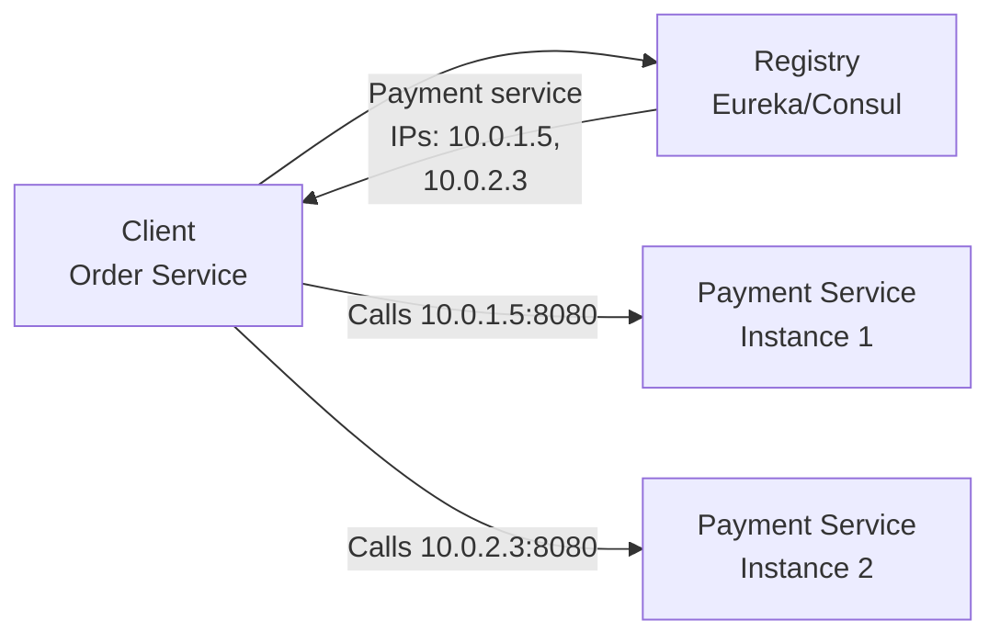
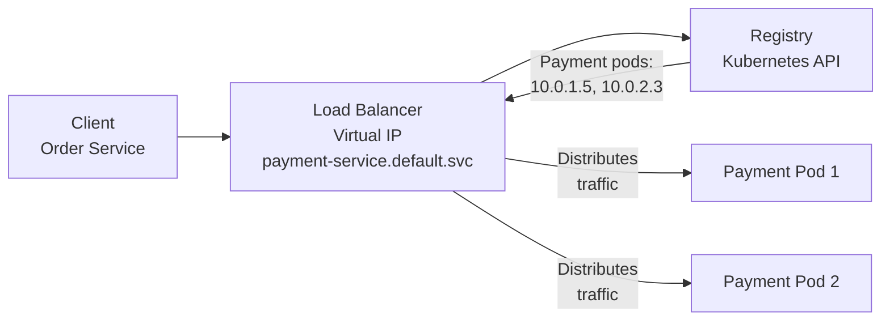
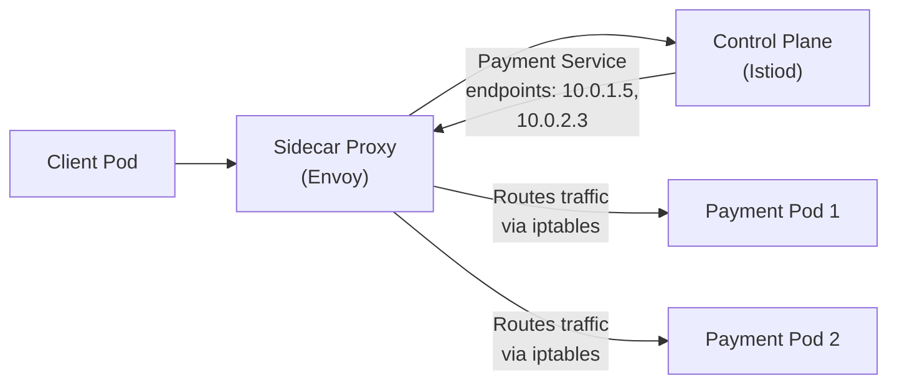

# Service Discovery & Load Balancing — Deep Dive

> **Level:** Intermediate
> **Pre-reading:** [03 · Microservices Patterns](03-microservices-patterns.md) · [05 · API & Communication](05-api-communication.md)

---

## The Problem: Finding Services Dynamically

In monoliths, all services run on known IPs. In microservices, services come and go:

```
Problem:
  Service A needs to call Service B
  But Service B has 5 instances across 3 availability zones
  IPs change as pods restart
  How does A discover B's current IPs?
```

**Service Discovery** solves this: a registry that tracks "Service B is at 10.0.1.5:8080, 10.0.2.3:8080, 10.0.3.7:8080 right now."

---

## Service Discovery Patterns

| Pattern | How It Works | When to Use |
|:--------|:------------|:-----------|
| **Client-side** | Client queries registry; picks instance | Small, known set of services |
| **Server-side** | Load balancer queries registry; client calls LB | Separation of concerns; simpler clients |
| **Kubernetes DNS** | CoreDNS serves `service.namespace.svc.cluster.local` | Kubernetes-native (easiest) |
| **Service Mesh** | Sidecar proxy intercepts; service discovery abstracted | Large scale; language-agnostic |

---

## Client-Side Service Discovery

**Client directly queries service registry and picks an instance.**



### Eureka (Spring Cloud)

```yaml
# In Spring Boot application.yml
spring:
  application:
    name: order-service
  cloud:
    eureka:
      client:
        serviceUrl:
          defaultZone: http://eureka-server:8761/eureka/
```

```java
// Order Service queries Eureka
@RestController
public class OrderController {
    
    @Autowired
    private DiscoveryClient discoveryClient;
    
    @GetMapping("/orders/{id}")
    public Order getOrder(@PathVariable String id) {
        // Get all Payment Service instances from Eureka
        List<ServiceInstance> instances = 
            discoveryClient.getInstances("payment-service");
        
        if (instances.isEmpty()) {
            throw new ServiceUnavailableException("payment-service");
        }
        
        // Client-side load balancing: pick instance 0
        ServiceInstance instance = instances.get(0);
        String url = instance.getUri() + "/api/payments/" + id;
        
        return restTemplate.getForObject(url, Order.class);
    }
}
```

### Pros & Cons

| Pros | Cons |
|:-----|:-----|
| Client control over load balancing logic | Every client language needs discovery logic |
| Custom load balancing (affinity, canary) | Service Registry client library required |
| No proxy overhead | Clients tightly coupled to discovery mechanism |

---

## Server-Side Service Discovery

**Load balancer queries registry; clients call load balancer.**



### Kubernetes DNS (Easiest)

```java
// In Kubernetes, just use DNS name
// Kubernetes CoreDNS handles discovery + load balancing
@RestTemplate
public Order callPaymentService() {
    String url = "http://payment-service.default.svc.cluster.local:8080/api/payments";
    return restTemplate.getForObject(url, Order.class);
}
```

**How it works:**

1. Order pod requests `payment-service.default.svc.cluster.local`
2. CoreDNS resolves to ClusterIP (virtual IP): `10.96.1.5`
3. kube-proxy on every node maintains iptables rules
4. iptables redirects `10.96.1.5:8080` to an actual pod IP

**Benefits:**

- Zero client-side code needed
- Works across any language
- Built-in health checking (if pod fails, removes from endpoints)

### Consul (HashiCorp)

Enterprise-grade service discovery with health checks and multi-DC support:

```hcl
# consul-config.hcl
service {
  name = "payment-service"
  port = 8080
  check {
    http     = "http://localhost:8080/health"
    interval = "10s"
    timeout  = "5s"
  }
}
```

```java
// Client fetches from Consul
public String discoverPaymentService() {
    Response<List<CatalogService>> response = 
        consul.getCatalogClient().getService("payment-service");
    
    List<CatalogService> instances = response.getValue();
    CatalogService instance = instances.get(0); // pick one
    return instance.getServiceAddress() + ":" + instance.getServicePort();
}
```

---

## Service Mesh (Abstracted Service Discovery)

Service mesh (Istio, Linkerd) handles discovery transparently via sidecars.



**Transparent to application:**

```java
// App just calls the service name; sidecar handles discovery
public Order callPaymentService() {
    // Sidecar intercepts; resolves payment-service automatically
    return restTemplate.getForObject("http://payment-service:8080/api/payments", Order.class);
}
```

**Service Mesh Benefits:**

- Service discovery + load balancing + circuit breaker + observability all in proxy
- Language-agnostic
- Canary, circuit breaker rules defined in config, not code

---

## Load Balancing Algorithms

Once a service discovers multiple instances, how to pick one?

| Algorithm | Behavior | When to Use |
|:----------|:---------|:-----------|
| **Round Robin** | Rotate through instances | Uniform load; stateless requests |
| **Least Connections** | Route to instance with fewest active connections | Long-lived connections; streaming |
| **IP Hash** | Same client IP → same instance | Session affinity; connection pooling |
| **Random** | Pick random instance | Simple; low overhead |
| **Weighted** | Favor certain instances (e.g., canary: 90% old, 10% new) | Gradual rollouts |

### Example: Round-Robin vs Least Connections

```
Scenario: 3 instances, requests arrive
Instance 1: 10 active requests, avg processing time 100ms
Instance 2: 5 active requests, avg processing time 100ms
Instance 3: 2 active requests, avg processing time 100ms

Round-Robin would send new request to Instance 1 (next in rotation)
→ Queues up; longer latency

Least Connections would send to Instance 3
→ Faster response
```

---

## Health Checks & Deregistration

Service registry must detect dead instances and remove them.

### Active Health Checks (Registry → Service)

```
Registry polls: GET http://payment-service-pod:8080/health
Response: 200 OK { "status": "UP" }
If poll fails 3x in a row → deregister instance
```

### Passive Health Checks (Client → Service)

```
Client calls payment-service:8080 → 500 error
Circuit breaker counts failure
After threshold → remove from load balancing rotation
```

### Kubernetes Health Probes

```yaml
apiVersion: v1
kind: Pod
metadata:
  name: payment-pod
spec:
  containers:
  - name: payment
    livenessProbe:  # Is app alive?
      httpGet:
        path: /health/live
        port: 8080
      initialDelaySeconds: 10
      periodSeconds: 10
    readinessProbe:  # Is app ready for traffic?
      httpGet:
        path: /health/ready
        port: 8080
      initialDelaySeconds: 5
      periodSeconds: 5
```

**Behavior:**

- **Liveness fails** → Kubelet restarts pod
- **Readiness fails** → Service removes pod from endpoints; no traffic sent

---

## Client-Side Load Balancing Library

Spring Cloud LoadBalancer (modern replacement for Ribbon):

```java
@Configuration
public class LoadBalancerConfig {
    
    @Bean
    public RestTemplate restTemplate(RestTemplateBuilder builder) {
        return builder
            .interceptors((request, body, execution) -> {
                // LoadBalancer intercepts; resolves service name via DiscoveryClient
                return execution.execute(request, body);
            })
            .build();
    }
}

@RestController
public class OrderController {
    
    @Bean
    public RestTemplate restTemplate() {
        return new RestTemplate();
    }
    
    @Autowired
    private RestTemplate restTemplate;
    
    @GetMapping("/orders")
    public List<Payment> getPayments() {
        // LoadBalancer resolves "payment-service" to actual IP
        return restTemplate.getForObject(
            "http://payment-service/api/payments",
            List.class
        );
    }
}
```

---

## When to Use Each Pattern

| Pattern | Use When |
|:--------|:---------|
| **Kubernetes DNS** | Running in Kubernetes; simplest option; recommended default |
| **Client-side (Eureka)** | Not in Kubernetes; need sophisticated routing logic (canary, affinity) |
| **Server-side (Consul)** | Multi-DC; need strong health checks; legacy infrastructure |
| **Service Mesh (Istio)** | Large microservices fleet; want decoupling from discovery mechanism; language diversity |

---

??? question "Why not just use a load balancer IP (VIP) for every service?"
    VIPs work but don't scale: in Kubernetes with 500 microservices, managing 500 VIPs is operational overhead. DNS + CoreDNS scales naturally; new service = new DNS record, automatic.

??? question "How does Kubernetes CoreDNS differ from Consul?"
    CoreDNS is Kubernetes-native; scales well for K8s workloads; limited health checks. Consul is external; multi-cloud; richer API; more overhead. For Kubernetes, CoreDNS is sufficient; use Consul only if multi-cloud or on-prem hybrid.

??? question "Can I use Round-Robin load balancing with long-lived connections?"
    No; will saturate old instances. Use Least Connections instead, or IP Hash for session affinity.

??? question "How does Istio's load balancing differ from Kubernetes service load balancing?"
    Kubernetes service load balancing is basic (round-robin at kube-proxy). Istio adds circuit breaker, canary weights, outlier detection, and observability without application code changes.

