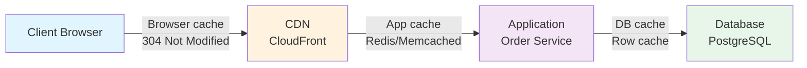
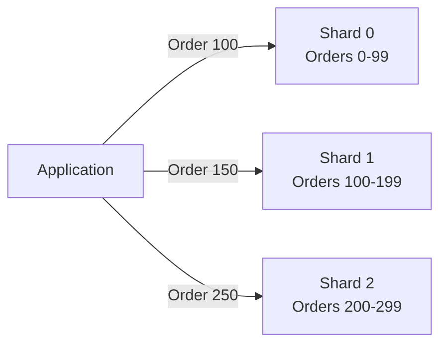

# Cache Patterns & Strategies — Deep Dive

> **Level:** Intermediate
> **Pre-reading:** [03 · Microservices Patterns](03-microservices-patterns.md) · [09 · Deployment & Infrastructure](09-deployment.md)

---

## Caching Layers



| Layer | Examples | TTL | Invalidation |
|:------|:---------|:----|:-------------|
| **Browser/CDN** | Static assets, HTML | Hours to days | Cache headers; URL versioning |
| **Application** | API responses, objects | Minutes to hours | Event-based; TTL |
| **Database** | Row-level caching | Milliseconds to seconds | Query result cache; invalidation on write |
| **Hardware** | CPU L1/L2/L3 cache | Nanoseconds | Automatic; CPU managed |

---

## Cache-Aside Pattern (Lazy Loading)

**Logic:** Check cache → miss → load from DB → store in cache → return.

```java
@Service
public class ProductService {
    
    @Autowired
    private RedisTemplate<String, Product> redisTemplate;
    
    @Autowired
    private ProductRepository productRepository;
    
    public Product getProduct(String productId) {
        // 1. Check cache
        String cacheKey = "product:" + productId;
        Product cached = redisTemplate.opsForValue().get(cacheKey);
        if (cached != null) {
            return cached;  // Cache hit; return immediately
        }
        
        // 2. Cache miss; load from DB
        Product product = productRepository.findById(productId)
            .orElseThrow(() -> new ProductNotFoundException());
        
        // 3. Store in cache (with TTL of 1 hour)
        redisTemplate.opsForValue().set(
            cacheKey,
            product,
            Duration.ofHours(1)
        );
        
        // 4. Return
        return product;
    }
}
```

### Pros & Cons

| Pros | Cons |
|:-----|:-----|
| Simple to implement | Cache warming on startup needed; slow first request |
| Only caches accessed items | Stale data possible (expired items) |
| Easy to remove cached items | Cache stampede: many threads reload same key |

---

## Write-Through Pattern

**Logic:** Write to cache AND DB together.

```java
@Service
public class ProductService {
    
    public void updateProduct(String productId, Product product) {
        // 1. Write to cache
        String cacheKey = "product:" + productId;
        redisTemplate.opsForValue().set(cacheKey, product, Duration.ofHours(1));
        
        // 2. Write to DB
        productRepository.save(product);
    }
}
```

### Pros & Cons

| Pros | Cons |
|:-----|:-----|
| Cache always consistent with DB | Writes slower (must wait for both DB + cache) |
| No stale reads possible | Extra load on cache during writes |

---

## Write-Behind (Write-Back) Pattern

**Logic:** Write to cache immediately; async flush to DB.

```java
@Service
public class ProductService {
    
    @Autowired
    private RedisTemplate<String, Product> redisTemplate;
    
    public void updateProduct(String productId, Product product) {
        // 1. Write to cache immediately (fast)
        String cacheKey = "product:" + productId;
        redisTemplate.opsForValue().set(
            cacheKey,
            product,
            Duration.ofHours(1)
        );
        
        // 2. Async write to DB (deferred)
        asyncDbWriter.schedule(() -> {
            productRepository.save(product);
        }, Duration.ofSeconds(5));
    }
}
```

### Pros & Cons

| Pros | Cons |
|:-----|:-----|
| Writes fast (cache only) | Stale DB; data loss if cache fails before flush |
| Batching: flush 10 updates in 1 DB call | Complex; need flush logic |

### When to Use Write-Behind

- **High-write scenarios:** Analytics, counters, logs
- **Non-critical data:** Recommendations, statistics

### When NOT to Use

- **Financial transactions:** Critical data must be in DB immediately
- **Inventory:** Overselling risk if cache fails

---

## Cache Invalidation Strategies

> **Two hard problems in CS:** Cache invalidation and naming things.

### TTL-Based (Time-To-Live)

```java
// Cache expires after 1 hour
redisTemplate.opsForValue().set(
    "product:123",
    product,
    Duration.ofHours(1)  // TTL
);
```

**Pro:** Simple; automatic cleanup. **Con:** Stale data until expiry.

### Event-Based

```java
@Service
public class ProductService {
    
    @Autowired
    private RedisTemplate<String, Product> redisTemplate;
    
    @Autowired
    private ApplicationEventPublisher eventPublisher;
    
    public void updateProduct(String productId, Product product) {
        // Update DB
        productRepository.save(product);
        
        // Invalidate cache
        redisTemplate.delete("product:" + productId);
        
        // Publish event for other services
        eventPublisher.publishEvent(new ProductUpdatedEvent(productId));
    }
}
```

**Pro:** Immediate consistency. **Con:** Must remember to invalidate everywhere.

### Cache-Aside with Versioning

```java
@Service
public class ProductService {
    
    public Product getProduct(String productId) {
        // Version-based cache key
        int version = productVersionRepository.getVersion(productId);
        String cacheKey = "product:" + productId + ":v" + version;
        
        Product cached = redisTemplate.opsForValue().get(cacheKey);
        if (cached != null) {
            return cached;
        }
        
        Product product = productRepository.findById(productId).orElseThrow();
        redisTemplate.opsForValue().set(cacheKey, product, Duration.ofHours(1));
        return product;
    }
    
    public void updateProduct(String productId, Product product) {
        productRepository.save(product);
        productVersionRepository.incrementVersion(productId);
        // Old cache keys become orphaned; automatic cleanup via TTL
    }
}
```

**Pro:** No explicit invalidation needed. **Con:** Cache fragmentation over time.

---

## Cache Stampede Prevention

**Problem:** Multiple requests hit expired cache key; all reload from DB simultaneously.

```
Cache expires: product:123
100 requests arrive at same time
All miss cache → all query DB
DB gets 100 queries; slow
```

### Solution 1: Probabilistic TTL

```java
public Product getProduct(String productId) {
    Product cached = redisTemplate.opsForValue().get("product:" + productId);
    
    if (cached != null && !shouldRefresh()) {
        return cached;  // Use stale cache
    }
    
    // Refresh cache
    Product fresh = productRepository.findById(productId).orElseThrow();
    redisTemplate.opsForValue().set("product:" + productId, fresh, Duration.ofMinutes(60));
    return fresh;
}

private boolean shouldRefresh() {
    // 10% chance to refresh; spreads load
    return Math.random() < 0.1;
}
```

### Solution 2: Distributed Lock

```java
public Product getProduct(String productId) {
    Product cached = redisTemplate.opsForValue().get("product:" + productId);
    if (cached != null) {
        return cached;
    }
    
    // Prevent thundering herd with distributed lock
    String lockKey = "lock:" + productId;
    if (!redisTemplate.opsForValue().setIfAbsent(lockKey, "1", Duration.ofSeconds(5))) {
        // Another thread has lock; wait and retry cache
        Thread.sleep(100);
        return getProduct(productId);
    }
    
    try {
        // This thread refreshes
        Product fresh = productRepository.findById(productId).orElseThrow();
        redisTemplate.opsForValue().set("product:" + productId, fresh, Duration.ofHours(1));
        return fresh;
    } finally {
        redisTemplate.delete(lockKey);
    }
}
```

---

## Database Sharding for Horizontal Scaling

**Problem:** Single database becomes bottleneck.

**Solution:** Split data across multiple databases (shards).



### Sharding Strategies

| Strategy | Example | Pros | Cons |
|:---------|:--------|:-----|:-----|
| **Range-based** | Orders 0-99 → Shard A; 100-199 → Shard B | Simple; range queries fast | Uneven distribution (hot shards) |
| **Hash-based** | hash(orderId) % num_shards | Uniform distribution | Expensive range queries |
| **Geographic** | US data → Shard A; EU → Shard B | Data locality; compliance | Complex to rebalance |
| **Directory-based** | Lookup table: orderId → shard | Flexible; easy rebalancing | Extra lookup overhead |

### Hash-Based Sharding Example

```java
@Repository
public class ShardedOrderRepository {
    
    private List<JdbcTemplate> shards;
    
    public Order findById(String orderId) {
        int shardId = Math.abs(orderId.hashCode()) % shards.size();
        JdbcTemplate shard = shards.get(shardId);
        
        return shard.queryForObject(
            "SELECT * FROM orders WHERE id = ?",
            new OrderRowMapper(),
            orderId
        );
    }
    
    public void save(Order order) {
        int shardId = Math.abs(order.getId().hashCode()) % shards.size();
        JdbcTemplate shard = shards.get(shardId);
        
        shard.update(
            "INSERT INTO orders (id, total) VALUES (?, ?)",
            order.getId(),
            order.getTotal()
        );
    }
}
```

### Rebalancing Shards

When adding new shard: rehash all data; move subset to new shard.

```
Before: 3 shards
  Shard 0: 1/3 data
  Shard 1: 1/3 data
  Shard 2: 1/3 data

Add Shard 3:
  Rehash all data: hash(orderId) % 4
  1/4 of data moves to Shard 3
  Shard 0, 1, 2 each lose 1/12 of data
  
Downtime: Yes (migration required)
```

---

## Redis Cluster for Distributed Caching

Scale beyond single Redis instance:

```yaml
# Redis Cluster: 6 nodes (3 primary + 3 replica)
redis-node-1 (primary, slots 0-5461)
redis-node-2 (primary, slots 5462-10922)
redis-node-3 (primary, slots 10923-16383)
redis-node-4 (replica of node-1)
redis-node-5 (replica of node-2)
redis-node-6 (replica of node-3)
```

**Feature:**

- Sharding built-in
- Failover: replica promoted if primary fails
- Cluster-aware clients

---

## Cache Warming

Pre-populate cache on startup; avoid slow first requests.

```java
@Component
public class CacheWarmer {
    
    @Autowired
    private ProductService productService;
    
    @Autowired
    private RedisTemplate<String, Product> redisTemplate;
    
    @EventListener(ApplicationReadyEvent.class)
    public void warmCache() {
        // Load top 1000 products on startup
        List<Product> topProducts = productService.getTopProducts(1000);
        
        topProducts.forEach(product -> {
            String key = "product:" + product.getId();
            redisTemplate.opsForValue().set(key, product, Duration.ofHours(1));
        });
        
        log.info("Cache warmed with {} products", topProducts.size());
    }
}
```

---

??? question "Should I cache at the application layer or database layer?"
    Both: app layer (Redis) for hot data; DB layer (query cache) for expensive queries. App layer is faster and decouples services.

??? question "How much memory should I allocate to Redis?"
    Rule of thumb: cache working set (80% of queries touch 20% of data). Monitor hit ratio; target > 90%. Start with 10–20% of dataset size.

??? question "What happens when Redis runs out of memory?"
    Eviction policy kicks in: LRU (least recently used), LFU (least frequently used), or TTL-based. Configure with `maxmemory-policy` in redis.conf.

