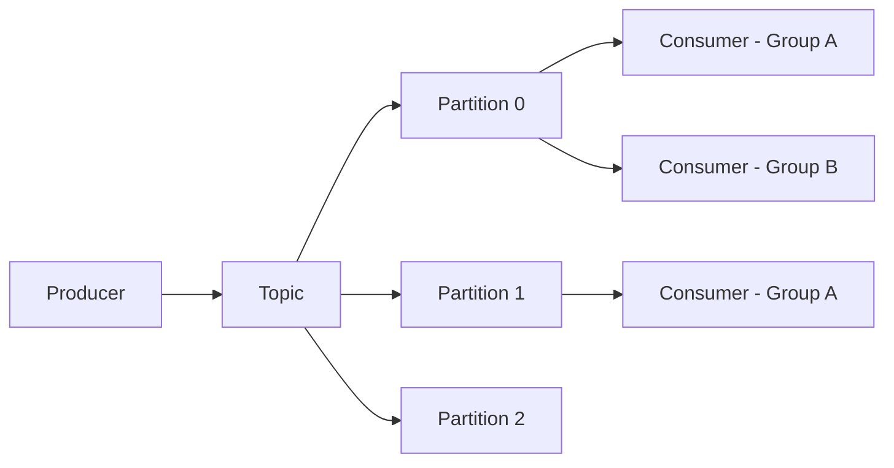
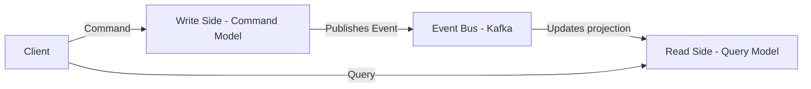
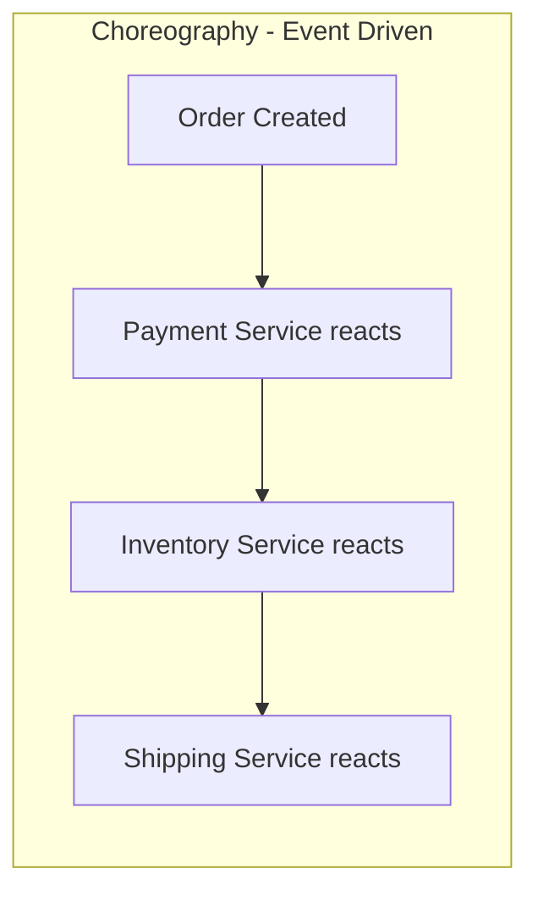
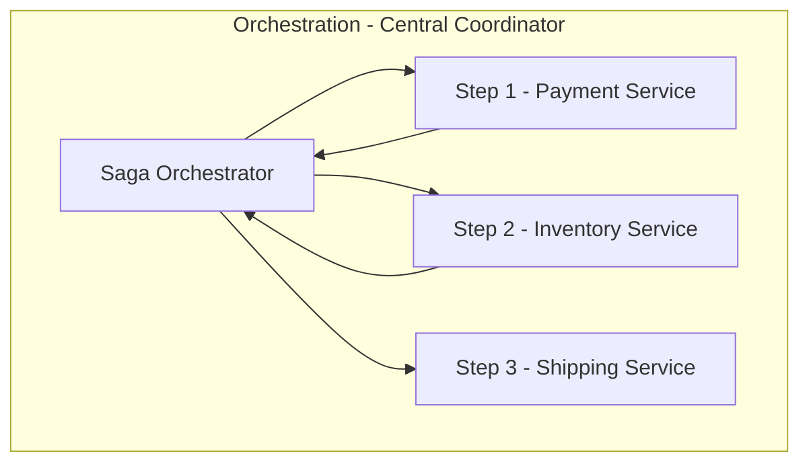

# Event-Driven Architecture

> Events decouple producers from consumers. They are the backbone of scalable, resilient microservices.

## Event Types

| Type                  | Description                                                        | Example                            |
|:----------------------|:-------------------------------------------------------------------|:-----------------------------------|
| **Domain Event**      | Fact within a bounded context                                      | `OrderPlaced`, `InventoryReserved` |
| **Integration Event** | Domain event published across service boundaries                   | Same events but via Kafka topics   |
| **Command**           | Request to do something; directed at one receiver; can be rejected | `PlaceOrder`, `ShipOrder`          |
| **Query**             | Request for data; no side effects; read-only                       | `GetOrderStatus`                   |

> **Key distinction:** An event is a *fact* (past tense, already happened). A command is a *request* (may succeed or fail).

## Event-Driven Patterns

| Pattern                          | Description                                             | When to Use                                |
|:---------------------------------|:--------------------------------------------------------|:-------------------------------------------|
| **Event Notification**           | Publisher fires event; doesn't care about consumers     | Loosest coupling; audit, notifications     |
| **Event-Carried State Transfer** | Event contains full payload — no follow-up query needed | Avoids query fan-out; larger events        |
| **Event Sourcing**               | Events *are* the record; state derived by replay        | Audit, time-travel, complex state machines |
| **CQRS via Events**              | Write side emits events; read side builds projections   | High read/write ratio; independent scaling |

## Kafka Architecture

| Concept                     | Description                                                                                    |
|:----------------------------|:-----------------------------------------------------------------------------------------------|
| **Topic**                   | Named stream of events; logical category                                                       |
| **Partition**               | Ordered, immutable append-only log; unit of parallelism                                        |
| **Offset**                  | Position of a message in a partition; consumer tracks this                                     |
| **Consumer Group**          | Group of consumers splitting a topic; each partition goes to exactly one consumer in the group |
| **Broker**                  | Kafka server; stores and serves partitions                                                     |
| **Replication Factor**      | Copies of each partition across brokers for fault tolerance                                    |
| **Retention**               | How long messages are kept — time-based or size-based                                          |
| **Log Compaction**          | Keep only the latest message per key; others discarded                                         |
| **Schema Registry**         | Central schema store (Avro, Protobuf, JSON Schema); prevents schema breakage                   |
| **Dead Letter Queue (DLQ)** | Separate topic for poison-pill messages after max retries exhausted                            |

### Delivery Guarantees

| Guarantee         | Description                                                | Use When                   |
|:------------------|:-----------------------------------------------------------|:---------------------------|
| **At most once**  | May lose messages; no duplicates                           | Metrics, non-critical logs |
| **At least once** | No loss; may duplicate; default Kafka behavior             | Most business events       |
| **Exactly once**  | No loss, no duplicates; idempotent producer + transactions | Financial, inventory       |

## CQRS — Command Query Responsibility Segregation

| Aspect          | Command Side                  | Query Side                               |
|:----------------|:------------------------------|:-----------------------------------------|
| **Purpose**     | Business logic, state changes | Fast reads, projections                  |
| **Model**       | Rich domain model             | Denormalized, read-optimized             |
| **Storage**     | Relational DB / Event Store   | Elasticsearch, Redis, materialized views |
| **Consistency** | Immediate                     | Eventual                                 |

- Read and write models scale independently
- Cost: two models to design and maintain; eventual consistency between sides

## Event Sourcing

| Concept              | Description                                                                    |
|:---------------------|:-------------------------------------------------------------------------------|
| **Event Store**      | Append-only log; each event = one row; never updated, never deleted            |
| **Current State**    | Derived by replaying all events for an aggregate from the beginning            |
| **Snapshot**         | Periodic state capture to speed up replay (don't replay 10k events every time) |
| **Projection**       | Read model built from events — one projection per query pattern                |
| **Event Versioning** | Handle schema evolution; old events must still be readable (upcasting)         |

**When to use:** Audit trails required, complex state machines, time-travel debugging, regulatory compliance.

**When NOT to use:** Simple CRUD, team unfamiliar with the pattern, no audit requirement — the complexity cost is real.

## Saga Pattern — Distributed Transactions Without 2PC

> Each saga step is a local transaction. On failure, compensating transactions undo previous steps.

### Choreography vs Orchestration

| Aspect               | Choreography                                  | Orchestration                         |
|:---------------------|:----------------------------------------------|:--------------------------------------|
| **Coordination**     | Events; each service reacts                   | Central orchestrator directs steps    |
| **Coupling**         | Lower; services don't know each other         | Orchestrator knows all participants   |
| **Visibility**       | Harder to trace the full flow                 | Easy to see state in orchestrator     |
| **Failure handling** | Compensating events published by each service | Orchestrator manages rollback         |
| **Tools**            | Kafka, EventBridge                            | Temporal.io, AWS Step Functions, Axon |

### Compensating Transactions

| Step  | Forward Action    | Compensating Action  |
|:------|:------------------|:---------------------|
| 1     | Reserve inventory | Release reservation  |
| 2     | Charge payment    | Issue refund         |
| 3     | Create shipment   | Cancel shipment      |

## Outbox Pattern — Guaranteed Event Publishing

**Problem:** Writing to the DB and publishing to Kafka are two separate operations. Either can fail independently.

**Solution:**

1. Write business data **and** an outbox record in the **same database transaction**
2. A separate Outbox Poller or CDC tool (Debezium) reads pending records
3. Publishes to Kafka; marks record as published

This guarantees **at-least-once** delivery without distributed transactions.
