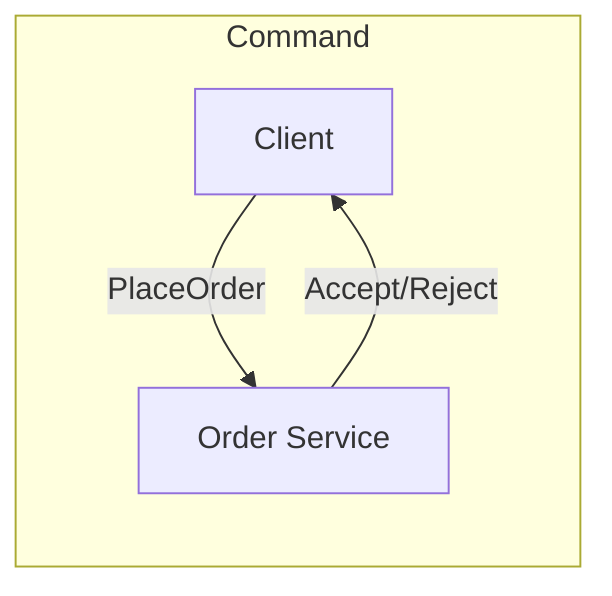
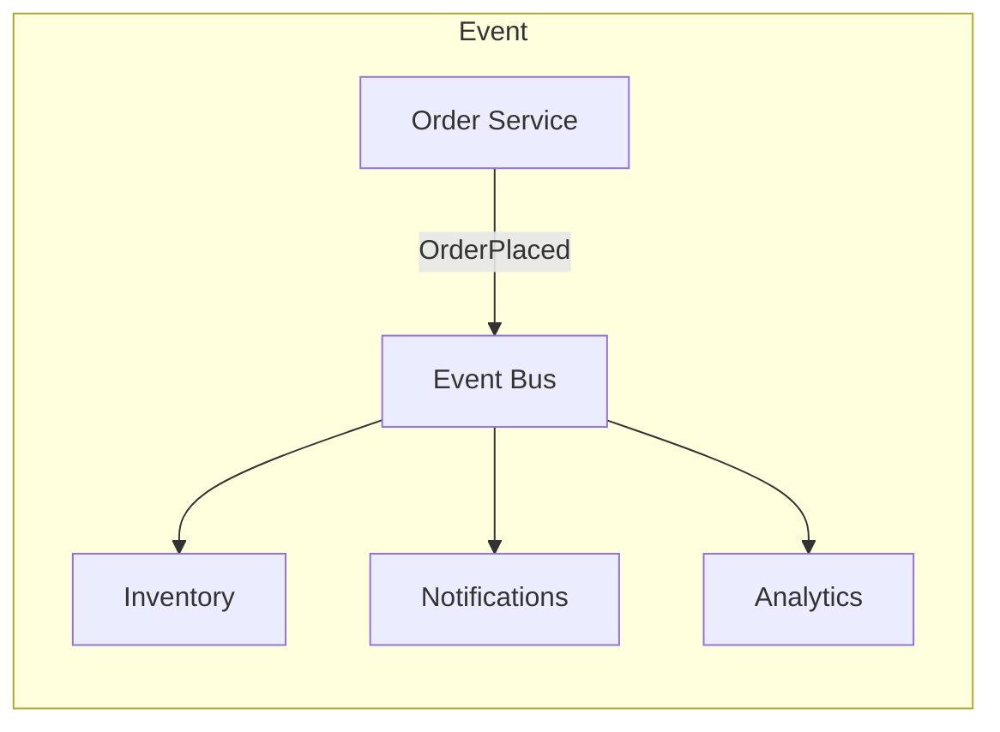
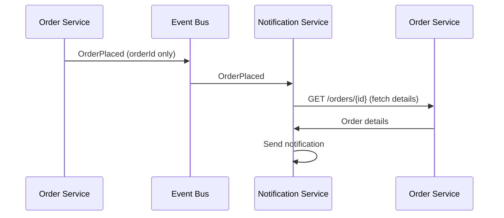
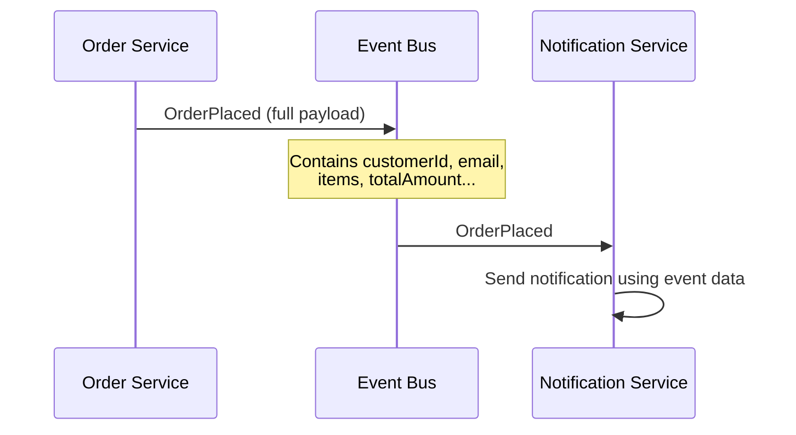
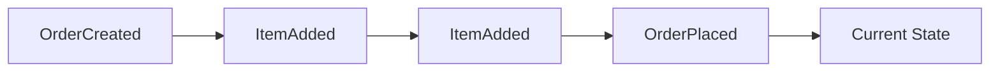
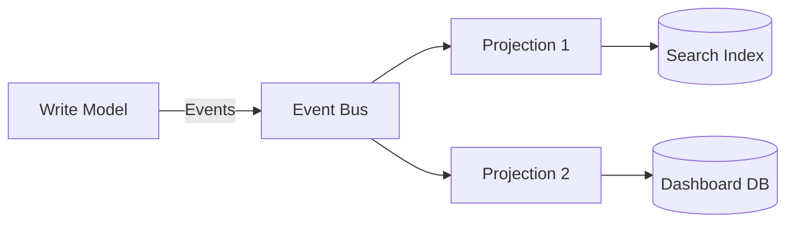
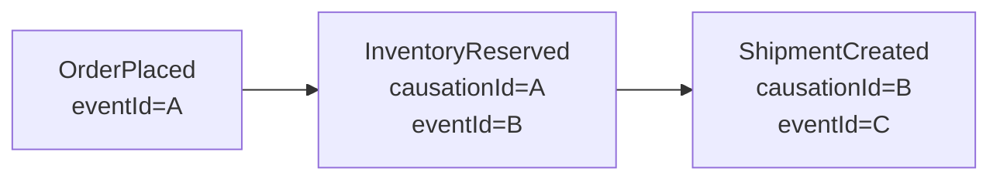

# Event Types and Patterns — Deep Dive

> **Level:** Beginner → Intermediate  
> **Pre-reading:** [04 · Event-Driven Architecture](04-event-driven.md)

---

## What is an Event?

An **event** is a record of something that happened. It's a fact, past-tense, immutable. Events capture state changes in a system.

| Characteristic | Description |
|:---------------|:------------|
| **Past tense** | `OrderPlaced`, `PaymentReceived` |
| **Immutable** | Cannot be changed after creation |
| **Self-contained** | Contains context needed by consumers |
| **Timestamped** | When the event occurred |

---

## Event vs Command vs Query

| Type | Direction | Semantics | Example |
|:-----|:----------|:----------|:--------|
| **Command** | To one target | Request to do something; may fail | `PlaceOrder` |
| **Event** | To any subscriber | Notification of what happened | `OrderPlaced` |
| **Query** | To one target | Request for data; no side effects | `GetOrderStatus` |





!!! tip "Events are past tense; commands are imperative"
    - **Event:** `OrderPlaced` — "This happened"
    - **Command:** `PlaceOrder` — "Do this"

---

## Event Types

### Domain Events

Events that occur within a **bounded context**. They use ubiquitous language and reflect business operations.

```java
public record OrderPlaced(
    OrderId orderId,
    CustomerId customerId,
    List<OrderLineDto> lines,
    Money totalAmount,
    Instant occurredAt
) {}
```

### Integration Events

Domain events **published across service boundaries**. They're the contract between services.

| Aspect | Domain Event | Integration Event |
|:-------|:-------------|:------------------|
| **Scope** | Within bounded context | Across services |
| **Consumer** | Same service handlers | Other services |
| **Schema** | Can change freely | Versioned; backward compatible |
| **Transport** | In-memory | Kafka, RabbitMQ, SQS |

### External Events

Events from **outside your system** — third-party webhooks, partner notifications.

| Source | Event | Handling |
|:-------|:------|:---------|
| **Stripe** | `payment_intent.succeeded` | Webhook receiver |
| **GitHub** | `push` | Webhook endpoint |
| **AWS SNS** | Topic notification | SNS subscriber |

---

## Event-Driven Patterns

### 1. Event Notification

The simplest pattern. Publisher emits an event announcing something happened. Consumers query for details if needed.



| Pros | Cons |
|:-----|:-----|
| Small event payload | Consumer must query back |
| Publisher doesn't predict consumer needs | More network calls |
| Easy to add consumers | Temporal coupling (publisher must be up) |

### 2. Event-Carried State Transfer

Events contain **all the data** consumers need. No follow-up queries.



| Pros | Cons |
|:-----|:-----|
| Consumer is autonomous | Larger event payloads |
| No temporal coupling | Publisher must predict consumer needs |
| Better for data replication | Schema versioning complexity |

### 3. Event Sourcing

Events **are** the source of truth. State is derived by replaying events.



→ **[Deep Dive: Event Sourcing](04.04-event-sourcing.md)**

### 4. CQRS via Events

Write model emits events; read model builds projections.



→ **[Deep Dive: CQRS](04.03-cqrs.md)**

---

## Event Design Best Practices

### Naming Conventions

| Good (Domain Language) | Bad (Technical) |
|:-----------------------|:----------------|
| `OrderPlaced` | `OrderInserted` |
| `PaymentReceived` | `PaymentTableUpdated` |
| `CustomerRegistered` | `UserCreated` |
| `InventoryReserved` | `StockDecremented` |

### Event Structure

```java
public record OrderPlaced(
    // Metadata
    String eventId,           // Unique event identifier
    String eventType,         // "OrderPlaced"
    int version,              // Schema version
    Instant occurredAt,       // When it happened
    String correlationId,     // Trace through system
    String causationId,       // What caused this event
    
    // Payload
    String orderId,
    String customerId,
    BigDecimal totalAmount,
    String currency,
    List<OrderLineDto> items
) {}
```

### Event Payload Guidelines

| Guideline | Rationale |
|:----------|:----------|
| **Include IDs** | Always include aggregate ID |
| **Include timestamp** | When the event occurred |
| **Include relevant data** | What consumers need |
| **Avoid sensitive data** | No passwords, PII unless needed |
| **Keep stable schema** | Version changes carefully |

---

## Event Schema Evolution

Events are contracts. Changes must be backward compatible.

### Safe Changes (Backward Compatible)

| Change | Why Safe |
|:-------|:---------|
| Add optional field | Old consumers ignore it |
| Add new event type | Old consumers don't subscribe |
| Deprecate field (keep present) | Still readable |

### Breaking Changes (Avoid)

| Change | Why Breaking |
|:-------|:-------------|
| Remove field | Old consumers fail |
| Rename field | Old consumers can't read |
| Change field type | Deserialization fails |

### Versioning Strategies

| Strategy | Example |
|:---------|:--------|
| **Version in event** | `"version": 2` in payload |
| **New event type** | `OrderPlacedV2` |
| **Schema Registry** | Avro with compatibility checks |

```java
// Avro schema with Schema Registry
{
  "type": "record",
  "name": "OrderPlaced",
  "namespace": "com.example.events",
  "fields": [
    {"name": "orderId", "type": "string"},
    {"name": "customerId", "type": "string"},
    {"name": "totalAmount", "type": "double"},
    // New optional field (backward compatible)
    {"name": "loyaltyPoints", "type": ["null", "int"], "default": null}
  ]
}
```

---

## Event Ordering and Causality

### Ordering Guarantees

| Scope | Guarantee | How |
|:------|:----------|:----|
| **Per partition** | Total order | Kafka partition key |
| **Per aggregate** | Events in sequence | Same partition key as aggregate ID |
| **Global** | No guarantee | Distributed system; physical clocks differ |

### Causality Tracking

```java
public record InventoryReserved(
    String eventId,
    String causationId,    // Event that caused this: OrderPlaced.eventId
    String correlationId,  // Original request ID
    // ...
) {}
```



---

## Choosing Event Pattern

| Scenario | Pattern |
|:---------|:--------|
| **Simple notification** | Event Notification |
| **Consumer needs autonomy** | Event-Carried State Transfer |
| **Audit trail, time travel** | Event Sourcing |
| **Complex queries, high read volume** | CQRS via Events |

---

??? question "What's the difference between a domain event and an integration event?"
    **Domain events** occur within a bounded context and use internal vocabulary — they can change freely. **Integration events** cross service boundaries and are published contracts — they must be versioned and backward compatible. Integration events often carry more data (event-carried state) to avoid cross-service queries.

??? question "When should you use event-carried state transfer vs. event notification?"
    Use **event-carried state transfer** when consumers need autonomy (function without querying back), when the publisher knows consumer needs, or when you're building replicated read models. Use **event notification** when events are truly minimal, when you want flexibility to add consumers, or when payloads would be huge.

??? question "How do you handle event schema evolution?"
    (1) Use a **Schema Registry** (Confluent, AWS Glue) with compatibility checks. (2) Only make **backward-compatible changes** (add optional fields). (3) **Version events** — include version number or use new event types for breaking changes. (4) **Dual publish** temporarily when migrating. (5) Design consumers to be **tolerant readers** (ignore unknown fields).

