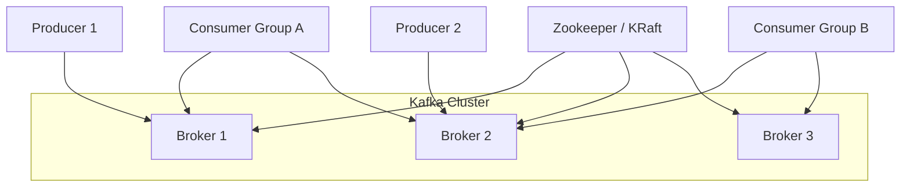
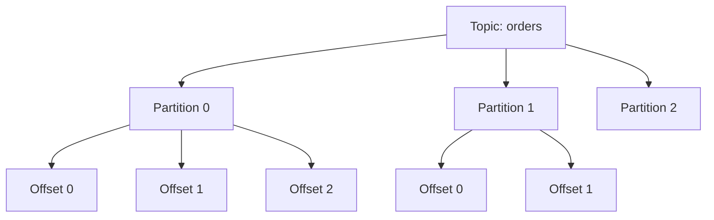
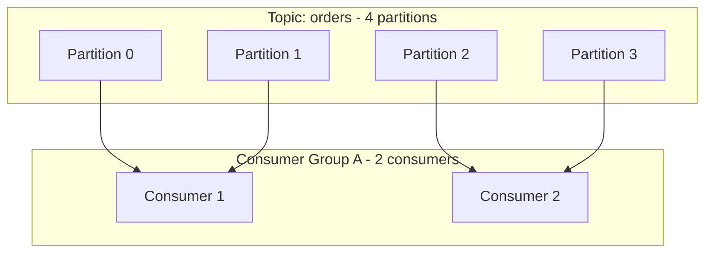
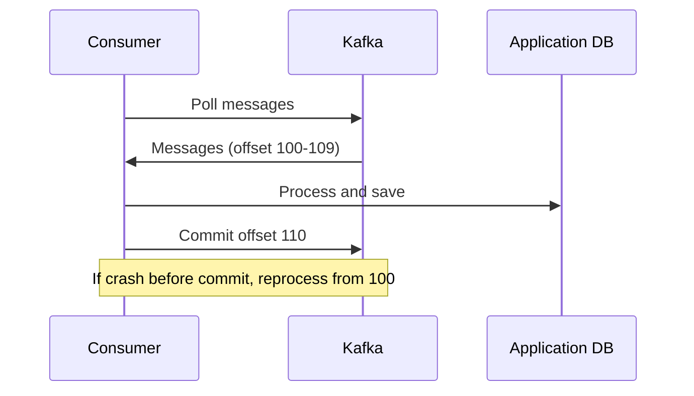
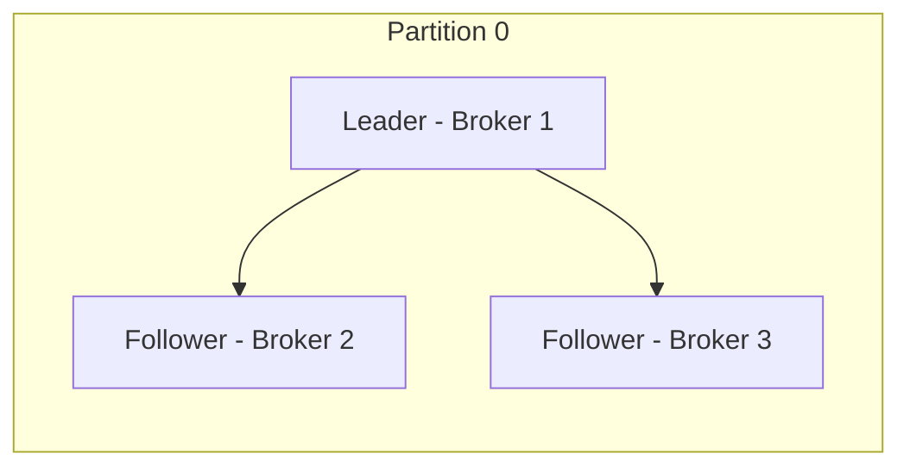
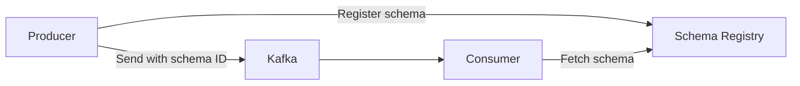
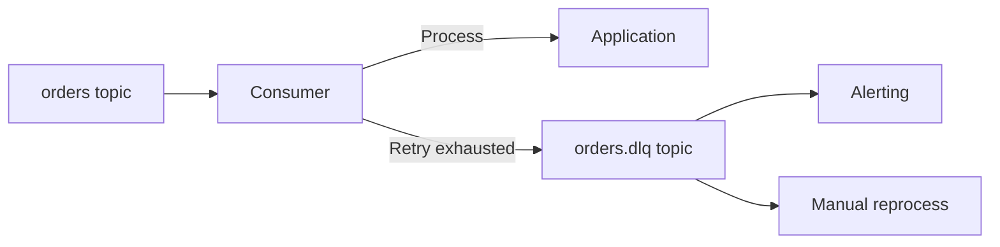

# Kafka Deep Dive

> **Level:** Intermediate  
> **Pre-reading:** [04 · Event-Driven Architecture](04-event-driven.md) · [04.01 · Event Types and Patterns](04.01-event-types-and-patterns.md)

---

## Kafka Architecture Overview

Apache Kafka is a distributed event streaming platform. It's designed for high throughput, durability, and scalability.



---

## Core Concepts

### Topics and Partitions

A **topic** is a named stream of events. Topics are split into **partitions** — ordered, immutable logs.



| Concept | Description |
|:--------|:------------|
| **Topic** | Logical channel; named stream |
| **Partition** | Physical unit; ordered log; parallelism unit |
| **Offset** | Position of message in partition; monotonically increasing |
| **Replication Factor** | Number of copies across brokers |

### Partition Key

The **partition key** determines which partition a message goes to. Messages with the same key always go to the same partition (ordering guaranteed).

```java
// Same orderId always goes to same partition
producer.send(new ProducerRecord<>(
    "orders",           // topic
    order.getId(),      // key (partition key)
    orderEvent          // value
));
```

| Key Strategy | Use Case |
|:-------------|:---------|
| **Entity ID** | Order ID, Customer ID — events for same entity ordered |
| **Random/null** | Load distribution; no ordering needed |
| **Region/tenant** | Shard by geography or tenant |

---

## Producers

Producers write messages to topics.

### Producer Configuration

| Config | Purpose | Recommendation |
|:-------|:--------|:---------------|
| `acks` | Acknowledgment level | `all` for durability |
| `retries` | Retry count | High (e.g., 10) |
| `enable.idempotence` | Prevent duplicates | `true` |
| `batch.size` | Batch messages | Tune for throughput |
| `linger.ms` | Wait to batch | 5–10ms for throughput |

### Acknowledgment Levels

| `acks` | Behavior | Durability | Latency |
|:-------|:---------|:-----------|:--------|
| `0` | Fire and forget | None | Lowest |
| `1` | Leader acknowledged | Medium | Medium |
| `all` | All replicas acknowledged | Highest | Highest |

```java
Properties props = new Properties();
props.put("bootstrap.servers", "kafka:9092");
props.put("acks", "all");
props.put("enable.idempotence", "true");
props.put("retries", 10);
props.put("key.serializer", StringSerializer.class);
props.put("value.serializer", KafkaAvroSerializer.class);

KafkaProducer<String, OrderEvent> producer = new KafkaProducer<>(props);
```

---

## Consumers and Consumer Groups

### Consumer Groups

A **consumer group** is a set of consumers that cooperatively consume a topic. Each partition is consumed by exactly one consumer in the group.



### Consumer Configuration

| Config | Purpose | Recommendation |
|:-------|:--------|:---------------|
| `group.id` | Consumer group identifier | Unique per logical consumer |
| `auto.offset.reset` | Where to start on new group | `earliest` or `latest` |
| `enable.auto.commit` | Auto-commit offsets | `false` for reliability |
| `max.poll.records` | Records per poll | Tune for processing time |
| `session.timeout.ms` | Heartbeat timeout | 10–30 seconds |

### Offset Management



**Manual commit for reliability:**

```java
while (true) {
    ConsumerRecords<String, OrderEvent> records = consumer.poll(Duration.ofMillis(100));
    for (ConsumerRecord<String, OrderEvent> record : records) {
        processEvent(record.value());  // Process
    }
    consumer.commitSync();  // Commit after processing
}
```

---

## Delivery Guarantees

| Guarantee | Description | Configuration |
|:----------|:------------|:--------------|
| **At most once** | May lose; no duplicates | Auto-commit; `acks=0` |
| **At least once** | May duplicate; no loss | Manual commit; `acks=all`; idempotent consumer |
| **Exactly once** | No loss; no duplicates | Transactions + idempotent processing |

### Achieving Exactly-Once

```java
// Producer side: enable transactions
props.put("enable.idempotence", "true");
props.put("transactional.id", "order-processor");

// Consumer side: read committed only
props.put("isolation.level", "read_committed");
```

!!! warning "Exactly-once is expensive"
    True exactly-once requires transactions and adds latency. Often, **at-least-once with idempotent consumers** is simpler and sufficient.

### Idempotent Consumer Pattern

```java
public void processEvent(OrderEvent event) {
    // Check if already processed
    if (processedEventRepository.exists(event.getEventId())) {
        return;  // Skip duplicate
    }
    
    // Process
    orderService.processOrder(event);
    
    // Mark as processed
    processedEventRepository.save(event.getEventId());
}
```

---

## Replication and Fault Tolerance

### ISR — In-Sync Replicas

| Concept | Description |
|:--------|:------------|
| **Leader** | Handles reads/writes for partition |
| **Follower** | Replicates from leader |
| **ISR** | Replicas caught up to leader |
| **min.insync.replicas** | Minimum ISR for `acks=all` |



### Recommended Configuration

```properties
# Topic configuration
replication.factor=3
min.insync.replicas=2

# Producer
acks=all
```

With this config: 3 replicas, writes succeed if at least 2 (including leader) acknowledge. Survives 1 broker failure.

---

## Schema Registry

Centralized schema management for Avro, Protobuf, or JSON Schema.



### Benefits

| Benefit | Description |
|:--------|:------------|
| **Schema validation** | Reject messages that don't conform |
| **Compatibility checks** | Prevent breaking changes |
| **Schema evolution** | Track schema versions |
| **Efficient serialization** | Schema ID in message, not full schema |

### Compatibility Modes

| Mode | Can Add Fields | Can Remove Fields |
|:-----|:---------------|:------------------|
| **BACKWARD** | With defaults | Optional only |
| **FORWARD** | Required only | Any |
| **FULL** | With defaults | Optional only |
| **NONE** | Any | Any |

---

## Dead Letter Queue (DLQ)

Handle messages that fail processing after max retries.



```java
public void processWithRetry(ConsumerRecord<String, OrderEvent> record) {
    int retries = 0;
    while (retries < MAX_RETRIES) {
        try {
            process(record.value());
            return;
        } catch (RetryableException e) {
            retries++;
            backoff(retries);
        }
    }
    // Send to DLQ
    dlqProducer.send(new ProducerRecord<>("orders.dlq", record.key(), record.value()));
}
```

---

## Kafka vs Alternatives

| Aspect | Kafka | RabbitMQ | AWS SQS |
|:-------|:------|:---------|:--------|
| **Model** | Log-based | Queue-based | Queue-based |
| **Ordering** | Per partition | Per queue (with caveats) | FIFO queues only |
| **Retention** | Time/size-based | Until consumed | 14 days max |
| **Replay** | Yes | No | No |
| **Throughput** | Very high | High | Moderate |
| **Managed** | Confluent, MSK | CloudAMQP | Native AWS |

---

## Kafka Best Practices

| Area | Recommendation |
|:-----|:---------------|
| **Partitions** | Start with #partitions = expected consumers |
| **Keys** | Use entity ID for ordering; null for load distribution |
| **Serialization** | Avro + Schema Registry for contracts |
| **Retention** | Set based on replay needs |
| **Monitoring** | Consumer lag, under-replicated partitions |
| **Idempotency** | Design idempotent consumers |

---

??? question "How many partitions should a topic have?"
    Start with **number of partitions = expected maximum consumers**. More partitions = more parallelism but more overhead. You can increase partitions later, but messages with the same key may go to different partitions after. Typical: 6–12 for moderate load; 50+ for high-throughput.

??? question "What happens when a Kafka consumer crashes?"
    The consumer group **rebalances**. Partitions assigned to the crashed consumer are redistributed to remaining consumers. Uncommitted offsets are replayed (at-least-once). If using auto-commit, some messages may be lost (at-most-once). Design consumers to be idempotent.

??? question "How does Kafka achieve exactly-once semantics?"
    (1) **Idempotent producer**: Each message has sequence number; broker deduplicates. (2) **Transactions**: Atomic writes across partitions and consumer offset commits. (3) **Read committed**: Consumers only see committed transaction messages. (4) **Idempotent consumer**: Application-level deduplication for full exactly-once.

