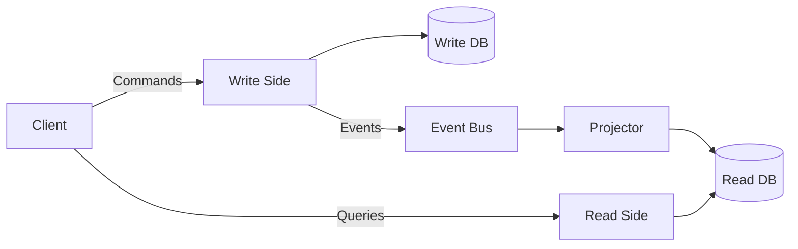
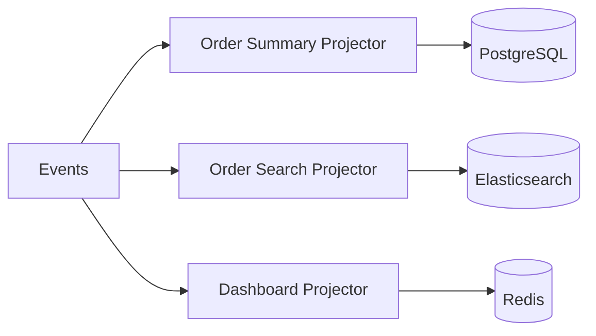
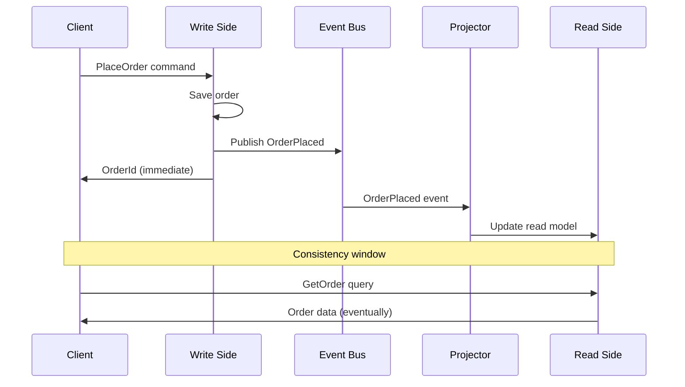
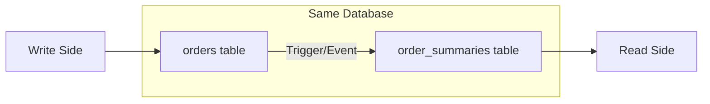
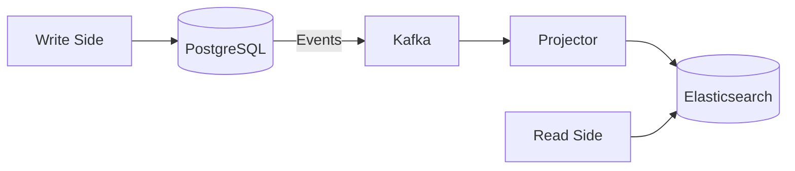
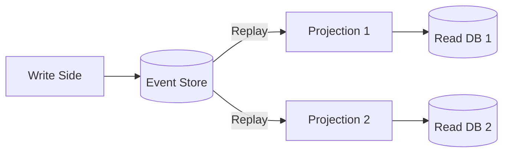
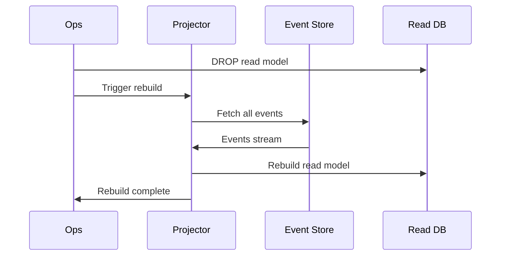

# CQRS — Deep Dive

> **Level:** Intermediate  
> **Pre-reading:** [04 · Event-Driven Architecture](04-event-driven.md) · [03.03 · Data Management Patterns](03.03-data-management-patterns.md)

---

## What is CQRS?

**CQRS** (Command Query Responsibility Segregation) separates the write model from the read model. Each is optimized for its purpose.



---

## Why CQRS?

| Challenge | CQRS Solution |
|:----------|:--------------|
| Read/write optimization conflict | Separate models; optimize each |
| Complex queries across aggregates | Denormalized read models |
| Different scaling needs | Scale read side independently |
| Multiple view requirements | Multiple projections |

### When CQRS Makes Sense

| Good Fit | Poor Fit |
|:---------|:---------|
| High read/write ratio (10:1 or more) | Simple CRUD |
| Complex queries | Single model suffices |
| Different scaling needs | Small scale |
| Multiple read representations | Team unfamiliar with pattern |

---

## CQRS Components

### Command Side (Write Model)

Handles state changes. Focuses on business rules and invariants.

```java
// Command
public record PlaceOrderCommand(
    String customerId,
    List<OrderLineDto> items
) {}

// Command Handler
@Service
public class OrderCommandHandler {
    private final OrderRepository repository;
    private final EventPublisher publisher;
    
    @Transactional
    public OrderId handle(PlaceOrderCommand cmd) {
        // Business logic
        Order order = Order.create(cmd.customerId(), cmd.items());
        order.validate();  // Invariants
        
        // Persist
        repository.save(order);
        
        // Publish event (or via Outbox)
        publisher.publish(new OrderPlaced(order));
        
        return order.getId();
    }
}
```

### Query Side (Read Model)

Handles queries. Optimized for specific read patterns.

```java
// Query
public record GetOrderSummaryQuery(String orderId) {}

// Query Handler
@Service
public class OrderQueryHandler {
    private final OrderReadRepository readRepository;
    
    public OrderSummaryDto handle(GetOrderSummaryQuery query) {
        return readRepository.findSummaryById(query.orderId())
            .orElseThrow(() -> new OrderNotFoundException(query.orderId()));
    }
}
```

### Event Projector

Consumes events and updates read models.

```java
@Component
public class OrderProjector {
    private final OrderReadRepository readRepository;
    
    @EventListener
    public void on(OrderPlaced event) {
        OrderReadModel readModel = new OrderReadModel(
            event.orderId(),
            event.customerId(),
            event.totalAmount(),
            "PLACED",
            event.occurredAt()
        );
        readRepository.save(readModel);
    }
    
    @EventListener
    public void on(OrderShipped event) {
        OrderReadModel model = readRepository.findById(event.orderId());
        model.setStatus("SHIPPED");
        model.setShippedAt(event.occurredAt());
        readRepository.save(model);
    }
}
```

---

## Read Model Strategies

### Single Denormalized Table

Flatten related data into one table for fast queries.

```sql
-- Write side: normalized
orders (id, customer_id, status, created_at)
order_lines (id, order_id, product_id, quantity, price)
customers (id, name, email)
products (id, name, sku)

-- Read side: denormalized
order_summaries (
    order_id,
    customer_name,
    customer_email,
    status,
    total_amount,
    item_count,
    created_at,
    shipped_at
)
```

### Multiple Projections

Different read models for different query patterns.



| Projection | Storage | Use Case |
|:-----------|:--------|:---------|
| **Order Summary** | PostgreSQL | Order detail page |
| **Order Search** | Elasticsearch | Full-text search |
| **Dashboard** | Redis | Real-time metrics |
| **Reporting** | Data warehouse | Analytics |

### Materialized Views

Database-level projections. Simpler but less flexible.

```sql
CREATE MATERIALIZED VIEW order_dashboard AS
SELECT 
    date_trunc('day', created_at) as day,
    status,
    COUNT(*) as order_count,
    SUM(total_amount) as revenue
FROM orders
GROUP BY 1, 2;

-- Refresh periodically or via trigger
REFRESH MATERIALIZED VIEW order_dashboard;
```

---

## Eventual Consistency

Read models are **eventually consistent** with the write model. There's a lag between write and read.



### Handling Consistency Lag

| Strategy | Implementation |
|:---------|:---------------|
| **Optimistic UI** | Show expected state; reconcile later |
| **Read-your-writes** | Query write model for just-created data |
| **Polling** | Client polls until read model updated |
| **WebSocket** | Push notification when projection ready |
| **Timestamps** | Client sends last-known version; wait if stale |

---

## CQRS Implementation Patterns

### Same Database, Different Tables

Simplest approach. Events sync tables in same database.



### Separate Databases

Full separation. Different databases optimized per side.



### CQRS + Event Sourcing

Events are the write model's source of truth. Read models are projections of events.



---

## Rebuilding Projections

Read models can be rebuilt from events. Useful for:

- Fixing bugs in projection logic
- Adding new projections
- Recovery from corruption



### Rebuild Considerations

| Concern | Mitigation |
|:--------|:-----------|
| **Long rebuild time** | Parallel processing; checkpointing |
| **Missing events** | Event store must retain all events |
| **Schema changes** | Event versioning; upcasting |
| **Downtime** | Blue-green read models |

---

## CQRS Without Events

CQRS doesn't require event sourcing. You can sync read models via:

| Method | Description |
|:-------|:------------|
| **Database triggers** | Trigger updates read table on write |
| **Scheduled sync** | Periodic job syncs data |
| **Change Data Capture** | Debezium captures changes |
| **Application-level** | Code updates both models |

```java
// Application-level sync (simpler, but coupled)
@Transactional
public void placeOrder(PlaceOrderCommand cmd) {
    Order order = Order.create(cmd);
    writeRepository.save(order);
    
    // Update read model in same transaction
    OrderSummary summary = OrderSummary.from(order);
    readRepository.save(summary);
}
```

---

## CQRS Trade-offs

| Benefit | Cost |
|:--------|:-----|
| Optimized read performance | Two models to maintain |
| Independent scaling | Eventual consistency |
| Flexible query patterns | Increased complexity |
| Right storage per use case | More infrastructure |
| Audit-friendly | Steeper learning curve |

---

## CQRS in Spring Boot

```java
// Command side
@RestController
@RequestMapping("/orders")
public class OrderCommandController {
    private final OrderCommandHandler handler;
    
    @PostMapping
    public ResponseEntity<OrderIdResponse> placeOrder(@RequestBody PlaceOrderRequest request) {
        OrderId id = handler.handle(request.toCommand());
        return ResponseEntity.created(URI.create("/orders/" + id)).body(new OrderIdResponse(id));
    }
}

// Query side
@RestController
@RequestMapping("/orders")
public class OrderQueryController {
    private final OrderQueryHandler handler;
    
    @GetMapping("/{id}")
    public OrderSummaryDto getOrder(@PathVariable String id) {
        return handler.handle(new GetOrderSummaryQuery(id));
    }
    
    @GetMapping("/search")
    public List<OrderSummaryDto> search(@RequestParam String q) {
        return handler.handle(new SearchOrdersQuery(q));
    }
}
```

---

??? question "When should you use CQRS?"
    Use CQRS when: (1) Read/write ratio is high (10:1+). (2) You need complex queries across multiple aggregates. (3) Read and write have different scaling needs. (4) You need multiple read representations (list, search, dashboard). Avoid CQRS for simple CRUD or when the team is unfamiliar with eventual consistency.

??? question "How do you handle eventual consistency in CQRS?"
    (1) **Optimistic UI**: Show expected state immediately; reconcile if different. (2) **Polling**: Client polls read side until updated. (3) **WebSocket**: Push notification when projection complete. (4) **Read-your-writes**: For just-created entities, query write side directly. (5) **Accept it**: Many use cases tolerate slight delay.

??? question "Do you need event sourcing to use CQRS?"
    No. CQRS separates read and write models — that's independent of how you persist writes. You can use CQRS with a traditional relational database and sync read models via triggers, CDC, or application code. Event sourcing is complementary but optional.

