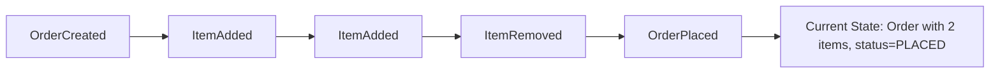
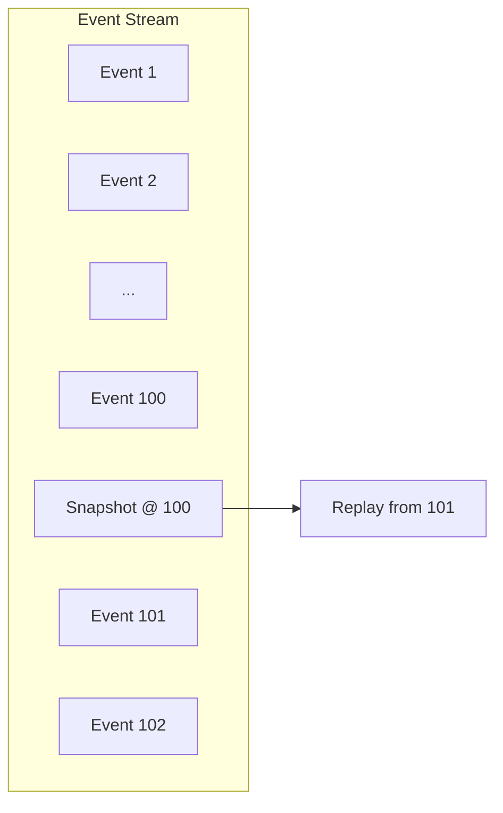
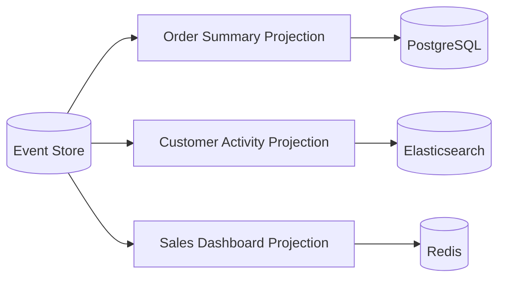

# Event Sourcing — Deep Dive

> **Level:** Advanced  
> **Pre-reading:** [04 · Event-Driven Architecture](04-event-driven.md) · [04.03 · CQRS](04.03-cqrs.md)

---

## What is Event Sourcing?

**Event Sourcing** stores all changes to application state as a sequence of events. The current state is derived by replaying events.



| Traditional | Event Sourcing |
|:------------|:---------------|
| Store current state only | Store all events |
| UPDATE overwrites history | Events are immutable |
| "What is the state?" | "How did we get here?" |
| Audit trail separate | Audit built-in |

---

## Event Store

The **event store** is an append-only log of events, partitioned by aggregate.

```sql
CREATE TABLE event_store (
    id BIGSERIAL PRIMARY KEY,
    aggregate_id UUID NOT NULL,
    aggregate_type VARCHAR(255) NOT NULL,
    event_type VARCHAR(255) NOT NULL,
    event_data JSONB NOT NULL,
    version INT NOT NULL,
    occurred_at TIMESTAMP NOT NULL,
    
    UNIQUE (aggregate_id, version)  -- Optimistic concurrency
);
```

### Event Structure

```java
public record StoredEvent(
    UUID id,
    UUID aggregateId,
    String aggregateType,
    String eventType,
    String eventData,        // Serialized event
    int version,             // Aggregate version
    Instant occurredAt,
    Map<String, String> metadata  // correlationId, causationId
) {}
```

### Append-Only Semantics

```java
public interface EventStore {
    // Append events (expects version for optimistic concurrency)
    void append(UUID aggregateId, List<DomainEvent> events, int expectedVersion);
    
    // Load events for an aggregate
    List<StoredEvent> load(UUID aggregateId);
    
    // Load events from a position (for projections)
    List<StoredEvent> loadFrom(long position, int batchSize);
}
```

---

## Reconstructing State

To get current state, **replay** all events for the aggregate.

```java
public class Order {
    private OrderId id;
    private CustomerId customerId;
    private List<OrderLine> lines = new ArrayList<>();
    private OrderStatus status;
    private int version;
    
    // Apply events to build state
    public void apply(OrderCreated event) {
        this.id = event.orderId();
        this.customerId = event.customerId();
        this.status = OrderStatus.DRAFT;
    }
    
    public void apply(ItemAdded event) {
        this.lines.add(new OrderLine(event.productId(), event.quantity(), event.price()));
    }
    
    public void apply(ItemRemoved event) {
        this.lines.removeIf(l -> l.productId().equals(event.productId()));
    }
    
    public void apply(OrderPlaced event) {
        this.status = OrderStatus.PLACED;
    }
    
    // Reconstruct from events
    public static Order fromEvents(List<DomainEvent> events) {
        Order order = new Order();
        for (DomainEvent event : events) {
            order.apply(event);
            order.version++;
        }
        return order;
    }
}
```

### Repository Pattern

```java
public class EventSourcedOrderRepository {
    private final EventStore eventStore;
    
    public Order load(OrderId id) {
        List<StoredEvent> events = eventStore.load(id.value());
        if (events.isEmpty()) {
            throw new OrderNotFoundException(id);
        }
        return Order.fromEvents(deserializeEvents(events));
    }
    
    public void save(Order order) {
        List<DomainEvent> newEvents = order.getUncommittedEvents();
        eventStore.append(order.getId().value(), newEvents, order.getVersion());
        order.markEventsCommitted();
    }
}
```

---

## Snapshots

Replaying thousands of events is slow. **Snapshots** cache state at a point in time.



### Snapshot Implementation

```java
public class SnapshotStore {
    void save(UUID aggregateId, int version, String serializedState);
    Optional<Snapshot> load(UUID aggregateId);
}

public Order load(OrderId id) {
    Optional<Snapshot> snapshot = snapshotStore.load(id.value());
    
    int fromVersion;
    Order order;
    
    if (snapshot.isPresent()) {
        order = deserialize(snapshot.get().state());
        fromVersion = snapshot.get().version() + 1;
    } else {
        order = new Order();
        fromVersion = 0;
    }
    
    List<StoredEvent> events = eventStore.loadFrom(id.value(), fromVersion);
    for (StoredEvent event : events) {
        order.apply(deserialize(event));
    }
    
    return order;
}
```

### Snapshot Strategies

| Strategy | When to Snapshot |
|:---------|:-----------------|
| **Every N events** | After 100 events |
| **Time-based** | Every hour |
| **On read** | If replay takes > X ms |
| **On write** | When version % N == 0 |

---

## Projections

**Projections** are read models built from events. They're independent views of the event stream.



### Projection Handler

```java
@Component
public class OrderSummaryProjection {
    private final OrderSummaryRepository repository;
    private long lastProcessedPosition;
    
    @Scheduled(fixedDelay = 100)
    public void process() {
        List<StoredEvent> events = eventStore.loadFrom(lastProcessedPosition, 100);
        
        for (StoredEvent event : events) {
            switch (event.eventType()) {
                case "OrderCreated" -> createSummary(event);
                case "OrderPlaced" -> updateStatus(event, "PLACED");
                case "OrderShipped" -> updateStatus(event, "SHIPPED");
            }
            lastProcessedPosition = event.id();
        }
        
        saveCheckpoint(lastProcessedPosition);
    }
}
```

### Projection Characteristics

| Characteristic | Implication |
|:---------------|:------------|
| **Async** | Eventually consistent |
| **Rebuildable** | Can recreate from events |
| **Independent** | Each projection has own schema |
| **Additive** | Add new projections anytime |

---

## Event Versioning

Events are immutable, but requirements change. Handle schema evolution.

### Upcasting

Transform old events to new schema at read time.

```java
public class EventUpcaster {
    public DomainEvent upcast(StoredEvent stored) {
        if (stored.eventType().equals("OrderCreated") && stored.version() == 1) {
            // V1 didn't have currency, default to USD
            OrderCreatedV1 v1 = deserialize(stored, OrderCreatedV1.class);
            return new OrderCreatedV2(v1.orderId(), v1.customerId(), v1.amount(), "USD");
        }
        return deserialize(stored);
    }
}
```

### Event Type Versioning

```java
// V1 of the event
public record OrderCreated(OrderId orderId, CustomerId customerId, BigDecimal amount) {}

// V2 adds currency
public record OrderCreatedV2(OrderId orderId, CustomerId customerId, Money amount) {}
```

### Migration Strategies

| Strategy | Description |
|:---------|:------------|
| **Upcasting** | Transform at read time; lazy |
| **Copy-transform** | Migrate to new event stream |
| **Dual write** | Write both versions temporarily |
| **Version field** | Include version in event |

---

## Concurrency Control

Prevent concurrent modifications to same aggregate.

### Optimistic Locking

```java
public void append(UUID aggregateId, List<Event> events, int expectedVersion) {
    int actualVersion = getLatestVersion(aggregateId);
    if (actualVersion != expectedVersion) {
        throw new ConcurrencyException("Expected version " + expectedVersion 
            + " but was " + actualVersion);
    }
    // Proceed with append
}
```

### Handling Conflicts

```java
public void save(Order order) {
    try {
        eventStore.append(order.getId(), order.getUncommittedEvents(), order.getVersion());
    } catch (ConcurrencyException e) {
        // Reload and retry (or fail)
        Order fresh = load(order.getId());
        // Re-apply command on fresh aggregate
    }
}
```

---

## When to Use Event Sourcing

### Good Fit

| Scenario | Why Event Sourcing Helps |
|:---------|:-------------------------|
| **Audit requirements** | Full history built-in |
| **Regulatory compliance** | Immutable, verifiable log |
| **Complex state machines** | Easier to reason about transitions |
| **Debugging** | "Time travel" to any point |
| **Multiple projections** | Build any view from events |
| **Event-driven architecture** | Events are the data model |

### Poor Fit

| Scenario | Why Not |
|:---------|:--------|
| **Simple CRUD** | Overkill; just use a database |
| **Team unfamiliar** | High learning curve |
| **High frequency updates** | Event volume explosion |
| **No audit needs** | Complexity not justified |

---

## Event Sourcing Challenges

| Challenge | Mitigation |
|:----------|:-----------|
| **Replay time** | Snapshots |
| **Event schema evolution** | Upcasting, versioning |
| **Eventual consistency** | CQRS read models |
| **Complexity** | Start simple; evolve |
| **Debugging** | Good tooling; event browser |
| **Storage growth** | Archiving; compaction (careful!) |

---

## Event Sourcing Frameworks

| Framework | Language | Notes |
|:----------|:---------|:------|
| **Axon Framework** | Java | Full CQRS + ES; saga support |
| **EventStoreDB** | Any | Purpose-built event database |
| **Marten** | .NET | PostgreSQL-based |
| **Eventuous** | .NET | Lightweight; EventStoreDB |
| **eventstore** | Node.js | EventStoreDB client |

---

??? question "What's the difference between Event Sourcing and CQRS?"
    **Event Sourcing** is about storing events as the source of truth and deriving state by replay. **CQRS** is about separating read and write models. They're often used together (events feed projections) but are independent patterns. You can use CQRS without Event Sourcing and vice versa.

??? question "How do you handle event schema changes in Event Sourcing?"
    (1) **Upcasting**: Transform old events to new schema at read time. (2) **Versioned events**: Include version number; handle each version. (3) **New event types**: Introduce `OrderCreatedV2` instead of changing `OrderCreated`. (4) **Copy-transform**: Migrate entire stream (expensive; rarely needed). Always design events with evolution in mind.

??? question "How do you prevent replay from taking too long?"
    (1) **Snapshots**: Store state periodically; replay only from last snapshot. (2) **Smaller aggregates**: Fewer events per aggregate. (3) **Projection checkpoints**: Read models track their position; don't replay fully. (4) **Parallel replay**: Multiple projections process in parallel. (5) **In-memory caching**: Keep hot aggregates loaded.

