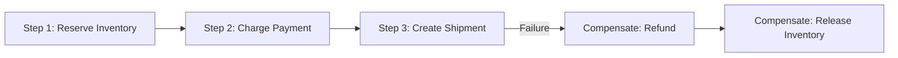
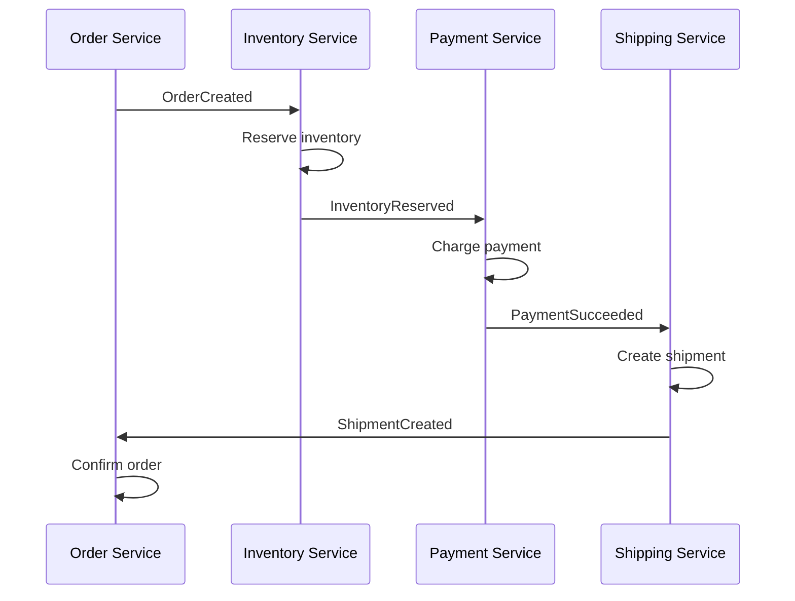
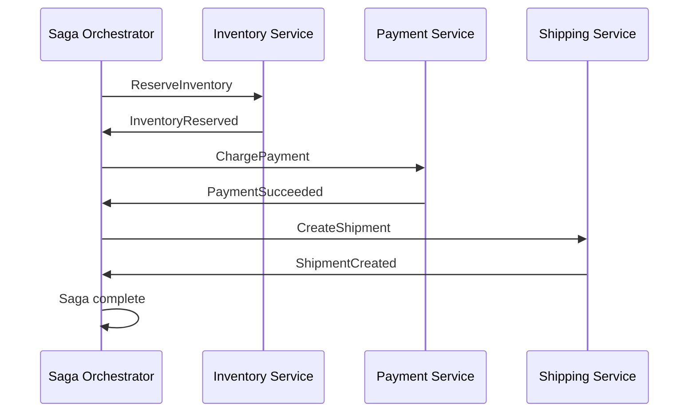
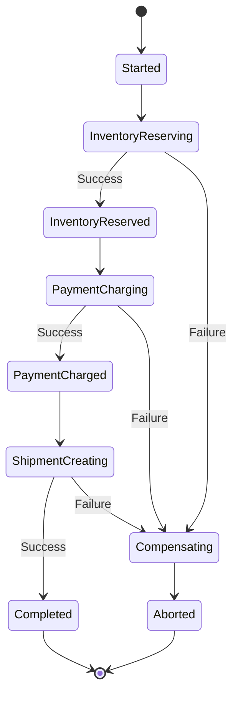
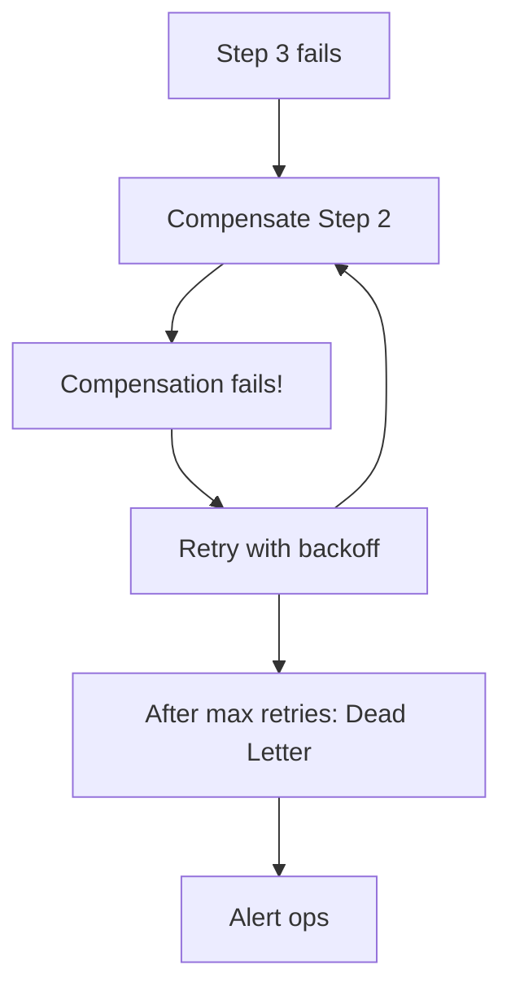

# Saga Pattern — Deep Dive

> **Level:** Advanced  
> **Pre-reading:** [04 · Event-Driven Architecture](04-event-driven.md) · [03.04 · Saga and Outbox Patterns](03.04-saga-and-outbox.md)

---

## The Problem: Distributed Transactions

Microservices each have their own database. Traditional ACID transactions don't work across service boundaries. Two-Phase Commit (2PC) blocks and reduces availability.

**Solution:** The Saga pattern — a sequence of local transactions coordinated by messages.

---

## Saga Definition

A **saga** is a sequence of local transactions where:

- Each step is a local ACID transaction
- Each step publishes events/commands to trigger the next step
- Each step has a **compensating transaction** to undo on failure



---

## Choreography vs Orchestration

### Choreography

Services communicate via events. Each service decides what to do next based on events it receives.



### Orchestration

A central **saga orchestrator** tells each service what to do and handles responses.



### Comparison

| Aspect | Choreography | Orchestration |
|:-------|:-------------|:--------------|
| **Coupling** | Loose; services independent | Tighter; orchestrator knows all |
| **Visibility** | Hard to see full flow | Clear in orchestrator |
| **Single point of failure** | None | Orchestrator |
| **Complexity** | Distributed; harder to trace | Centralized; easier to manage |
| **Testing** | Harder | Easier |
| **Best for** | Simple flows (2-4 steps) | Complex flows (5+ steps) |

---

## Compensating Transactions

Compensations **undo** the effects of a step. They're not rollbacks — they're new transactions that reverse the business effect.

### Compensation Design

| Forward Action | Compensation | Considerations |
|:---------------|:-------------|:---------------|
| Create order | Cancel order | Don't delete; mark cancelled |
| Reserve inventory | Release inventory | Handle partial reservations |
| Charge payment | Issue refund | May take days to process |
| Send confirmation email | Send cancellation email | Can't unsend; send follow-up |
| Create shipment | Cancel shipment | May not be possible if shipped |

### Compensation Rules

| Rule | Rationale |
|:-----|:----------|
| **Idempotent** | Safe to execute multiple times |
| **Eventually succeed** | Retry until done |
| **Semantic reversal** | May not be exact undo |
| **Order matters** | Compensate in reverse order |

---

## Saga State Machine

A saga transitions through states:



### State Persistence

```java
public class OrderSaga {
    private String sagaId;
    private String orderId;
    private SagaState state;
    private List<SagaStep> completedSteps;
    private String failureReason;
    private Instant startedAt;
    private Instant completedAt;
    
    public enum SagaState {
        STARTED,
        INVENTORY_RESERVING,
        INVENTORY_RESERVED,
        PAYMENT_CHARGING,
        PAYMENT_CHARGED,
        SHIPMENT_CREATING,
        COMPLETED,
        COMPENSATING,
        ABORTED
    }
}
```

---

## Orchestration Implementation

### Orchestrator Service

```java
@Service
public class OrderSagaOrchestrator {
    private final SagaRepository sagaRepository;
    private final InventoryClient inventoryClient;
    private final PaymentClient paymentClient;
    private final ShippingClient shippingClient;
    
    public void start(PlaceOrderCommand command) {
        OrderSaga saga = OrderSaga.create(command);
        sagaRepository.save(saga);
        
        executeStep(saga, this::reserveInventory);
    }
    
    private void reserveInventory(OrderSaga saga) {
        try {
            inventoryClient.reserve(saga.getOrderId(), saga.getItems());
            saga.inventoryReserved();
            executeStep(saga, this::chargePayment);
        } catch (Exception e) {
            saga.startCompensation(e.getMessage());
            compensate(saga);
        }
    }
    
    private void chargePayment(OrderSaga saga) {
        try {
            paymentClient.charge(saga.getOrderId(), saga.getAmount());
            saga.paymentCharged();
            executeStep(saga, this::createShipment);
        } catch (Exception e) {
            saga.startCompensation(e.getMessage());
            compensate(saga);
        }
    }
    
    private void compensate(OrderSaga saga) {
        for (SagaStep step : saga.getCompletedStepsReversed()) {
            executeCompensation(step);
        }
        saga.abort();
        sagaRepository.save(saga);
    }
}
```

### Async Orchestrator with Events

```java
@Component
public class OrderSagaEventHandler {
    private final SagaRepository sagaRepository;
    private final CommandGateway commandGateway;
    
    @EventHandler
    public void on(InventoryReserved event) {
        OrderSaga saga = sagaRepository.findByOrderId(event.orderId());
        saga.inventoryReserved();
        
        commandGateway.send(new ChargePaymentCommand(
            saga.getOrderId(),
            saga.getAmount()
        ));
        
        sagaRepository.save(saga);
    }
    
    @EventHandler
    public void on(PaymentFailed event) {
        OrderSaga saga = sagaRepository.findByOrderId(event.orderId());
        saga.startCompensation(event.reason());
        
        commandGateway.send(new ReleaseInventoryCommand(saga.getOrderId()));
        
        sagaRepository.save(saga);
    }
}
```

---

## Choreography Implementation

### Service Reacting to Events

```java
// Inventory Service
@Component
public class InventoryEventHandler {
    @EventListener
    public void on(OrderCreated event) {
        try {
            inventory.reserve(event.orderId(), event.items());
            eventPublisher.publish(new InventoryReserved(event.orderId()));
        } catch (InsufficientStockException e) {
            eventPublisher.publish(new InventoryReservationFailed(event.orderId(), e.getMessage()));
        }
    }
    
    @EventListener
    public void on(PaymentFailed event) {
        inventory.release(event.orderId());
        eventPublisher.publish(new InventoryReleased(event.orderId()));
    }
}

// Payment Service
@Component
public class PaymentEventHandler {
    @EventListener
    public void on(InventoryReserved event) {
        try {
            payment.charge(event.orderId());
            eventPublisher.publish(new PaymentSucceeded(event.orderId()));
        } catch (PaymentException e) {
            eventPublisher.publish(new PaymentFailed(event.orderId(), e.getMessage()));
        }
    }
}
```

---

## Saga Frameworks and Tools

| Tool | Type | Description |
|:-----|:-----|:------------|
| **Temporal.io** | Orchestration | Durable workflows; code-based; handles failures |
| **AWS Step Functions** | Orchestration | Serverless; state machine; AWS native |
| **Camunda** | Orchestration | BPMN-based; visual designer |
| **Axon Framework** | Both | Java; saga + event sourcing |
| **Netflix Conductor** | Orchestration | JSON-based workflow definition |
| **Eventuate Tram** | Choreography | Java; outbox-based messaging |

### Temporal Example

```java
@WorkflowInterface
public interface OrderSagaWorkflow {
    @WorkflowMethod
    void execute(PlaceOrderCommand command);
}

@WorkflowImplementation
public class OrderSagaWorkflowImpl implements OrderSagaWorkflow {
    private final InventoryActivity inventory = Workflow.newActivityStub(InventoryActivity.class);
    private final PaymentActivity payment = Workflow.newActivityStub(PaymentActivity.class);
    private final ShippingActivity shipping = Workflow.newActivityStub(ShippingActivity.class);
    
    @Override
    public void execute(PlaceOrderCommand command) {
        Saga.Options options = new Saga.Options.Builder().build();
        Saga saga = new Saga(options);
        
        try {
            saga.addCompensation(() -> inventory.release(command.orderId()));
            inventory.reserve(command.orderId(), command.items());
            
            saga.addCompensation(() -> payment.refund(command.orderId()));
            payment.charge(command.orderId(), command.amount());
            
            shipping.create(command.orderId());
        } catch (Exception e) {
            saga.compensate();
            throw e;
        }
    }
}
```

---

## Saga Failure Scenarios

### Happy Path

All steps succeed.

### Step Failure

A step fails; compensate completed steps in reverse order.

### Compensation Failure



### Network Partition

Message lost; use idempotency and timeouts.

---

## Best Practices

| Practice | Rationale |
|:---------|:----------|
| **Idempotent steps** | Safe to retry on failure |
| **Timeout each step** | Don't wait forever |
| **Store saga state** | Recover after crash |
| **Unique saga ID** | Trace full flow |
| **Dead letter handling** | Catch unprocessable events |
| **Monitoring** | Dashboard for saga states |

---

??? question "When should you use choreography vs orchestration?"
    Use **choreography** for simple flows (2-4 steps) with clear event chains and teams comfortable with event-driven design. Use **orchestration** for complex flows (5+ steps), when you need visibility into saga state, or when business logic has branching/conditional paths. Orchestration is easier to test and debug.

??? question "How do you handle a saga that gets stuck?"
    (1) **Timeouts**: Each step has a timeout; trigger compensation if exceeded. (2) **Monitoring**: Dashboard shows stuck sagas. (3) **Manual intervention**: Ops UI to force complete or abort. (4) **Reconciliation**: Periodic job checks for stuck sagas. (5) **Dead letter queue**: Capture and alert on stuck compensations.

??? question "What if a compensating transaction fails?"
    (1) **Retry** with exponential backoff. (2) **Dead letter queue** after max retries. (3) **Alert ops** for manual intervention. (4) **Reconciliation job** to detect and fix inconsistencies. Compensations must be designed to eventually succeed — they're idempotent and retryable.

