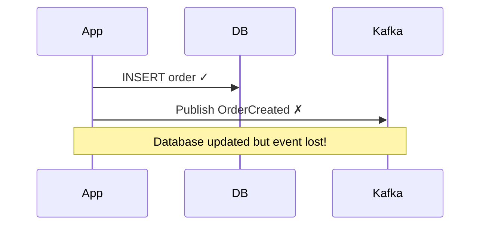
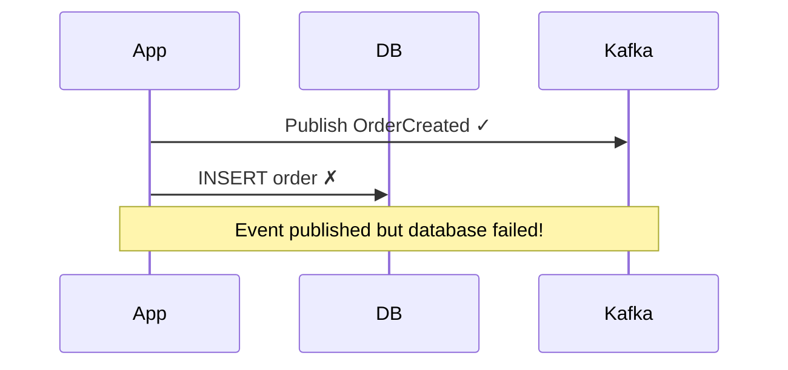
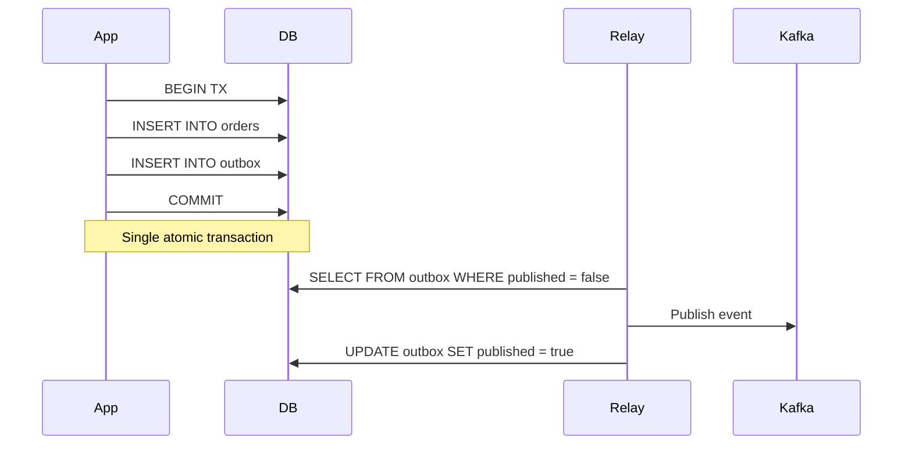
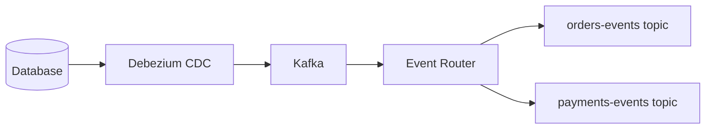

# Outbox Pattern — Deep Dive

> **Level:** Intermediate  
> **Pre-reading:** [04 · Event-Driven Architecture](04-event-driven.md) · [03.04 · Saga and Outbox Patterns](03.04-saga-and-outbox.md)

---

## The Dual-Write Problem

When a service needs to update its database **and** publish an event, two things can go wrong:





Both scenarios leave the system in an inconsistent state.

---

## The Outbox Solution

Write both the business data and the event to the **same database** in a **single transaction**. A separate process reads the outbox and publishes events.



---

## Outbox Table Design

```sql
CREATE TABLE outbox (
    id UUID PRIMARY KEY DEFAULT gen_random_uuid(),
    aggregate_type VARCHAR(255) NOT NULL,  -- 'Order'
    aggregate_id VARCHAR(255) NOT NULL,    -- Order ID
    event_type VARCHAR(255) NOT NULL,      -- 'OrderCreated'
    payload JSONB NOT NULL,                -- Serialized event
    created_at TIMESTAMP NOT NULL DEFAULT NOW(),
    published_at TIMESTAMP,
    published BOOLEAN NOT NULL DEFAULT FALSE
);

CREATE INDEX idx_outbox_unpublished ON outbox (created_at) WHERE published = FALSE;
```

### Outbox Record

```java
public record OutboxRecord(
    UUID id,
    String aggregateType,
    String aggregateId,
    String eventType,
    String payload,
    Instant createdAt,
    Instant publishedAt,
    boolean published
) {}
```

---

## Writing to the Outbox

Write business data and outbox record in the **same transaction**:

```java
@Service
public class OrderService {
    private final OrderRepository orderRepository;
    private final OutboxRepository outboxRepository;
    
    @Transactional
    public Order placeOrder(PlaceOrderCommand command) {
        // Business logic
        Order order = Order.create(command);
        orderRepository.save(order);
        
        // Write to outbox (same transaction)
        OrderCreatedEvent event = new OrderCreatedEvent(
            order.getId(),
            order.getCustomerId(),
            order.getTotalAmount(),
            order.getLines()
        );
        
        outboxRepository.save(new OutboxRecord(
            UUID.randomUUID(),
            "Order",
            order.getId().toString(),
            "OrderCreated",
            serialize(event),
            Instant.now(),
            null,
            false
        ));
        
        return order;
    }
}
```

---

## Publishing from the Outbox

### Option 1: Polling

A scheduled job polls the outbox table and publishes events.

```java
@Component
public class OutboxRelay {
    private final OutboxRepository outboxRepository;
    private final KafkaTemplate<String, String> kafkaTemplate;
    
    @Scheduled(fixedDelay = 100)  // Poll every 100ms
    @Transactional
    public void processOutbox() {
        List<OutboxRecord> records = outboxRepository.findUnpublished(100);
        
        for (OutboxRecord record : records) {
            String topic = record.aggregateType().toLowerCase() + "-events";
            
            kafkaTemplate.send(topic, record.aggregateId(), record.payload())
                .whenComplete((result, error) -> {
                    if (error == null) {
                        markPublished(record);
                    } else {
                        log.error("Failed to publish: {}", record.id(), error);
                    }
                });
        }
    }
    
    @Transactional
    void markPublished(OutboxRecord record) {
        outboxRepository.markPublished(record.id(), Instant.now());
    }
}
```

### Option 2: Change Data Capture (CDC)

Use Debezium to capture database changes and stream them to Kafka.



**Debezium advantages:**

- No polling; real-time
- Captures all changes (even from other apps)
- Scales with database replication

**Debezium connector config:**

```json
{
    "name": "outbox-connector",
    "config": {
        "connector.class": "io.debezium.connector.postgresql.PostgresConnector",
        "database.hostname": "postgres",
        "database.port": "5432",
        "database.user": "debezium",
        "database.password": "secret",
        "database.dbname": "orders",
        "table.include.list": "public.outbox",
        "transforms": "outbox",
        "transforms.outbox.type": "io.debezium.transforms.outbox.EventRouter",
        "transforms.outbox.table.fields.additional.placement": "type:header:eventType"
    }
}
```

---

## Outbox with Spring Modulith

Spring Modulith has built-in outbox support:

```java
@Configuration
public class ModulithConfig {
    @Bean
    public EventExternalizationConfiguration eventExternalization(
            KafkaOperations<String, Object> kafka) {
        return EventExternalizationConfiguration.externalizing()
            .select(EventExternalizationConfiguration.annotatedAsExternalized())
            .route(OrderCreated.class, e -> RoutingTarget.forTarget("orders-events"))
            .build();
    }
}

// Events marked for externalization
@Externalized
public record OrderCreated(OrderId orderId, CustomerId customerId) {}
```

---

## Delivery Guarantees

The outbox pattern provides **at-least-once** delivery:

| Guarantee | How |
|:----------|:----|
| **No loss** | Event persisted in DB before publish |
| **Eventual delivery** | Relay retries until published |
| **May duplicate** | If publish succeeds but mark fails |

### Handling Duplicates

Consumers must be **idempotent**:

```java
@Component
public class OrderEventConsumer {
    private final ProcessedEventRepository processedEvents;
    
    @KafkaListener(topics = "orders-events")
    public void consume(OrderCreatedEvent event) {
        // Idempotency check
        if (processedEvents.exists(event.eventId())) {
            log.debug("Duplicate event: {}", event.eventId());
            return;
        }
        
        // Process event
        inventoryService.reserve(event.orderId(), event.items());
        
        // Mark as processed
        processedEvents.save(event.eventId());
    }
}
```

---

## Outbox Cleanup

Old outbox records accumulate. Clean them up:

```java
@Scheduled(cron = "0 0 2 * * *")  // Daily at 2 AM
@Transactional
public void cleanupOutbox() {
    Instant threshold = Instant.now().minus(7, ChronoUnit.DAYS);
    outboxRepository.deletePublishedBefore(threshold);
}
```

Or partition the table by date for efficient drops.

---

## Ordering Guarantees

### Per-Aggregate Ordering

Use aggregate ID as Kafka partition key:

```java
kafkaTemplate.send(
    "orders-events",
    record.aggregateId(),  // Partition key
    record.payload()
);
```

Events for the same aggregate go to the same partition → ordered.

### Global Ordering

Not guaranteed. If you need global order, use a single partition (but lose parallelism).

---

## Outbox Anti-Patterns

| Anti-Pattern | Problem | Fix |
|:-------------|:--------|:----|
| **No cleanup** | Table grows forever | Scheduled cleanup job |
| **Synchronous publish** | Defeats the purpose | Always async; relay or CDC |
| **No idempotency** | Duplicate processing | Idempotent consumers |
| **Business logic in relay** | Relay becomes bottleneck | Keep relay simple |
| **No monitoring** | Don't know if events stuck | Alert on unpublished age |

---

## Polling vs CDC

| Aspect | Polling | CDC (Debezium) |
|:-------|:--------|:---------------|
| **Latency** | 100ms+ (poll interval) | Milliseconds |
| **Complexity** | Simple | More infrastructure |
| **Database load** | Polling queries | Replication slot |
| **Scalability** | Limited | High |
| **Captures all changes** | Only outbox | Any table |

---

## Monitoring

| Metric | Alert Condition |
|:-------|:----------------|
| **Unpublished count** | > 1000 (backlog growing) |
| **Oldest unpublished** | > 5 minutes |
| **Publish failures** | > 0 sustained |
| **Consumer lag** | Growing |

```sql
-- Monitoring query
SELECT 
    COUNT(*) as unpublished_count,
    MIN(created_at) as oldest_unpublished,
    EXTRACT(EPOCH FROM (NOW() - MIN(created_at))) as oldest_age_seconds
FROM outbox
WHERE published = FALSE;
```

---

??? question "What guarantees does the outbox pattern provide?"
    **At-least-once delivery**: Events will be published (eventually). **No loss**: Events are persisted in the DB before publishing. **Ordering per aggregate**: If using aggregate ID as partition key. It does NOT guarantee exactly-once — consumers must be idempotent. The pattern trades some latency for reliability.

??? question "Should I use polling or CDC for the outbox?"
    **Polling** is simpler to set up and has no additional infrastructure. Good for moderate volumes and when 100ms+ latency is acceptable. **CDC (Debezium)** has lower latency (milliseconds), scales better, and captures changes reliably. Use CDC for high-volume systems or when you already have Kafka Connect infrastructure.

??? question "How do you handle a backlog of unpublished events?"
    (1) **Scale the relay**: More instances, parallel processing. (2) **Increase batch size**: Process more records per poll. (3) **Prioritize**: Critical events first. (4) **Alert early**: Monitor unpublished age and count. (5) **Investigate root cause**: Is Kafka down? Network issues? Fix the underlying problem.

