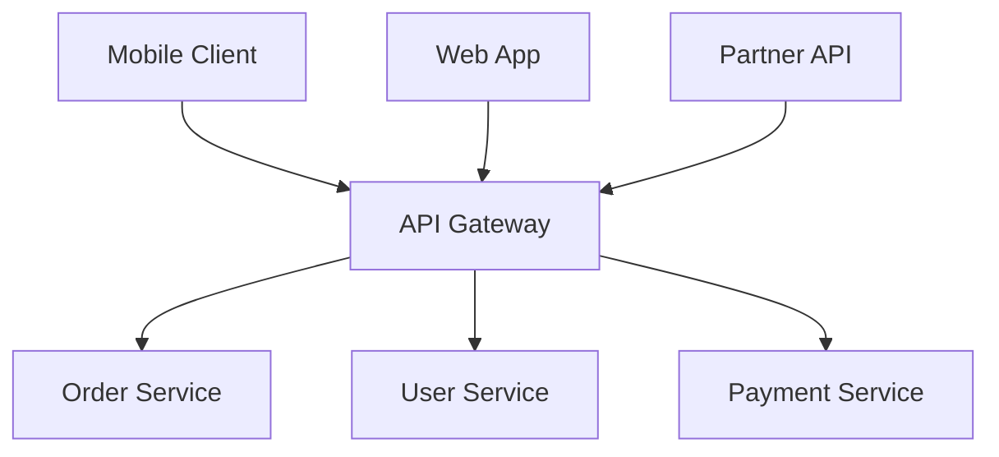
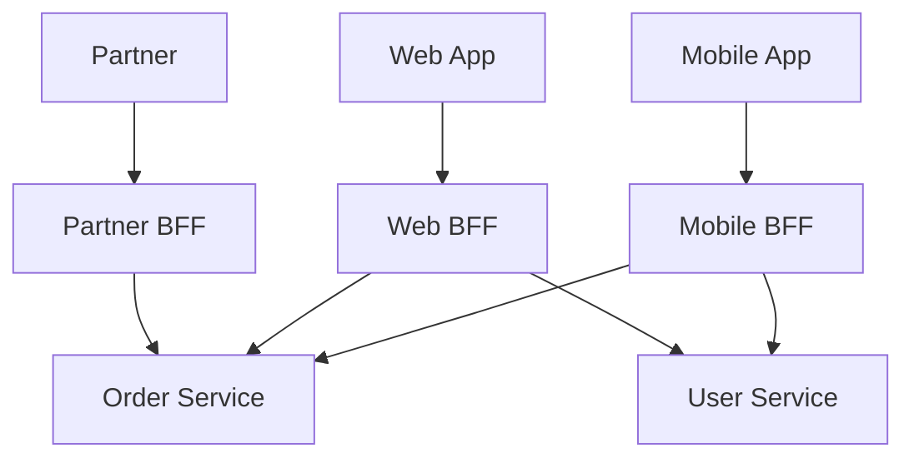

# API & Communication

> How services talk to each other and to the outside world. Choice of protocol shapes your entire system design.

---

## Communication Protocol Overview

| Protocol | Style | Best For |
|:----------|:-------|:---------|
| **REST** | Request/Response over HTTP | External APIs, browser clients, simplicity |
| **gRPC** | Binary RPC over HTTP/2 | Internal service-to-service, high throughput |
| **GraphQL** | Query language over HTTP | Complex frontends with varied data needs |
| **Messaging (Kafka/SQS)** | Async event streaming | Decoupled workflows, high volume |
| **WebSocket** | Persistent bidirectional connection | Real-time: chat, live dashboards |

---

## REST

| Concept | Description |
|---------|-------------|
| **Richardson Maturity** | Level 0: HTTP tunnel · Level 1: Resources · Level 2: HTTP verbs + status codes · Level 3: HATEOAS |
| **HATEOAS** | Responses include links to next actions; true REST; rarely implemented |
| **Idempotency** | GET, PUT, DELETE are idempotent; POST is not |
| **Status codes** | 2xx success · 3xx redirect · 4xx client error · 5xx server error |

### API Versioning Strategies

| Strategy | Example | Pros / Cons |
|----------|---------|-------------|
| **URI Path** | `/api/v1/orders` | Simple, visible; not RESTful |
| **Header** | `Accept: application/vnd.api.v1+json` | RESTful; less discoverable |
| **Query Param** | `/orders?version=1` | Easy to test; caching issues |
| **Content Negotiation** | `Accept: application/json;version=2` | Clean; complex to implement |

---

## gRPC

| Concept | Description |
|---------|-------------|
| **Protocol Buffers** | Binary serialization; strongly typed schema; code generation for all languages |
| **HTTP/2** | Multiplexed streams; lower latency and overhead than HTTP/1.1 |
| **Streaming types** | Unary (1 req, 1 res) · Server streaming · Client streaming · Bidirectional |
| **Use case** | Internal service-to-service; high throughput; polyglot environments |
| **Trade-offs** | Less debuggable than REST; browsers need grpc-web proxy; requires schema management |

---

## GraphQL

| Concept | Description |
|---------|-------------|
| **Schema** | Strongly typed; defines Queries, Mutations, Subscriptions |
| **Single endpoint** | `POST /graphql`; client specifies exact data shape |
| **N+1 Problem** | Nested resolvers each trigger individual DB queries — performance killer |
| **DataLoader** | Batching and caching solution for N+1; groups queries into one |
| **Introspection** | Schema is self-documenting; disable in production |
| **Use case** | Complex frontends with varied clients; BFF replacement; rapidly evolving APIs |

---

## API Gateway

**Responsibilities:**

| Concern | What Gateway Does |
|---------|-------------------|
| **Routing** | Path-based, header-based, method-based routing |
| **Authentication** | Validate JWT / API key before forwarding |
| **Rate Limiting** | Per-client throttling; return 429 Too Many Requests |
| **SSL Termination** | TLS at gateway; plain HTTP to internal services |
| **Request Transform** | Add/remove/rewrite headers; request shaping |
| **Caching** | Cache idempotent GET responses |
| **Load Balancing** | Round-robin, least connections across service instances |
| **Observability** | Centralized access logs, metrics per route |

**Tools:** Kong, AWS API Gateway, Spring Cloud Gateway, Nginx, Envoy, Traefik

---

## Backend for Frontend (BFF)

**Problem:** One generic API cannot optimally serve mobile, web, and partner clients simultaneously.

**Solution:** A separate gateway per client type, each tailored to that client's data shape, auth flow, and performance needs.

| Benefit | Cost |
|---------|------|
| Each BFF tailored to its client | More services to own and deploy |
| Reduces over-fetching / under-fetching | Logic duplication if not careful |
| Teams own their BFF end-to-end | Coordination when backend changes |

---

## Service Mesh

| Component | Description |
|-----------|-------------|
| **Data Plane** | Envoy sidecar proxies injected alongside every service pod |
| **Control Plane** | Istiod (Istio) — distributes config to all sidecars |
| **VirtualService** | Traffic routing rules: canary splits, fault injection, retries |
| **DestinationRule** | Load balancing policy, circuit breaking, mTLS settings |
| **PeerAuthentication** | Enforce mutual TLS between services |
| **Observability** | Automatic metrics, distributed traces, access logs — no code changes |

**When to use:** Mature microservices with many services needing consistent security, observability, and traffic management. Overhead not worth it for < 5 services.

---

## Sync vs Async — Decision Guide

| Factor | Choose Synchronous | Choose Asynchronous |
|--------|-------------------|---------------------|
| **Response needed now** | Yes | No |
| **Failure isolation** | Low — cascades | High — producer continues |
| **Temporal coupling** | Required | Not required |
| **Throughput** | Bounded by slowest service | High; consumers scale independently |
| **Example** | User login, payment confirmation | Order processing, notifications, analytics |
