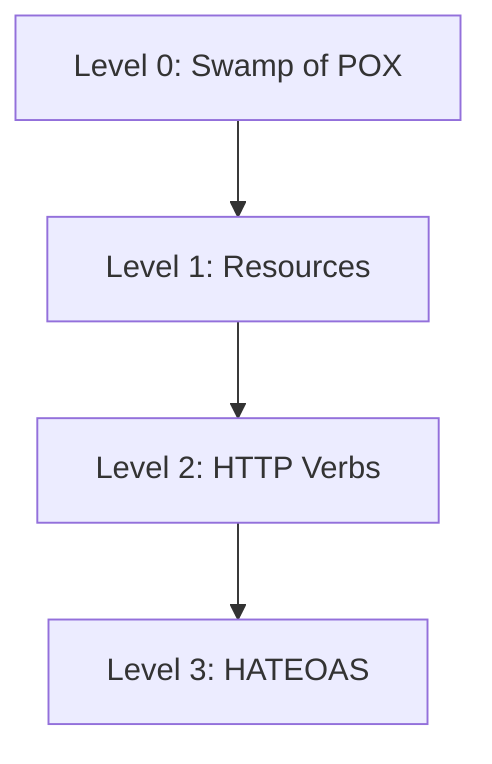

# REST Deep Dive

> **Level:** Intermediate  
> **Pre-reading:** [05 · API & Communication](05-api-communication.md)

---

## REST Fundamentals

**REST** (Representational State Transfer) is an architectural style for designing networked applications. It uses HTTP methods to perform operations on resources.

---

## Richardson Maturity Model

A model for measuring how RESTful an API is:



| Level | Description | Example |
|:------|:------------|:--------|
| **Level 0** | Single endpoint; RPC over HTTP | `POST /api` with action in body |
| **Level 1** | Resources with URIs | `/orders`, `/customers` |
| **Level 2** | HTTP verbs + status codes | GET, POST, PUT, DELETE; 201, 404 |
| **Level 3** | HATEOAS (hypermedia) | Links in responses for navigation |

### Level 2 Example

```http
GET /orders/123 HTTP/1.1
Host: api.example.com

HTTP/1.1 200 OK
Content-Type: application/json
{
  "id": "123",
  "status": "placed",
  "total": 99.99
}
```

### Level 3 Example (HATEOAS)

```json
{
  "id": "123",
  "status": "placed",
  "total": 99.99,
  "_links": {
    "self": { "href": "/orders/123" },
    "cancel": { "href": "/orders/123/cancel", "method": "POST" },
    "items": { "href": "/orders/123/items" },
    "customer": { "href": "/customers/456" }
  }
}
```

---

## HTTP Methods

| Method | Purpose | Idempotent | Safe |
|:-------|:--------|:-----------|:-----|
| **GET** | Retrieve resource | Yes | Yes |
| **POST** | Create resource | No | No |
| **PUT** | Replace resource | Yes | No |
| **PATCH** | Partial update | No* | No |
| **DELETE** | Remove resource | Yes | No |
| **HEAD** | Get headers only | Yes | Yes |
| **OPTIONS** | Get allowed methods | Yes | Yes |

*PATCH can be idempotent with JSON Patch operations

### PUT vs PATCH

```http
# PUT: Replace entire resource
PUT /orders/123
{
  "status": "shipped",
  "items": [...],
  "shippingAddress": {...}
}

# PATCH: Update specific fields
PATCH /orders/123
{
  "status": "shipped"
}
```

---

## Status Codes

| Range | Category | Common Codes |
|:------|:---------|:-------------|
| **2xx** | Success | 200 OK, 201 Created, 204 No Content |
| **3xx** | Redirect | 301 Moved, 304 Not Modified |
| **4xx** | Client Error | 400 Bad Request, 401, 403, 404, 409 Conflict, 429 |
| **5xx** | Server Error | 500 Internal, 502 Bad Gateway, 503 Unavailable |

### Status Code Guidelines

| Action | Success | Failure |
|:-------|:--------|:--------|
| **GET** | 200 OK | 404 Not Found |
| **POST** | 201 Created | 400 Bad Request, 409 Conflict |
| **PUT** | 200 OK / 204 No Content | 404, 400 |
| **DELETE** | 204 No Content | 404 |
| **PATCH** | 200 OK | 400, 404 |

---

## Idempotency

An **idempotent** operation produces the same result when called multiple times.

| Method | Idempotent? | Why |
|:-------|:------------|:----|
| **GET** | Yes | Returns same data |
| **PUT** | Yes | Same resource state |
| **DELETE** | Yes | Resource stays deleted |
| **POST** | No | Creates new resource each time |

### Idempotency Keys

For non-idempotent operations, use an **idempotency key**:

```http
POST /payments HTTP/1.1
Idempotency-Key: abc123-unique-request-id
Content-Type: application/json

{"amount": 100, "currency": "USD"}
```

Server stores the key; subsequent requests with same key return cached response.

---

## API Versioning

### URI Path Versioning

```
GET /api/v1/orders
GET /api/v2/orders
```

| Pros | Cons |
|:-----|:-----|
| Explicit, visible | Not pure REST |
| Easy to implement | URL bloat |
| Easy to cache | Links may break |

### Header Versioning

```http
GET /orders HTTP/1.1
Accept: application/vnd.api.v2+json
```

| Pros | Cons |
|:-----|:-----|
| Clean URLs | Less discoverable |
| RESTful | Harder to test |

### Query Parameter

```
GET /orders?version=2
```

| Pros | Cons |
|:-----|:-----|
| Easy to test | Not semantic |
| Visible | Can break caching |

---

## Resource Naming

### Guidelines

| Guideline | Good | Bad |
|:----------|:-----|:----|
| **Nouns, not verbs** | `/orders` | `/getOrders` |
| **Plural** | `/customers` | `/customer` |
| **Lowercase, kebab-case** | `/order-items` | `/orderItems` |
| **Hierarchy** | `/customers/123/orders` | `/customerOrders?id=123` |
| **No file extensions** | `/orders/123` | `/orders/123.json` |

### Collection vs Instance

```
/orders          # Collection
/orders/123      # Instance
/orders/123/items    # Sub-collection
/orders/123/items/1  # Sub-instance
```

---

## Pagination

### Offset-Based

```http
GET /orders?offset=20&limit=10
```

```json
{
  "data": [...],
  "pagination": {
    "offset": 20,
    "limit": 10,
    "total": 95
  }
}
```

| Pros | Cons |
|:-----|:-----|
| Simple | Inconsistent with data changes |
| Familiar | Slow for large offsets |

### Cursor-Based

```http
GET /orders?cursor=eyJpZCI6MTIzfQ&limit=10
```

```json
{
  "data": [...],
  "pagination": {
    "next_cursor": "eyJpZCI6MTMzfQ",
    "has_more": true
  }
}
```

| Pros | Cons |
|:-----|:-----|
| Consistent | Can't jump to page |
| Fast | Opaque cursor |

---

## Filtering, Sorting, Field Selection

### Filtering

```http
GET /orders?status=shipped&created_after=2024-01-01
```

### Sorting

```http
GET /orders?sort=-created_at,+total
# - for descending, + for ascending
```

### Field Selection

```http
GET /orders?fields=id,status,total
```

---

## Error Responses

Use consistent error format:

```json
{
  "error": {
    "code": "VALIDATION_ERROR",
    "message": "Invalid request",
    "details": [
      {
        "field": "email",
        "message": "Invalid email format"
      }
    ]
  },
  "request_id": "abc123"
}
```

| Element | Purpose |
|:--------|:--------|
| **code** | Machine-readable error type |
| **message** | Human-readable description |
| **details** | Field-specific errors |
| **request_id** | Trace for debugging |

---

## Content Negotiation

Client specifies desired format:

```http
GET /orders/123 HTTP/1.1
Accept: application/json
Accept-Language: en-US
Accept-Encoding: gzip

HTTP/1.1 200 OK
Content-Type: application/json; charset=utf-8
Content-Language: en-US
Content-Encoding: gzip
```

---

## Best Practices

| Practice | Recommendation |
|:---------|:---------------|
| **Use nouns** | Resources, not actions |
| **Consistent naming** | kebab-case, plural |
| **HTTP methods** | GET, POST, PUT, DELETE semantically |
| **Status codes** | Correct codes for each situation |
| **Versioning** | Pick one strategy; stick with it |
| **Pagination** | Always paginate collections |
| **Error format** | Consistent across API |
| **Documentation** | OpenAPI/Swagger |

---

??? question "What is HATEOAS and is it worth implementing?"
    **HATEOAS** (Hypermedia as the Engine of Application State) means responses include links to related actions and resources. The client discovers the API by following links. **Worth it?** Rarely in practice. It adds complexity and most API clients are built against fixed contracts (OpenAPI). Consider it for public APIs where discoverability matters.

??? question "PUT vs PATCH — when to use each?"
    **PUT** replaces the entire resource — send all fields. Omitted fields may be set to null. **PATCH** updates specific fields only — send only changed fields. Use PUT when you're replacing; use PATCH for partial updates. PATCH is more bandwidth-efficient but requires clear semantics.

??? question "How do you handle API versioning long-term?"
    (1) **Support 2-3 versions max** — more is unmanageable. (2) **Deprecation policy** — announce deprecation 6-12 months ahead. (3) **Sunset headers** — `Sunset: Sat, 31 Dec 2025 23:59:59 GMT`. (4) **Version in URL** is most practical for most teams. (5) **Breaking changes** require new version; additive changes don't.

