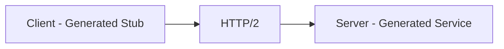
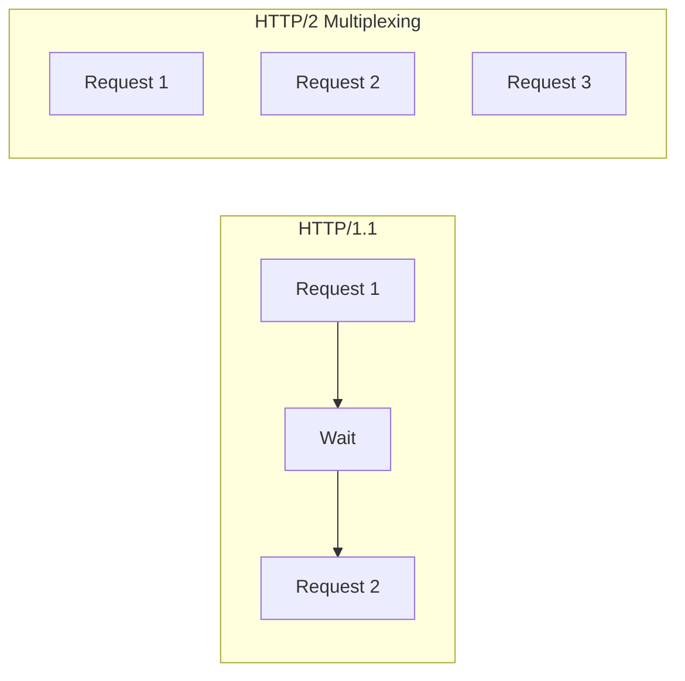
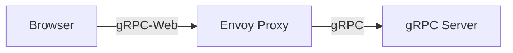

# gRPC Deep Dive

> **Level:** Intermediate  
> **Pre-reading:** [05 · API & Communication](05-api-communication.md)

---

## What is gRPC?

**gRPC** is a high-performance RPC framework using HTTP/2 and Protocol Buffers. It provides strongly-typed contracts and efficient binary serialization.



---

## Protocol Buffers (Protobuf)

gRPC uses Protocol Buffers for schema definition and serialization.

### Proto File Example

```protobuf
syntax = "proto3";

package orders;

option java_package = "com.example.orders.grpc";
option java_multiple_files = true;

// Service definition
service OrderService {
    rpc PlaceOrder(PlaceOrderRequest) returns (OrderResponse);
    rpc GetOrder(GetOrderRequest) returns (OrderResponse);
    rpc ListOrders(ListOrdersRequest) returns (stream OrderResponse);
    rpc SubmitOrders(stream PlaceOrderRequest) returns (BatchOrderResponse);
}

// Messages
message PlaceOrderRequest {
    string customer_id = 1;
    repeated OrderItem items = 2;
    Address shipping_address = 3;
}

message OrderItem {
    string product_id = 1;
    int32 quantity = 2;
    Money price = 3;
}

message Money {
    int64 amount_cents = 1;
    string currency = 2;
}

message Address {
    string street = 1;
    string city = 2;
    string country = 3;
    string postal_code = 4;
}

message OrderResponse {
    string order_id = 1;
    OrderStatus status = 2;
    Money total = 3;
}

enum OrderStatus {
    ORDER_STATUS_UNSPECIFIED = 0;
    ORDER_STATUS_PLACED = 1;
    ORDER_STATUS_SHIPPED = 2;
    ORDER_STATUS_DELIVERED = 3;
}
```

---

## Streaming Types

| Type | Request | Response | Use Case |
|:-----|:--------|:---------|:---------|
| **Unary** | Single | Single | Simple request-response |
| **Server streaming** | Single | Stream | Long lists, real-time updates |
| **Client streaming** | Stream | Single | Batch upload |
| **Bidirectional** | Stream | Stream | Chat, real-time collaboration |

```protobuf
service OrderService {
    // Unary
    rpc GetOrder(GetOrderRequest) returns (OrderResponse);
    
    // Server streaming
    rpc ListOrders(ListOrdersRequest) returns (stream OrderResponse);
    
    // Client streaming
    rpc SubmitOrders(stream PlaceOrderRequest) returns (BatchOrderResponse);
    
    // Bidirectional streaming
    rpc OrderChat(stream OrderMessage) returns (stream OrderMessage);
}
```

### Server Streaming Example

```java
// Server implementation
@Override
public void listOrders(ListOrdersRequest request, 
                       StreamObserver<OrderResponse> responseObserver) {
    List<Order> orders = orderRepository.findByCustomer(request.getCustomerId());
    
    for (Order order : orders) {
        responseObserver.onNext(toProto(order));
    }
    responseObserver.onCompleted();
}

// Client usage
Iterator<OrderResponse> orders = stub.listOrders(request);
while (orders.hasNext()) {
    OrderResponse order = orders.next();
    process(order);
}
```

---

## HTTP/2 Benefits

| Feature | Benefit |
|:--------|:--------|
| **Multiplexing** | Multiple streams over single connection |
| **Header compression** | HPACK reduces overhead |
| **Binary framing** | Efficient parsing |
| **Server push** | Proactive data sending |
| **Persistent connections** | Reduced latency |



---

## gRPC vs REST

| Aspect | gRPC | REST |
|:-------|:-----|:-----|
| **Protocol** | HTTP/2 | HTTP/1.1 (usually) |
| **Format** | Binary (Protobuf) | Text (JSON) |
| **Schema** | Required (.proto) | Optional (OpenAPI) |
| **Code generation** | Built-in | Third-party tools |
| **Streaming** | Native | Requires workarounds |
| **Browser support** | Needs proxy (grpc-web) | Native |
| **Debugging** | Harder (binary) | Easy (readable) |
| **Performance** | Higher throughput | Lower throughput |

---

## Generated Code

From a `.proto` file, gRPC generates:

| Generated | Purpose |
|:----------|:--------|
| **Messages** | Data classes (immutable) |
| **Service interface** | Server-side contract |
| **Stub** | Client-side proxy |
| **Builder** | Message construction |

### Server Implementation (Java)

```java
public class OrderServiceImpl extends OrderServiceGrpc.OrderServiceImplBase {
    
    @Override
    public void placeOrder(PlaceOrderRequest request, 
                          StreamObserver<OrderResponse> responseObserver) {
        try {
            Order order = orderService.placeOrder(
                request.getCustomerId(),
                request.getItemsList(),
                request.getShippingAddress()
            );
            
            OrderResponse response = OrderResponse.newBuilder()
                .setOrderId(order.getId())
                .setStatus(OrderStatus.ORDER_STATUS_PLACED)
                .setTotal(toProtoMoney(order.getTotal()))
                .build();
            
            responseObserver.onNext(response);
            responseObserver.onCompleted();
        } catch (Exception e) {
            responseObserver.onError(Status.INTERNAL
                .withDescription(e.getMessage())
                .asRuntimeException());
        }
    }
}
```

### Client Usage (Java)

```java
ManagedChannel channel = ManagedChannelBuilder
    .forAddress("order-service", 9090)
    .usePlaintext()
    .build();

OrderServiceGrpc.OrderServiceBlockingStub stub = 
    OrderServiceGrpc.newBlockingStub(channel);

PlaceOrderRequest request = PlaceOrderRequest.newBuilder()
    .setCustomerId("customer-123")
    .addItems(OrderItem.newBuilder()
        .setProductId("product-456")
        .setQuantity(2)
        .setPrice(Money.newBuilder()
            .setAmountCents(1999)
            .setCurrency("USD")))
    .build();

OrderResponse response = stub.placeOrder(request);
```

---

## Error Handling

gRPC uses status codes:

| Status | Description |
|:-------|:------------|
| `OK` | Success |
| `INVALID_ARGUMENT` | Client error; bad input |
| `NOT_FOUND` | Resource doesn't exist |
| `ALREADY_EXISTS` | Duplicate |
| `PERMISSION_DENIED` | Authz failure |
| `UNAUTHENTICATED` | AuthN failure |
| `RESOURCE_EXHAUSTED` | Rate limited |
| `UNAVAILABLE` | Service down; retry |
| `INTERNAL` | Server error |
| `DEADLINE_EXCEEDED` | Timeout |

### Error Response

```java
// Server
responseObserver.onError(Status.NOT_FOUND
    .withDescription("Order not found: " + orderId)
    .asRuntimeException());

// Client
try {
    OrderResponse response = stub.getOrder(request);
} catch (StatusRuntimeException e) {
    if (e.getStatus().getCode() == Status.Code.NOT_FOUND) {
        // Handle not found
    }
}
```

---

## Deadlines and Timeouts

Always set deadlines:

```java
// Client sets deadline
OrderServiceGrpc.OrderServiceBlockingStub stub = 
    OrderServiceGrpc.newBlockingStub(channel)
        .withDeadlineAfter(5, TimeUnit.SECONDS);

// Server can check remaining time
Context.current().getDeadline().timeRemaining(TimeUnit.MILLISECONDS);
```

---

## Interceptors

Add cross-cutting concerns:

```java
// Client interceptor
public class AuthInterceptor implements ClientInterceptor {
    @Override
    public <ReqT, RespT> ClientCall<ReqT, RespT> interceptCall(
            MethodDescriptor<ReqT, RespT> method,
            CallOptions callOptions,
            Channel next) {
        return new ForwardingClientCall.SimpleForwardingClientCall<>(
                next.newCall(method, callOptions)) {
            @Override
            public void start(Listener<RespT> responseListener, Metadata headers) {
                headers.put(AUTH_KEY, "Bearer " + getToken());
                super.start(responseListener, headers);
            }
        };
    }
}

// Register
ManagedChannel channel = ManagedChannelBuilder
    .forAddress("order-service", 9090)
    .intercept(new AuthInterceptor(), new LoggingInterceptor())
    .build();
```

---

## gRPC with Spring Boot

```java
// Dependencies (grpc-spring-boot-starter)
@GrpcService
public class OrderGrpcService extends OrderServiceGrpc.OrderServiceImplBase {
    
    private final OrderService orderService;
    
    @Override
    public void placeOrder(PlaceOrderRequest request, 
                          StreamObserver<OrderResponse> responseObserver) {
        // Implementation
    }
}

// Client
@GrpcClient("order-service")
private OrderServiceGrpc.OrderServiceBlockingStub orderStub;
```

```yaml
# application.yml
grpc:
  server:
    port: 9090
  client:
    order-service:
      address: static://localhost:9090
      negotiationType: plaintext
```

---

## Browser Support: gRPC-Web

Browsers don't support HTTP/2 trailers. Use **gRPC-Web** with a proxy:



```yaml
# Envoy configuration
- name: envoy.filters.http.grpc_web
  typed_config:
    "@type": type.googleapis.com/envoy.extensions.filters.http.grpc_web.v3.GrpcWeb
```

---

## Best Practices

| Practice | Recommendation |
|:---------|:---------------|
| **Always set deadlines** | Avoid hanging calls |
| **Use interceptors** | Auth, logging, metrics |
| **Version services** | `package orders.v1;` |
| **Retries** | Configure for idempotent calls |
| **Keep-alive** | Prevent connection drops |
| **Load balancing** | Client-side or L7 proxy |

---

??? question "When should you use gRPC over REST?"
    Use gRPC for: (1) **Internal service-to-service** communication where performance matters. (2) **Polyglot environments** where code generation is valuable. (3) **Streaming** requirements. (4) **Strong typing** is essential. Use REST for: public APIs, browser clients (without proxy), simple integrations, debugging ease.

??? question "How does gRPC handle load balancing?"
    gRPC uses persistent HTTP/2 connections, so traditional L4 load balancing doesn't distribute well. Options: (1) **Client-side LB**: Client resolves to multiple backends and balances (grpc-lb). (2) **L7 proxy**: Envoy, Linkerd, or Istio at HTTP/2 level. (3) **Lookaside LB**: Client queries LB service for backend list. Service mesh (Istio) handles this transparently.

??? question "How do you handle backwards compatibility in gRPC?"
    (1) **Add fields, don't remove**: New fields are ignored by old clients. (2) **Reserve removed fields**: `reserved 5, 6;` (3) **Don't change field numbers**: They're the wire identifier. (4) **Deprecate, don't delete**: Add `[deprecated = true]`. (5) **Version packages**: `package orders.v2;` for breaking changes.

