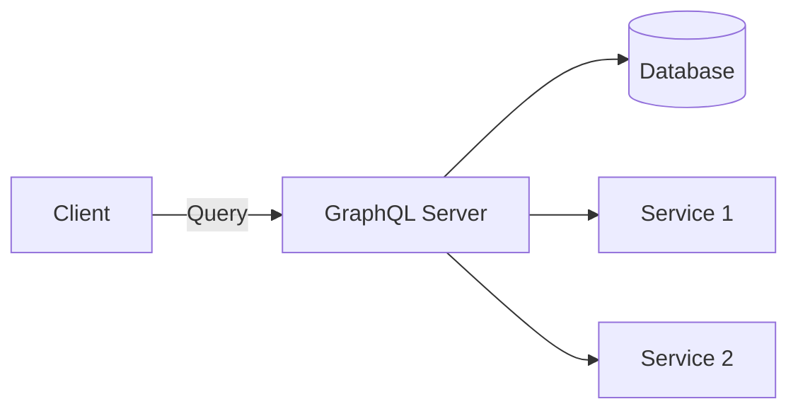

# GraphQL Deep Dive

> **Level:** Intermediate  
> **Pre-reading:** [05 · API & Communication](05-api-communication.md)

---

## What is GraphQL?

**GraphQL** is a query language for APIs that lets clients request exactly the data they need. A single endpoint serves all queries, mutations, and subscriptions.



---

## Schema Definition

GraphQL uses a strongly-typed schema:

```graphql
type Query {
    order(id: ID!): Order
    orders(customerId: ID, status: OrderStatus, first: Int, after: String): OrderConnection!
}

type Mutation {
    placeOrder(input: PlaceOrderInput!): PlaceOrderPayload!
    cancelOrder(id: ID!): CancelOrderPayload!
}

type Subscription {
    orderStatusChanged(orderId: ID!): Order!
}

type Order {
    id: ID!
    customer: Customer!
    items: [OrderItem!]!
    status: OrderStatus!
    total: Money!
    createdAt: DateTime!
}

type OrderItem {
    product: Product!
    quantity: Int!
    price: Money!
}

type Customer {
    id: ID!
    name: String!
    email: String!
    orders(first: Int, after: String): OrderConnection!
}

type Product {
    id: ID!
    name: String!
    sku: String!
    price: Money!
}

type Money {
    amount: Float!
    currency: String!
}

enum OrderStatus {
    PLACED
    PROCESSING
    SHIPPED
    DELIVERED
    CANCELLED
}

input PlaceOrderInput {
    customerId: ID!
    items: [OrderItemInput!]!
}

input OrderItemInput {
    productId: ID!
    quantity: Int!
}

type PlaceOrderPayload {
    order: Order
    errors: [Error!]
}
```

---

## Queries

Clients specify exactly what they need:

```graphql
# Client query
query GetOrderDetails($orderId: ID!) {
    order(id: $orderId) {
        id
        status
        total {
            amount
            currency
        }
        items {
            quantity
            product {
                name
                sku
            }
        }
        customer {
            name
            email
        }
    }
}
```

Response matches the query shape:

```json
{
    "data": {
        "order": {
            "id": "order-123",
            "status": "SHIPPED",
            "total": {"amount": 99.99, "currency": "USD"},
            "items": [
                {
                    "quantity": 2,
                    "product": {"name": "Widget", "sku": "WDG-001"}
                }
            ],
            "customer": {"name": "Jane Doe", "email": "jane@example.com"}
        }
    }
}
```

---

## Mutations

Write operations:

```graphql
mutation PlaceOrder($input: PlaceOrderInput!) {
    placeOrder(input: $input) {
        order {
            id
            status
        }
        errors {
            field
            message
        }
    }
}
```

---

## The N+1 Problem

Without optimization, nested resolvers cause N+1 queries:

```graphql
query {
    orders(first: 10) {
        items {
            product {    # ← Each item triggers a product query
                name
            }
        }
    }
}
```

```
1 query: Get 10 orders
10 queries: Get items for each order
100 queries: Get product for each item (if 10 items per order)
= 111 queries for one GraphQL request!
```

### Solution: DataLoader

**DataLoader** batches and caches queries within a request:

```java
// Without DataLoader: N queries
public Product getProduct(String productId) {
    return productRepository.findById(productId);
}

// With DataLoader: 1 batched query
DataLoader<String, Product> productLoader = DataLoaderFactory.newDataLoader(
    productIds -> productRepository.findAllById(productIds)
);

// Resolver uses loader
public CompletableFuture<Product> getProduct(DataFetchingEnvironment env) {
    DataLoader<String, Product> loader = env.getDataLoader("productLoader");
    return loader.load(productId);
}
```

---

## Resolvers

Resolvers fetch data for each field:

```java
@Component
public class OrderResolver implements GraphQLResolver<Order> {
    private final CustomerService customerService;
    private final DataLoader<String, Customer> customerLoader;
    
    // Field resolver for customer
    public CompletableFuture<Customer> customer(Order order, DataFetchingEnvironment env) {
        DataLoader<String, Customer> loader = env.getDataLoader("customerLoader");
        return loader.load(order.getCustomerId());
    }
    
    // Field resolver for items (already loaded)
    public List<OrderItem> items(Order order) {
        return order.getItems();
    }
}
```

---

## Pagination

Use **Relay-style connections** for cursor-based pagination:

```graphql
type Query {
    orders(first: Int, after: String, last: Int, before: String): OrderConnection!
}

type OrderConnection {
    edges: [OrderEdge!]!
    pageInfo: PageInfo!
    totalCount: Int!
}

type OrderEdge {
    cursor: String!
    node: Order!
}

type PageInfo {
    hasNextPage: Boolean!
    hasPreviousPage: Boolean!
    startCursor: String
    endCursor: String
}
```

Query:

```graphql
query {
    orders(first: 10, after: "cursor123") {
        edges {
            cursor
            node {
                id
                status
            }
        }
        pageInfo {
            hasNextPage
            endCursor
        }
    }
}
```

---

## Error Handling

GraphQL returns both data and errors:

```json
{
    "data": {
        "placeOrder": {
            "order": null,
            "errors": [
                {"field": "items", "message": "Product out of stock"}
            ]
        }
    },
    "errors": [
        {
            "message": "Not authorized",
            "path": ["placeOrder"],
            "extensions": {"code": "UNAUTHORIZED"}
        }
    ]
}
```

---

## Security Considerations

| Concern | Mitigation |
|:--------|:-----------|
| **Query depth** | Limit nested levels |
| **Query complexity** | Calculate and limit cost |
| **Introspection** | Disable in production |
| **Batching attacks** | Limit batch size |
| **Authorization** | Per-field or per-resolver checks |

### Query Complexity Example

```java
@GraphQLApi
public class SecurityConfig {
    @Bean
    public GraphQL graphQL(GraphQLSchema schema) {
        return GraphQL.newGraphQL(schema)
            .instrumentation(new MaxQueryComplexityInstrumentation(100))
            .instrumentation(new MaxQueryDepthInstrumentation(10))
            .build();
    }
}
```

---

## GraphQL vs REST

| Aspect | GraphQL | REST |
|:-------|:--------|:-----|
| **Endpoints** | Single `/graphql` | Multiple per resource |
| **Data fetching** | Client specifies | Server defines |
| **Over/under-fetching** | Avoided | Common |
| **Versioning** | Deprecated fields | URL versioning |
| **Caching** | Complex (POST requests) | HTTP caching |
| **Tooling** | Schema introspection | OpenAPI |
| **Learning curve** | Steeper | Gentle |

---

## When to Use GraphQL

### Good Fit

| Scenario | Why GraphQL |
|:---------|:------------|
| **Multiple client types** | Each fetches what it needs |
| **Complex, nested data** | Single query, no waterfall |
| **Rapid frontend iteration** | No backend changes needed |
| **BFF replacement** | Consolidate aggregation |
| **Mobile with data constraints** | Minimize payload |

### Poor Fit

| Scenario | Why Not |
|:---------|:--------|
| **Simple CRUD** | REST is simpler |
| **File uploads** | Not GraphQL's strength |
| **Public API caching** | HTTP cache-friendly REST better |
| **Team unfamiliar** | Learning curve |

---

## GraphQL in Spring Boot

```java
// Spring for GraphQL
@Controller
public class OrderGraphQLController {
    
    @QueryMapping
    public Order order(@Argument String id) {
        return orderService.findById(id);
    }
    
    @QueryMapping
    public Connection<Order> orders(@Argument String customerId, 
                                     @Argument int first, 
                                     @Argument String after) {
        return orderService.findByCustomer(customerId, first, after);
    }
    
    @MutationMapping
    public PlaceOrderPayload placeOrder(@Argument PlaceOrderInput input) {
        return orderService.placeOrder(input);
    }
    
    @SchemaMapping(typeName = "Order", field = "customer")
    public CompletableFuture<Customer> customer(Order order, DataLoader<String, Customer> loader) {
        return loader.load(order.getCustomerId());
    }
}
```

---

??? question "How do you handle the N+1 problem in GraphQL?"
    Use **DataLoader** — it batches and deduplicates requests within a single GraphQL execution. Instead of N queries for N items, DataLoader collects all IDs and makes one batched query. Configure a DataLoader for each data source and use it in resolvers.

??? question "When should you choose GraphQL over REST?"
    Choose GraphQL when: (1) Multiple clients need different data shapes. (2) You have deeply nested data. (3) Frontend needs to iterate quickly without backend changes. (4) You're building a BFF-like aggregation layer. Choose REST when: API is simple, caching is critical, team is REST-familiar.

??? question "How do you handle authorization in GraphQL?"
    (1) **Schema directives**: `@auth(role: ADMIN)` on fields/types. (2) **Resolver-level**: Check permissions in each resolver. (3) **Middleware/interceptors**: Global checks before resolution. (4) **Field-level**: Null out unauthorized fields instead of erroring. Prefer resolver-level for flexibility.

