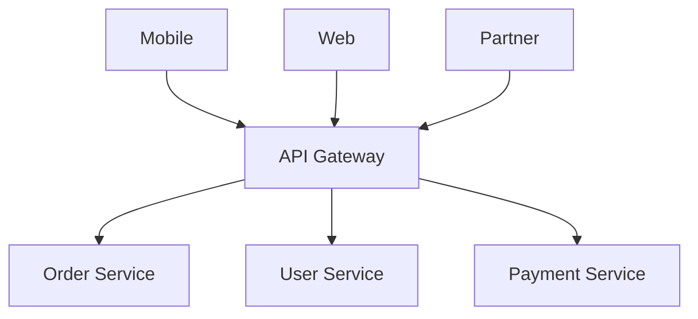
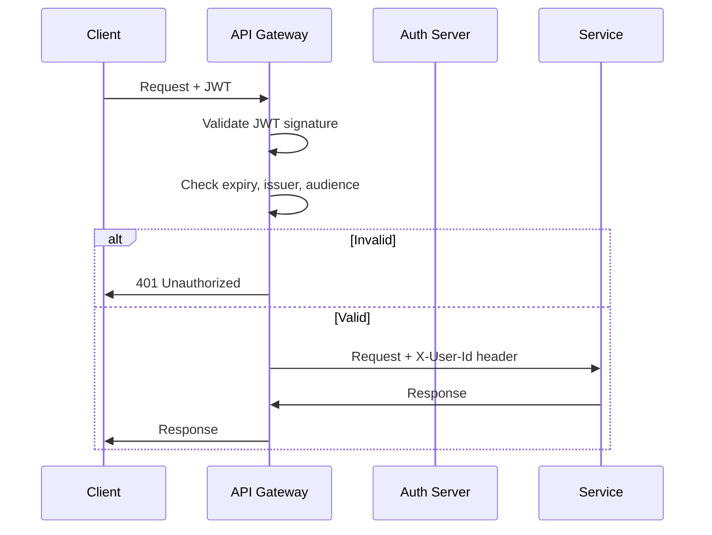
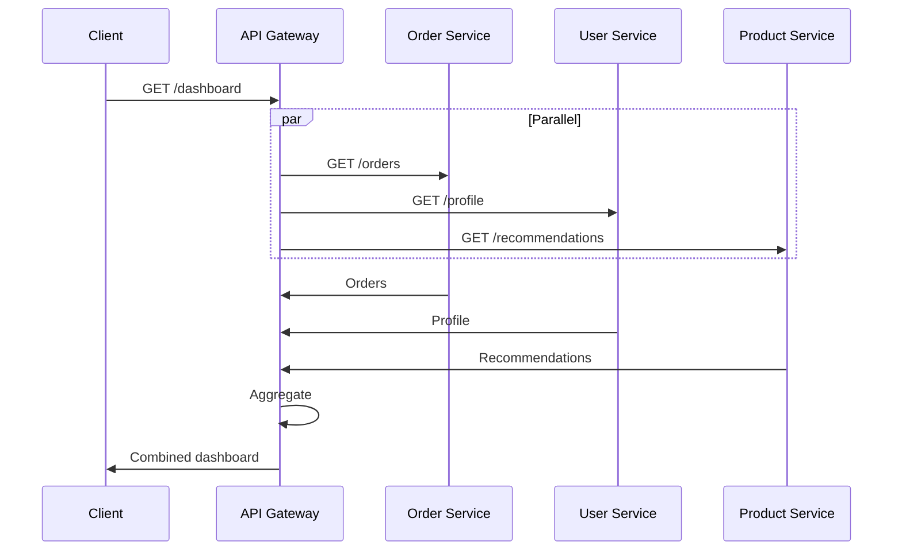
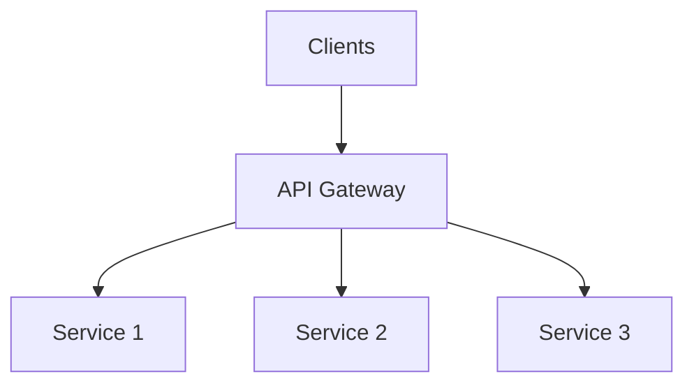
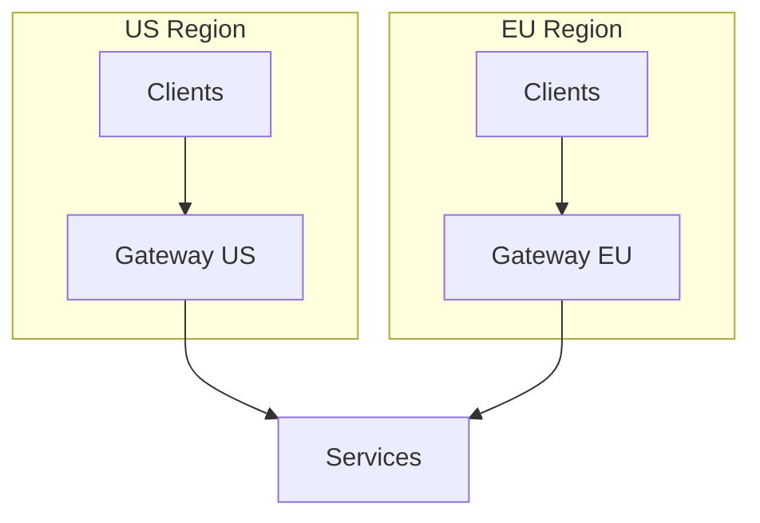
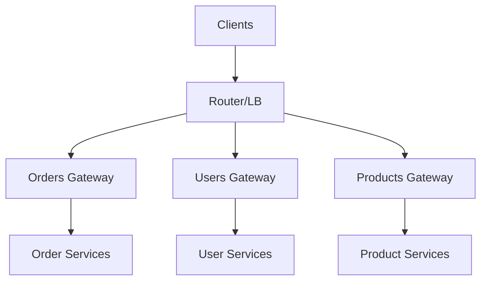

# API Gateway — Deep Dive

> **Level:** Intermediate  
> **Pre-reading:** [05 · API & Communication](05-api-communication.md)

---

## What is an API Gateway?

An **API Gateway** is a single entry point for all client requests. It handles cross-cutting concerns and routes requests to backend services.



---

## Core Responsibilities

| Responsibility | Description |
|:---------------|:------------|
| **Routing** | Direct requests to appropriate backend services |
| **Authentication** | Validate JWT/API keys before forwarding |
| **Authorization** | Check permissions for routes |
| **Rate Limiting** | Throttle per client/IP |
| **SSL Termination** | Handle TLS; internal traffic can be plain HTTP |
| **Load Balancing** | Distribute across service instances |
| **Caching** | Cache GET responses |
| **Request/Response Transform** | Modify headers, body shape |
| **Aggregation** | Combine multiple service responses |
| **Observability** | Centralized logging and metrics |

---

## Routing Patterns

### Path-Based Routing

```yaml
routes:
  - path: /api/orders/**
    service: order-service
  - path: /api/users/**
    service: user-service
  - path: /api/products/**
    service: product-service
```

### Header-Based Routing

```yaml
routes:
  - headers:
      X-API-Version: v2
    service: order-service-v2
  - headers:
      X-API-Version: v1
    service: order-service-v1
```

### Canary Routing

```yaml
routes:
  - path: /api/orders/**
    targets:
      - service: order-service-v1
        weight: 90
      - service: order-service-v2
        weight: 10
```

---

## Authentication at the Gateway

Validate tokens centrally; forward validated claims to services.



### Gateway JWT Configuration (Kong)

```yaml
plugins:
  - name: jwt
    config:
      claims_to_verify:
        - exp
      key_claim_name: kid
      secret_is_base64: false
  - name: request-transformer
    config:
      add:
        headers:
          - X-User-Id:$(jwt.claims.sub)
```

---

## Rate Limiting

Protect backend services from overload.

### Rate Limiting Strategies

| Strategy | Description |
|:---------|:------------|
| **Per client** | Limit by API key or user ID |
| **Per IP** | Limit by source IP |
| **Per route** | Different limits per endpoint |
| **Global** | Total gateway throughput |

### Rate Limiting Response

```http
HTTP/1.1 429 Too Many Requests
Retry-After: 30
X-RateLimit-Limit: 100
X-RateLimit-Remaining: 0
X-RateLimit-Reset: 1699900000
```

### Configuration (Kong)

```yaml
plugins:
  - name: rate-limiting
    config:
      minute: 100
      hour: 1000
      policy: redis
      redis_host: redis
```

---

## Request/Response Transformation

Modify requests before forwarding or responses before returning.

### Use Cases

| Transformation | Example |
|:---------------|:--------|
| **Add headers** | Add correlation ID, user context |
| **Remove headers** | Strip internal headers from response |
| **Rename fields** | Map external field names to internal |
| **Filter response** | Remove sensitive fields |

### Example (Kong)

```yaml
plugins:
  - name: request-transformer
    config:
      add:
        headers:
          - X-Request-ID:$(uuid)
          - X-Forwarded-Host:$(host)
      remove:
        headers:
          - X-Internal-Header
```

---

## Response Caching

Cache GET responses to reduce backend load.

```yaml
plugins:
  - name: proxy-cache
    config:
      strategy: memory
      content_type:
        - application/json
      cache_ttl: 300
      cache_control: true
```

### Cache Considerations

| Consideration | Recommendation |
|:--------------|:---------------|
| **TTL** | Short for dynamic data; longer for static |
| **Invalidation** | Use cache headers or explicit purge |
| **Vary headers** | Cache per user if response varies |
| **Storage** | Redis for distributed; memory for single instance |

---

## Gateway Aggregation

Combine responses from multiple services into one response.



### Aggregation Trade-offs

| Benefit | Cost |
|:--------|:-----|
| Single client request | Gateway complexity |
| Reduced latency (parallel calls) | Partial failure handling |
| Tailored response | Business logic at gateway edge |

---

## API Gateway Tools

| Tool | Type | Key Features |
|:-----|:-----|:-------------|
| **Kong** | OSS + Enterprise | Plugin ecosystem, declarative config |
| **AWS API Gateway** | Managed | Lambda integration, pay-per-request |
| **Spring Cloud Gateway** | OSS | Java-native, reactive, WebFlux |
| **Envoy** | OSS | High-performance, service mesh ready |
| **NGINX** | OSS + Commercial | Proven, lightweight |
| **Traefik** | OSS | K8s-native, auto-discovery |
| **Apigee** | Commercial | Full API management platform |

### Selection Criteria

| Factor | Consideration |
|:-------|:--------------|
| **Cloud native** | AWS API Gateway, GCP Cloud Endpoints |
| **Kubernetes** | Kong, Traefik, Ambassador |
| **Java ecosystem** | Spring Cloud Gateway |
| **Performance critical** | Envoy, NGINX |
| **Full API management** | Kong Enterprise, Apigee |

---

## Gateway Deployment Patterns

### Single Gateway



Simple; single point of failure.

### Regional Gateways



Lower latency; regional compliance.

### Gateway per Domain



Domain team ownership; avoid monolithic gateway.

---

## Anti-Patterns

| Anti-Pattern | Problem | Fix |
|:-------------|:--------|:----|
| **Business logic in gateway** | Gateway becomes monolith | Keep gateway thin |
| **Coupling to implementation** | Changes require gateway changes | Route by contract, not implementation |
| **No rate limiting** | DoS vulnerability | Always configure limits |
| **No timeout** | Stuck connections | Set upstream timeouts |
| **Monolithic gateway config** | Hard to manage | Modular configs per team |

---

## Gateway vs Service Mesh

| Aspect | API Gateway | Service Mesh |
|:-------|:------------|:-------------|
| **Traffic type** | North-south (external → cluster) | East-west (service → service) |
| **Deployment** | Edge of cluster | Sidecar per pod |
| **Scope** | External API concerns | Internal communication |
| **Examples** | Kong, AWS API Gateway | Istio, Linkerd |

Often used together: Gateway at edge, mesh for internal.

---

??? question "When should you use an API Gateway vs direct service calls?"
    Use a gateway when: (1) You need centralized auth, rate limiting, or logging. (2) Multiple clients with different needs. (3) You want to decouple clients from backend topology. Direct calls are fine for internal service-to-service (use service mesh instead).

??? question "How do you prevent the API Gateway from becoming a monolith?"
    (1) Keep business logic in services, not gateway. (2) Use gateway only for cross-cutting concerns. (3) Consider BFF pattern — gateway per client type. (4) Modular config — each team manages their routes. (5) Avoid aggregation that requires domain knowledge.

??? question "What happens when the API Gateway fails?"
    The gateway is a single point of failure. Mitigations: (1) High availability — multiple instances behind load balancer. (2) Health checks — remove unhealthy instances. (3) Circuit breaker — fail fast if backend down. (4) Regional failover — route to another region. (5) Client retry — with backoff.

