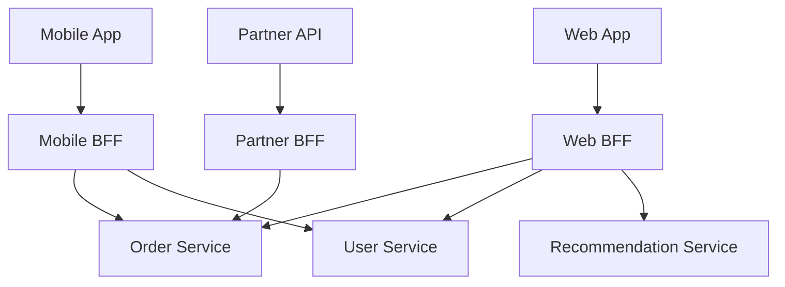
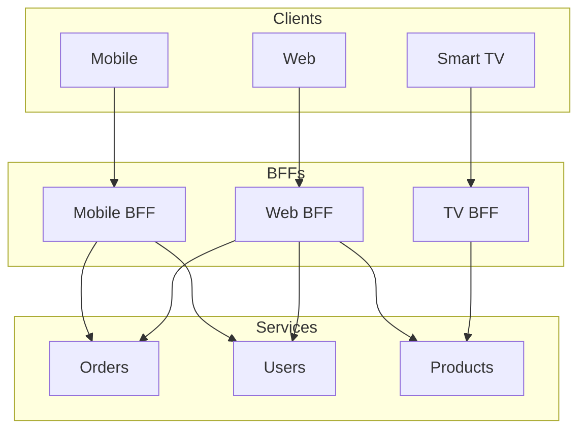
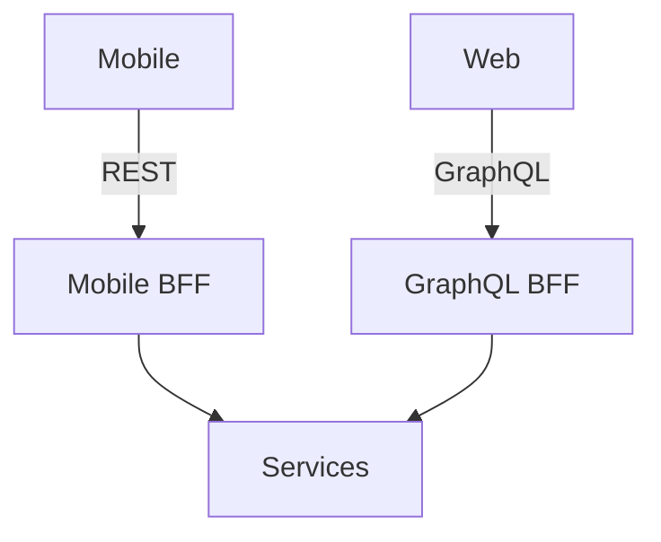
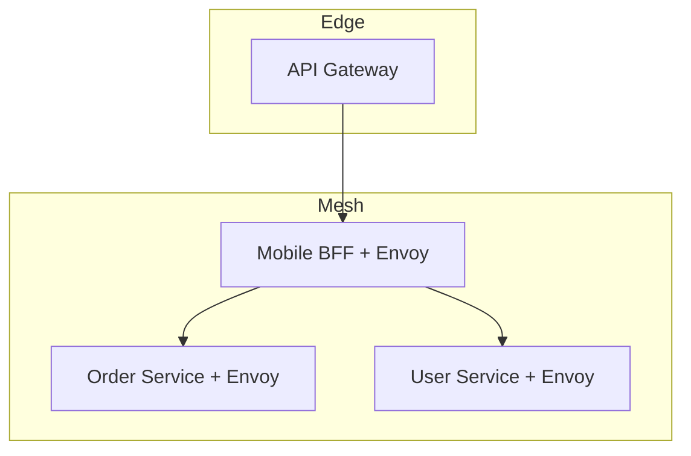

# Backend for Frontend (BFF) — Deep Dive

> **Level:** Intermediate  
> **Pre-reading:** [05 · API & Communication](05-api-communication.md) · [05.04 · API Gateway](05.04-api-gateway.md)

---

## What is BFF?

**Backend for Frontend** is a pattern where each client type gets its own dedicated backend API layer. Each BFF is tailored to its client's specific needs.



---

## Why BFF?

### The Problem with Single API

One generic API serving all clients leads to:

| Problem | Impact |
|:--------|:-------|
| **Over-fetching** | Mobile downloads data it doesn't need |
| **Under-fetching** | Web makes multiple calls for one view |
| **Conflicting requirements** | Mobile needs compact, web needs rich |
| **Versioning complexity** | Breaking change affects all clients |
| **Slow iteration** | Backend changes need coordination |

### BFF Solution

Each client gets an optimized API:

| Client | BFF Optimization |
|:-------|:-----------------|
| **Mobile** | Compact payloads, minimal calls, offline support |
| **Web** | Rich data, aggregated views, real-time updates |
| **Partner** | Stable contract, full documentation, rate limits |
| **Smart TV** | Paginated lists, image URLs, simple auth |

---

## BFF Responsibilities

| Responsibility | Description |
|:---------------|:------------|
| **Aggregation** | Combine data from multiple services |
| **Transformation** | Shape responses for client needs |
| **Protocol translation** | REST for mobile, GraphQL for web |
| **Client-specific auth** | Different auth flows per client |
| **Caching** | Cache strategies per client pattern |
| **Error handling** | Client-appropriate error messages |

---

## BFF Architecture

### Per-Client BFF



### BFF with GraphQL



GraphQL can act as a flexible BFF — clients query what they need.

---

## BFF Implementation

### Mobile BFF Example

```java
@RestController
@RequestMapping("/api/v1/dashboard")
public class MobileDashboardController {
    
    private final OrderClient orderClient;
    private final UserClient userClient;
    
    @GetMapping
    public MobileDashboardResponse getDashboard(@RequestHeader("X-User-Id") String userId) {
        // Parallel calls
        CompletableFuture<List<Order>> ordersFuture = 
            CompletableFuture.supplyAsync(() -> orderClient.getRecentOrders(userId, 5));
        CompletableFuture<User> userFuture = 
            CompletableFuture.supplyAsync(() -> userClient.getUser(userId));
        
        // Wait and combine
        List<Order> orders = ordersFuture.join();
        User user = userFuture.join();
        
        // Transform for mobile — compact payload
        return MobileDashboardResponse.builder()
            .userName(user.getFirstName())
            .orderCount(orders.size())
            .orders(orders.stream()
                .map(o -> MobileOrderSummary.builder()
                    .id(o.getId())
                    .status(o.getStatus())
                    .total(o.getTotal())
                    .build())
                .toList())
            .build();
    }
}
```

### Web BFF Example

```java
@RestController
@RequestMapping("/api/v1/dashboard")
public class WebDashboardController {
    
    @GetMapping
    public WebDashboardResponse getDashboard(@RequestHeader("X-User-Id") String userId) {
        // More data for web
        CompletableFuture<List<Order>> ordersFuture = 
            CompletableFuture.supplyAsync(() -> orderClient.getOrders(userId, 20));
        CompletableFuture<User> userFuture = 
            CompletableFuture.supplyAsync(() -> userClient.getUserWithPreferences(userId));
        CompletableFuture<List<Product>> recommendationsFuture = 
            CompletableFuture.supplyAsync(() -> recommendationClient.getForUser(userId));
        
        // Rich response for web
        return WebDashboardResponse.builder()
            .user(userFuture.join())  // Full user object
            .orders(ordersFuture.join().stream()
                .map(this::toDetailedOrder)  // Includes items, addresses
                .toList())
            .recommendations(recommendationsFuture.join())
            .analytics(getAnalytics(userId))
            .build();
    }
}
```

---

## BFF Ownership

| Model | Description | Trade-offs |
|:------|:------------|:-----------|
| **Frontend team owns BFF** | Mobile team owns Mobile BFF | Best alignment; may lack backend skills |
| **Fullstack team** | Team owns client + BFF | Fast iteration; team size grows |
| **Dedicated BFF team** | Central team manages all BFFs | Consistency; becomes bottleneck |
| **Platform team + contracts** | Platform provides framework; teams extend | Balance of control and flexibility |

!!! tip "Frontend team ownership preferred"
    The team building the client understands its needs best. They should control the BFF to iterate quickly.

---

## BFF vs API Gateway vs GraphQL

| Aspect | API Gateway | BFF | GraphQL |
|:-------|:------------|:----|:--------|
| **Purpose** | Cross-cutting concerns | Client-specific API | Flexible queries |
| **Aggregation** | Limited | Yes, per client | Yes, per query |
| **Transformation** | Basic | Full control | Client specifies |
| **Ownership** | Platform team | Frontend team | Backend team |
| **Complexity** | Low | Medium | Medium |
| **Use case** | Auth, rate limiting | Client optimization | Multiple clients, flexible |

### When to Use Each

| Scenario | Solution |
|:---------|:---------|
| **Centralized auth, rate limiting** | API Gateway |
| **Multiple clients, different needs** | BFF per client |
| **Flexible queries, one backend** | GraphQL |
| **All of the above** | Gateway → BFF → Services |

---

## BFF Anti-Patterns

| Anti-Pattern | Problem | Fix |
|:-------------|:--------|:----|
| **BFF with business logic** | Duplicates service logic | Keep business logic in services |
| **BFF calling BFF** | Complexity explosion | BFFs call services only |
| **Shared BFF for all clients** | Back to generic API problem | One BFF per client type |
| **BFF as data cache** | Stale data, consistency issues | Cache at edge or service level |
| **Too many BFFs** | Maintenance burden | Consolidate similar clients |

---

## BFF with Service Mesh

In a service mesh, BFFs are just services. They get the same benefits:



BFF sidecars handle mTLS, retries, and observability automatically.

---

## Testing BFFs

| Test Type | Focus |
|:----------|:------|
| **Unit** | Transformation logic |
| **Integration** | Service client mocking |
| **Contract** | BFF ↔ Service contracts (Pact) |
| **E2E** | Full client → BFF → Service flow |

### Contract Testing

```java
@Pact(consumer = "mobile-bff", provider = "order-service")
public RequestResponsePact getOrdersPact(PactDslWithProvider builder) {
    return builder
        .given("orders exist for user 123")
        .uponReceiving("a request for recent orders")
        .path("/orders")
        .query("userId=123&limit=5")
        .method("GET")
        .willRespondWith()
        .status(200)
        .body(newJsonArrayMinLike(1, order -> 
            order.stringType("id")
                 .stringType("status")))
        .toPact();
}
```

---

??? question "When should you use BFF vs a single API Gateway?"
    Use BFF when clients have **significantly different needs**: different data shapes, different aggregation, different auth flows. Use single gateway when clients are similar or the team doesn't want to maintain multiple services. Consider GraphQL as a middle ground — one backend, flexible queries.

??? question "Should the frontend team or backend team own the BFF?"
    **Frontend team** is generally preferred. They understand client needs best and can iterate quickly. However, they need backend skills (API design, service integration). A compromise: platform team provides a BFF framework; frontend teams extend it.

??? question "How do you avoid duplicating logic across multiple BFFs?"
    (1) **Keep business logic in services** — BFFs only aggregate and transform. (2) **Shared libraries** for common transformation logic. (3) **GraphQL** as a single flexible BFF. (4) Accept some duplication — it's the cost of client optimization.

