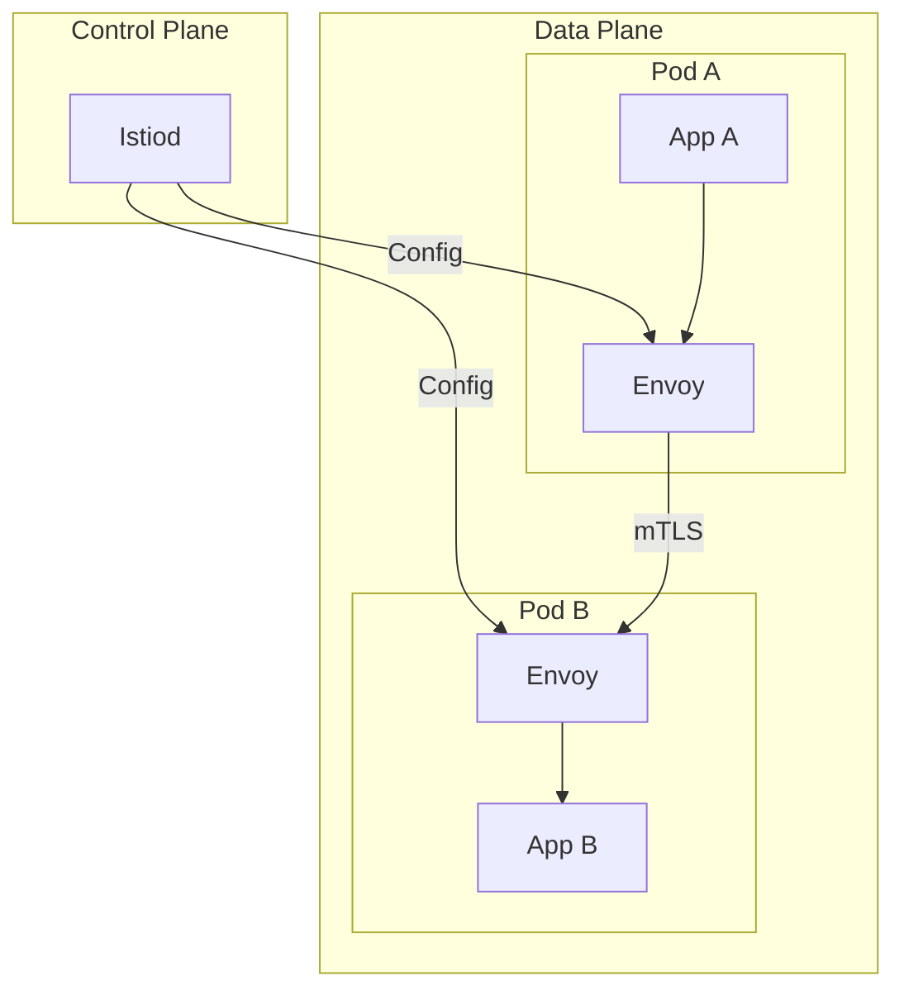
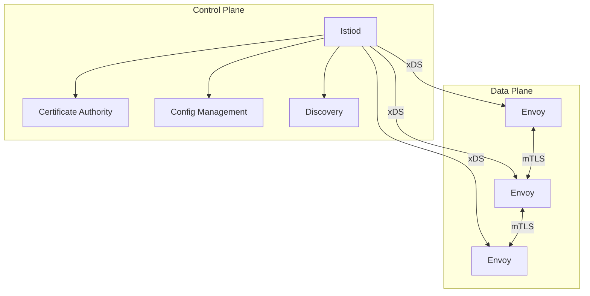
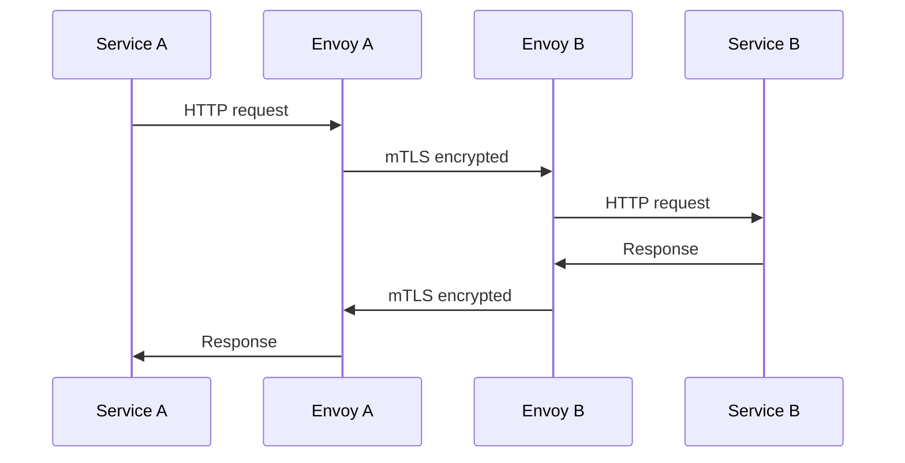
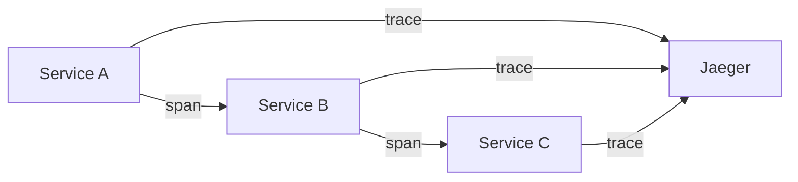

# Service Mesh — Deep Dive

> **Level:** Advanced  
> **Pre-reading:** [05 · API & Communication](05-api-communication.md) · [09 · Deployment & Infrastructure](09-deployment.md)

---

## What is a Service Mesh?

A **service mesh** is a dedicated infrastructure layer for handling service-to-service communication. It uses **sidecar proxies** deployed alongside each service.



---

## Why Service Mesh?

| Without Mesh | With Mesh |
|:-------------|:----------|
| Each service implements retries | Mesh handles retries |
| Each language needs its own circuit breaker library | Consistent across languages |
| mTLS implemented per service | Automatic mTLS |
| Distributed tracing requires code changes | Automatic trace propagation |
| Traffic management requires code | Declarative traffic rules |

---

## Service Mesh Components

### Data Plane

The **data plane** is the collection of sidecar proxies that intercept all network traffic.

| Component | Description |
|:----------|:------------|
| **Sidecar proxy** | Envoy, Linkerd proxy |
| **Traffic interception** | iptables rules redirect traffic |
| **Protocol handling** | HTTP/1.1, HTTP/2, gRPC, TCP |

### Control Plane

The **control plane** manages and configures the proxies.

| Component | Description |
|:----------|:------------|
| **Configuration API** | VirtualService, DestinationRule |
| **Service discovery** | Kubernetes API, Consul |
| **Certificate authority** | Issues mTLS certificates |
| **Telemetry collection** | Aggregates metrics, traces |

---

## Istio Architecture



| Istio Component | Purpose |
|:----------------|:--------|
| **Istiod** | Unified control plane (Pilot, Citadel, Galley) |
| **Envoy** | Sidecar proxy |
| **Gateway** | Ingress/egress traffic |

---

## Traffic Management

### VirtualService

Define routing rules for traffic.

```yaml
apiVersion: networking.istio.io/v1beta1
kind: VirtualService
metadata:
  name: orders
spec:
  hosts:
    - order-service
  http:
    - match:
        - headers:
            x-canary:
              exact: "true"
      route:
        - destination:
            host: order-service
            subset: v2
    - route:
        - destination:
            host: order-service
            subset: v1
          weight: 90
        - destination:
            host: order-service
            subset: v2
          weight: 10
```

### DestinationRule

Define policies for traffic to a destination.

```yaml
apiVersion: networking.istio.io/v1beta1
kind: DestinationRule
metadata:
  name: orders
spec:
  host: order-service
  trafficPolicy:
    connectionPool:
      http:
        h2UpgradePolicy: UPGRADE
        http1MaxPendingRequests: 100
    loadBalancer:
      simple: LEAST_CONN
    outlierDetection:
      consecutive5xxErrors: 5
      interval: 30s
      baseEjectionTime: 60s
  subsets:
    - name: v1
      labels:
        version: v1
    - name: v2
      labels:
        version: v2
```

---

## Resilience Features

### Circuit Breaking

```yaml
trafficPolicy:
  outlierDetection:
    consecutive5xxErrors: 5
    interval: 10s
    baseEjectionTime: 30s
    maxEjectionPercent: 50
```

### Retries

```yaml
http:
  - route:
      - destination:
          host: order-service
    retries:
      attempts: 3
      perTryTimeout: 2s
      retryOn: 5xx,reset,connect-failure
```

### Timeouts

```yaml
http:
  - route:
      - destination:
          host: order-service
    timeout: 10s
```

---

## Security: mTLS

Service mesh provides **mutual TLS** automatically.



### PeerAuthentication

```yaml
apiVersion: security.istio.io/v1beta1
kind: PeerAuthentication
metadata:
  name: default
  namespace: production
spec:
  mtls:
    mode: STRICT  # Require mTLS for all services
```

### AuthorizationPolicy

```yaml
apiVersion: security.istio.io/v1beta1
kind: AuthorizationPolicy
metadata:
  name: order-service-policy
spec:
  selector:
    matchLabels:
      app: order-service
  rules:
    - from:
        - source:
            principals: ["cluster.local/ns/production/sa/payment-service"]
      to:
        - operation:
            methods: ["GET", "POST"]
            paths: ["/api/orders/*"]
```

---

## Observability

Service mesh provides observability without code changes.

### Metrics (Prometheus)

```yaml
# Istio exports these automatically
istio_requests_total{...}
istio_request_duration_milliseconds{...}
istio_tcp_connections_opened_total{...}
```

### Distributed Tracing



Envoy propagates trace headers automatically (B3, W3C TraceContext).

### Access Logs

```json
{
  "protocol": "HTTP/2",
  "upstream_service": "order-service",
  "response_code": 200,
  "response_flags": "-",
  "duration": 45,
  "request_id": "abc-123"
}
```

---

## Service Mesh Options

| Mesh | Proxy | Key Features |
|:-----|:------|:-------------|
| **Istio** | Envoy | Full-featured; complex |
| **Linkerd** | Linkerd2-proxy | Lightweight; simpler |
| **Consul Connect** | Envoy | HashiCorp ecosystem |
| **AWS App Mesh** | Envoy | AWS-native |
| **Kuma** | Envoy | CNCF; multi-cluster |

### Selection Criteria

| Factor | Recommendation |
|:-------|:---------------|
| **Simplicity** | Linkerd |
| **Features** | Istio |
| **AWS native** | App Mesh |
| **Multi-cloud** | Istio, Kuma |
| **Existing HashiCorp** | Consul Connect |

---

## When to Use Service Mesh

### Good Fit

| Scenario | Why Mesh Helps |
|:---------|:---------------|
| **10+ microservices** | Consistent policies at scale |
| **Polyglot services** | Language-agnostic features |
| **Zero-trust security** | Automatic mTLS |
| **Complex traffic management** | Canary, A/B, fault injection |
| **Observability gaps** | Automatic metrics and traces |

### Poor Fit

| Scenario | Why Not |
|:---------|:--------|
| **< 5 services** | Overhead not justified |
| **Simple routing** | K8s Services suffice |
| **Resource constrained** | Sidecar overhead |
| **Team unfamiliar** | Learning curve |

---

## Mesh Overhead

| Resource | Per Pod | Notes |
|:---------|:--------|:------|
| **Memory** | 50-100 MB | Envoy sidecar |
| **CPU** | 0.1-0.2 cores | Processing traffic |
| **Latency** | 1-3 ms | Additional hop |

---

## Anti-Patterns

| Anti-Pattern | Problem | Fix |
|:-------------|:--------|:----|
| **Mesh for everything** | Overhead on simple apps | Use mesh where needed |
| **Ignoring sidecar health** | App works, mesh doesn't | Include sidecar in health checks |
| **Complex routing logic** | Hard to understand | Keep routing simple |
| **No gradual rollout** | Breaking changes | Canary the mesh itself |

---

??? question "When should you use a service mesh vs implementing resilience in the application?"
    Use a **service mesh** when: (1) You have many services in different languages. (2) You need consistent mTLS. (3) You want observability without code changes. Use **application libraries** (Resilience4j) when: (1) Homogeneous stack. (2) Fine-grained control needed. (3) Sidecar overhead unacceptable.

??? question "What's the difference between Istio and Linkerd?"
    **Istio** is feature-rich (traffic management, security, observability) but complex. Uses Envoy, resource-heavy. **Linkerd** is lightweight, simpler, focuses on reliability. Custom Rust proxy, lower overhead. Choose Istio for features; Linkerd for simplicity.

??? question "How does mTLS work in a service mesh?"
    (1) Control plane acts as **Certificate Authority** — issues short-lived certs to each workload. (2) Certs are rotated automatically (every 24h typically). (3) Sidecars **intercept traffic** and establish mTLS connections. (4) **PeerAuthentication** policy enforces mTLS mode (STRICT, PERMISSIVE). (5) **AuthorizationPolicy** controls which services can communicate.

