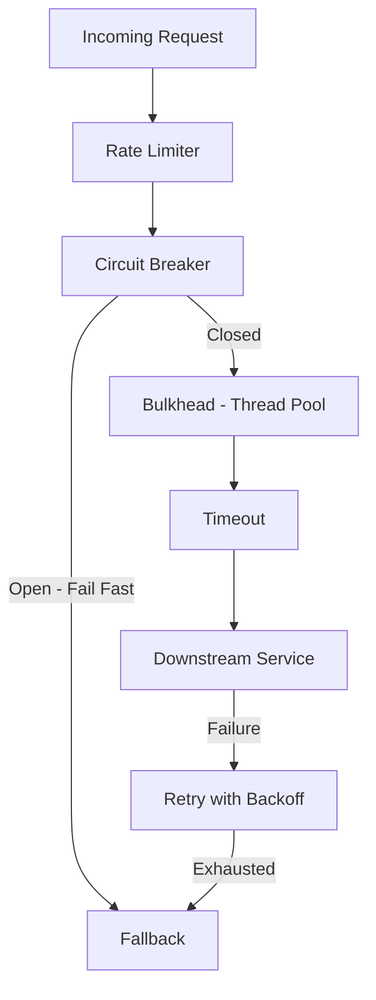
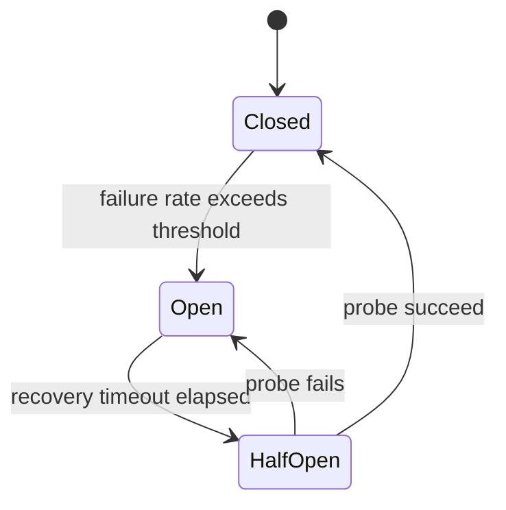

# Resilience & Reliability

> In distributed systems, failure is not an exception — it's the norm. Design for it explicitly.

---

## Resilience Patterns Overview

---

## Circuit Breaker

**States:**

| State | Behavior | Transition |
|-------|---------|-----------|
| **Closed** | Requests pass through; failures counted | → Open when threshold exceeded |
| **Open** | All requests fail immediately (fast fail); no calls made | → Half-Open after recovery timeout |
| **Half-Open** | Limited probe requests sent to test recovery | → Closed if success; → Open if fails |

- **Threshold:** Open after N failures or X% error rate in a sliding time window
- **Libraries:** Resilience4j (Spring Boot), Polly (.NET); Hystrix is deprecated
- **Key insight:** Circuit breaker *prevents* cascading failure; retry *recovers* from transient failure

---

## Retry Pattern

| Concept | Description |
|---------|-------------|
| **Exponential backoff** | Wait time doubles on each retry: 1s, 2s, 4s, 8s... |
| **Jitter** | Add random variance to backoff — prevents thundering herd when all clients retry simultaneously |
| **Max retries** | Always cap retries; uncapped = infinite load on a struggling service |
| **Idempotency required** | Only retry operations that are safe to repeat without side effects |
| **Retryable errors** | 503, 429, connection timeout — NOT 4xx client errors |

> **Thundering herd:** All clients retry simultaneously after a failure, causing a traffic spike that re-causes the failure. Jitter solves this.

---

## Bulkhead Pattern

> Isolate resources so a failure in one area cannot exhaust the entire system.

| Type | Implementation |
|------|---------------|
| **Thread pool isolation** | Separate thread pool per downstream dependency; one slow service can't starve all others |
| **Connection pool isolation** | Separate DB/HTTP connection pool per consumer group |
| **Process isolation** | Separate deployments for critical vs non-critical paths (pricing can't kill checkout) |

Named after the watertight compartments in a ship hull.

---

## Timeout Pattern

| Type | Description |
|------|-------------|
| **Connect timeout** | Max time to establish a TCP connection |
| **Read timeout** | Max time to receive a complete response |
| **Write timeout** | Max time to send a request body |
| **Deadline propagation** | Pass remaining timeout budget through service call chains (`grpc-timeout`, `X-Request-Deadline`) |

> Always set timeouts. An unconfigured timeout = each thread waiting indefinitely = thread pool exhaustion = service outage.

---

## Rate Limiting & Throttling

| Algorithm | How It Works | Properties |
|-----------|-------------|-----------|
| **Token Bucket** | Tokens refill at fixed rate; consume one per request; burst allowed up to bucket size | Smooth average; allows bursts |
| **Sliding Window** | Count requests in rolling time window | Precise; more memory |
| **Fixed Window** | Count resets at fixed interval | Simple; allows burst at boundary |
| **Leaky Bucket** | Requests queued and processed at fixed rate | Smoothest output; no burst |

- Response: **429 Too Many Requests**
- Response headers: `Retry-After`, `X-RateLimit-Limit`, `X-RateLimit-Remaining`

---

## Fallback Pattern

| Type | Description | Example |
|------|-------------|---------|
| **Default value** | Return sensible constant | Empty product list, default price |
| **Cached response** | Return last known good response | Product details cache |
| **Degraded mode** | Return partial data; skip non-critical sections | Show order without real-time stock |
| **Stub response** | Hardcoded response for maintenance or testing | Feature flag disabled |

---

## Idempotency

| Concept | Description |
|---------|-------------|
| **Idempotent operation** | Call it N times = same result as calling it once |
| **Idempotency key** | Client generates unique UUID per request; server stores it and deduplicates |
| **HTTP verbs** | GET, PUT, DELETE are idempotent by specification; POST is not |
| **Why it matters** | Enables safe retries in at-least-once messaging; prevents duplicate charges |

---

## Health Checks

| Type | Question | Kubernetes Probe |
|------|---------|-----------------|
| **Liveness** | Is the app alive and not deadlocked? | `livenessProbe` — restart pod if fails |
| **Readiness** | Is the app ready to serve traffic? | `readinessProbe` — remove from load balancer if fails |
| **Startup** | Has the app finished its slow initialization? | `startupProbe` — delays liveness/readiness checks |

---

## Backpressure

| Concept | Description |
|---------|-------------|
| **Problem** | Fast producer overwhelms a slow consumer |
| **Solution** | Producer slows down or stops when consumer signals it's overwhelmed |
| **Reactive Streams** | `Publisher`, `Subscriber`, `Subscription` protocol — backpressure built in |
| **Kafka signal** | Monitor consumer lag; alert when partition lag grows unbounded |

---

## Chaos Engineering

| Concept | Description |
|---------|-------------|
| **Steady state** | Define and measure normal behavior before injecting failures |
| **Blast radius** | Start small; inject failure in one pod, one AZ, one service |
| **Fault types** | Kill pods, add network latency, drop packets, exhaust resources |
| **Tools** | Netflix Chaos Monkey, Chaos Toolkit, AWS Fault Injection Simulator, Litmus (K8s) |
| **Goal** | Verify resilience claims before incidents do it for you |
