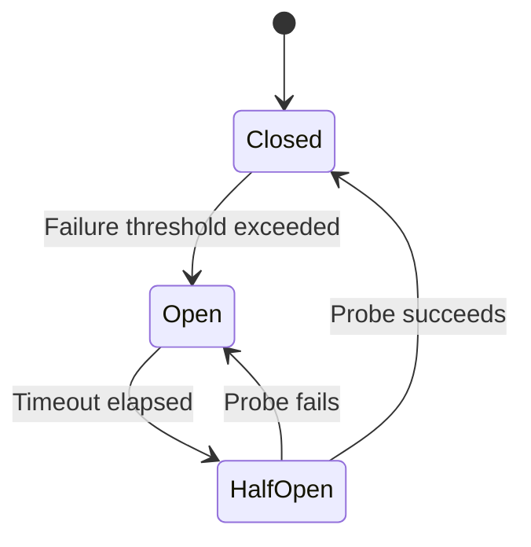

# Circuit Breaker — Deep Dive

> **Level:** Intermediate  
> **Pre-reading:** [06 · Resilience & Reliability](06-resilience.md)

---

## What is a Circuit Breaker?

A **circuit breaker** prevents cascading failures by failing fast when a downstream service is unhealthy. Like an electrical circuit breaker, it "trips" when problems are detected.



---

## Circuit Breaker States

| State | Behavior | Transition |
|:------|:---------|:-----------|
| **Closed** | Requests flow through; failures counted | → Open when threshold exceeded |
| **Open** | Requests fail immediately; no calls made | → Half-Open after timeout |
| **Half-Open** | Limited probe requests sent | → Closed if success; → Open if fail |

---

## Configuration Parameters

| Parameter | Description | Typical Value |
|:----------|:------------|:--------------|
| **Failure rate threshold** | % of failures to trip circuit | 50% |
| **Slow call rate threshold** | % of slow calls to trip | 80% |
| **Slow call duration** | Definition of "slow" | 2 seconds |
| **Minimum calls** | Min calls before evaluating | 10 |
| **Sliding window size** | Time or count window | 100 calls or 10 seconds |
| **Wait duration in open** | Time before half-open | 60 seconds |
| **Permitted calls in half-open** | Probe requests | 10 |

---

## Resilience4j Implementation

### Configuration

```java
@Configuration
public class CircuitBreakerConfig {
    
    @Bean
    public CircuitBreakerRegistry circuitBreakerRegistry() {
        CircuitBreakerConfig config = CircuitBreakerConfig.custom()
            .failureRateThreshold(50)
            .slowCallRateThreshold(80)
            .slowCallDurationThreshold(Duration.ofSeconds(2))
            .waitDurationInOpenState(Duration.ofSeconds(60))
            .permittedNumberOfCallsInHalfOpenState(10)
            .slidingWindowType(SlidingWindowType.COUNT_BASED)
            .slidingWindowSize(100)
            .minimumNumberOfCalls(10)
            .build();
        
        return CircuitBreakerRegistry.of(config);
    }
}
```

### Usage with Annotation

```java
@Service
public class OrderService {
    
    @CircuitBreaker(name = "paymentService", fallbackMethod = "paymentFallback")
    public PaymentResult processPayment(Order order) {
        return paymentClient.charge(order);
    }
    
    private PaymentResult paymentFallback(Order order, Exception e) {
        log.warn("Payment service unavailable, queuing order: {}", order.getId());
        paymentQueue.enqueue(order);
        return PaymentResult.pending();
    }
}
```

### Programmatic Usage

```java
CircuitBreaker circuitBreaker = registry.circuitBreaker("paymentService");

Supplier<PaymentResult> decorated = CircuitBreaker
    .decorateSupplier(circuitBreaker, () -> paymentClient.charge(order));

Try<PaymentResult> result = Try.ofSupplier(decorated)
    .recover(CallNotPermittedException.class, e -> PaymentResult.pending());
```

---

## Sliding Window Types

### Count-Based

Track last N calls regardless of time.

```java
.slidingWindowType(SlidingWindowType.COUNT_BASED)
.slidingWindowSize(100)  // Last 100 calls
```

### Time-Based

Track calls within a time window.

```java
.slidingWindowType(SlidingWindowType.TIME_BASED)
.slidingWindowSize(10)  // Last 10 seconds
```

| Type | Use When |
|:-----|:---------|
| **Count-based** | Consistent traffic volume |
| **Time-based** | Variable traffic; want time-based evaluation |

---

## Circuit Breaker vs Retry

| Pattern | Purpose | When to Use |
|:--------|:--------|:------------|
| **Retry** | Recover from transient failures | Temporary issues (network blip) |
| **Circuit Breaker** | Prevent calling failing service | Sustained failures (service down) |

**Use together:** Retry first, circuit breaker wraps retry.

```java
@CircuitBreaker(name = "paymentService")
@Retry(name = "paymentService")
public PaymentResult processPayment(Order order) {
    return paymentClient.charge(order);
}
```

Order of execution: Retry → Circuit Breaker → Bulkhead → Rate Limiter

---

## Monitoring

### Metrics (Prometheus)

```
# Circuit breaker state
resilience4j_circuitbreaker_state{name="paymentService"} 0  # 0=closed, 1=open, 2=half-open

# Failure rate
resilience4j_circuitbreaker_failure_rate{name="paymentService"} 5.5

# Calls
resilience4j_circuitbreaker_calls_total{name="paymentService", kind="successful"} 1000
resilience4j_circuitbreaker_calls_total{name="paymentService", kind="failed"} 50
resilience4j_circuitbreaker_calls_total{name="paymentService", kind="not_permitted"} 200
```

### Events

```java
circuitBreaker.getEventPublisher()
    .onStateTransition(event -> 
        log.info("Circuit breaker {} transitioned from {} to {}",
            event.getCircuitBreakerName(),
            event.getStateTransition().getFromState(),
            event.getStateTransition().getToState()));
```

---

## Fallback Strategies

| Strategy | Example |
|:---------|:--------|
| **Default value** | Return empty list, default price |
| **Cached response** | Return last known good response |
| **Graceful degradation** | Skip non-critical feature |
| **Queue for later** | Save request for retry |
| **Alternative service** | Call backup service |

### Fallback Example

```java
@CircuitBreaker(name = "recommendations", fallbackMethod = "recommendationsFallback")
public List<Product> getRecommendations(String userId) {
    return recommendationService.getPersonalized(userId);
}

// Fallback returns cached popular products
private List<Product> recommendationsFallback(String userId, Exception e) {
    return cache.get("popular-products", () -> productService.getPopular());
}
```

---

## Circuit Breaker Patterns

### Per-Service Circuit Breaker

One circuit breaker per downstream service.

```java
@CircuitBreaker(name = "paymentService")
public PaymentResult charge(Order order) { ... }

@CircuitBreaker(name = "inventoryService")
public boolean reserve(Order order) { ... }
```

### Per-Operation Circuit Breaker

Different thresholds for different operations.

```java
CircuitBreakerConfig criticalConfig = CircuitBreakerConfig.custom()
    .failureRateThreshold(25)  // More sensitive
    .waitDurationInOpenState(Duration.ofSeconds(30))
    .build();

CircuitBreakerConfig normalConfig = CircuitBreakerConfig.custom()
    .failureRateThreshold(50)
    .waitDurationInOpenState(Duration.ofSeconds(60))
    .build();
```

---

## Service Mesh Circuit Breaking

Istio/Envoy provides circuit breaking at the infrastructure level.

```yaml
apiVersion: networking.istio.io/v1beta1
kind: DestinationRule
metadata:
  name: payment-service
spec:
  host: payment-service
  trafficPolicy:
    outlierDetection:
      consecutive5xxErrors: 5
      interval: 10s
      baseEjectionTime: 30s
      maxEjectionPercent: 50
```

| Aspect | Application Level | Service Mesh |
|:-------|:------------------|:-------------|
| **Language** | Requires library | Language agnostic |
| **Granularity** | Per method/operation | Per service |
| **Fallback logic** | Yes | No (just fail) |
| **Configuration** | In code/config | Kubernetes resources |

---

## Common Mistakes

| Mistake | Impact | Fix |
|:--------|:-------|:----|
| **Threshold too high** | Circuit never trips | Lower to 50% or less |
| **Threshold too low** | False positives | Increase minimum calls |
| **No fallback** | Error propagates | Always provide fallback |
| **Same config for all** | Suboptimal behavior | Tune per service |
| **Not monitoring** | Don't know state | Add metrics and alerts |

---

??? question "What's the difference between circuit breaker and retry?"
    **Retry** handles transient failures by repeating the request. **Circuit breaker** handles sustained failures by failing fast and not calling the unhealthy service. Use retry for temporary issues; circuit breaker prevents overwhelming a struggling service. Use both together: retry wraps the call, circuit breaker wraps retry.

??? question "How do you tune circuit breaker thresholds?"
    Start with defaults (50% failure rate, 60s open duration). Monitor in production. If false positives: increase minimum calls or threshold. If slow to trip: decrease threshold. If too long in open: decrease wait duration. Tune per service based on its SLA and failure patterns.

??? question "Should you use application-level or service mesh circuit breakers?"
    Use **both**. Service mesh (Istio) provides baseline protection without code changes and works across languages. Application-level (Resilience4j) provides fallback logic and fine-grained control. Mesh catches infrastructure failures; application handles business logic degradation.

