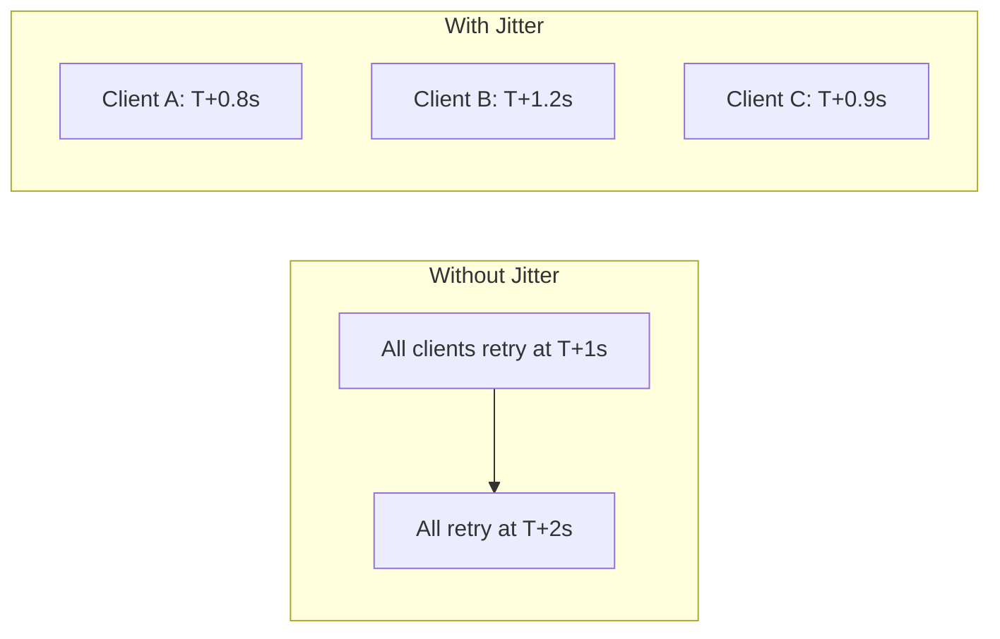

# Retry Pattern — Deep Dive

> **Level:** Intermediate  
> **Pre-reading:** [06 · Resilience & Reliability](06-resilience.md)

---

## What is Retry?

**Retry** handles transient failures by automatically repeating a failed request. It's effective for temporary issues like network blips or momentary overload.

---

## Retry Strategy Components

| Component | Description |
|:----------|:------------|
| **Max retries** | Maximum number of attempts |
| **Backoff** | Wait time between retries |
| **Jitter** | Random variance to prevent thundering herd |
| **Retryable exceptions** | Which errors to retry |

---

## Backoff Strategies

### Fixed Backoff

Wait the same time between each retry.

```
Attempt 1 → fail → wait 1s → Attempt 2 → fail → wait 1s → Attempt 3
```

### Exponential Backoff

Wait time doubles with each retry.

```
Attempt 1 → fail → wait 1s → Attempt 2 → fail → wait 2s → Attempt 3 → fail → wait 4s → Attempt 4
```

### Exponential with Jitter

Add randomness to prevent synchronized retries.

```
Attempt 1 → fail → wait 1.2s → Attempt 2 → fail → wait 2.7s → Attempt 3
```



---

## Jitter Strategies

| Strategy | Formula | Use Case |
|:---------|:--------|:---------|
| **Full jitter** | `random(0, base * 2^attempt)` | Best for most cases |
| **Equal jitter** | `base * 2^attempt / 2 + random(0, base * 2^attempt / 2)` | Guaranteed minimum wait |
| **Decorrelated jitter** | `min(cap, random(base, sleep * 3))` | AWS recommended |

---

## Resilience4j Implementation

### Configuration

```java
@Configuration
public class RetryConfig {
    
    @Bean
    public RetryRegistry retryRegistry() {
        RetryConfig config = RetryConfig.custom()
            .maxAttempts(3)
            .waitDuration(Duration.ofMillis(500))
            .exponentialBackoff(2, Duration.ofSeconds(10))
            .randomizedWait(true)  // Jitter
            .retryOnResult(response -> response.getStatus() == 503)
            .retryExceptions(IOException.class, TimeoutException.class)
            .ignoreExceptions(IllegalArgumentException.class)
            .build();
        
        return RetryRegistry.of(config);
    }
}
```

### Usage

```java
@Service
public class PaymentService {
    
    @Retry(name = "paymentRetry", fallbackMethod = "paymentFallback")
    public PaymentResult processPayment(Order order) {
        return paymentClient.charge(order);
    }
    
    private PaymentResult paymentFallback(Order order, Exception e) {
        log.error("Payment failed after retries: {}", e.getMessage());
        throw new PaymentFailedException(e);
    }
}
```

### Programmatic Usage

```java
Retry retry = Retry.of("paymentRetry", RetryConfig.custom()
    .maxAttempts(3)
    .waitDuration(Duration.ofMillis(500))
    .build());

Supplier<PaymentResult> retryingSupplier = Retry
    .decorateSupplier(retry, () -> paymentClient.charge(order));

PaymentResult result = retryingSupplier.get();
```

---

## Retryable vs Non-Retryable Errors

| Retryable | Non-Retryable |
|:----------|:--------------|
| **503 Service Unavailable** | **400 Bad Request** |
| **429 Too Many Requests** | **401 Unauthorized** |
| **Connection timeout** | **403 Forbidden** |
| **Network error** | **404 Not Found** |
| **Circuit breaker open** | **422 Unprocessable Entity** |

### HTTP Status Code Retry Logic

```java
RetryConfig config = RetryConfig.custom()
    .retryOnResult(response -> {
        int status = response.getStatusCode();
        return status == 503 || status == 429 || status == 502;
    })
    .build();
```

---

## Idempotency Requirement

**Only retry idempotent operations.** Retrying non-idempotent operations can cause duplicates.

| Operation | Idempotent? | Safe to Retry? |
|:----------|:------------|:---------------|
| **GET /orders/123** | Yes | Yes |
| **DELETE /orders/123** | Yes | Yes |
| **PUT /orders/123 (replace)** | Yes | Yes |
| **POST /orders (create)** | No | With idempotency key |
| **POST /payments (charge)** | No | With idempotency key |

### Idempotency Key Pattern

```java
public PaymentResult chargeWithRetry(Order order) {
    String idempotencyKey = "payment-" + order.getId();
    
    return retry.executeSupplier(() -> 
        paymentClient.charge(order, idempotencyKey)
    );
}
```

Server stores results by idempotency key:

```java
@PostMapping("/payments")
public PaymentResult charge(@RequestHeader("Idempotency-Key") String key,
                           @RequestBody PaymentRequest request) {
    // Check if already processed
    Optional<PaymentResult> existing = paymentRepository.findByIdempotencyKey(key);
    if (existing.isPresent()) {
        return existing.get();  // Return cached result
    }
    
    // Process new payment
    PaymentResult result = processPayment(request);
    paymentRepository.saveWithKey(key, result);
    return result;
}
```

---

## Retry with Circuit Breaker

Use retry for transient failures; circuit breaker for sustained failures.

```java
@CircuitBreaker(name = "paymentService")
@Retry(name = "paymentService")
public PaymentResult processPayment(Order order) {
    return paymentClient.charge(order);
}
```

**Execution order:** Retry is innermost; Circuit Breaker wraps it.

```
Request → CircuitBreaker → Retry → Actual Call
                             ↓
                        (retries on transient failure)
                             ↓
                    (if all retries fail, circuit breaker counts as failure)
```

---

## Retry in HTTP Clients

### Spring WebClient

```java
WebClient.builder()
    .filter(ExchangeFilterFunction.ofResponseProcessor(response -> {
        if (response.statusCode().is5xxServerError()) {
            return Mono.error(new RetryableException());
        }
        return Mono.just(response);
    }))
    .build()
    .get()
    .uri("/api/orders/{id}", orderId)
    .retrieve()
    .bodyToMono(Order.class)
    .retryWhen(Retry
        .backoff(3, Duration.ofMillis(500))
        .maxBackoff(Duration.ofSeconds(10))
        .jitter(0.5)
        .filter(e -> e instanceof RetryableException));
```

### Feign with Resilience4j

```java
@FeignClient(name = "payment-service")
public interface PaymentClient {
    
    @Retry(name = "paymentService")
    @PostMapping("/payments")
    PaymentResult charge(@RequestBody PaymentRequest request);
}
```

---

## Monitoring Retries

### Metrics

```
resilience4j_retry_calls_total{name="paymentService", kind="successful_without_retry"} 900
resilience4j_retry_calls_total{name="paymentService", kind="successful_with_retry"} 80
resilience4j_retry_calls_total{name="paymentService", kind="failed_with_retry"} 20
```

### Alerting

| Metric | Alert Condition |
|:-------|:----------------|
| **Retry rate** | > 10% of calls need retry |
| **Max retries exhausted** | > 1% of calls fail after all retries |
| **Retry latency impact** | p99 latency increased significantly |

---

## Common Mistakes

| Mistake | Impact | Fix |
|:--------|:-------|:----|
| **No max retries** | Infinite retry loop | Always cap retries |
| **No backoff** | Overwhelms failing service | Add exponential backoff |
| **No jitter** | Thundering herd on recovery | Add randomized wait |
| **Retry non-idempotent** | Duplicate side effects | Use idempotency keys |
| **Retry client errors (4xx)** | Wasted retries | Only retry transient errors |

---

??? question "What is the thundering herd problem and how does jitter solve it?"
    When many clients fail simultaneously and retry at the same time (e.g., all retry at T+1s), they create a **thundering herd** that overwhelms the recovering service. **Jitter** adds random variance to retry timing, spreading out retry attempts and giving the service time to recover.

??? question "Should you retry on timeout?"
    Yes, timeouts are often transient — the server may have been briefly overloaded. But: (1) Use shorter timeout for retries. (2) Check if operation is idempotent. (3) The original request may have succeeded — use idempotency keys for writes. (4) Consider if the operation is time-sensitive.

??? question "How do retry and circuit breaker work together?"
    **Retry** handles individual transient failures. **Circuit breaker** handles sustained failures across multiple requests. When a request fails, retry attempts it again. If all retries fail, the circuit breaker counts it as a failure. When enough failures accumulate, the circuit breaker opens and prevents further calls (including retries).

