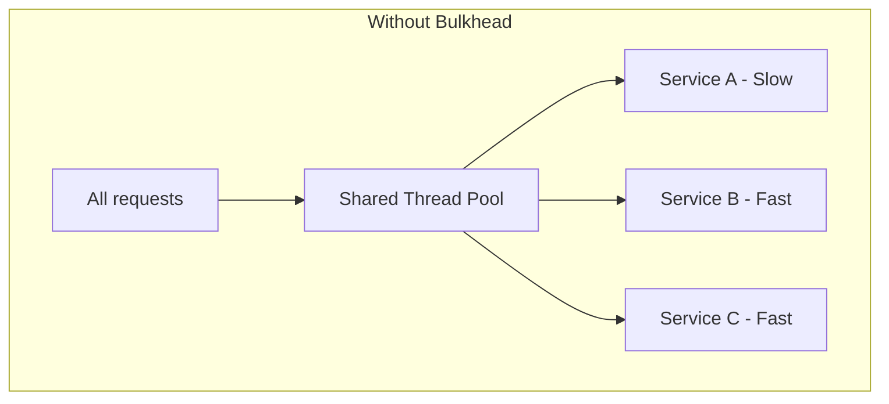
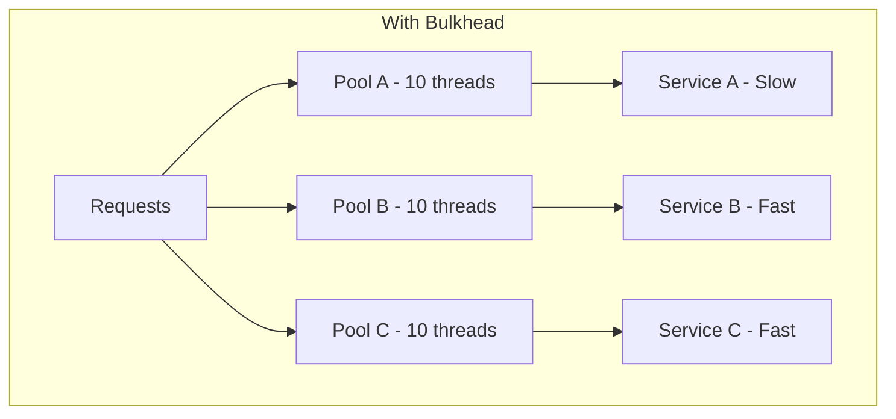
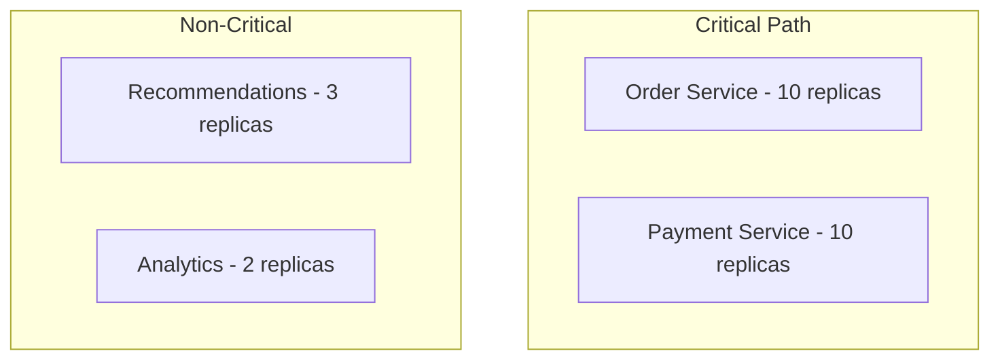

# Bulkhead Pattern — Deep Dive

> **Level:** Intermediate  
> **Pre-reading:** [06 · Resilience & Reliability](06-resilience.md)

---

## What is Bulkhead?

**Bulkhead** isolates resources so a failure in one area doesn't exhaust resources for the entire system. Named after watertight compartments in a ship — if one floods, the others stay dry.





---

## Bulkhead Types

### Thread Pool Bulkhead

Each service call has a dedicated thread pool.

| Service | Thread Pool | Max Concurrent |
|:--------|:------------|:---------------|
| Payment Service | payment-pool | 20 threads |
| Inventory Service | inventory-pool | 10 threads |
| Notification Service | notification-pool | 5 threads |

**Benefit:** Slow service only exhausts its pool.

### Semaphore Bulkhead

Limit concurrent calls without dedicated threads. Lighter weight.

```java
Semaphore semaphore = new Semaphore(10);  // Max 10 concurrent

public Result call() {
    if (semaphore.tryAcquire(100, TimeUnit.MILLISECONDS)) {
        try {
            return doCall();
        } finally {
            semaphore.release();
        }
    }
    throw new BulkheadFullException();
}
```

### Comparison

| Aspect | Thread Pool | Semaphore |
|:-------|:------------|:----------|
| **Isolation** | Full (separate threads) | Partial (shared threads) |
| **Overhead** | Higher (context switching) | Lower |
| **Timeout** | Per-thread timeout | Relies on call timeout |
| **Use case** | Blocking I/O | Non-blocking / reactive |

---

## Resilience4j Bulkhead

### Thread Pool Bulkhead

```java
ThreadPoolBulkheadConfig config = ThreadPoolBulkheadConfig.custom()
    .maxThreadPoolSize(10)
    .coreThreadPoolSize(5)
    .queueCapacity(20)
    .keepAliveDuration(Duration.ofMillis(100))
    .build();

ThreadPoolBulkhead bulkhead = ThreadPoolBulkhead.of("paymentBulkhead", config);

CompletionStage<PaymentResult> result = bulkhead.executeSupplier(
    () -> paymentClient.charge(order)
);
```

### Semaphore Bulkhead

```java
BulkheadConfig config = BulkheadConfig.custom()
    .maxConcurrentCalls(10)
    .maxWaitDuration(Duration.ofMillis(500))
    .build();

Bulkhead bulkhead = Bulkhead.of("paymentBulkhead", config);

Supplier<PaymentResult> decorated = Bulkhead.decorateSupplier(
    bulkhead, () -> paymentClient.charge(order)
);
```

### Annotation-Based

```java
@Service
public class PaymentService {
    
    @Bulkhead(name = "paymentBulkhead", type = Bulkhead.Type.SEMAPHORE)
    public PaymentResult processPayment(Order order) {
        return paymentClient.charge(order);
    }
}
```

---

## Bulkhead Configuration

```yaml
resilience4j:
  bulkhead:
    instances:
      paymentBulkhead:
        maxConcurrentCalls: 10
        maxWaitDuration: 500ms
      inventoryBulkhead:
        maxConcurrentCalls: 20
        maxWaitDuration: 0  # Fail immediately
  thread-pool-bulkhead:
    instances:
      paymentBulkhead:
        maxThreadPoolSize: 10
        coreThreadPoolSize: 5
        queueCapacity: 20
```

---

## Connection Pool Bulkhead

Separate database connection pools for different operations.

```java
@Configuration
public class DataSourceConfig {
    
    @Bean("ordersDataSource")
    public DataSource ordersDataSource() {
        HikariConfig config = new HikariConfig();
        config.setMaximumPoolSize(20);
        config.setPoolName("orders-pool");
        return new HikariDataSource(config);
    }
    
    @Bean("analyticsDataSource")
    public DataSource analyticsDataSource() {
        HikariConfig config = new HikariConfig();
        config.setMaximumPoolSize(5);  // Smaller pool for analytics
        config.setPoolName("analytics-pool");
        return new HikariDataSource(config);
    }
}
```

**Benefit:** Slow analytics queries don't exhaust connections for orders.

---

## Process Bulkhead

Separate critical and non-critical workloads at the deployment level.



- Deploy critical services with more resources
- Use separate node pools in Kubernetes
- Different scaling policies

### Kubernetes Resource Isolation

```yaml
apiVersion: v1
kind: Pod
metadata:
  name: order-service
spec:
  containers:
    - name: order
      resources:
        requests:
          memory: "512Mi"
          cpu: "500m"
        limits:
          memory: "1Gi"
          cpu: "1000m"
  nodeSelector:
    workload-type: critical  # Dedicated nodes
```

---

## Bulkhead with Other Patterns

### Bulkhead + Circuit Breaker

```java
@CircuitBreaker(name = "paymentService")
@Bulkhead(name = "paymentBulkhead")
@Retry(name = "paymentService")
public PaymentResult processPayment(Order order) {
    return paymentClient.charge(order);
}
```

**Execution order:** Bulkhead → Circuit Breaker → Retry → Call

### Bulkhead + Rate Limiter

```java
@Bulkhead(name = "searchBulkhead")
@RateLimiter(name = "searchRateLimiter")
public SearchResults search(String query) {
    return searchClient.search(query);
}
```

---

## Monitoring

### Metrics

```
# Semaphore bulkhead
resilience4j_bulkhead_available_concurrent_calls{name="paymentBulkhead"} 8
resilience4j_bulkhead_max_allowed_concurrent_calls{name="paymentBulkhead"} 10

# Thread pool bulkhead
resilience4j_thread_pool_bulkhead_queue_depth{name="paymentBulkhead"} 5
resilience4j_thread_pool_bulkhead_current_thread_count{name="paymentBulkhead"} 10
resilience4j_thread_pool_bulkhead_available_queue_capacity{name="paymentBulkhead"} 15
```

### Alerting

| Metric | Alert Condition |
|:-------|:----------------|
| **Available concurrent calls** | < 20% of max sustained |
| **Queue depth** | > 80% capacity |
| **Rejected calls** | > 0 sustained |

---

## Sizing Bulkheads

### Little's Law

```
Concurrent requests = Arrival rate × Average latency
```

**Example:**

- 100 requests/second
- 200ms average latency
- Needed: 100 × 0.2 = 20 concurrent threads minimum

Add headroom for variance:

```java
int concurrentCalls = (int) (requestsPerSecond * avgLatencySeconds * 1.5);
```

### Start Conservative

- Begin with low limits
- Monitor queue depth and rejections
- Increase gradually

---

## Common Mistakes

| Mistake | Impact | Fix |
|:--------|:-------|:----|
| **Bulkhead too small** | Many rejections | Size based on Little's Law |
| **Bulkhead too large** | No isolation | Smaller pools per service |
| **Single shared pool** | No isolation | Separate pools |
| **No timeout** | Threads blocked forever | Always set timeouts |
| **Not monitoring** | Don't know when exhausted | Add metrics and alerts |

---

??? question "When should you use thread pool vs semaphore bulkhead?"
    Use **thread pool** for blocking I/O operations — it provides full isolation with separate threads. Use **semaphore** for non-blocking/reactive operations — it's lighter weight and limits concurrency without thread overhead. Most Spring MVC apps use thread pool; WebFlux apps use semaphore.

??? question "How do you size a bulkhead?"
    Use Little's Law: `Concurrent = Rate × Latency`. For 100 req/s and 200ms latency, you need ~20 concurrent slots. Add 50% headroom = 30. Monitor in production and adjust: if queue is always full, increase; if always empty, decrease.

??? question "How does bulkhead differ from rate limiting?"
    **Bulkhead** limits concurrent calls — how many requests are in-flight simultaneously. **Rate limiter** limits throughput — how many requests per time window. Bulkhead prevents resource exhaustion; rate limiter prevents overload. Use both: bulkhead for concurrency, rate limiter for throughput.

