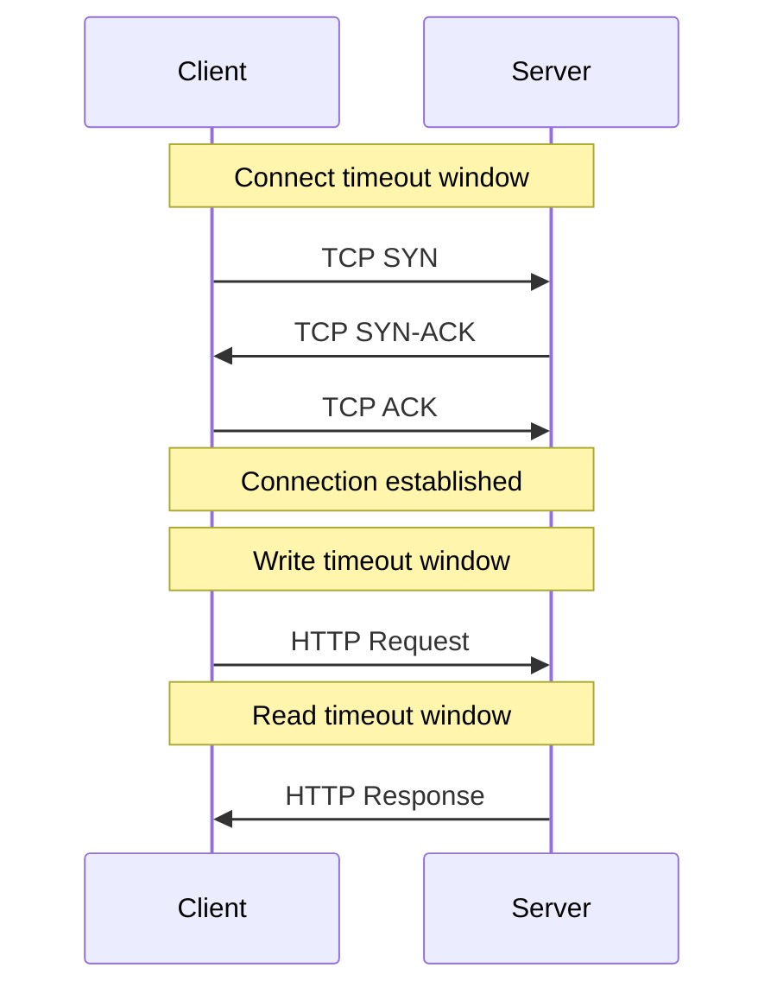
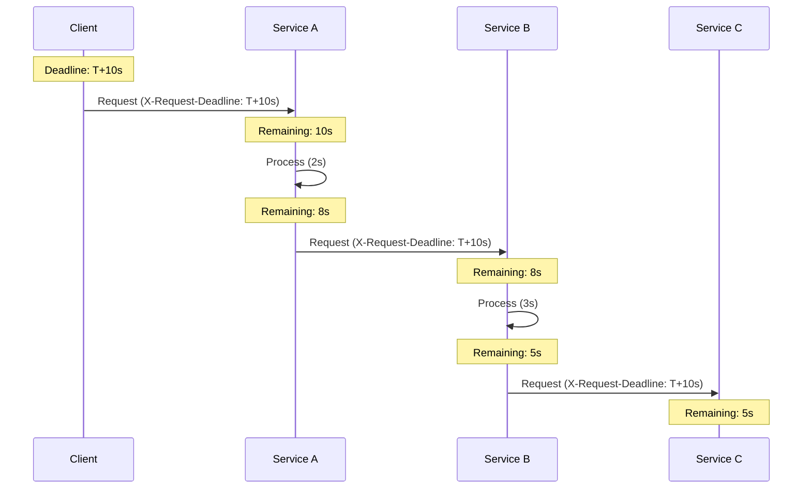

# Timeout Pattern — Deep Dive

> **Level:** Intermediate  
> **Pre-reading:** [06 · Resilience & Reliability](06-resilience.md)

---

## Why Timeouts Matter

Without timeouts, a slow or unresponsive service can:

- Block threads indefinitely
- Exhaust connection pools
- Cascade failures upstream
- Leave users waiting forever

> **Rule:** Every remote call needs a timeout.

---

## Types of Timeouts

| Type | Description | Typical Value |
|:-----|:------------|:--------------|
| **Connect timeout** | Time to establish TCP connection | 1-5 seconds |
| **Read timeout** | Time to receive response after request sent | 5-30 seconds |
| **Write timeout** | Time to send request body | 5-10 seconds |
| **Request timeout** | Total time for entire operation | 10-60 seconds |



---

## Configuring Timeouts

### RestTemplate

```java
@Bean
public RestTemplate restTemplate() {
    HttpComponentsClientHttpRequestFactory factory = 
        new HttpComponentsClientHttpRequestFactory();
    factory.setConnectTimeout(5000);     // 5 seconds
    factory.setReadTimeout(10000);       // 10 seconds
    return new RestTemplate(factory);
}
```

### WebClient

```java
@Bean
public WebClient webClient() {
    HttpClient httpClient = HttpClient.create()
        .option(ChannelOption.CONNECT_TIMEOUT_MILLIS, 5000)
        .responseTimeout(Duration.ofSeconds(10));
    
    return WebClient.builder()
        .clientConnector(new ReactorClientHttpConnector(httpClient))
        .build();
}
```

### Feign

```yaml
feign:
  client:
    config:
      default:
        connectTimeout: 5000
        readTimeout: 10000
      payment-service:
        readTimeout: 30000  # Longer for payment
```

### HTTP Client (Apache)

```java
RequestConfig config = RequestConfig.custom()
    .setConnectTimeout(5000)
    .setSocketTimeout(10000)
    .setConnectionRequestTimeout(3000)  // Time to get connection from pool
    .build();

CloseableHttpClient client = HttpClients.custom()
    .setDefaultRequestConfig(config)
    .build();
```

---

## Deadline Propagation

Pass remaining time budget through service call chains. If the client has 10s total and the first hop takes 3s, only 7s remain for the rest.



### Implementation

```java
@Component
public class DeadlineInterceptor implements ClientHttpRequestInterceptor {
    
    @Override
    public ClientHttpResponse intercept(HttpRequest request, byte[] body,
            ClientHttpRequestExecution execution) throws IOException {
        
        // Get deadline from context
        Instant deadline = DeadlineContext.getDeadline();
        if (deadline != null) {
            request.getHeaders().set("X-Request-Deadline", deadline.toString());
        }
        
        return execution.execute(request, body);
    }
}

// Check deadline before expensive operations
public Order processOrder(OrderRequest request) {
    if (DeadlineContext.isExpired()) {
        throw new DeadlineExceededException();
    }
    
    // Continue processing...
}
```

### gRPC Deadlines

gRPC has built-in deadline support:

```java
// Client sets deadline
OrderServiceGrpc.OrderServiceBlockingStub stub = OrderServiceGrpc
    .newBlockingStub(channel)
    .withDeadlineAfter(10, TimeUnit.SECONDS);

// Server checks remaining time
long remaining = Context.current().getDeadline().timeRemaining(TimeUnit.MILLISECONDS);
if (remaining <= 0) {
    throw Status.DEADLINE_EXCEEDED.asRuntimeException();
}
```

---

## Timeout vs Circuit Breaker

| Aspect | Timeout | Circuit Breaker |
|:-------|:--------|:----------------|
| **Purpose** | Limit wait time for single call | Prevent calls to failing service |
| **Scope** | Per request | Across requests |
| **When triggers** | Call takes too long | Failure rate exceeds threshold |
| **Result** | Request fails | Request rejected immediately |

**Use together:** Timeout causes individual calls to fail; circuit breaker counts timeouts as failures.

---

## Timeout Strategy by Service

| Service Type | Timeout | Rationale |
|:-------------|:--------|:----------|
| **Database** | 5-10s | Queries should be fast |
| **Cache (Redis)** | 100-500ms | Cache should be very fast |
| **Internal service** | 5-15s | Within cluster, should be fast |
| **External API** | 15-30s | Third-party may be slow |
| **Payment gateway** | 30-60s | May involve bank processing |
| **File upload** | 60-120s | Large files take time |

---

## Handling Timeout Errors

```java
try {
    return restTemplate.getForObject(url, Order.class);
} catch (ResourceAccessException e) {
    if (e.getCause() instanceof SocketTimeoutException) {
        // Read timeout
        log.warn("Timeout calling order service: {}", url);
        throw new ServiceTimeoutException("Order service timeout", e);
    }
    if (e.getCause() instanceof ConnectTimeoutException) {
        // Connect timeout
        log.error("Cannot connect to order service: {}", url);
        throw new ServiceUnavailableException("Order service unreachable", e);
    }
    throw e;
}
```

---

## Resilience4j TimeLimiter

```java
TimeLimiterConfig config = TimeLimiterConfig.custom()
    .timeoutDuration(Duration.ofSeconds(10))
    .cancelRunningFuture(true)
    .build();

TimeLimiter timeLimiter = TimeLimiter.of("orderService", config);

CompletableFuture<Order> future = CompletableFuture.supplyAsync(
    () -> orderClient.getOrder(orderId)
);

Order order = timeLimiter.executeFutureSupplier(() -> future);
```

### With Annotation

```java
@TimeLimiter(name = "orderService", fallbackMethod = "orderFallback")
public CompletableFuture<Order> getOrder(String orderId) {
    return CompletableFuture.supplyAsync(() -> 
        orderClient.getOrder(orderId)
    );
}
```

---

## Common Mistakes

| Mistake | Impact | Fix |
|:--------|:-------|:----|
| **No timeout configured** | Threads blocked forever | Always set timeouts |
| **Timeout too long** | Poor user experience | Match SLA requirements |
| **Timeout too short** | False failures | Allow for normal variance |
| **Same timeout everywhere** | Suboptimal behavior | Tune per service |
| **Ignoring deadline propagation** | Chain exceeds total budget | Pass remaining time |

---

## Timeout Anti-Pattern: The Timeout Cliff

When multiple services in a chain have the same timeout:

```
Service A (timeout: 10s) → Service B (timeout: 10s) → Service C (timeout: 10s)
```

If Service C takes 9s, Service B might timeout at 10s before getting the response, even though C was "successful."

**Fix:** Decrease timeouts down the chain:

```
Service A (timeout: 10s) → Service B (timeout: 7s) → Service C (timeout: 4s)
```

---

??? question "How do you choose the right timeout value?"
    Consider: (1) **p99 latency** of the downstream service — set timeout 2-3x higher. (2) **User experience** — how long can users wait? (3) **SLA requirements** — what's the total latency budget? (4) **Service type** — cache should be fast (500ms), payment can be slow (30s). Start conservative; tune based on production data.

??? question "What is deadline propagation and why is it important?"
    Deadline propagation passes the remaining time budget through a call chain. Without it, each service has its own timeout, and the total time can far exceed what the client expects. With it, each service knows how much time remains and can fail early if the deadline is already exceeded.

??? question "What happens to the request on the server when the client times out?"
    The server doesn't know the client gave up — it may continue processing. This can waste resources or cause issues if the operation has side effects. Mitigations: (1) Use deadline propagation — server checks and aborts. (2) Design for idempotency. (3) Use request cancellation (gRPC supports this).

