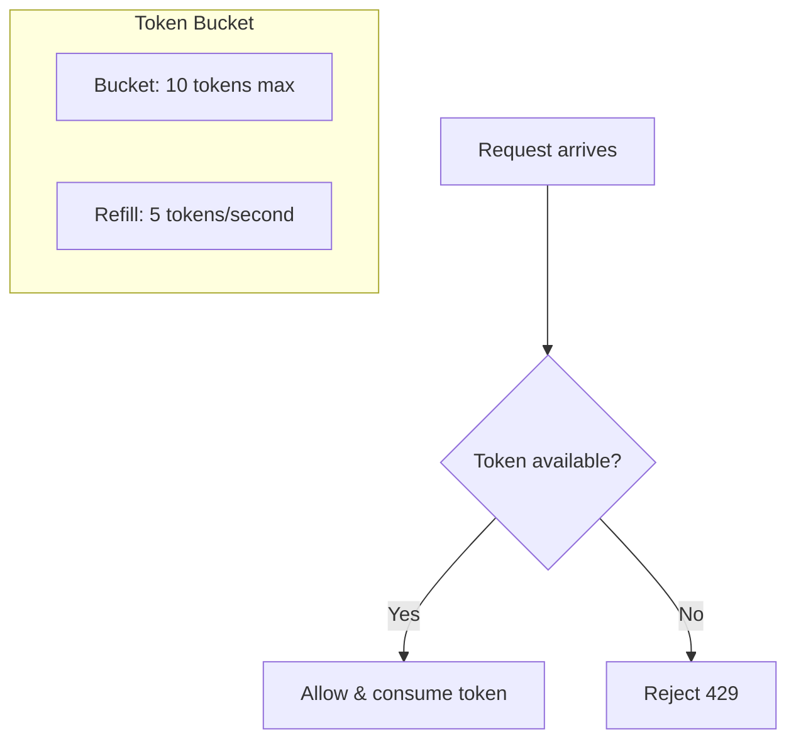
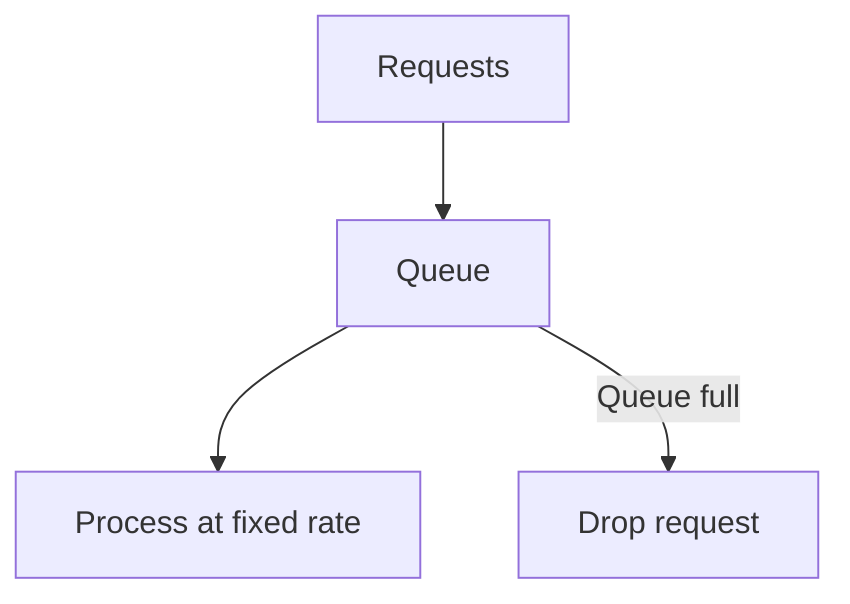
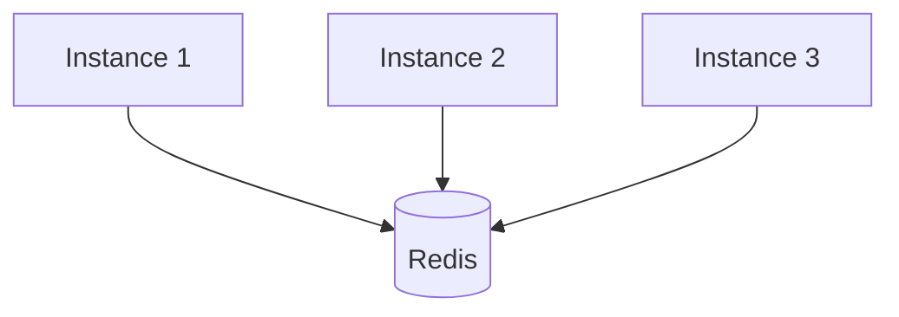

# Rate Limiting — Deep Dive

> **Level:** Intermediate  
> **Pre-reading:** [06 · Resilience & Reliability](06-resilience.md)

---

## What is Rate Limiting?

**Rate limiting** controls how many requests a client can make in a given time window. It protects services from overload and ensures fair resource usage.

---

## Rate Limiting Algorithms

### Token Bucket

A bucket holds tokens. Each request consumes a token. Tokens refill at a fixed rate.



| Property | Behavior |
|:---------|:---------|
| **Bucket size** | Maximum burst size |
| **Refill rate** | Sustained throughput |
| **Burst handling** | Allows burst up to bucket size |

**Example:** 10 tokens, refill 5/second

- Can burst 10 requests instantly
- Sustains 5 requests/second

### Sliding Window Log

Track timestamps of all requests. Count requests in the last N seconds.

```
Window: 1 minute
Requests: [T-55s, T-30s, T-15s, T-5s, T-1s]
Count: 5

New request at T: Check if count + 1 > limit
```

| Property | Behavior |
|:---------|:---------|
| **Precision** | Exact count in window |
| **Memory** | Stores all timestamps |
| **Burst** | No burst allowed at boundary |

### Sliding Window Counter

Hybrid: Fixed window counters with weighted combination.

```
Previous window count: 10
Current window count: 3
Current position in window: 70%

Weighted count: 10 × 30% + 3 × 70% = 5.1
```

More memory-efficient than log; smoother than fixed window.

### Fixed Window

Count requests in fixed time intervals. Simple but allows burst at boundaries.

```
Window: [0:00-0:59] count: 50
Window: [1:00-1:59] count: 0

Limit: 100/minute
Client sends 50 at 0:59, 50 at 1:00 → 100 in 2 seconds!
```

### Leaky Bucket

Requests queue and process at a fixed rate. Smoothest output; no bursts.



---

## Algorithm Comparison

| Algorithm | Burst | Memory | Precision | Use Case |
|:----------|:------|:-------|:----------|:---------|
| **Token Bucket** | Yes | Low | Approximate | General purpose |
| **Sliding Window Log** | No | High | Exact | High-value APIs |
| **Sliding Window Counter** | Partial | Medium | Good | Balanced |
| **Fixed Window** | Boundary burst | Low | Approximate | Simple cases |
| **Leaky Bucket** | No | Low | Exact rate | Smooth output |

---

## Rate Limiting Implementation

### Resilience4j

```java
RateLimiterConfig config = RateLimiterConfig.custom()
    .limitForPeriod(100)                    // Requests per period
    .limitRefreshPeriod(Duration.ofSeconds(1))
    .timeoutDuration(Duration.ofMillis(500)) // Wait time for permit
    .build();

RateLimiter rateLimiter = RateLimiter.of("apiRateLimiter", config);

// Decorate call
Supplier<Response> limited = RateLimiter.decorateSupplier(
    rateLimiter, () -> apiClient.call()
);
```

### Redis (Distributed)

```java
public boolean tryAcquire(String clientId, int limit, Duration window) {
    String key = "rate:" + clientId;
    long now = System.currentTimeMillis();
    
    // Sliding window log in Redis sorted set
    jedis.zremrangeByScore(key, 0, now - window.toMillis());
    long count = jedis.zcard(key);
    
    if (count < limit) {
        jedis.zadd(key, now, String.valueOf(now));
        jedis.expire(key, window.toSeconds());
        return true;
    }
    return false;
}
```

### Spring Cloud Gateway

```yaml
spring:
  cloud:
    gateway:
      routes:
        - id: api-route
          uri: lb://api-service
          predicates:
            - Path=/api/**
          filters:
            - name: RequestRateLimiter
              args:
                redis-rate-limiter.replenishRate: 100
                redis-rate-limiter.burstCapacity: 200
                key-resolver: "#{@userKeyResolver}"
```

---

## Rate Limiting Strategies

### Per Client

```java
// By API key
String clientKey = request.getHeader("X-API-Key");
RateLimiter limiter = limiters.computeIfAbsent(clientKey, 
    k -> createLimiter(k, getClientTier(k)));
```

### Per User

```java
// By authenticated user
String userId = SecurityContext.getUserId();
RateLimiter limiter = limiters.get("user:" + userId);
```

### Per IP

```java
// By IP address
String ip = request.getRemoteAddr();
RateLimiter limiter = limiters.get("ip:" + ip);
```

### Tiered Limits

| Tier | Requests/minute | Burst |
|:-----|:----------------|:------|
| **Free** | 60 | 10 |
| **Pro** | 600 | 100 |
| **Enterprise** | 6000 | 1000 |

---

## Response Headers

```http
HTTP/1.1 200 OK
X-RateLimit-Limit: 100
X-RateLimit-Remaining: 45
X-RateLimit-Reset: 1699900060
```

On limit exceeded:

```http
HTTP/1.1 429 Too Many Requests
Retry-After: 30
X-RateLimit-Limit: 100
X-RateLimit-Remaining: 0
X-RateLimit-Reset: 1699900060

{
    "error": "rate_limit_exceeded",
    "message": "Too many requests. Please retry after 30 seconds."
}
```

---

## Distributed Rate Limiting

Single-node rate limiting doesn't work with multiple instances.

### Centralized (Redis)



All instances share state in Redis.

### Gossip/Eventual Consistency

Instances share counts periodically. Less precise but lower latency.

### Local with Coordination

Each instance gets a fraction of the limit.

```
Total limit: 100/s
3 instances: 33/s each
```

---

## API Gateway Rate Limiting

Centralize rate limiting at the gateway.

### Kong

```yaml
plugins:
  - name: rate-limiting
    config:
      minute: 100
      policy: redis
      redis_host: redis
      redis_port: 6379
      hide_client_headers: false
```

### AWS API Gateway

```yaml
Resources:
  ApiGatewayUsagePlan:
    Type: AWS::ApiGateway::UsagePlan
    Properties:
      Throttle:
        RateLimit: 100
        BurstLimit: 200
      Quota:
        Limit: 10000
        Period: DAY
```

---

## Rate Limiting vs Throttling

| Term | Meaning |
|:-----|:--------|
| **Rate Limiting** | Reject requests over limit |
| **Throttling** | Slow down or queue requests |
| **Quota** | Total requests over longer period (day/month) |

---

## Common Mistakes

| Mistake | Impact | Fix |
|:--------|:-------|:----|
| **No rate limiting** | DoS, cost explosion | Always limit |
| **Single-node limiter** | Bypassed with multiple instances | Use distributed (Redis) |
| **No Retry-After header** | Clients hammer repeatedly | Include retry guidance |
| **Same limit for all** | Premium clients throttled | Tiered limits |
| **Limit too low** | Legitimate users blocked | Monitor and adjust |

---

??? question "What's the difference between rate limiting and throttling?"
    **Rate limiting** rejects requests that exceed the limit — fast fail with 429. **Throttling** slows down or queues requests — they eventually process. Rate limiting protects services; throttling manages load. Sometimes used interchangeably; be precise in your design.

??? question "How do you implement rate limiting across multiple service instances?"
    (1) **Centralized store** (Redis) — all instances check/update the same counter. (2) **API Gateway** — rate limit at edge before hitting services. (3) **Local + coordination** — each instance gets fraction of limit; periodic sync. Redis is most common for microservices.

??? question "Token bucket or sliding window — which is better?"
    **Token bucket** allows controlled bursts, which is often desirable (bursty traffic is normal). **Sliding window** is more precise and prevents burst at boundaries. For most APIs, token bucket is preferred. For high-value or compliance-critical APIs, sliding window provides stricter control.

