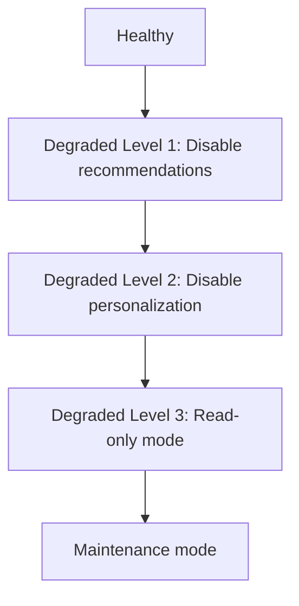
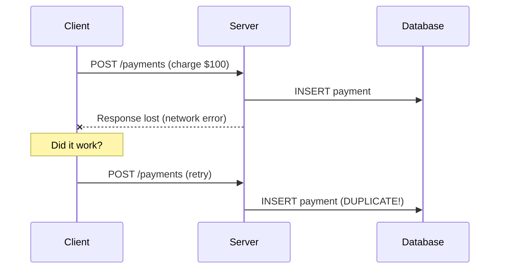
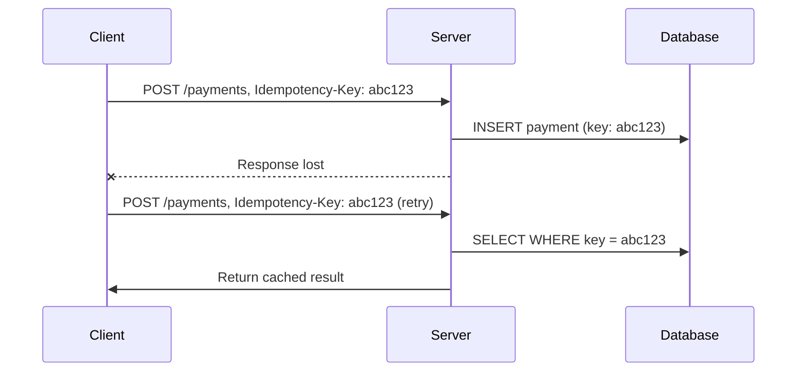

# Fallback and Idempotency — Deep Dive

> **Level:** Intermediate  
> **Pre-reading:** [06 · Resilience & Reliability](06-resilience.md)

---

## Fallback Patterns

When a service call fails, **fallback** provides an alternative response instead of propagating the error.

### Fallback Strategies

| Strategy | Description | Example |
|:---------|:------------|:--------|
| **Default value** | Return a sensible constant | Empty list, default price |
| **Cached response** | Return last known good value | Cached product details |
| **Degraded mode** | Return partial data | Order without live pricing |
| **Stub response** | Hardcoded response | "Service unavailable" message |
| **Alternative service** | Call backup service | Secondary payment provider |

---

## Fallback Implementation

### Resilience4j Fallback

```java
@Service
public class RecommendationService {
    
    @CircuitBreaker(name = "recommendations", fallbackMethod = "fallbackRecommendations")
    @Retry(name = "recommendations", fallbackMethod = "fallbackRecommendations")
    public List<Product> getRecommendations(String userId) {
        return recommendationClient.getPersonalized(userId);
    }
    
    // Fallback method - must have same return type
    private List<Product> fallbackRecommendations(String userId, Exception e) {
        log.warn("Recommendations unavailable for {}: {}", userId, e.getMessage());
        
        // Return cached popular products
        return cache.get("popular-products", () -> 
            productService.getPopular(10)
        );
    }
}
```

### Fallback Chain

```java
@CircuitBreaker(name = "primary", fallbackMethod = "trySecondary")
public PaymentResult charge(Order order) {
    return primaryPaymentProvider.charge(order);
}

private PaymentResult trySecondary(Order order, Exception e) {
    log.warn("Primary payment failed, trying secondary: {}", e.getMessage());
    try {
        return secondaryPaymentProvider.charge(order);
    } catch (Exception e2) {
        return queueForLater(order, e2);
    }
}

private PaymentResult queueForLater(Order order, Exception e) {
    paymentQueue.enqueue(order);
    return PaymentResult.pending("Queued for processing");
}
```

---

## Graceful Degradation

Progressively disable features as system health decreases.



### Feature Flags for Degradation

```java
@Service
public class ProductService {
    
    private final FeatureFlags features;
    
    public ProductDetails getProduct(String productId) {
        ProductDetails product = productRepository.findById(productId);
        
        if (features.isEnabled("personalization")) {
            product.setRecommendations(getRecommendations(productId));
        }
        
        if (features.isEnabled("live-pricing")) {
            product.setPrice(getPriceFromPricingService(productId));
        } else {
            product.setPrice(product.getCachedPrice());
        }
        
        if (features.isEnabled("reviews")) {
            product.setReviews(getReviews(productId));
        }
        
        return product;
    }
}
```

---

## Idempotency

An **idempotent** operation produces the same result whether called once or multiple times.

### Why Idempotency Matters



With idempotency key:



---

## Implementing Idempotency

### Idempotency Key Pattern

```java
@RestController
public class PaymentController {
    
    private final IdempotencyStore idempotencyStore;
    
    @PostMapping("/payments")
    public ResponseEntity<PaymentResult> createPayment(
            @RequestHeader("Idempotency-Key") String idempotencyKey,
            @RequestBody PaymentRequest request) {
        
        // Check for existing result
        Optional<PaymentResult> existing = idempotencyStore.get(idempotencyKey);
        if (existing.isPresent()) {
            return ResponseEntity.ok(existing.get());
        }
        
        // Process new payment
        PaymentResult result = paymentService.charge(request);
        
        // Store result
        idempotencyStore.put(idempotencyKey, result, Duration.ofHours(24));
        
        return ResponseEntity.status(HttpStatus.CREATED).body(result);
    }
}
```

### Idempotency Store

```java
@Component
public class RedisIdempotencyStore implements IdempotencyStore {
    
    private final RedisTemplate<String, String> redis;
    
    @Override
    public Optional<PaymentResult> get(String key) {
        String json = redis.opsForValue().get("idempotency:" + key);
        return Optional.ofNullable(json)
            .map(j -> objectMapper.readValue(j, PaymentResult.class));
    }
    
    @Override
    public void put(String key, PaymentResult result, Duration ttl) {
        redis.opsForValue().set(
            "idempotency:" + key,
            objectMapper.writeValueAsString(result),
            ttl
        );
    }
}
```

### Database-Level Idempotency

```sql
-- Use unique constraint on idempotency key
CREATE TABLE payments (
    id UUID PRIMARY KEY,
    idempotency_key VARCHAR(255) UNIQUE,
    amount DECIMAL(10,2),
    status VARCHAR(50),
    created_at TIMESTAMP
);

-- Insert with conflict handling
INSERT INTO payments (id, idempotency_key, amount, status)
VALUES (gen_random_uuid(), 'abc123', 100.00, 'completed')
ON CONFLICT (idempotency_key) DO NOTHING
RETURNING *;
```

---

## Idempotent by Design

Some operations are naturally idempotent:

| Method | Idempotent? | Notes |
|:-------|:------------|:------|
| **GET** | Yes | Read-only |
| **PUT** | Yes | Same resource state |
| **DELETE** | Yes | Resource stays deleted |
| **POST (create)** | No | Creates new each time |
| **PATCH** | Depends | Some patches are, some aren't |

### Making POST Idempotent

```java
// Non-idempotent: creates new each time
POST /orders
{"items": [...]}

// Idempotent with client-generated ID
PUT /orders/client-generated-uuid
{"items": [...]}

// Idempotent with idempotency key
POST /orders
Idempotency-Key: unique-key
{"items": [...]}
```

---

## Handling In-Progress Requests

What if a retry arrives while the first request is still processing?

```java
public PaymentResult processWithLock(String idempotencyKey, PaymentRequest request) {
    // Try to acquire lock
    boolean locked = lockService.tryLock(idempotencyKey, Duration.ofMinutes(5));
    
    if (!locked) {
        // Another request is processing
        throw new ConflictException("Request in progress");
    }
    
    try {
        // Check if already completed
        Optional<PaymentResult> existing = idempotencyStore.get(idempotencyKey);
        if (existing.isPresent()) {
            return existing.get();
        }
        
        // Process
        PaymentResult result = paymentService.charge(request);
        idempotencyStore.put(idempotencyKey, result);
        return result;
        
    } finally {
        lockService.unlock(idempotencyKey);
    }
}
```

---

## Idempotency Key Best Practices

| Practice | Rationale |
|:---------|:----------|
| **Client generates key** | Client controls retry behavior |
| **UUID format** | Globally unique |
| **Include in request** | Server doesn't guess |
| **TTL for storage** | Clean up old keys |
| **Return cached response** | Same response for same key |

### Key Generation

```javascript
// Client generates key
const idempotencyKey = `order-${orderId}-${Date.now()}-${uuid()}`;

fetch('/api/payments', {
    method: 'POST',
    headers: {
        'Idempotency-Key': idempotencyKey
    },
    body: JSON.stringify(paymentData)
});
```

---

## Combining Fallback and Idempotency

```java
@CircuitBreaker(name = "payment", fallbackMethod = "paymentFallback")
@Retry(name = "payment")
public PaymentResult charge(String idempotencyKey, Order order) {
    return paymentClient.charge(idempotencyKey, order);
}

private PaymentResult paymentFallback(String idempotencyKey, Order order, Exception e) {
    // Queue for later - include idempotency key
    paymentQueue.enqueue(new QueuedPayment(idempotencyKey, order));
    return PaymentResult.pending("Payment queued");
}

// Background processor uses same idempotency key
@Scheduled(fixedDelay = 5000)
public void processQueue() {
    QueuedPayment queued = paymentQueue.poll();
    if (queued != null) {
        // Retry with same idempotency key - safe even if original succeeded
        paymentClient.charge(queued.getIdempotencyKey(), queued.getOrder());
    }
}
```

---

??? question "When should you use fallback vs let the error propagate?"
    Use **fallback** when: (1) The feature is non-critical. (2) A degraded response is better than error. (3) You have meaningful cached/default data. **Propagate error** when: (1) The operation is critical (payment). (2) No sensible fallback exists. (3) User should know about failure.

??? question "How long should you store idempotency keys?"
    Balance between: (1) **Long enough** for retry windows (24h is common). (2) **Short enough** to not exhaust storage. Consider: client retry behavior, operation type (payments may need longer), storage costs. 24–72 hours is typical for payment APIs.

??? question "What happens if idempotency store fails?"
    Options: (1) **Fail closed** — reject request (safest for money). (2) **Fail open** — process without check (risk duplicates). (3) **Circuit breaker** — fallback to in-memory or database check. For financial operations, fail closed is usually right.

