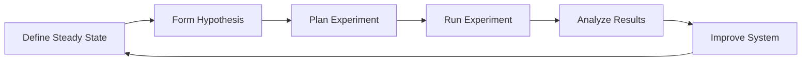
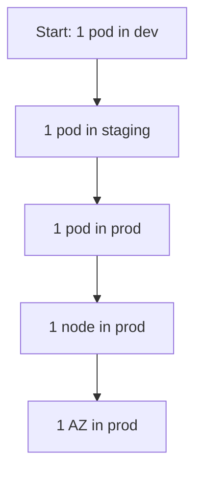

# Chaos Engineering — Deep Dive

> **Level:** Advanced  
> **Pre-reading:** [06 · Resilience & Reliability](06-resilience.md)

---

## What is Chaos Engineering?

**Chaos Engineering** is the discipline of experimenting on a system to build confidence in its ability to withstand turbulent conditions in production.

> "Chaos Engineering is the discipline of experimenting on a distributed system in order to build confidence in the system's capability to withstand turbulent conditions in production."
> — Principles of Chaos Engineering

---

## Why Chaos Engineering?

| Without Chaos Engineering | With Chaos Engineering |
|:--------------------------|:-----------------------|
| "We think it's resilient" | "We've tested it fails gracefully" |
| Find issues in production incidents | Find issues before they become incidents |
| Hope circuit breakers work | Know circuit breakers work |
| Untested runbooks | Validated recovery procedures |

---

## The Chaos Engineering Process



### 1. Define Steady State

What does "healthy" look like? Define metrics that indicate normal operation.

| Metric | Steady State |
|:-------|:-------------|
| **Error rate** | < 0.1% |
| **p99 latency** | < 500ms |
| **Throughput** | 1000 req/s |
| **Order completion** | > 99% |

### 2. Form Hypothesis

> "When we kill one pod of the payment service, the system will continue processing orders with < 1% additional latency and 0% error rate increase."

### 3. Run Experiment

Inject the failure in a controlled way.

### 4. Analyze Results

Did the system behave as hypothesized? If not, why?

### 5. Improve

Fix weaknesses found. Re-run experiment to verify fix.

---

## Types of Failures to Inject

| Category | Failures |
|:---------|:---------|
| **Compute** | Kill pod, kill node, CPU exhaustion |
| **Network** | Latency, packet loss, partition |
| **Dependency** | Database down, API unavailable |
| **Resource** | Memory exhaustion, disk full |
| **Time** | Clock skew, slow DNS |

---

## Chaos Engineering Tools

### Kubernetes-Native

| Tool | Description |
|:-----|:------------|
| **Chaos Mesh** | CNCF incubating; comprehensive K8s chaos |
| **Litmus** | CNCF sandbox; workflow-based |
| **Chaos Monkey** | Netflix original; random instance termination |
| **Pumba** | Docker container chaos |

### Cloud-Native

| Tool | Description |
|:-----|:------------|
| **AWS Fault Injection Simulator** | AWS-native; managed service |
| **Azure Chaos Studio** | Azure-native |
| **Gremlin** | Commercial; enterprise features |

### Code-Level

| Tool | Description |
|:-----|:------------|
| **Toxiproxy** | Network condition simulation |
| **Byteman** | JVM fault injection |
| **Failsafe** | Programmatic failure injection |

---

## Chaos Mesh Example

### Pod Kill

```yaml
apiVersion: chaos-mesh.org/v1alpha1
kind: PodChaos
metadata:
  name: pod-kill-order-service
spec:
  action: pod-kill
  mode: one
  selector:
    namespaces:
      - production
    labelSelectors:
      app: order-service
  scheduler:
    cron: "@every 2h"
```

### Network Delay

```yaml
apiVersion: chaos-mesh.org/v1alpha1
kind: NetworkChaos
metadata:
  name: network-delay-payment
spec:
  action: delay
  mode: all
  selector:
    namespaces:
      - production
    labelSelectors:
      app: payment-service
  delay:
    latency: "200ms"
    jitter: "50ms"
  duration: "5m"
```

### Stress Test

```yaml
apiVersion: chaos-mesh.org/v1alpha1
kind: StressChaos
metadata:
  name: cpu-stress
spec:
  mode: one
  selector:
    labelSelectors:
      app: order-service
  stressors:
    cpu:
      workers: 2
      load: 80
  duration: "10m"
```

---

## Blast Radius Control

### Start Small



### Scope Control

| Scope | Blast Radius |
|:------|:-------------|
| **Single pod** | Minimal; tests pod-level resilience |
| **Single node** | Tests node failure handling |
| **Single AZ** | Tests multi-AZ resilience |
| **Single region** | Tests multi-region failover |

### Guardrails

```yaml
# Chaos Mesh abort conditions
spec:
  # Maximum impact duration
  duration: "10m"
  
  # Pause if error rate exceeds threshold
  abort:
    - condition: "error_rate > 5%"
    - condition: "p99_latency > 2s"
```

---

## GameDay

A **GameDay** is a planned chaos engineering exercise with the team.

### GameDay Structure

| Phase | Duration | Activity |
|:------|:---------|:---------|
| **Prep** | 1-2 weeks | Define scenarios, prepare runbooks |
| **Briefing** | 30 min | Review scenarios, assign roles |
| **Execution** | 2-4 hours | Run experiments, observe, respond |
| **Debrief** | 1 hour | Review findings, identify improvements |
| **Follow-up** | 1-2 weeks | Implement fixes |

### GameDay Roles

| Role | Responsibility |
|:-----|:---------------|
| **Facilitator** | Runs the exercise; controls pace |
| **Injector** | Executes failure injections |
| **Responder** | On-call engineers responding |
| **Observer** | Documents findings |
| **Safety** | Stops exercise if needed |

---

## Steady State Verification

### Automated Checks

```java
public class SteadyStateVerifier {
    
    public boolean verifyOrderService() {
        double errorRate = metrics.getErrorRate("order-service", Duration.ofMinutes(5));
        double p99Latency = metrics.getP99Latency("order-service", Duration.ofMinutes(5));
        double throughput = metrics.getThroughput("order-service", Duration.ofMinutes(5));
        
        return errorRate < 0.01 
            && p99Latency < 500 
            && throughput > 900;
    }
}
```

### Continuous Verification

```yaml
# Run chaos experiments continuously
apiVersion: chaos-mesh.org/v1alpha1
kind: Schedule
metadata:
  name: continuous-chaos
spec:
  schedule: "0 */4 * * *"  # Every 4 hours
  type: "PodChaos"
  podChaos:
    action: pod-kill
    mode: one
    selector:
      labelSelectors:
        app: order-service
```

---

## Chaos Engineering Maturity

| Level | Description |
|:------|:------------|
| **0: None** | No chaos engineering |
| **1: Ad-hoc** | Manual experiments in dev/staging |
| **2: Planned** | Scheduled GameDays |
| **3: Automated** | Continuous chaos in staging |
| **4: Production** | Controlled chaos in production |
| **5: Culture** | Chaos as part of development lifecycle |

---

## Best Practices

| Practice | Rationale |
|:---------|:----------|
| **Start in non-prod** | Learn safely |
| **Define steady state** | Know what normal looks like |
| **Small blast radius** | Minimize impact |
| **Have rollback plan** | Stop experiments quickly |
| **Monitor closely** | Observe system behavior |
| **Communicate** | Inform stakeholders |
| **Document findings** | Build knowledge base |

---

## Common Mistakes

| Mistake | Impact | Fix |
|:--------|:-------|:----|
| **No steady state definition** | Don't know what to measure | Define SLIs before experimenting |
| **Too large blast radius** | Real outage | Start small; expand gradually |
| **No abort conditions** | Experiment causes damage | Set automatic abort thresholds |
| **Running in prod first** | Incident | Start in dev/staging |
| **No follow-up** | Findings not addressed | Track and fix issues found |

---

??? question "How do you convince management to allow chaos engineering in production?"
    (1) **Start small** — prove value in non-prod first. (2) **Show ROI** — document prevented incidents from findings. (3) **Control blast radius** — demonstrate guardrails and abort conditions. (4) **Reference industry leaders** — Netflix, Amazon, Google all do it. (5) **Frame it as testing** — "We're testing resilience, not breaking things."

??? question "What's the difference between chaos engineering and testing?"
    **Testing** verifies known behavior with expected inputs. **Chaos engineering** explores unknown behavior with unexpected conditions. Tests prove the system works as designed; chaos proves it fails gracefully when things go wrong. Both are needed; chaos engineering supplements testing.

??? question "How often should you run chaos experiments?"
    **Dev/Staging:** Continuously — run with every deployment. **Production:** Start with scheduled GameDays (monthly), progress to continuous experiments as maturity grows. Critical: run after any significant change. The goal is to catch regressions early, not just find initial weaknesses.

