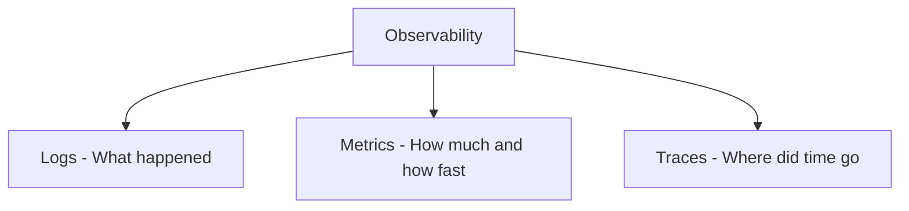
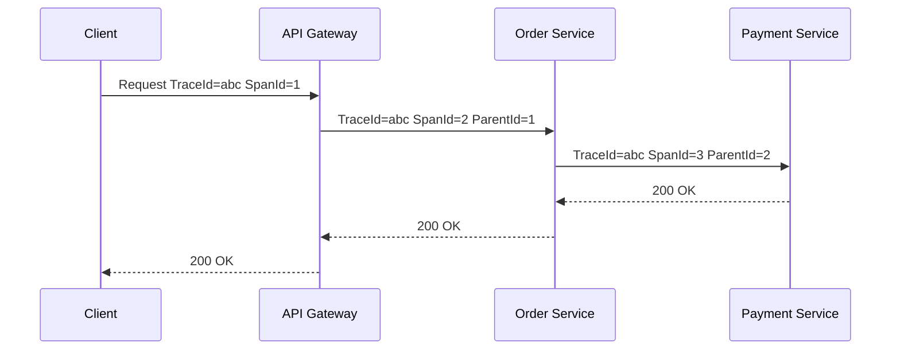

# Observability

> You can't fix what you can't see. Observability is the foundation of reliable operations.

---

## The Three Pillars



| Pillar | Question Answered | Tool Stack |
|--------|-----------------|-----------|
| **Logs** | What happened? What errors occurred? | ELK Stack, Grafana Loki, Splunk |
| **Metrics** | How many requests? CPU? Error rate? | Prometheus + Grafana, Datadog |
| **Traces** | Where did this request spend its time across services? | Jaeger, Zipkin, AWS X-Ray, Honeycomb |

!!! tip "Observability vs Monitoring"
    Monitoring answers *known* questions (is CPU high?). Observability lets you ask *unknown* questions about system behavior from the outside.

---

## Logging

| Best Practice | Description |
|---------------|-------------|
| **Structured logging** | Emit JSON; machine-parseable; fields queryable by log aggregator |
| **Correlation ID** | Unique per-request ID propagated through all services via headers |
| **Log levels** | ERROR (needs action), WARN (degraded), INFO (business events), DEBUG (dev only — never in prod) |
| **Never log secrets** | No PII, tokens, passwords, or card numbers in logs — ever |
| **Centralize** | Ship to central store (not pod local); pods are ephemeral |

**ELK Stack flow:**
```
App → Logstash / Fluentd / Fluent Bit → Elasticsearch ← Kibana (visualize + alert)
```

→ **[Deep Dive: Logging](07.01-logging.md)** — Structured logging, correlation IDs, ELK stack, log levels

---

## Metrics

| Metric Type | Description | Example |
|-------------|-------------|---------|
| **Counter** | Monotonically increasing; resets on restart | Total HTTP requests, total errors |
| **Gauge** | Current snapshot; can go up or down | Active connections, memory used |
| **Histogram** | Distribution of values in configurable buckets | Request latency (50ms, 100ms, 500ms buckets) |
| **Summary** | Pre-calculated quantiles client-side | P50, P95, P99 latency |

### RED Method — For Service Health

| Letter | Metric |
|--------|--------|
| **R** — Rate | Requests per second |
| **E** — Errors | Error rate (%) |
| **D** — Duration | Latency distribution (P50, P95, P99) |

### USE Method — For Resource Health

| Letter | Metric |
|--------|--------|
| **U** — Utilization | How busy is the resource (%) |
| **S** — Saturation | How much work is queued / waiting |
| **E** — Errors | Errors on the resource |

→ **[Deep Dive: Metrics](07.02-metrics.md)** — Counter/Gauge/Histogram, RED and USE methods, Prometheus

---

## Distributed Tracing



| Concept | Description |
|---------|-------------|
| **Trace** | Full end-to-end journey of one request across all services |
| **Span** | One operation within a trace; has start time, duration, and metadata |
| **Context Propagation** | TraceId + SpanId passed via HTTP headers (B3 format or W3C TraceContext) |
| **OpenTelemetry (OTel)** | CNCF vendor-neutral standard; collects logs, metrics, and traces |
| **Head-based sampling** | Decide to trace at request entry; consistent but may miss errors |
| **Tail-based sampling** | Decide *after* seeing full trace; captures errors; more complex |

→ **[Deep Dive: Distributed Tracing](07.03-distributed-tracing.md)** — Spans, context propagation, sampling strategies

---

## SLI · SLO · SLA · Error Budget

| Term | Definition | Example |
|------|-----------|---------|
| **SLI** (Indicator) | The metric being measured | `successful_requests / total_requests` |
| **SLO** (Objective) | Target value for the SLI | 99.9% availability |
| **SLA** (Agreement) | Contractual commitment with penalties | 99.5% or 10% refund |
| **Error Budget** | `100% - SLO target` | 0.1% = ~43.8 min/month allowed downtime |

> Error budgets drive decisions: if the budget is burning fast, freeze feature deployments and focus on reliability.

→ **[Deep Dive: SLI, SLO, SLA](07.04-sli-slo-sla.md)** — Error budgets, burn rate alerting, SRE approach

---

## Health Checks & Kubernetes Probes

| Probe | Question | Pod Action if Fails |
|-------|---------|---------------------|
| **livenessProbe** | Is the app alive (not stuck/deadlocked)? | Restart the pod |
| **readinessProbe** | Is the app ready to receive traffic? | Remove from Service endpoints |
| **startupProbe** | Has slow-starting app finished initializing? | Pauses liveness/readiness checks |

---

## Alerting Best Practices

| Principle | Description |
|-----------|-------------|
| **Alert on symptoms, not causes** | Alert on SLO burn rate (user impact), not individual CPU spikes |
| **Avoid alert fatigue** | Too many alerts → all ignored; tune and reduce ruthlessly |
| **Actionable alerts only** | Every alert should require a human action |
| **On-call rotation** | Use PagerDuty / OpsGenie; document runbooks for every alert |
| **Escalation paths** | Define who gets paged and when escalation triggers |

---

## OpenTelemetry (OTel) in Spring Boot

| Component | Description |
|-----------|-------------|
| **SDK** | Instrument your app (auto or manual) |
| **Collector** | Receives, processes, and exports telemetry |
| **Exporters** | Send to Jaeger, Zipkin, Prometheus, Datadog, etc. |
| **Spring Boot support** | `spring-boot-starter-actuator` + Micrometer + OTel integration |

→ **[Deep Dive: OpenTelemetry](07.05-opentelemetry.md)** — SDK, Collector, auto-instrumentation, Spring Boot integration
