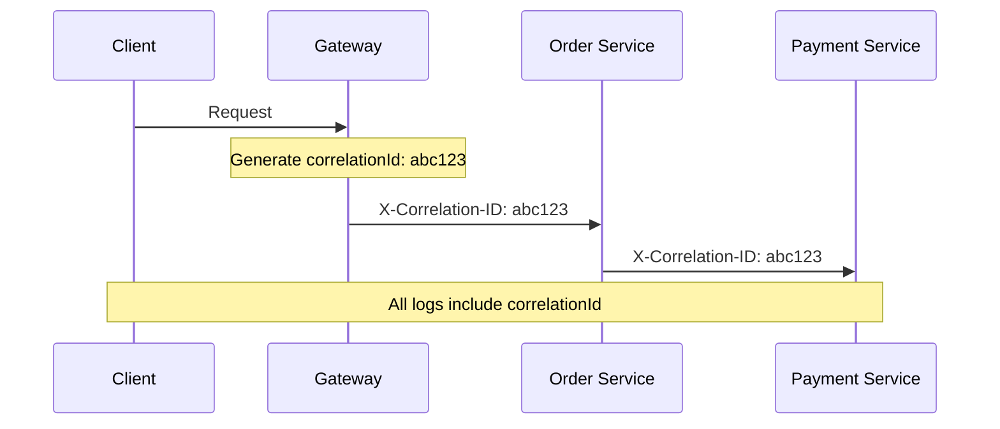
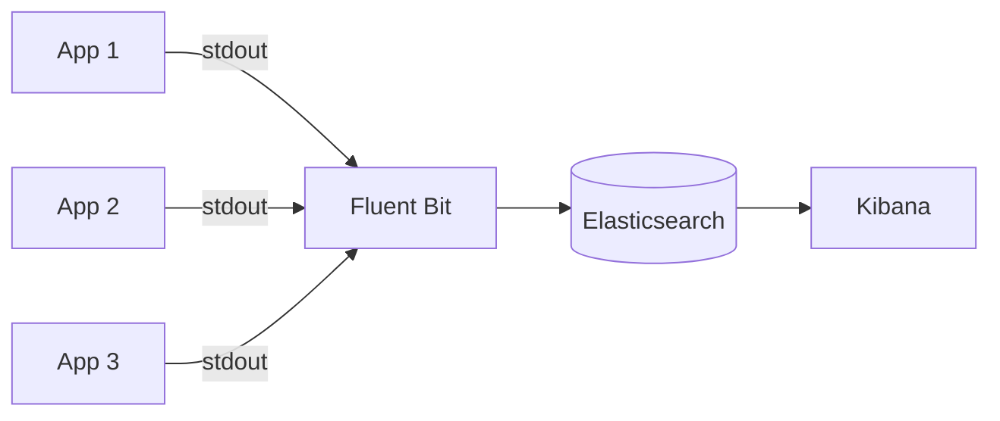

# Logging — Deep Dive

> **Level:** Beginner → Intermediate  
> **Pre-reading:** [07 · Observability](07-observability.md)

---

## Structured Logging

**Structured logging** outputs machine-parseable log entries (JSON) instead of plain text. Essential for log aggregation and querying.

### Plain Text vs Structured

```
# Plain text (hard to parse)
2024-01-15 10:23:45 INFO OrderService - Order placed: 12345 for customer 67890

# Structured (JSON)
{"timestamp":"2024-01-15T10:23:45Z","level":"INFO","service":"order-service","message":"Order placed","orderId":"12345","customerId":"67890","amount":99.99}
```

---

## Log Levels

| Level | When to Use | Example |
|:------|:------------|:--------|
| **ERROR** | Failure needing action | Payment failed, DB connection lost |
| **WARN** | Degraded but working | Cache miss, retry succeeded |
| **INFO** | Business events | Order placed, user logged in |
| **DEBUG** | Development details | Request payload, SQL query |
| **TRACE** | Fine-grained | Method entry/exit (rarely in prod) |

!!! warning "Never DEBUG in production"
    DEBUG logs are verbose and can expose sensitive data. Use INFO for production; enable DEBUG only when troubleshooting.

---

## Correlation IDs

Track requests across services with a unique **correlation ID**.



### Implementation (Spring)

```java
@Component
public class CorrelationIdFilter implements Filter {
    
    @Override
    public void doFilter(ServletRequest request, ServletResponse response, FilterChain chain) {
        HttpServletRequest req = (HttpServletRequest) request;
        String correlationId = req.getHeader("X-Correlation-ID");
        
        if (correlationId == null) {
            correlationId = UUID.randomUUID().toString();
        }
        
        MDC.put("correlationId", correlationId);
        try {
            chain.doFilter(request, response);
        } finally {
            MDC.clear();
        }
    }
}

// Logback config includes MDC
// logback-spring.xml: %d{ISO8601} [%X{correlationId}] %-5level %logger - %msg%n
```

---

## Log Aggregation Architecture



### ELK Stack

| Component | Role |
|:----------|:-----|
| **Elasticsearch** | Storage and search |
| **Logstash / Fluent Bit** | Collection and parsing |
| **Kibana** | Visualization and dashboards |

### Alternative: Grafana Loki

- Uses same labels as Prometheus
- More lightweight than Elasticsearch
- Query with LogQL

---

## What to Log

| Log | Don't Log |
|:---|:----------|
| Request ID, user ID | Passwords |
| Business events | Credit card numbers |
| Error details | PII (unless required) |
| Performance metrics | Full request bodies |
| State transitions | Sensitive tokens |

---

## Spring Boot Logging

```yaml
logging:
  level:
    root: INFO
    com.example: DEBUG
    org.springframework.web: WARN
  pattern:
    console: '{"timestamp":"%d","level":"%p","service":"${spring.application.name}","correlationId":"%X{correlationId}","logger":"%logger","message":"%m"}%n'
```

---

??? question "Why use structured logging over plain text?"
    (1) **Queryable** — filter by orderId, customerId, etc. (2) **Parseable** — automated analysis possible. (3) **Consistent** — all logs have same format. (4) **Aggregation-friendly** — works with ELK, Loki. Plain text requires regex parsing which is fragile.

??? question "How do you ensure correlation IDs propagate across async calls?"
    For async (Kafka, queues): include correlationId in message headers. Consumer extracts and sets in MDC. For reactive/WebFlux: use Context propagation. For threads: wrap executors to propagate MDC.

??? question "What's the difference between logging and distributed tracing?"
    **Logging** captures discrete events with context. **Tracing** captures the full journey of a request across services with timing. Logs tell you what happened; traces tell you where time was spent. Use both: correlate logs by trace ID.

