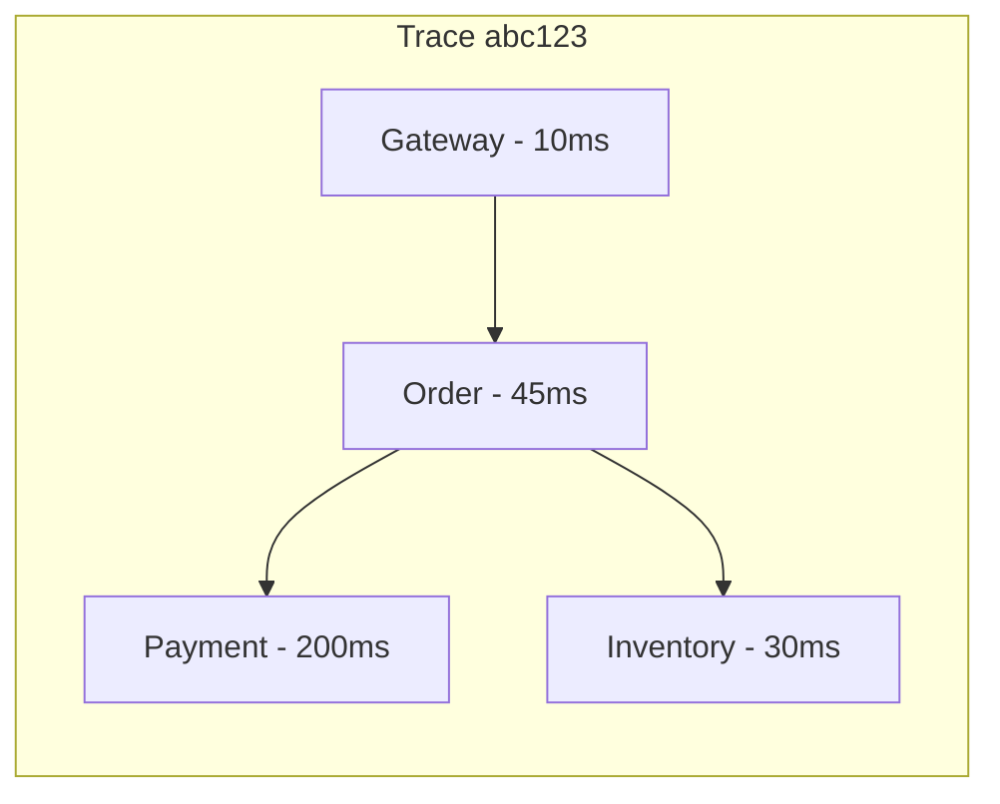
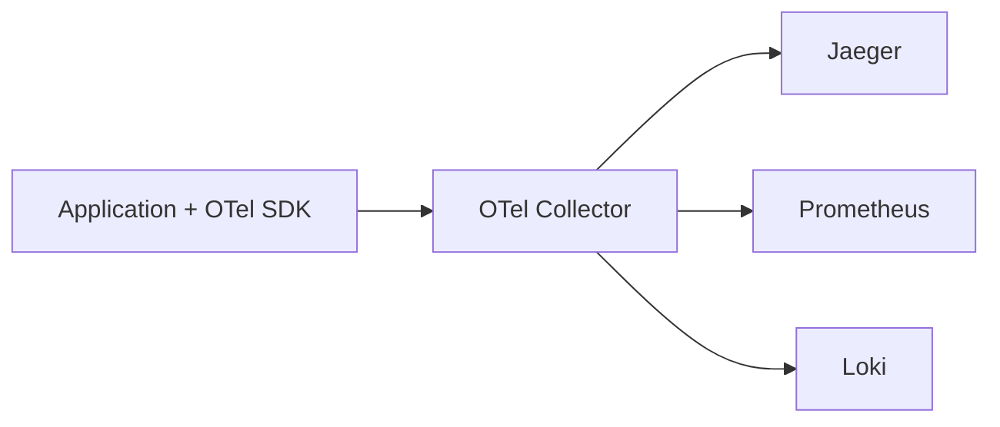

# Distributed Tracing — Deep Dive

> **Level:** Intermediate  
> **Pre-reading:** [07 · Observability](07-observability.md)

---

## What is Distributed Tracing?

**Distributed tracing** tracks a request as it flows through multiple services, showing where time is spent.



---

## Tracing Concepts

| Concept | Description |
|:--------|:------------|
| **Trace** | End-to-end journey of a request |
| **Span** | Single operation within a trace |
| **Trace ID** | Unique identifier for the trace |
| **Span ID** | Unique identifier for each span |
| **Parent Span ID** | Links child spans to parent |

---

## Context Propagation

Trace context travels in HTTP headers:

### W3C TraceContext (Standard)

```http
traceparent: 00-0af7651916cd43dd8448eb211c80319c-b7ad6b7169203331-01
tracestate: vendor=value
```

### B3 (Zipkin)

```http
X-B3-TraceId: 463ac35c9f6413ad48485a3953bb6124
X-B3-SpanId: a2fb4a1d1a96d312
X-B3-ParentSpanId: 0020000000000001
X-B3-Sampled: 1
```

---

## OpenTelemetry

**OpenTelemetry** (OTel) is the CNCF standard for traces, metrics, and logs.



### Spring Boot Integration

```xml
<dependency>
    <groupId>io.opentelemetry</groupId>
    <artifactId>opentelemetry-api</artifactId>
</dependency>
<dependency>
    <groupId>io.micrometer</groupId>
    <artifactId>micrometer-tracing-bridge-otel</artifactId>
</dependency>
```

```yaml
management:
  tracing:
    sampling:
      probability: 1.0  # 100% sampling (reduce in prod)
  otlp:
    tracing:
      endpoint: http://otel-collector:4318/v1/traces
```

---

## Sampling Strategies

| Strategy | Description | Use Case |
|:---------|:------------|:---------|
| **Head-based** | Decide at request entry | Simple; may miss errors |
| **Tail-based** | Decide after seeing full trace | Captures errors; more complex |
| **Rate limiting** | Sample N traces/second | Control cost |

---

## Tracing Tools

| Tool | Type | Notes |
|:-----|:-----|:------|
| **Jaeger** | OSS | CNCF; Kubernetes-native |
| **Zipkin** | OSS | Twitter origin; simple |
| **Tempo** | OSS | Grafana; cost-effective storage |
| **AWS X-Ray** | Managed | AWS native |
| **Honeycomb** | SaaS | High-cardinality analysis |

---

??? question "What's the difference between tracing and logging?"
    **Tracing** shows the flow and timing of a request across services. **Logging** captures discrete events with context. Traces answer "where did time go?"; logs answer "what happened?". Use both together; link logs to traces via trace ID.

??? question "How do you decide on sampling rate?"
    Start with 100% in dev. In production: (1) Cost constraints — traces are expensive. (2) Traffic volume — high-traffic needs lower rate. (3) Error capture — use tail-based to always capture errors. Common: 1-10% for high-traffic, 100% for critical paths.

??? question "Head-based vs tail-based sampling?"
    **Head-based** decides at trace start — simple but may miss errors. **Tail-based** decides after seeing complete trace — captures all errors and slow traces. Use head-based for most cases; add tail-based for critical paths to ensure error capture.

