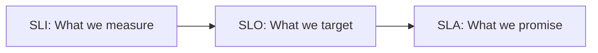

# SLI, SLO, SLA — Deep Dive

> **Level:** Intermediate  
> **Pre-reading:** [07 · Observability](07-observability.md)

---

## Definitions

| Term | Definition | Example |
|:-----|:-----------|:--------|
| **SLI** (Service Level Indicator) | The metric you measure | `successful_requests / total_requests` |
| **SLO** (Service Level Objective) | Target value for the SLI | 99.9% availability |
| **SLA** (Service Level Agreement) | Contractual commitment | 99.5% or 10% refund |



---

## Error Budget

**Error budget** = `100% - SLO target`

| SLO | Error Budget | Downtime/Month |
|:----|:-------------|:---------------|
| 99.9% | 0.1% | ~43 minutes |
| 99.95% | 0.05% | ~22 minutes |
| 99.99% | 0.01% | ~4 minutes |

### Error Budget Policy

> "If we're burning error budget too fast, we freeze feature deployments and focus on reliability."

---

## Common SLIs

| Category | SLI | Measurement |
|:---------|:----|:------------|
| **Availability** | Success rate | `successful_requests / total_requests` |
| **Latency** | Response time | `requests < 500ms / total_requests` |
| **Throughput** | Capacity | `orders_processed / time` |
| **Correctness** | Data accuracy | `correct_responses / total_responses` |

---

## Setting SLOs

| Factor | Consideration |
|:-------|:--------------|
| **User expectations** | What do users consider acceptable? |
| **Dependencies** | Your SLO can't exceed dependency SLOs |
| **Cost** | Higher reliability = higher cost |
| **Current performance** | What can you realistically achieve? |

### SLO Example

```yaml
slos:
  order-service:
    - name: availability
      target: 99.9
      window: 30d
      sli:
        type: success_rate
        metric: http_requests_total
        good: status=~"2.."
        
    - name: latency
      target: 95
      window: 30d
      sli:
        type: latency_percentile
        percentile: 99
        threshold: 500ms
```

---

## SLO Burn Rate Alerting

Instead of alerting on instant failures, alert on **burn rate** — how fast you're consuming error budget.

| Burn Rate | Meaning | Alert Window |
|:----------|:--------|:-------------|
| 14.4x | Budget consumed in 2 hours | 5 min window |
| 6x | Budget consumed in 12 hours | 30 min window |
| 1x | Consuming at expected rate | 6 hour window |

### Prometheus Alert

```yaml
- alert: SLOBurnRateHigh
  expr: |
    (
      rate(http_requests_total{status=~"5.."}[5m]) 
      / rate(http_requests_total[5m])
    ) > (14.4 * 0.001)  # 14.4x burn rate for 99.9% SLO
  for: 2m
  labels:
    severity: critical
```

---

## SLO Dashboard

| Panel | Content |
|:------|:--------|
| **Current SLI** | Real-time success rate, latency |
| **Error budget remaining** | % of budget left |
| **Burn rate** | Current consumption rate |
| **Historical** | SLI over 30 days |

---

??? question "What's the difference between SLO and SLA?"
    **SLO** is an internal target — what you aim for. **SLA** is an external commitment — what you promise customers with penalties. SLO should be tighter than SLA to give buffer. Example: SLO = 99.9%, SLA = 99.5%.

??? question "How do you set an appropriate SLO?"
    (1) Measure current performance — can't promise what you can't deliver. (2) Understand user expectations — survey, analyze support tickets. (3) Consider dependencies — you can't exceed their SLOs. (4) Balance cost vs reliability — 99.99% is 10x harder than 99.9%. Start conservative; tighten as you improve.

??? question "What is error budget and how does it drive decisions?"
    Error budget is the allowed unreliability (100% - SLO). If SLO is 99.9%, budget is 0.1% (~43 min/month). When budget is healthy: deploy features. When budget is depleting: freeze deployments, focus on reliability. It aligns product and SRE teams around shared goals.

