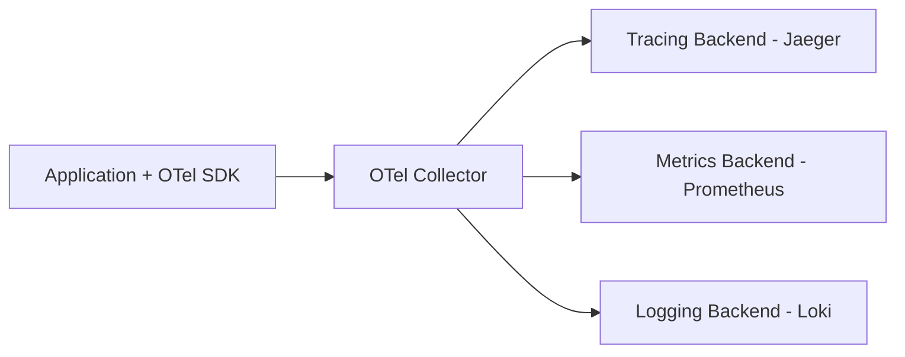
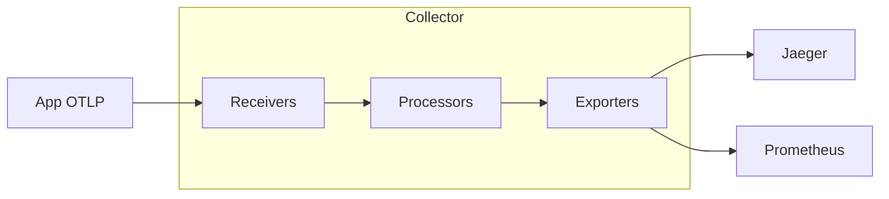

# OpenTelemetry — Deep Dive

> **Level:** Intermediate  
> **Pre-reading:** [07 · Observability](07-observability.md) · [07.03 · Distributed Tracing](07.03-distributed-tracing.md)

---

## What is OpenTelemetry?

**OpenTelemetry** (OTel) is a CNCF project providing a unified standard for collecting telemetry data: traces, metrics, and logs.



---

## OTel Components

| Component | Purpose |
|:----------|:--------|
| **API** | Vendor-neutral interfaces |
| **SDK** | Implementation of API |
| **Collector** | Receives, processes, exports telemetry |
| **Exporters** | Send data to backends |
| **Instrumentation** | Auto/manual instrumentation libraries |

---

## Collector Architecture



### Collector Config

```yaml
receivers:
  otlp:
    protocols:
      grpc:
        endpoint: 0.0.0.0:4317
      http:
        endpoint: 0.0.0.0:4318

processors:
  batch:
    timeout: 1s
    send_batch_size: 1000
  memory_limiter:
    limit_mib: 512

exporters:
  jaeger:
    endpoint: jaeger:14250
  prometheus:
    endpoint: 0.0.0.0:8889

service:
  pipelines:
    traces:
      receivers: [otlp]
      processors: [memory_limiter, batch]
      exporters: [jaeger]
    metrics:
      receivers: [otlp]
      processors: [memory_limiter, batch]
      exporters: [prometheus]
```

---

## Spring Boot Integration

```xml
<dependency>
    <groupId>io.micrometer</groupId>
    <artifactId>micrometer-tracing-bridge-otel</artifactId>
</dependency>
<dependency>
    <groupId>io.opentelemetry</groupId>
    <artifactId>opentelemetry-exporter-otlp</artifactId>
</dependency>
```

```yaml
management:
  tracing:
    sampling:
      probability: 1.0
  otlp:
    metrics:
      export:
        enabled: true
        endpoint: http://otel-collector:4318/v1/metrics
    tracing:
      endpoint: http://otel-collector:4318/v1/traces
```

### Manual Instrumentation

```java
@Service
public class OrderService {
    private final Tracer tracer;
    
    public Order processOrder(OrderRequest request) {
        Span span = tracer.spanBuilder("processOrder")
            .setAttribute("order.id", request.getOrderId())
            .setAttribute("customer.id", request.getCustomerId())
            .startSpan();
        
        try (Scope scope = span.makeCurrent()) {
            // Process order
            return doProcess(request);
        } catch (Exception e) {
            span.setStatus(StatusCode.ERROR, e.getMessage());
            span.recordException(e);
            throw e;
        } finally {
            span.end();
        }
    }
}
```

---

## Auto-Instrumentation

Use Java agent for automatic instrumentation:

```dockerfile
FROM openjdk:17
COPY opentelemetry-javaagent.jar /app/
ENV JAVA_TOOL_OPTIONS="-javaagent:/app/opentelemetry-javaagent.jar"
ENV OTEL_SERVICE_NAME=order-service
ENV OTEL_EXPORTER_OTLP_ENDPOINT=http://otel-collector:4317
```

Automatically instruments: HTTP clients, JDBC, Kafka, Redis, gRPC, and more.

---

## Semantic Conventions

OTel defines standard attribute names:

| Category | Attributes |
|:---------|:-----------|
| **HTTP** | `http.method`, `http.status_code`, `http.url` |
| **Database** | `db.system`, `db.statement`, `db.name` |
| **Messaging** | `messaging.system`, `messaging.destination` |
| **Service** | `service.name`, `service.version` |

---

??? question "Why use OpenTelemetry over vendor-specific SDKs?"
    (1) **Vendor neutral** — switch backends without code changes. (2) **Standard** — CNCF backed; industry adoption. (3) **Unified** — traces, metrics, logs in one SDK. (4) **Future-proof** — consolidates fragmented ecosystem. (5) **Wide support** — all major backends support OTel.

??? question "Should you use auto-instrumentation or manual?"
    **Auto-instrumentation** (Java agent) covers common libraries with zero code changes — start here. **Manual instrumentation** adds custom spans and attributes for business logic. Use both: auto for infrastructure, manual for business operations.

??? question "What's the role of the OTel Collector?"
    The Collector is a **vendor-agnostic proxy** that: (1) Receives telemetry from apps. (2) Processes (batching, filtering, sampling). (3) Exports to multiple backends. Benefits: apps don't need backend configs; can switch backends without redeploying apps; central place for processing.

