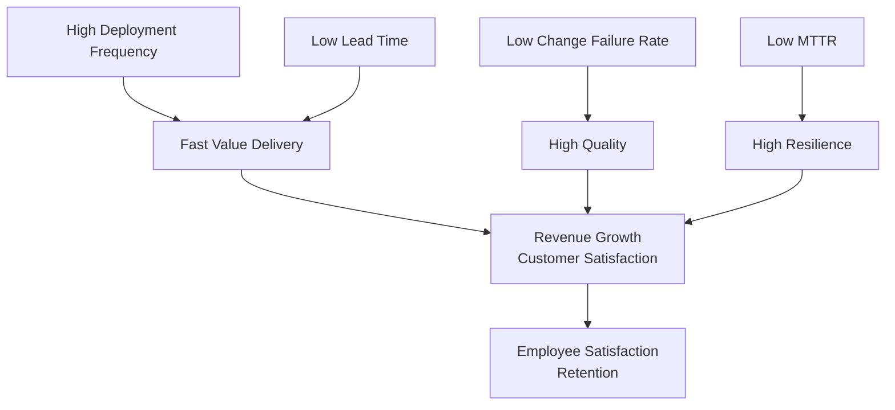

# DORA Metrics — Deep Dive

> **Level:** Intermediate
> **Pre-reading:** [07 · Observability](07-observability.md) · [09 · Deployment & Infrastructure](09-deployment.md)

---

## What are DORA Metrics?

**DORA** (DevOps Research and Assessment) metrics are the gold standard for measuring software delivery performance. Unlike traditional IT metrics (CPU utilization, lines of code), DORA focuses on *outcome-based* measurements that correlate with business success.

The four metrics:

| Metric | Measures | Good Target | Elite Target |
|:-------|:---------|:------------|:-------------|
| **Deployment Frequency** | How often code reaches production | 1–3/week | 3+/day |
| **Lead Time for Changes** | Time from code commit to production | 1–7 days | < 1 hour |
| **Change Failure Rate** | % of deployments causing incidents | 16–30% | 0–15% |
| **Mean Time to Recovery (MTTR)** | Time to restore service after incident | 1–7 days | < 1 hour |

---

## Why DORA Metrics Matter

Traditional metrics (e.g., "lines of code", "test coverage %") don't correlate with business outcomes. DORA metrics do:

- **Deployment Frequency + Lead Time** = how fast you can deliver value
- **Change Failure Rate** = how much you trade speed for quality
- **MTTR** = how resilient your system is

Organizations with **elite** performance on all four metrics:
- Ship 3+ times per day
- Fix production issues in under an hour
- Maintain low defect rates despite high velocity
- Have 37% higher employee satisfaction

---

## Deployment Frequency

**Definition:** How often code is deployed to production.

### Measurement

```
Deployments in last 30 days / 30
```

### Benchmark Scale

| Level | Frequency |
|:------|:----------|
| **Elite** | 3+ per day |
| **High** | 1–3 per week |
| **Medium** | 1–3 per month |
| **Low** | Fewer than 1 per month |

### Drivers

| Factor | Impact |
|:-------|:-------|
| **Automated testing** (unit, integration, E2E) | Must pass before merge |
| **Feature flags** | Deploy without exposing; toggle at runtime |
| **Trunk-based development** | Short-lived branches; merge to main daily |
| **GitOps + Automated CD** | No manual kubectl apply; declarative sync |
| **Microservices independence** | Deploy service A without touching B |
| **Small batch sizes** | Easier to test, review, debug |

### Anti-Patterns

- Long feature branches (> 1 week) → merge hell, conflict resolution
- Manual deployment gates → bottleneck; non-deterministic
- Mandatory code freeze before releases → artificial batching
- Monolith deployments → one service = entire deployment

### Practical Improvement

```yaml
Today:
  - 1 deployment per month
  - Large batch: 50+ commits
  - Manual smoke tests

Target (6 months):
  - 3 deployments per week
  - Batch: 5–10 commits per deploy
  - Automated E2E tests in pipeline

Tools:
  - GitHub Actions / GitLab CI for automation
  - ArgoCD / Flux for GitOps sync
  - Helm for repeatable deployments
  - Feature flags (LaunchDarkly, Split.io)
```

---

## Lead Time for Changes

**Definition:** Time from code commit to successful deployment to production.

### Measurement

```
Sum of (deployment_date - commit_date) for all commits in period / number of commits
```

Measure via Git history + deployment logs; most CI/CD platforms track this automatically.

### Benchmark Scale

| Level | Lead Time |
|:------|:----------|
| **Elite** | < 1 hour |
| **High** | 1–24 hours |
| **Medium** | 1–7 days |
| **Low** | > 1 month |

### Drivers

| Stage | Optimization |
|:------|:-------------|
| **Build** | Parallelize tests; cache dependencies; minimize build time |
| **Test** | Fast unit tests; skip slow tests in fast path; test pyramids not ice cream cones |
| **Staging** | Skip staging if you have confidence (feature flags, canary); or auto-promote |
| **Deployment** | Declarative sync (GitOps); no manual steps; fast rollback capability |

### Example: 30-day lead time → 1-hour lead time

```
Current state:
  - Code review: 8 hours (reviewer capacity)
  - Build + test: 45 min
  - Deploy to staging: 30 min (manual approval)
  - Staging validation: 4 hours (manual QA)
  - Deploy to prod: 2 hours (change advisory board approval)
  Total: ~15 hours median; outliers 2–3 days

Target state:
  - Code review: 30 min (team norm: "review within 30 min")
  - Build + test: 15 min (parallelize; cache; prune slow tests)
  - Deploy to staging: 5 min (fully automated)
  - Staging validation: 5 min (automated smoke tests)
  - Deploy to prod: 5 min (GitOps auto-sync; no approval for low-risk changes)
  Total: ~60 minutes
```

### Anti-Patterns

- Code review bottleneck (one person reviewing all changes)
- Test suite takes > 1 hour
- Manual staging environment setups
- Approval workflows requiring multiple sign-offs for every change
- Separate build system from deployment system

---

## Change Failure Rate

**Definition:** % of deployments that result in an incident or rollback.

### Measurement

```
(Incidents caused by deployments + Rollbacks) / Total deployments × 100
```

### Benchmark Scale

| Level | Failure Rate |
|:------|:-------------|
| **Elite** | 0–15% |
| **High** | 16–30% |
| **Medium** | 31–45% |
| **Low** | > 45% |

### Drivers

| Factor | Impact |
|:--------|--------|
| **Test coverage** | More tests → catch bugs before prod |
| **Contract tests** | Verify service boundaries; catch API breaking changes |
| **Staged rollout** (canary, blue-green) | Catch issues on % of traffic before full rollout |
| **Monitoring + alerts** | Detect issues fast; short blast radius |
| **Automated rollback** | Detect failure signal; revert automatically |
| **Observability** | Know what changed; correlate to incident |
| **Feature flags** | Kill a feature without full rollback |

### Example: Reducing 40% → 15%

```
Root causes of failures:
  - 50% API contract breaking changes → add contract tests
  - 25% Database migration issues → test schema changes in staging; use feature flags for gradual rollout
  - 15% Configuration mistakes → store config in GitOps; review diffs
  - 10% Concurrency bugs → add chaos tests; load testing

Actions:
  1. Add contract tests (Pact) to CI/CD
  2. Implement canary deployments (ship to 10% of traffic first)
  3. Set up automated monitoring → trigger rollback if error rate > 2%
  4. Use feature flags for data migration rollouts
```

---

## Mean Time to Recovery (MTTR)

**Definition:** Average time to restore service after an incident.

### Measurement

```
Sum of (incident_resolved_time - incident_detected_time) / number of incidents
```

### Benchmark Scale

| Level | MTTR |
|:------|:-----|
| **Elite** | < 1 hour |
| **High** | 1–4 hours |
| **Medium** | 4–12 hours |
| **Low** | > 24 hours |

### Drivers

| Factor | Impact |
|:--------|--------|
| **Alert detection latency** | If you detect in 1 min vs 1 hour, MTTR improves by 59 min |
| **Runbook automation** | Automated responses vs manual troubleshooting |
| **On-call rotation** | Someone paged immediately vs waiting for business hours |
| **Observability** | Distributed tracing tells you the culprit fast |
| **Rollback capability** | Fast rollback to previous good state |
| **Chaos testing** | Uncover fragility before production |
| **Post-mortem + fix culture** | Root cause analysis → fixes prevent recurrence |

### Example: 8 hours → 30 minutes

```
Current incident flow:
  - Issue occurs (02:00 AM)
  - Customer reports problem (02:15)
  - On-call paged (02:30)
  - On-call diagnoses via logs (02:45–03:15) — 30 min troubleshooting
  - Root cause: database connection pool exhausted
  - Manual fix: scale DB, restart app (03:15–03:45)
  - Verify fix; customer impacted 1.75 hours
  - Post-mortem: "We need better alerting"
  MTTR: 1.75 hours

Target incident flow:
  - Issue occurs (02:00 AM)
  - Monitoring detects elevated error rate (02:01)
  - Alert sent; on-call paged (02:02)
  - Observability dashboard shows: "DB connection pool utilization 95%"
  - Automated response: HPA scales replicas (02:03)
  - Issue resolved; customer impact < 2 minutes
  - Runbook auto-triggers: scale DB (02:04)
  - Post-mortem: "HPA needs to account for connection pool; increase pool size"
  MTTR: 2–4 minutes
```

### Anti-Patterns

- Alerts only fire after manual investigation
- No runbooks; each incident requires ad-hoc debugging
- Observability poor; logs/metrics not correlated to symptoms
- No automated rollback; all fixes manual
- Blame culture → people hide failures; slow incident response

---

## Measuring & Tracking DORA

### Tools

| Tool | Capability |
|:-----|:-----------|
| **GitHub / GitLab** | Native deploy frequency + lead time tracking via API |
| **Accelerate Metrics** (free tool) | Integrates with GitHub; calculates all 4 metrics |
| **Dora.dev** | Free calculator; enter metrics manually or via API |
| **PagerDuty / OpsGenie** | MTTR tracking via incident creation/resolution timestamps |
| **Datadog / Splunk** | Custom dashboards; query deployment logs + incident logs |
| **Grafana** | Query Prometheus data; visualize trends |

### Baseline Report

When starting to track DORA:

```yaml
Current State (Month 1):
  Deployment Frequency: 0.5/week (2–3 per month)
  Lead Time: 7 days average
  Change Failure Rate: 35%
  MTTR: 4 hours

Targets (12 months):
  Deployment Frequency: 1–2/week (High)
  Lead Time: < 24 hours (High)
  Change Failure Rate: < 30% (High)
  MTTR: 2 hours (High)

Stretch (18 months):
  Deployment Frequency: 3+/week (Elite)
  Lead Time: 1–4 hours (Elite)
  Change Failure Rate: < 15% (Elite)
  MTTR: 30 min (Elite)
```

### Avoid Metric Gaming

⚠️ **Warning:** If you incentivize these metrics without context, teams will:
- Increase deployment frequency by deploying trivial changes → fake commits
- Lower failure rate by deploying less → less value shipped
- Lower MTTR by marking incidents resolved without fixing root cause

**The fix:** Track DORA *as a system*, not per-person or per-team. Use for organizational learning, not for performance reviews.

---

## Connecting DORA to Business Outcomes



---

??? question "How do I get buy-in to improve DORA metrics?"
    Show the correlation: elite performers ship 200× faster with lower defect rates. Pitch as enabling speed *and* quality, not just speed. Start with one metric (e.g., deployment frequency) and show quick wins, then expand.

??? question "What's the difference between DORA metrics and SLO/SLI?"
    DORA measures *capability* (how fast can you ship and recover). SLO/SLI measure *reliability* (does the system meet availability targets). Together: DORA = how you build, SLO = what you deliver.

??? question "Can a monolith achieve elite DORA?"
    Yes, but harder. Elite requires independent deployments of features. Monoliths can use feature flags + small batch deployments + strong test suites to get close. But microservices + containers make it much easier.

??? question "How often should we measure DORA?"
    Every sprint or every 2 weeks. Monthly data hides short-term trends. Weekly can be noisy. The sweet spot is sprint-aligned (2–3 weeks).

