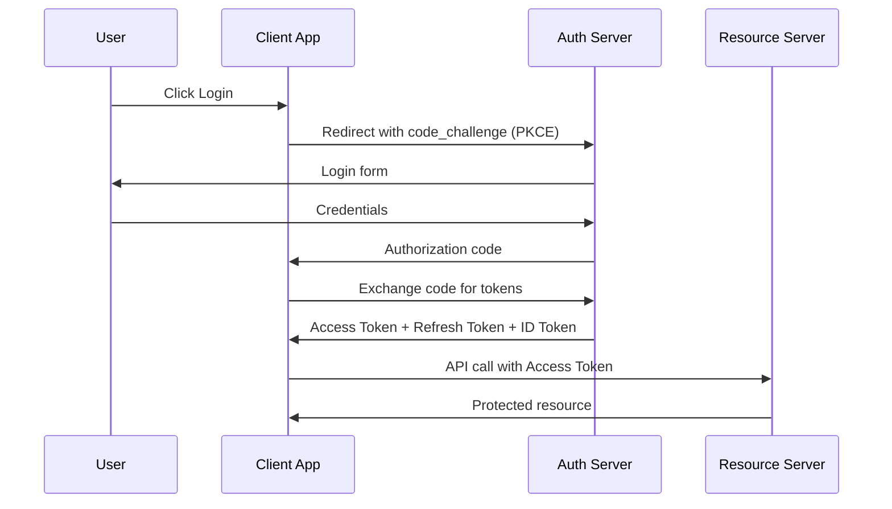

# Security

> Security is a cross-cutting concern woven through every layer — not a feature added at the end.

## Authentication vs Authorization

|                | Authentication (AuthN)              | Authorization (AuthZ)             |
|:---------------|:------------------------------------|:----------------------------------|
| **Question**   | *Who are you?*                      | *What can you do?*                |
| **Handled by** | Identity Provider (IdP)             | Permission system / Policy engine |
| **Example**    | Username + password, SSO, biometric | RBAC, ABAC, OAuth scopes          |

## OAuth2 & OIDC

**OAuth2** = authorization framework (grants access to resources).
**OIDC** = identity layer on top of OAuth2 (tells you *who* the user is via ID Token).

### OAuth2 Grant Types

| Grant Type                    | Use Case                             | Notes                             |
|:------------------------------|:-------------------------------------|:----------------------------------|
| **Authorization Code + PKCE** | Web and mobile apps with a user      | Current best practice             |
| **Client Credentials**        | Machine to machine; no user involved | Service accounts, background jobs |
| **Device Flow**               | Smart TVs, CLI tools, IoT            | Polling-based                     |
| **Implicit**                  | **(Deprecated)** — avoid             | Replaced by Auth Code + PKCE      |

### Token Types

| Token             | Lifetime                 | Purpose                                 |
|:------------------|:-------------------------|:----------------------------------------|
| **Access Token**  | Short (minutes to hours) | Prove identity to resource server       |
| **Refresh Token** | Long (days to weeks)     | Get a new access token without re-login |
| **ID Token**      | Short                    | OIDC only; contains user claims         |

→ **[Deep Dive: OAuth2 & OIDC](08.01-oauth2-and-oidc.md)** — Grant types, PKCE flow, SAML vs OAuth2 vs OIDC, common mistakes

## JWT (JSON Web Token)

Structure: `Header.Payload.Signature`

| Part          | Content                                                            |
|:--------------|:-------------------------------------------------------------------| 
| **Header**    | Algorithm (`RS256`, `HS256`), type (`JWT`)                         |
| **Payload**   | Standard claims: `sub`, `iss`, `aud`, `exp`, `iat` + custom claims |
| **Signature** | HMAC or RSA signature over header + payload                        |

**Validation checklist:**

- [ ] Signature is valid (use correct public key — never skip this)
- [ ] `exp` is in the future (token not expired)
- [ ] `iss` matches your expected issuer
- [ ] `aud` matches your service identifier
- [ ] Algorithm is what you expect (reject `alg: none` attacks)

!!! warning "JWT is NOT encrypted by default"
    JWT payload is Base64 encoded — anyone can decode it. Never put secrets, passwords, or sensitive PII in JWT claims. Use **JWE** (JSON Web Encryption) if you need encrypted tokens.

→ **[Deep Dive: JWT](08.02-jwt-deep-dive.md)** — RS256 vs HS256, JWKS rotation, token storage, security vulnerabilities

## Service-to-Service Security

| Pattern                         | Description                                                                 |
|:--------------------------------|:----------------------------------------------------------------------------|
| **mTLS**                        | Both client and server present certificates; bidirectional authentication   |
| **SPIFFE / SPIRE**              | Workload identity standard; issues SVIDs (X.509 certs) to service instances |
| **Kubernetes Service Accounts** | K8s-native identity scoped to namespace + service account; mounted as token |
| **Short-lived tokens**          | Prefer ephemeral credentials; minimize blast radius of a leak               |

Service Mesh (Istio) can automate mTLS between all services with zero code changes.

→ **[Deep Dive: Service-to-Service Auth](08.03-service-to-service-auth.md)** — mTLS, SPIFFE/SPIRE, K8s SA tokens, OAuth2 Client Credentials

## API Security Checklist

| Category             | Practice                                                                       |
|:---------------------|:-------------------------------------------------------------------------------|
| **Transport**        | HTTPS everywhere; redirect HTTP → HTTPS; HSTS header                           |
| **Input validation** | Validate and sanitize all input at system boundaries; reject unexpected fields |
| **CORS**             | Allowlist specific origins; never use `*` for credentialed requests            |
| **Rate limiting**    | At API gateway; per-client and per-IP limits                                   |
| **SQL injection**    | Parameterized queries or ORM only; never string concatenation                  |
| **Sensitive data**   | Mask PII in logs; encrypt at rest; minimize data returned (no over-fetching)   |
| **Error messages**   | Never expose stack traces or internal details to clients                       |

→ **[Deep Dive: API Security Patterns](08.04-api-security-patterns.md)** — CORS, rate limiting strategies, OWASP Top 10 detail, security headers

## Secrets Management

| Tool                          | Description                                                                     |
|:------------------------------|:--------------------------------------------------------------------------------|
| **HashiCorp Vault**           | Centralized secrets store; dynamic secrets; lease TTL; audit log                |
| **AWS Secrets Manager**       | AWS-native; automatic rotation; fine-grained IAM policies                       |
| **Kubernetes Secrets**        | Base64 stored; encrypt at rest with KMS; use External Secrets Operator for sync |
| **External Secrets Operator** | Sync secrets from Vault / AWS SM / GCP SM into K8s Secrets automatically        |

**Golden rules:**

- Never hardcode secrets in source code or Dockerfiles
- Never commit secrets to Git (use `.gitignore`; tools like `git-secrets`)
- Rotate credentials regularly and always on suspected breach
- Use least-privilege credentials — each service gets only what it needs

→ **[Deep Dive: Secrets Management](08.05-secrets-management.md)** — Vault dynamic secrets, K8s secret hardening, AWS SM rotation, anti-patterns

## Zero Trust Architecture

| Principle                      | What It Means                                                          |
|:-------------------------------|:-----------------------------------------------------------------------|
| **Never trust, always verify** | Authenticate and authorize every request, regardless of source network |
| **Assume breach**              | Design as if attackers are already inside; minimize lateral movement   |
| **Least privilege**            | Grant minimum permissions needed for the task                          |
| **Micro-segmentation**         | K8s NetworkPolicies restricting east-west traffic between services     |

→ **[Deep Dive: Zero Trust](08.06-zero-trust.md)** — Five pillars, OPA policy as code, maturity model, K8s micro-segmentation

## OWASP API Security Top 10 — Key Ones

| #  | Risk                                         | One-Line Description                                     |
|:---|:---------------------------------------------|:---------------------------------------------------------|
| 1  | **BOLA** (Broken Object Level Authorization) | Can user A access user B's data via ID manipulation?     |
| 2  | **Broken Authentication**                    | Weak or missing token validation; no expiry check        |
| 3  | **Broken Object Property Level Auth**        | API returns or accepts fields the caller shouldn't touch |
| 4  | **Unrestricted Resource Consumption**        | No rate limiting → DoS, cost explosion                   |
| 5  | **Broken Function Level Authorization**      | Regular user calling admin endpoints                     |
| 7  | **Server-Side Request Forgery (SSRF)**       | Attacker tricks server into making internal requests     |
| 8  | **Security Misconfiguration**                | Default creds, open CORS, debug endpoints in production  |

